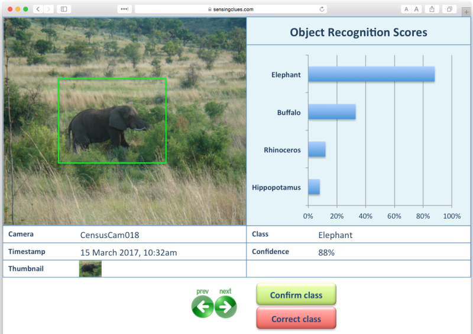
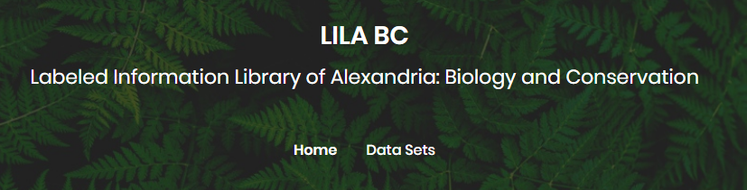

# Overview

This is a list of everything I know about machine learning and camera traps, which is presumably a strict subset of what&rsquo;s out there... <a href="mailto:agentmorris@gmail.com">email me</a> with updates, or submit pull requests.  Help me keep this page up to date!  And tell me what I got wrong about your software and your papers!

Maintained by [Dan Morris](http://dmorris.net).  I contribute to a project on [ML for camera traps](https://github.com/Microsoft/CameraTraps) and an [open repository for conservation data](https://lila.science).

# Table of Contents

[Camera trap systems using ML, *maybe* using ML, or *thinking about* ML](#camera-trap-systems-using-ml-maybe-using-ml-or-thinking-about-ml)  
&nbsp;&nbsp;&nbsp;&nbsp;[Wildlife Insights](#wildlife-insights)  
&nbsp;&nbsp;&nbsp;&nbsp;[wpsWatch](#wpswatch)  
&nbsp;&nbsp;&nbsp;&nbsp;[Microsoft AI for Earth MegaDetector](#microsoft-ai-for-earth-megadetector)  
&nbsp;&nbsp;&nbsp;&nbsp;[Project Zamba](#project-zamba)  
&nbsp;&nbsp;&nbsp;&nbsp;[TimeLapse2](#timelapse2)  
&nbsp;&nbsp;&nbsp;&nbsp;[Camelot](#camelot)  
&nbsp;&nbsp;&nbsp;&nbsp;[Conservation AI](#conservation-ai)  
&nbsp;&nbsp;&nbsp;&nbsp;[Trapper](#trapper)  
&nbsp;&nbsp;&nbsp;&nbsp;[TrapTagger](#traptagger)  
&nbsp;&nbsp;&nbsp;&nbsp;[Wildlife Observer Network ImageID](#wildlife-observer-network-image-id)  
&nbsp;&nbsp;&nbsp;&nbsp;[Agouti](#agouti)  
&nbsp;&nbsp;&nbsp;&nbsp;[Wildlife Institute of India CaTRAT](#wildlife-institute-of-india-catrat)  
&nbsp;&nbsp;&nbsp;&nbsp;[EventFinder](#eventfinder)  
&nbsp;&nbsp;&nbsp;&nbsp;[Where&rsquo;s the Bear?](#wheres-the-bear)  
&nbsp;&nbsp;&nbsp;&nbsp;[AnDeNet (Animal Detection Network)](#andenet-animal-detection-network)  
&nbsp;&nbsp;&nbsp;&nbsp;[Trailcam Data](#trailcam-data)  
&nbsp;&nbsp;&nbsp;&nbsp;[BuckTracker](#bucktracker)  
&nbsp;&nbsp;&nbsp;&nbsp;[SnapCat](#snapcat)  
&nbsp;&nbsp;&nbsp;&nbsp;[ClassifyMe](#classifyme)  
&nbsp;&nbsp;&nbsp;&nbsp;[Panthera IDS (Integrated Data System)](#panthera-ids-integrated-data-system)  
&nbsp;&nbsp;&nbsp;&nbsp;[MooseDar](#moosedar)  
[GitHub repos about ML for camera traps](#github-repos-about-ml-for-camera-traps)  
[Smart camera traps](#smart-camera-traps)  
&nbsp;&nbsp;&nbsp;&nbsp;[TrailGuard](#trailguard)  
&nbsp;&nbsp;&nbsp;&nbsp;[WAMCam (Wildlife Advanced Monitoring Camera)](#wamcam-wildlife-advanced-monitoring-camera)  
&nbsp;&nbsp;&nbsp;&nbsp;[InstantDetect (ZSL)](#instantdetect-zsl)  
&nbsp;&nbsp;&nbsp;&nbsp;[Sensing Clues](#sensing-clues)  
&nbsp;&nbsp;&nbsp;&nbsp;[PoacherCam (Panthera)](#poachercam-panthera)  
[Manual labeling tools people use for camera traps](#manual-labeling-tools-people-use-for-camera-traps)  
&nbsp;&nbsp;&nbsp;&nbsp;[Review articles about manual labeling](#review-articles-about-manual-labeling)  
&nbsp;&nbsp;&nbsp;&nbsp;[Camera Base (San Diego Zoo)](#camera-base-san-diego-zoo)  
&nbsp;&nbsp;&nbsp;&nbsp;[eMammal (Smithsonian)](#emammal-smithsonian)  
&nbsp;&nbsp;&nbsp;&nbsp;[Carnassial (Cascades Carnivore Project)](#carnassial-cascades-carnivore-project)  
&nbsp;&nbsp;&nbsp;&nbsp;[CPW Photo Warehouse (Colorado Parks and Wildlife)](#cpw-photo-warehouse-colorado-parks-and-wildlife)  
&nbsp;&nbsp;&nbsp;&nbsp;[Aardwolf2](#aardwolf2)  
&nbsp;&nbsp;&nbsp;&nbsp;[Camera Trap Manager](#camera-trap-manager)  
&nbsp;&nbsp;&nbsp;&nbsp;[Vixen](#vixen)  
&nbsp;&nbsp;&nbsp;&nbsp;[Reconyx MapView](#reconyx-mapview)  
&nbsp;&nbsp;&nbsp;&nbsp;[CameraSweet](#camerasweet)  
&nbsp;&nbsp;&nbsp;&nbsp;[Non-camera-trap-specific labeling tools at least one person has mentioned using](#non-camera-trap-specific-labeling-tools-at-least-one-person-has-mentioned-using)  
[Post-hoc analysis tools people use for labeled camera trap images](#post-hoc-analysis-tools-people-use-for-labeled-camera-trap-images)  
[Camera trap ML papers](#camera-trap-ml-papers)  
&nbsp;&nbsp;&nbsp;&nbsp;[With summaries](#with-summaries)  
&nbsp;&nbsp;&nbsp;&nbsp;[Waiting for summaries](#waiting-for-summaries)  
[Data sources for camera trap ML](#data-sources-for-camera-trap-ml)  
&nbsp;&nbsp;&nbsp;&nbsp;[LILA](#lila)  
&nbsp;&nbsp;&nbsp;&nbsp;[LILA&rsquo;s list of other data sets](#lilas-list-of-other-data-sets)  
[Further reading](#further-reading)  

# Camera trap tools/platforms using ML, *maybe* using ML, or *thinking about* ML

## Wildlife Insights

[Wildlife Insights](https://wildlifeinsights.org/) (WI) is a platform for camera trap image management that includes AI-accelerated annotation, as well as data management and spatial analysis tools.  WI is a collaboration among several NGOs, HQ&rsquo;d at Conservation International, with AI work HQ'd at Google.

&nbsp;&nbsp;&nbsp;&nbsp;&nbsp;&nbsp;

## Microsoft AI for Earth MegaDetector

This is not a "platform" or "system" in the same sense as other items on this list, but there aren't enough open models for me to make a separate "models" section, and the tooling is *almost* a "system", so for this list, I'm upgrading MegaDetector to "system".  Full disclosure: I contribute to this project.

<a href="https://github.com/microsoft/CameraTraps/blob/main/megadetector.md">MegaDetector</a> is an object detection model that is used to identify camera trap images that contain animals, people, vehicles, or none of the above; in practice, it's primarily used to eliminate blank images from large camera trap surveys.  The GitHub repo provides Python scripts to run MegaDetector and do stuff with the output, and the model (or its output) has also been integrated into some of the other items on this list.

&nbsp;&nbsp;&nbsp;&nbsp;&nbsp;&nbsp;

## wpsWatch

<a href="https://wildlifeprotectionsolutions.org">Wildlife Protection Solutions</a> deploys connected cameras in protected areas to detect and combat poaching.  They partnered with [Silverpond](https://silverpond.com.au) to build an [automated people-detection workflow](https://silverpond.com.au/case-studies/wildlife-protection-solutions/), and later <a href="https://customers.microsoft.com/en-us/story/1384184517929343083-wildlife-protection-solutions-nonprofit-ai-for-earth">integrated the Microsoft AI for Earth MegaDetector</a> into their workflow.

&nbsp;&nbsp;&nbsp;&nbsp;&nbsp;&nbsp;

## Project Zamba

> <http://zamba.drivendata.org/>

> <https://www.zambacloud.com/>

> <https://github.com/drivendataorg/zamba>

Python toolkit (Project Zamba) to find species in camera trap videos, specifically tuned for 23 species often seen in central Africa. Algorithms were trained on data from the [Chimp & See](https://www.chimpandsee.org/#/) Zooniverse project. The [description](http://zamba.drivendata.org/docs/algorithms.html) says it&rsquo;s a 5-model ensemble trained in Keras.

Evolved into the application available at <https://www.zambacloud.com/>.

&nbsp;&nbsp;&nbsp;&nbsp;&nbsp;&nbsp;

## Timelapse2

> <http://saul.cpsc.ucalgary.ca/timelapse/>

> <https://github.com/saulgreenberg/Timelapse>

Thick-client, .net-based tool. In active development as of 2022. Incorporates ML in the sense that it has integrated the output from the AI for Earth <a href="https://github.com/microsoft/CameraTraps">MegaDetector</a> to allow selective review of human/animal/empty/vehicle images.

&nbsp;&nbsp;&nbsp;&nbsp;&nbsp;&nbsp;

## Camelot

> <https://gitlab.com/camelot-project/camelot>

Open-source, runs in Java in a browser.  Developed in consultation with Fauna & Flora International.  Preliminary integration with the Microsoft AI for Earth MegaDetector to allow selective review of human/animal/empty/vehicle images.

&nbsp;&nbsp;&nbsp;&nbsp;&nbsp;&nbsp;

## Conservation AI

> <https://conservationai.co.uk/>

Family of region-specific object detection models for camera traps and drones, backed by real-time and batch processing services, with a browser-based <a href="https://conservationai.co.uk/trymodel">demo</a>.  Also supports acoustic classification.

&nbsp;&nbsp;&nbsp;&nbsp;&nbsp;&nbsp;

## Trapper

> <https://gitlab.com/oscf/trapper-project>

Demo [here](https://demo.trapper-project.org/); you have to register and ask for a login, but they are responsive.

Open-source system, interaction is via a browser, data is stored in Postgres. Can be hosted either locally or on a Linux VM.  Experimenting with ML, including preliminary use of the AI for Earth <a href="https://github.com/microsoft/CameraTraps/blob/master/megadetector.md">MegaDetector</a>.

&nbsp;&nbsp;&nbsp;&nbsp;&nbsp;&nbsp;

## TrapTagger

> <https://wildeyeconservation.org/traptagger/>

An online platform for camera trap data management that includes automated blank/non-blank elimination (not ecosystem-specific, uses MegaDetector), species classification (for South African species), and an integration with HotSpotter for individual identification.

&nbsp;&nbsp;&nbsp;&nbsp;&nbsp;&nbsp;

## Wildlife Observer Network Image ID

> <https://wildlifeobserver.net/imageid/>

Web-based system that takes a zipfile of camera trap images and produces an estimate of the presence/number of animals in each image.

## Agouti

> <https://agouti.eu/>

Web-based (requires upload), hosting is free for small student projects and gets more expensive as the user gets closer to commercial.  Considering ML integration.

Described in Casaer J, Milotic T, Liefting Y, Desmet P, Jansen P. <a href="https://search.proquest.com/openview/409a3fc07525678bbaf3f4d87c076d58/1?pq-origsite=gscholar&cbl=2049297">Agouti: A platform for processing and archiving of camera trap images</a>. Biodiversity Information Science and Standards. 2019 Sep 24.

&nbsp;&nbsp;&nbsp;&nbsp;&nbsp;&nbsp;

## Wildlife Institute of India CaTRAT

> [Wildlife Institute of India 2018 Tiger Status Report](https://projecttiger.nic.in/WriteReadData/PublicationFile/Tiger%20Status%20Report_XPS220719032%20%20new%20layout(1).pdf)

CaTRAT (Camera Trap Data Repository and Analysis Tool) is an internal tool used by the Wildlife Institute of India and the National Tiger Conservation Authority to accelerate the processing of camera trap images, with a focus on detecting tigers.  Not a lot of information is publicly available, but the report linked above suggests that CNNs are involved and that the workflow integrates [ExtractCompare](http://conservationresearch.org.uk/Home/ExtractCompare/index.html) for individual tiger identification.

&nbsp;&nbsp;&nbsp;&nbsp;&nbsp;&nbsp;

## EventFinder

> <http://cs.kingsu.ca/~mjanzen/CameraTrapSoftware.html>

Java-based tool to separate empty from non-empty images using background subtraction and color histogram comparisons.  Also see the associated [paper](https://link.springer.com/article/10.1007/s10661-019-7518-9).

&nbsp;&nbsp;&nbsp;&nbsp;&nbsp;&nbsp;

## Where's the Bear?

> <https://www.cs.ucsb.edu/~ckrintz/projects/wtb.html>

IoT system with computer vision pieces for managing camera traps, currently in Southern California. They refer to having processed 1.2M images, and have used Inception with some clever synthetic data generation to get pretty good results.

&ldquo;...is deployed at the UCSB Sedgwick Reserve, a 6000 acre site for environmental research and used to aggregate, manage, and analyze over 1.12M images.&rdquo;

## AnDeNet (Animal Detection Network)

> <http://biodiversityinformatics.amnh.org/ml4conservation/animal-detection-network>

Open-source project ([code](https://github.com/persts/andenet-desktop)) from the American Museum of Natural History, does semi-automated labeling. Thick-client Python tool, uses TensorFlow.

&nbsp;&nbsp;&nbsp;&nbsp;&nbsp;&nbsp;

## Trailcam Data

> <https://www.trailcamdata.com>

System for removing false positives from camera trap image collections. Unclear if this is automated or manual; I think manual.

&nbsp;&nbsp;&nbsp;&nbsp;&nbsp;&nbsp;

## BuckTracker

> <http://www.bucktracker.com>

App associated with [SpyPoint](https://www.spypoint.com) trail cameras, allowing users to filter photos by species for consumer hunting applications.

&nbsp;&nbsp;&nbsp;&nbsp;&nbsp;&nbsp;

## SnapCat

> <https://www.snapcatconservation.org/our-product>

TF model and maybe front-end, with plans to build a smart camera trap. Not sure how far along they are, but their Web page is nice, and they definitely make stuff, since they made this neat [waterproof scale for penguins](https://blog.synapse.com/post/how-much-does-a-magellanic-penguin-weigh).

&nbsp;&nbsp;&nbsp;&nbsp;&nbsp;&nbsp;

## ClassifyMe

> <https://classifymeapp.com>

Thick-client tool that allows a menu of Yolov2-based models.  Five models are provided out of the gate, trained primarily on open data sets (Snapshot Sergenti, Caltech Camera Traps, Snapshot Wisconsin).  Downloadable by request.

&nbsp;&nbsp;&nbsp;&nbsp;&nbsp;&nbsp;

## Panthera IDS (Integrated Data System)

> <https://www.pantheraids.org/>

Image management and analysis software used internally at Panthera; includes machine learning functionality for blank removal and species classification.  ([More information](https://wildlifeact.com/blog/new-pantheraids-software-leopard-survey))

## MooseDar

> <https://www.moosedar.com>

Thermal-camera-based system that uses CNNs to detect moose, for accident prevention.

# GitHub repos about ML for camera traps

* Microsoft AI for EArth MegaDetector ([github.com/Microsoft/CameraTraps](https://github.com/Microsoft/CameraTraps))
* Willi et al species classification ([github.com/marco-willi/camera-trap-classifier](https://github.com/marco-willi/camera-trap-classifier))
* MLWIC: Machine Learning for Wildlife Image Classification in R ([github.com/mikeyEcology/MLWIC](https://github.com/mikeyEcology/MLWIC))
* MLWIC2: Machine Learning for Wildlife Image Classification ([github.com/mikeyEcology/MLWIC2](https://github.com/mikeyEcology/MLWIC2))
* Bounding Box Editor and Exporter (BBoxEE) for the Animal Detection Network ([github.com/persts/BBoxEE](https://github.com/persts/BBoxEE))
* Deep Learning for Camera Trap Images (Norouzzadeh 2018) ([github.com/Evolving-AI-Lab/deep_learning_for_camera_trap_images](https://github.com/Evolving-AI-Lab/deep_learning_for_camera_trap_images))
* WildAnimalDetection (Jasper Ridge Biological Preserve) ([github.com/qiantianpei/WildAnimalDetection](https://github.com/qiantianpei/WildAnimalDetection))
* TrapTagger ([github.com/WildEyeConservation/TrapTagger](https://github.com/WildEyeConservation/TrapTagger))
* Zamba ([github.com/drivendataorg/zamba](https://github.com/drivendataorg/zamba))
* Camelot ([gitlab.com/camelot-project/camelo>](https://gitlab.com/camelot-project/camelot>))
* Deep Learning for Nilgai Management (Kutugata et al, 2021) ([github.com/mkutu/Nilgai](https://github.com/mkutu/Nilgai))
* Species Classification in Trapper ([gitlab.com/oscf/trapper-species-classifier](https://gitlab.com/oscf/trapper-species-classifier))
* DrivenData classification competition winners ([github.com/drivendataorg/hakuna-madata/](https://github.com/drivendataorg/hakuna-madata/))

# Smart camera traps

## TrailGuard

> <http://www.resolv.org/site-BiodiversityWildlifeSolutions/trailguard/>

> <https://venturebeat.com/2019/01/03/trailguard-ai-uses-intel-ai-tech-to-prevent-african-elephant-poaching/>

Their V2 camera does online human-vs-animal detection, and sends alerts via GSM/satellite. Running stock YOLO. Their V3 camera (now called &ldquo;TrailGuard AI&rdquo;) runs Movidius hardware.

&nbsp;&nbsp;&nbsp;&nbsp;&nbsp;&nbsp;

## WAMCam (Wildlife Advanced Monitoring Camera)

> <https://business.esa.int/projects/wamcam>

> <https://www.archangel.im/wamcam>

&ldquo;WAMCam started as a kickstart feasibility study. The study successfully completed with an end-to-end system prototype, facilitating user engagement and feedback on the system requirements. The devices have been tested in jungle conditions and reliably send AI-generated Iridium SBD status messages from beneath the forest canopy to remote end users who have cellular coverage.&rdquo;

Built as a contract project for the ESA by <https://www.archangel.im/>, who make unmanned cameras for other applications. Had &ldquo;AI on board&rdquo;, details unknown.

## InstantDetect (ZSL)

> <https://www.wildlabs.net/resources/case-studies/instant-detect-20-connected-future-conservation>

> <https://www.zsl.org/conservation/conservation-initiatives/conservation-technology/instant-detect>

InstantDetect 2.0 will be connected but will not have on-board AI; will move images to a base station. Iridium connection.

&nbsp;&nbsp;&nbsp;&nbsp;&nbsp;&nbsp;

## Sensing Clues

> <https://sensingclues.org/author/jankeesschakel/>

This appears to be a research lab with preliminary feelers in acoustic and image recognition; it&rsquo;s mostly on this list because of this screenshot from a [blog post](https://sensingclues.org/2017/03/16/smart-vision-update) from 2017:

&nbsp;&nbsp;&nbsp;&nbsp;&nbsp;&nbsp;

## PoacherCam (Panthera)

> <https://www.panthera.org/conservation-technology/poachercam>

> <https://www.panthera.org/panthera-poachercam-closer-look>

Web page says: &ldquo;Adapted from Panthera’s previous camera traps, the PoacherCam has a groundbreaking new feature: its motion-triggered detection system can now instantly distinguish between people and animals—the world&rsquo;s first camera to do so.&rdquo; This was from a 2015 blog post, unclear what the status is. I&rsquo;ve heard (anecdotally) that it wasn&rsquo;t exactly using machine learning, but was doing some amount of classical vision, i.e. change detection and moving-object geometry estimation.

&nbsp;&nbsp;&nbsp;&nbsp;&nbsp;&nbsp;

# Manual labeling tools people use for camera traps

Not repeating items that were already included in the "AI-enabled" list above.  E.g., lots of people use Timelapse without AI, but I'm not including it in both lists.

## Review articles about manual labeling

* Wearn, O., & Glover-Kapfer, P. (2017). <a href="https://www.wwf.org.uk/conservationtechnology/camera-trap.html">Camera-trapping for Conservation: a Guide to Best-practices</a>. WWF-UK: Woking, UK. ([pdf](https://www.wwf.org.uk/conservationtechnology/documents/CameraTraps-WWF-guidelines.pdf))  Not just about labeling tools, but contains a fantastic list of labeling tools, so including it here.

* Young, S., Rode-Margono, J., & Amin, R. (2018). <a href="https://onlinelibrary.wiley.com/doi/full/10.1002/ece3.4464">Software to facilitate and streamline camera trap data management</a>: A review. Ecology and Evolution*, 8(19), 9947-9957.

## Camera Base (San Diego Zoo)

> <http://www.atrium-biodiversity.org/tools/camerabase/>

Thick-client tool for Windows.

&nbsp;&nbsp;&nbsp;&nbsp;&nbsp;&nbsp;

## eMammal (Smithsonian)

> <https://emammal.si.edu/>

Software package and Smithsonian-hosted storage. All labeling happens through their tool prior to upload. Data stored by Smithsonian, owned by individual data set owners, and released to collaborators upon request.

I&rsquo;ve worked with a lot of camera trap data, and I will say that because the tool enforces consistent metadata at the time of labeling, in terms of organization and matching images to labels, data coming through eMammal is an order of magnitude cleaner than anything I&rsquo;ve worked with from any other source. eMammal metadata is provided in the Camera Trap Metadata Standard (XML variant).

&nbsp;&nbsp;&nbsp;&nbsp;&nbsp;&nbsp;

## Carnassial (Cascades Carnivore Project)

> <https://github.com/CascadesCarnivoreProject/Carnassial>

Offshoot of TimeLapse2; both git pages acknowledge the divergence and refer to &ldquo;differing project requirements&rdquo;. As of 11/2019, it&rsquo;s been over a year since the last commit, so development status unknown.

## CPW Photo Warehouse (Colorado Parks and Wildlife)

Thick-client windows tool, appears to be .net-based, in active development as of 1/2019.

> <https://cpw.state.co.us/learn/Pages/ResearchMammalsSoftware.aspx>

> <http://biodiversityinformatics.amnh.org/ml4conservation/animal-detection-network/species-identification-localization/>

&nbsp;&nbsp;&nbsp;&nbsp;&nbsp;&nbsp;

## Aardwolf2

> <https://github.com/yathin/aardwolf2>

> <https://sourceforge.net/projects/aardwolf/>

As of version 2, this is browser-based (but runs locally) (v1 was a thick-client app). Linux only.

&nbsp;&nbsp;&nbsp;&nbsp;&nbsp;&nbsp;

## Camera Trap Manager

> <https://github.com/benizar/cameratrapmanager>

&ldquo;.NET desktop application for managing pictures taken by automatic camera traps&rdquo;

Looks slick and built easily, but appears to be linked deeply to GIS, which is good, except that I couldn&rsquo;t start a project without providing a shapefile. UI is in a mix of English and Spanish.

## Vixen

> <https://github.com/vixen-project/vixen>

Open-source, multi-platform, thick-client (Python). As of my last check (4/2019), this was last updated early 2018.

&nbsp;&nbsp;&nbsp;&nbsp;&nbsp;&nbsp;

## Reconyx MapView

> <https://www.reconyx.com/software/mapview>

&nbsp;&nbsp;&nbsp;&nbsp;&nbsp;&nbsp;

## CameraSweet

> <https://smallcats.org/resources/#camerasweet>

Series of command-line tools for image organization and annotation used by the Small Wild Cat Conservation Foundation.

## Non-camera-trap-specific labeling tools at least one person has mentioned using

* [Adobe Lightroom](www.adobe.com/Lightroom](http://www.adobe.com/Lightroom))
* [Exif Pro](http://www.exifpro.com)
* [Digikam](https://www.digikam.org) ([code](https://github.com/KDE/digikam))

# Post-hoc analysis tools people use for labeled camera trap images

* [camtrapR](https://cran.r-project.org/web/packages/camtrapR/index.html)
* [Presence](https://www.mbr-pwrc.usgs.gov/software/doc/presence/presence.html)

# Camera trap ML papers

## With summaries

**Curry R, Trotter C, McGough AS. Application of deep learning to camera trap data for ecologists in planning/engineering – can captivity imagery train a model which generalises to the wild?. In2021 IEEE International Conference on Big Data (Big Data) 2021 Dec 15 (pp. 4011-4020). IEEE.**

Attempt to train a model to detect Scottish wild cats with extremely high recall, which also detects other animals, but with a higher tolerance for false negatives outside of the species of interest.  Also attempt to train on captive images, from three cameras in a single enclosure.  Also generated non-wildcat images from iNat 2018, using MegaDetector as a filter.  A small test set (~1k images, ~42 wildcats) was collected from a camera trap survey.

Used MegaDetector for cropping, then compared a variety of architectures and ensembles for classification.  Found that "The most promising combination found during the research is the use of MegaDetector to identify the location of animals in imagery, DeepMAC to subsequently segment those images, and a trio of image classification models (DenseNet201, MobileNet and ResNet152V2) with two classes (Wildcat and Not Wildcat) to classify those images. An ensembled score, calculated through a Best Accuracy vote, provided the best overall system. This classified Wildcat with 54.8% accuracy and has an overall model accuracy of 81.6% against the Wild test set."

Conclude that this approach (using captive wildcat images to train a model that will be deployed on wild images) is promising, but not yet ready for prime time.

**Greenberg S. Automated Image Recognition for Wildlife Camera Traps: Making it Work for You. Research report, University of Calgary: Prism Digital Repository; 2020.**

Ecologist-facing overview of terminology, opportunities, challenges, tools, and hype in the space of AI for camera traps.

&nbsp;&nbsp;&nbsp;&nbsp;&nbsp;&nbsp;

**Wei W, Luo G, Ran J, Li J. Zilong: A tool to identify empty images in camera-trap data. Ecological Informatics. 2020 Jan 1;55:101021.**

Present a non-ML technique that uses edge detection and frame-to-frame differencing to identify animals.  Test on 30k images from SS and 25k images from a private data set.  Compare results to MLWIC, report 87% (85%) accuracy on animal (no-animal) images.  Have slightly separate pipelines for foggy images, as reported by the user.

&nbsp;&nbsp;&nbsp;&nbsp;&nbsp;&nbsp;

**Falzon G, Lawson C, Cheung KW, Vernes K, Ballard GA, Fleming PJ, Glen AS, Milne H, Mather-Zardain A, Meek PD. ClassifyMe: a field-scouting software for the identification of wildlife in camera trap images. Animals. 2020 Jan;10(1):58.**

Present a thick-client tool (&ldquo;ClassifyMe&rdquo;) that allows a menu of Yolov2-based models.  Five models are provided out of the gate, trained primarily on open data sets (Snapshot Sergenti, Caltech Camera Traps, Snapshot Wisconsin).

Downloadable by request at <https://classifymeapp.com/>.

&nbsp;&nbsp;&nbsp;&nbsp;&nbsp;&nbsp;

**Janzen M, Ritter A, Walker PD, Visscher DR. EventFinder: a program for screening remotely captured images. Environmental monitoring and assessment. 2019 Jun;191(6):1-0.**

Describe a thick-client tool for eliminating empty images, using background subtraction and color histogram comparisons.

&ldquo;The automated classification, on average, reduced the data requiring human input by 90.8% with an accuracy of 96.1%, and produced a false positive rate of only 3.4%.&rdquo;

Software available at:

> <http://cs.kingsu.ca/~mjanzen/CameraTrapSoftware.html>

&nbsp;&nbsp;&nbsp;&nbsp;&nbsp;&nbsp;

**Norouzzadeh MS, Morris D, Beery S, Joshi N, Jojic N, Clune J. A deep active learning system for species identification and counting in camera trap images. Methods in Ecology and Evolution. 2021 Jan;12(1):150-61.**

Take an active learning approach to adapting species classification models to new species distributions; describe an architecture that uses a large embedding model (trained infrequently) and a small classification model (trained frequently), along with active learning selection strategies. Though only in a simulated active learning environment, they show the same results on Snapshot Serengeti with 14.1k labels as was previously achieved with 3.2M labels.

Disclaimer: I&rsquo;m a co-author on this paper.

&nbsp;&nbsp;&nbsp;&nbsp;&nbsp;&nbsp;

**Yousif H, Yuan J, Kays R, He Z. Animal Scanner: Software for classifying humans, animals, and empty frames in camera trap images. Ecology and evolution. 2019 Feb;9(4):1578-89..**

&ldquo;We developed computer vision algorithms to detect and classify moving objects to aid the first step of camera trap image filtering—separating the animal detections from the empty frames and pictures of humans.&rdquo;

&ldquo;For those cameras with excessive empty frames due to camera malfunction or blowing vegetation automatically removes 54% of the false-triggers sequences without influencing the human/animal sequences. We achieve 99.58% on image-level empty versus object classification of Serengeti dataset.&rdquo; Validation split appears to be by sequence, not by location.

Divide the image into 736 blocks compute HOG features, diff these features to find moving regions, connect adjacent moving regions to find candidate moving objects.

Then use some color histogram features to separate clearly-bogus candidates (i.e., false positives on &ldquo;is this moving at all?&rdquo;) from plausible moving-object candidates.

Then use AlexNet-96 to classify candidate regions into moving person, moving animal, or moving background. Training data is \~460k images.

Code released as a GUI (Windows and Linux versions) and a command-line tool (not source) at:

> <https://figshare.com/s/cfc1070ca5a9bdda4cd8>

Data now available on LILA as [Missouri Camera Traps](http://lila.science/datasets/missouri-camera-traps).

&nbsp;&nbsp;&nbsp;&nbsp;&nbsp;&nbsp;

**Giraldo-Zuluaga JH, Salazar A, Gomez A, Diaz-Pulido A. Camera-trap images segmentation using multi-layer robust principal component analysis. The Visual Computer. 2019 Mar;35(3):335-47.s**

Focus on foreground/background segmentation; compare both preprocessing techniques (e.g. histogram equalization) and foreground/background decomposition techniques (primarily focusing on multi-layer robust PCA).  Use a dataset of ~1000 images, report f-measures (I believe at the <i>pixel</i> level) in the neighborhood of 0.75, but the train/val split is unclear.

&nbsp;&nbsp;&nbsp;&nbsp;&nbsp;&nbsp;

**Glover-Kapfer P, Soto‐Navarro CA, Wearn OR. Camera‐trapping version 3.0: current constraints and future priorities for development. Remote Sensing in Ecology and Conservation. 2019 Sep;5(3):209-23.**

Not specifically focused on machine learning, but an excellent global survey (258 researchers) on the use of camera traps, with a nod toward a &ldquo;camera trap 3.0&rdquo; vision that includes some degree of automation.  If you&rsquo;re wondering after reading the title what &ldquo;camera trap 2.0&rdquo; was, they use that to refer to the curret, digital generation of camera traps.  In many ways this paper is a great reminder to computer vision folks that as important as machine learning is, there are 1000 other things that ecologists think about when they think about advances in camera trap technology, including durability, theft prevention, and connectivity.

&nbsp;&nbsp;&nbsp;&nbsp;&nbsp;&nbsp;

**Beery S, Van Horn G, Perona P. Recognition in terra incognita. In Proceedings of the European conference on computer vision (ECCV) 2018 (pp. 456-473).**

Not primarily about building awesome models, rather about showing how catastrophically performance falls off at new locations.

Data a subset of [Caltech Camera Traps](http://lila.science/datasets/caltech-camera-traps), available on LILA.

**Willi M, Pitman RT, Cardoso AW, Locke C, Swanson A, Boyer A, Veldthuis M, Fortson L. Identifying animal species in camera trap images using deep learning and citizen science. Methods in Ecology and Evolution. 2019 Jan;10(1):80-91.**

Datasets: Snapshot Serengeti (7M), Camera CATalogue (0.5M), Elephant Expedition (0.5M), Snapshot Wisconsin (0.5M)

Models were all Resnet 18 trained in TF.

Whole-image classification for empty separation, species classification.

&ldquo;We did not directly (i.e., without transfer-learning) apply models trained on one dataset to another dataset even if the identification of empty images is the same task.&rdquo;

Incorporated into a live experiment on Zooniverse; if annotators agreed with model, image was retired early (i.e., with fewer annotators).

&ldquo;To process all experiment-eligible capture events, 49% fewer annotations by citizen scientists were required. Accounting for the non-eligible subjects for which the model supplied no opinion and thus were processed by the standard logic, 43% fewer annotations were needed to retire all images.&rdquo;

Cross-validation was by sequence, not by location. I.e., the same locations appeared in training and test.

Code and models available at:

> <https://conservancy.umn.edu/handle/11299/199818>

Data available as thumbnails (330x330) at:

> <https://conservancy.umn.edu/handle/11299/199819>

&nbsp;&nbsp;&nbsp;&nbsp;&nbsp;&nbsp;

**Norouzzadeh MS, Nguyen A, Kosmala M, Swanson A, Palmer MS, Packer C, Clune J. Automatically identifying, counting, and describing wild animals in camera-trap images with deep learning. Proceedings of the National Academy of Sciences. 2018 Jun 19;115(25):E5716-25.**

They use VGG for detection (97% on a 50/50 rebalanced data set), an ensemble for identification (95% top-1 and 99% top-5), and an ensemble for counting (where they are running the ensemble as a classifier where the outputs are bins). Train their main networks from scratch on Snapshot Serengeti (~1.2M sequences), but also present experiments to simulate cases where Snapshot-Serengeti-sized training data is not available; in those experiments, they transfer from ImageNet.

Code and models available here:

> <https://github.com/Evolving-AI-Lab/deep_learning_for_camera_trap_images>

Cross-validation was by sequence, not by location. I.e., the same locations appeared in training and test.

&nbsp;&nbsp;&nbsp;&nbsp;&nbsp;&nbsp;

**Tabak MA, Norouzzadeh MS, Wolfson DW, Sweeney SJ, VerCauteren KC, Snow NP, Halseth JM, Di Salvo PA, Lewis JS, White MD, Teton B. Machine learning to classify animal species in camera trap images: Applications in ecology. Methods in Ecology and Evolution. 2019 Apr;10(4):585-90.**

&ldquo;We trained machine learning models using convolutional neural networks with the ResNet-18 architecture and 3,367,383 images to automatically classify wildlife species from camera trap images obtained from five states across the United States.&rdquo;

They tested on smaller data sets from Canada (5900 images) and Tanzania (Snapshot Serengeti, just used for testing *detection* models).

98% top-1 accuracy on US images, 82% top-1 accuracy on Canada images, 94% detection accuracy on Tanzania images.

28 species, operated on images @ 256x256. 10% test set held out from the \~3M images. Trained in TF, based on ResNet-18. Collapsed species with \<2000 images into taxonomic groups, built a separate group-level model. They had lots of pigs, so they trained a separate pig/non-pig model. So that&rsquo;s three models total. I believe &ldquo;empty&rdquo; was a class in both the species- and group-level models, i.e. they did not train a separate detector.

Cross-validation was by sequence, not by location. I.e., the same locations appeared in training and test.

Data available on LILA as [North American Camera Trap Images](http://lila.science/datasets/nacti).

**Loos A, Weigel C, Koehler M. Towards automatic detection of animals in camera-trap images. In 2018 26th European Signal Processing Conference (EUSIPCO) 2018 Sep 3 (pp. 1805-1809). IEEE.**

Train on Snapshot Serengeti (1.9M sequences, 3.2M images, 48 species), compare YOLOv2 and SSD. Created a new detection project @ Zooniverse, sourced 33k boxes on 17k images, then did random splits (kept sequences within a split, but did not use location information in drawing their split). Created a set of 300 empty images.

Evaluate with a normalized version of mAP they call nAP that normalizes to handle class imbalance (I didn&rsquo;t read into the details), results look like:

&nbsp;&nbsp;&nbsp;&nbsp;&nbsp;&nbsp;

**Schneider S, Taylor GW, Kremer S. Deep learning object detection methods for ecological camera trap data. In 2018 15th Conference on computer and robot vision (CRV) 2018 May 8 (pp. 321-328). IEEE.**

Compares Faster-RCNN and Yolo v2 on the gold-standard Snapshot Serengeti data (\~4.5k images with bound boxes, 11 species with enough for them to count) and another data set they call &ldquo;Reconyx Camera Trap&rdquo; (Panama, Netherlands) (7k images, but only 946 images w/bounding boxes).

Both architectures used ResNet 101 backbones, pre-trained on COCO, fine-tuned only the last layer.

They didn&rsquo;t specify their splitting procedure, ergo I assume sequences may have been split across train/val.

Their evaluation metrics are &ldquo;accuracy&rdquo; (class accuracy only evaluated on true positives) and &ldquo;IOU&rdquo;, which I believe is being defined as something like &ldquo;average IOU for all super-threshold detections&rdquo;, where a total miss is given an IOU of 0.0.

&nbsp;&nbsp;&nbsp;&nbsp;&nbsp;&nbsp;

**Schneider S, Taylor GW, Linquist S, Kremer SC. Past, present and future approaches using computer vision for animal re-identification from camera trap data. Methods in Ecology and Evolution. 2019 Apr;10(4):461-70.**

Excellent literature review (not a technical paper) on what species people have done automated individual ID for (not for camera traps), with an eye toward eventually supporting camera traps. Includes this awesome figure, and an equally-awesome table that goes with it:

&nbsp;&nbsp;&nbsp;&nbsp;&nbsp;&nbsp;

**Villa AG, Salazar A, Vargas F. Towards automatic wild animal monitoring: Identification of animal species in camera-trap images using very deep convolutional neural networks. Ecological informatics. 2017 Sep 1;41:24-32.**

&ldquo;Snapshot Serengeti ... 225 camera-traps ... more than one million sets of pictures ... 48 animal species ... highly unbalanced ..., e.g., zebra class has 179683 images and the striped polecat (zorilla) only 29. In this work only 26 classes were selected for classification.&rdquo;

Best results came from ResNet-50, but architecture wasn&rsquo;t the main variable here. They played with a bunch of different data set permutations, re: balancing and manual segmentation/cropping, which (not surprisingly) helped. Generally somewhere around 60% top-whatever in the base data set, up to around 90% top-whatever in a segmented subset.

**Tack JL, West BS, McGowan CP, Ditchkoff SS, Reeves SJ, Keever AC, Grand JB. AnimalFinder: A semi-automated system for animal detection in time-lapse camera trap images. Ecological Informatics. 2016 Nov 1;36:145-51.**

Not a machine learning approach; they use edge detection to find deer, tune their detector specifically for this application, and don&rsquo;t make claims that this will generalize to lots of species.  In fact just one paragraph of this paper is spent on technical methods.

The reason this paper is exciting, and the reason I include it here, is that this is the only paper I&rsquo;m aware of (as of 11/2019) that evaluates a semi-automated system for its performance relative to manual annotation on very-high-level tasks, i.e. not just the image classification metrics that we carry over from the computer vision community.  Sometimes it&rsquo;s easy to get so into our machine learning that we forget that <i>ecologists don&rsquo;t care about annotated images</i>; they care about, e.g., population distributions.  So this paper compares methods not on image-level accuracy, but on, e.g., &ldquo;site-days with at least one detection&rdquo; and &ldquo;model-averaged abundance&rdquo;.  They also specifically report on the time saved by a semi-automated approach: &ldquo;AnimalFinder saved 14.8 h (~1 h per 4400 images) of manual review time compared to the manual-only method.&rdquo;  

Reporting on domain-relevant metrics is a great aspirational goal for all papers in this space!

&nbsp;&nbsp;&nbsp;&nbsp;&nbsp;&nbsp;

**Chen G, Han TX, He Z, Kays R, Forrester T. Deep convolutional neural network based species recognition for wild animal monitoring. In 2014 IEEE international conference on image processing (ICIP) 2014 Oct 27 (pp. 858-862). IEEE.**

Use a motion-based approach (on sequences) to get a loose ROI, then compare bag-of-words-based and CNN-based approaches to classifying those ROIs. CNN is custom (three layers). Report accuracies in the neighborhood of 35% on 20 classes. Data is publicly available, though not linked in the paper.

**Yu X, Wang J, Kays R, Jansen PA, Wang T, Huang T. Automated identification of animal species in camera trap images. EURASIP Journal on Image and Video Processing. 2013 Dec;2013(1):1-0.**

Maybe the dawn of the field? I can&rsquo;t find much before 2013. Use SIFT and cLBP features, fed into an SVM.  Manually cropped ROIs, classified those crops.  Cross-validation used random splitting.  82% accuracy on 18 classes.  Dataset is 7000 crops from a variety of forest ecosystems.

&nbsp;&nbsp;&nbsp;&nbsp;&nbsp;&nbsp;

## Waiting for summaries

<!-- None right now, you should <a href="mailto:dmorris@cs.stanford.edu">email me</a> to tell me what I&rsquo;m missing! -->

**Auer D, Bodesheim P, Fiderer C, Heurich M, Denzler J. Minimizing the Annotation Effort for Detecting Wildlife in Camera Trap Images with Active Learning. INFORMATIK 2021. 2021.**

Based on a study of camera trap locations in Germany, they demonstrate that an active learning approach can train location-specific blank/non-blank models that may outperform MegaDetector for those locations.  In short: location-specific models outperform MegaDetector in the regions where MegaDetector performs worse overall.  In this scenario, they also found that having separate models for day- and night-time images yields better performance.

**Kutugata M, Baumgardt J, Goolsby JA, Racelis AE, Kutugata M, Racelis AE, Baumgardt J, Goolsby A. Automatic Camera Trap Classification Using Wildlife-Specific Deep Learning in Nilgai Management. Journal of Fish and Wildlife Management, 2021.**

Train a model primarily to find nilgai in a dataset from Texas (~2.5M images, which they reduce to 120k to oversample nilgai).  Split into 85/5/10 train/val/test, but don't clarify how images are split; the language loosely implies that splitting is random, i.e. locations and even sequences *may* be split across train/val/test.  With that caveat, they achieve a .85 F1 for nilgai, and somewhere in the 0.8-0.9 range for most classes.  Test on Caltech Camera Traps, demonstrate catastrophic falloff in performance.  Code and trained weights are [available](https://github.com/mkutu/Nilgai).

**Cunha F, dos Santos EM, Barreto R, Colonna JG. Filtering Empty Camera Trap Images in Embedded Systems. In Proceedings of the IEEE/CVF Conference on Computer Vision and Pattern Recognition 2021 (pp. 2438-2446).**

Compare classifiers (MobileNetV2-224, MobileNetV2-320, EfficientNet-B0, and EfficientNet-B3) and detectors (SSDLite+MNetV2, EfficientDet-D0) for blank elimination; find that for comparable training volumes, detectors substantially outperform classifiers even after controlling for latency.  However, when the cost of annotation is taken into account, classifiers approach detector performance at much lower latency.  Assessed latency on a Raspberry Pi, compared performance on Snapshot Serengeti and Caltech Camera Traps.

&nbsp;&nbsp;&nbsp;&nbsp;&nbsp;&nbsp;

**Zualkernan I, Dhou S, Judas J, Sajun AR, Gomez BR, Hussain LA. An IoT System Using Deep Learning to Classify Camera Trap Images on the Edge. Computers. 2022 Jan;11(1):13.**

Assessed the feasibility of model optimization of image classifiers (on ~66k images from UAE) for edge deployment; found that the best-performing architecture (Xception) achieved an F1 of .87 prior to optimization for edge deployment, but optimization reduced the average F1 to 0.7, and had an even more extreme effect on rare classes (F1 0.18).  80/20 train/test split appears to have been based on images, not sequences or locations.

**Choiński M, Rogowski M, Tynecki P, Kuijper DP, Churski M, Bubnicki JW. A first step towards automated species recognition from camera trap images of mammals using AI in a European temperate forest. In International Conference on Computer Information Systems and Industrial Management 2021 Sep 24 (pp. 299-310). Springer, Cham.**

Evaluate YOLOv5 on ~2700 images from Poland.  Cross-validation appears to have been based on images, not sequences or locations.  Achieve an F1 of 0.85, express optimism about YOLOv5.  Code is [available on Github](https://gitlab.com/oscf/trapper-species-classifier).

**Yang DQ, Li T, Liu M, Chen B.  A systematic study of the class imbalance problem: Automatically identifying empty camera trap images using convolutional neural networks.  Ecological Informatics. 2021 June 10.**

(I only have access to the abstract for this one, YMMV.)

They look at the impact of high blank rates in camera trap data sets when training classifiers; conclude that this imbalance doesn't mess things up too much when the empty rate is between 10% and 70%, but recommend over/undersampling when the empty rate exceeds 70%.

**Yang DQ, Tan K, Huang ZP, Li XW, Chen BH, Ren GP, Xiao W. An automatic method for removing empty camera trap images using ensemble learning. Ecology and Evolution. 2021 May 2.**

Compare methods for blank elimination using a data set of ~270k images (~90k sequences) from China, with an empty fraction of 78%.  Train/val split is done based on capture events, but not locations.  Trained AlexNet, InceptionV3, and ResNet-18, and ensembled them together post-hoc.  Propose three schemes (ensembling methods) that they suggest could be presented to users as different precision/recall tradeoffs, and present results as "% of empty images removed given a % of false negatives" (huzzah!).  Different schemes yield % empty removed (% false negatives) as 51% (0.7%), 58% (1.1%), and 77.5% (2.5%).  Repeat the analysis at the event level (huzzah!) and those numbers become 40% (0.2%), 49% (0.6%), and 71% (1.6%).  Found substantial falloff in accuracy when transferring to Snapshot Serengeti.

**Miao Z, Liu Z, Gaynor KM, Palmer MS, Yu SX, Getz WM. Iterative human and automated identification of wildlife images. Nature Machine Intelligence. 2021 Oct;3(10):885-95.**

Propose an active learning approach for species classification, evaluated on a dataset of ~630k images from Mozambique.  Train/val split is by sequence, not by location.  Most of the paper is about active learning sampling strategies and confidence thresholding approaches.   Report 88% "automatic" accuracy, which they roughly define as automating high-confidence predictions (78% of their test data); they suggest this is "already sufficient to help alleviate the data bottleneck encountered in typical camera trap monitoring projects".  I'm not sure I agree with that claim, but the concept and methodology are clear, and the paper lays out a good variety of methods one might use for sampling and threhsolding.

**Whytock RC, Świeżewski J, Zwerts JA, Bara‐Słupski T, Koumba Pambo AF, Rogala M, Bahaa‐el‐din L, Boekee K, Brittain S, Cardoso AW, Henschel P. Robust ecological analysis of camera trap data labelled by a machine learning model. Methods in Ecology and Evolution. 2021 Jun;12(6):1080-92.**

Train a species classifier on ~347k images from various locations in Central Africa.  Train/test split is on *locations* (huzzah!), and they also have a clean test set from new locations (double-huzzah!).  They train ResNet-50 in fast.ai .

Results summary (on the test set): "Top one accuracy for the overall machine learning model was 77.63% and top five accuracy was 94.24%. ... After aggregating labels of similar species that were frequently mis-classified by the model into a reduced set of 11 classes, top one and top five accuracies increased to 79.92% and 95.99%, respectively." ... "To achieve a top one balanced accuracy of 90% or more for the overall model, a threshold of ≥70% confidence was required and >25% of the data were discarded."

They also compared to Wildlife Insights, found that for the WI classifier "with a threshold of 70% confidence (i.e. excluding labelled images below 70% confidence), top one balanced accuracies for 16 of the 27 classes were >90% and a further five were >75% ... Top one balanced accuracies for the remaining seven classes ranged from 50% to 70%".

IMO the most interesting part of this paper is that they compute species richness, activity patterns for four focal species, and occupancy models, and basically show that ML-generated results are as good as expert-generated results.  I.e., for a lot of applications, maybe all of this labeling of every single image is overkill.

**Shepley A, Falzon G, Meek PD, Kwan P. Automated Location Invariant Animal Detection In Camera Trap Images Using Publicly Available Data Sources. Ecology and Evolution, March 2021.**

Demonstrate that including images from Flickr and iNaturalist can train reasonable detectors for camera trap images when infused with some camera trap data.  Collected hyena, rhino, and pig images from Flickr and iNat, as well as from WCS CT, Snapshot Serengeti, Missouri CT, and NACTI.

The paper does not include details about how the 90/10 train/val split works for the camera trap data (it's pretty self-explanatory for the Flickr/iNat data).  The implication is random splitting at the image level, but it turns out this won't be a limitation, since their real evaluation is on out-of-domain data (Snapshot Serengeti).  They train models on Flickr/iNat data alone, and camera trap data alone, then use an active-learning-like approach to sample camera trap images to add to the training set (the assumption is that you have gobs of camera trap data, but want to minimize training complexity).  Train on everything but Snapshot Serengeti, evaluate on Snapshot Serengeti.

Show very good results generalizing from Flickr/iNat to Snapshot Serengeti (better than when generalizing from models trained on camera trap data alone), propose that this is likely due to higher intra-dataset variability for Flickr/iNat data.

Show additional benefit (when transferring to Snapshot Serengeti) when adding some camera trap data (still from non-Snapshot-Serengeti data).

**Ahumada JA, Fegraus E, Birch T, Flores N, Kays R, O’Brien TG, Palmer J, Schuttler S, Zhao JY, Jetz W, Kinnaird M. Wildlife insights: A platform to maximize the potential of camera trap and other passive sensor wildlife data for the planet. Environmental Conservation. 2020 Mar;47(1):1-6.**

Not a methods paper, rather a high-level description of the WI platform, so a bit of an outlier on this list.  But it's likely to be among the most-cited papers in this space, so it would be a little silly for me to exclude it.

&nbsp;&nbsp;&nbsp;&nbsp;&nbsp;&nbsp;

**Greenberg S. Automated Image Recognition for Wildlife Camera Traps: Making it Work for You. Technical Report, University of Calgary. 2020 Jan 12.**

Advice for ecologists on the AI landscape for camera trap images, along with a terminology overview.  Encourages some skepticism about averaged results presented in the literature, particularly wrt generalization (models don't generalize well) and species balance (high accuracy on average leaves room for very low accuracy on some species).  Highlights a Timelapse-based workflow for accelerated review with AI-based blank elimination.

**Tabak MA, Norouzzadeh MS, Wolfson DW, Newton EJ, Boughton RK, Ivan JS, Odell EA, Newkirk ES, Conrey RY, Stenglein JL, Iannarilli F, Erb J, Brook R, Davis A, Lewis J, Walsh D, Beasley J, VerCauteren K, Clune J, Miller R. Improving the accessibility and transferability of machine learning algorithms for identification of animals in camera trap images: MLWIC2. Ecology and Evolution, September 2020.**

Train a species classification model and a blank/non-blank model on NACTI images.  Resample so that no class has more than 100,000 images.  For the evaluation on NACTI data train/val split appears to be random (i.e., locations and sequences may appear in train and val), but this turns out not to be an issue, because they also include analyses on Caltech Camera Traps, ENA24, Missouri Camera Traps, and a dataset from Saskatchewan for species classification; and from Wellington Camera Traps, Snapshot Serengeti, and Snapshot Karoo for blank/non-blank classification.

Use ResNet-18 for both the species classification and blank/non-blank models.

On the out-of-sample datasets for species classification, find ~50% accuracy on average for all but the Saskatchewan data (91%).  For the blank/non-blank, find >90% accuracy on all three out-of-sample datasets.  I.e., blank/non-blank generalizes well from NACTI to even very different datasets (like Snapshot Karoo), but species classification generalizes poorly to even pretty similar datasets (like Missouri Camera Traps).

**Carl C, Schönfeld F, Profft I, Klamm A, Landgraf D. Automated detection of European wild mammal species in camera trap images with an existing and pre-trained computer vision model. European Journal of Wildlife Research. 2020 Aug;66(4):1-7.**

Evaluated the pretrained [Faster-RCNN on InceptionResNetv2 from TF Hub](https://tfhub.dev/google/faster_rcnn/openimages_v4/inception_resnet_v2/1) on a small dataset (110 images) from Germany.  Found 94% detection accuracy, and 71% species classification accuracy (with reasonable class mapping applied).  The number of blank images isn't specified, but they report 100% accuracy on blank detection.

If this result holds for larger datasets, that's amazing!

&nbsp;&nbsp;&nbsp;&nbsp;&nbsp;&nbsp;

**Egna N, O'Connor D, Stacy-Dawes J, Tobler MW, Pilfold N, Neilson K, Simmons B, Davis EO, Bowler M, Fennessy J, Glikman JA, Larpei L, Lekalgitele J, Lekupanai R, Lekushan J, Lemingani L, Lemirigishan J, Lenaipa D, Lenyakopiro J, Lesipiti RL, Lororua M, Muneza A, Rabhayo S, Ranah SMO, Ruppert K, Owen M. Camera settings and biome influence the accuracy of citizen science approaches to camera trap image classification. Ecology and evolution. 2020 Nov;10(21):11954-65.**

Assess the factors that influence volunteer annotation accuracy for camera trap images.  Not actually about ML, but highly relevant to ML, and a great analysis for someone to repeat for machine-classified images.  

Aggregate existing annotations for Snapshot Serengeti, Wildwatch Kenya, and AmazonCam Tambopata, all from Zooniverse.  Compare non-expert plurality vote to an expert assessment.  Where expert and volunteer annotations disagreed, the expert provided a subjective assessment of the most likely reason the image was difficult.

Found volunteer accuracies of 83% for WWK, 93% for ACT, and 98% for SS.  For one site, found that the most common reason for errors (both missed animals and incorrect classification) was that the animal was off in the distance; for another site, found that the most common reason for errors was that the animal was only partially visible.  Distance was not an issue for the ACT dataset, which had a very limited field of view.

They note that the dataset with the lowest accuracy (WWK) did not have an "I don't know" option, which may have led to volunteers clicking "empty" when an animal was only partially visible.

**Winners of the [DrivenData / AI for Earth ML competition](https://www.drivendata.co/blog/wildlife-serengeti-winners/)**

Not exactly a paper, but it belongs here somewhere.  This competition allowed training on several seasons of Snapshot Serengeti, but tested on a previously-unreleased season that competitors never saw.  The winning entry showed 98%/99% precision/recall on empty images, and 86% species classification accuracy on single-species images.  All evaluation was at the sequence level.  Code is [here](https://github.com/drivendataorg/hakuna-madata/tree/09cebae07d668751f364b7da3a6c46afdb804253/1st%20Place) for the winners and [here](https://github.com/drivendataorg/hakuna-madata/) for the top N entries.  The winners used a weighted ensemble of classifiers (EfficientNet B1, EfficientNet B3, SE-ResNext50).

**Shashidhara BM, Mehta D, Kale Y, Morris D, Hazen M. Sequence Information Channel Concatenation for Improving Camera Trap Image Burst Classification. arXiv preprint arXiv:2005.00116. 2020 Apr 30.**

[NB: I'm a co-author on this paper.]

**Beery S, Liu Y, Morris D, Piavis J, Kapoor A, Joshi N, Meister M, Perona P. Synthetic examples improve generalization for rare classes. IEEE Winter Conference on Applications of Computer Vision 2020 (pp. 863-873).**

[NB: I'm a co-author on this paper.]

Shahinfar S, Meek P, Falzon G. “How many images do I need?” Understanding how sample size per class affects deep learning model performance metrics for balanced designs in autonomous wildlife monitoring. Ecological Informatics. 2020 Mar 19:101085.

Schneider S, Greenberg S, Taylor GW, Kremer SC. Three critical factors affecting automated image species recognition performance for camera traps. Ecology and evolution. 2020 Apr;10(7):3503-17.

Yousif H, Kays R, Zhihai H. Dynamic Programming Selection of Object Proposals for Sequence-Level Animal Species Classification in the Wild. IEEE Transactions on Circuits and Systems for Video Technology, 2019.

Yousif H, Yuan J, Kays R, He Z. (2017, May). Fast human-animal detection from highly cluttered camera-trap images using joint background modeling and deep learning classification. In 2017 IEEE international symposium on circuits and systems (ISCAS) (pp. 1-4). IEEE.

Miguel A, Beard JS, Bales-Heisterkamp C, Bayrakcismith R. (2017, November). Sorting camera trap images. In 2017 IEEE Global Conference on Signal and Information Processing (GlobalSIP) (pp. 249-253). IEEE.

Miguel A, Beery S, Flores E, Klemesrud L, Bayrakcismith R (2016, September). Finding areas of motion in camera trap images. In 2016 IEEE international conference on image processing (ICIP) (pp. 1334-1338). IEEE.

Zheng X, Owen MA, Nie Y, Hu Y, Swaisgood RR, Yan L, Wei F. Individual identification of wild giant pandas from camera trap photos–a systematic and hierarchical approach. Journal of Zoology. 2016 Dec;300(4):247-56.

Gomez A, Diez G, Salazar A, Diaz A. (2016, December). Animal identification in low quality camera-trap images using very deep convolutional neural networks and confidence thresholds. In International Symposium on Visual Computing (pp. 747-756). Springer, Cham.

**Vargas-Felipe M, Pellegrin L, Guevara-Carrizales AA, López-Monroy AP, Escalante HJ, Gonzalez-Fraga JA. Desert bighorn sheep (Ovis canadensis) recognition from camera traps based on learned features. Ecological Informatics. 2021 May 29:101328.**

[No access to this one, and I don't think I can capture the gist based on the abstract.]

<!-- These are papers I made an intentional decision to exclude, typically because they are basically pre-publication versions of another paper that is included. -->

<!--Shepley A, Falzon G, Lawson C, Meek P, Kwan P. U-Infuse: Democratization of Customizable AI for Object Detection. bioRxiv. 2020 Jan 1.-->

<!-- Islam SB, Valles D. Identification of Wild Species in Texas from Camera-trap Images using Deep Neural Network for Conservation Monitoring. 10th Annual Computing and Communication Workshop and Conference (CCWC) 2020 Jan 6 (pp. 0537-0542). IEEE. -->

<!--Zualkernan IA, Dhou S, Judas J, Sajun AR, Gomez BR, Hussain LA, Sakhnini D. Towards an iot-based deep learning architecture for camera trap image classification. In2020 IEEE Global Conference on Artificial Intelligence and Internet of Things (GCAIoT) 2020 Dec 12 (pp. 1-6). IEEE.-->

# Data sources for camera trap ML

## LILA

> <http://lila.science>

lila.science is the only large repository of openly available camera trap images that I&rsquo;m aware of. It currently contains over 20M images spread over ~30 data sets, a bit more than half of which are camera trap data.  (Full disclosure: I maintain LILA, so my claim that it's the only repository of its kind of plausibly quite biased.)

## LILA&rsquo;s list of other data sets

We also include a list of other publicly-available data sets that we know about:

> <http://lila.science/otherdatasets>

&nbsp;&nbsp;&nbsp;&nbsp;&nbsp;&nbsp;

# Further reading

[Awesome Deep Ecology](https://github.com/patrickcgray/awesome-deep-ecology) (review of deep learning applications in ecology) 
[Computer Vision and Aerial Imagery for Wildlife Conservation](https://bkellenb.github.io/cv-for-wildlife-aerial-imagery/) (page similar to this one, focused on aerial imagery)
