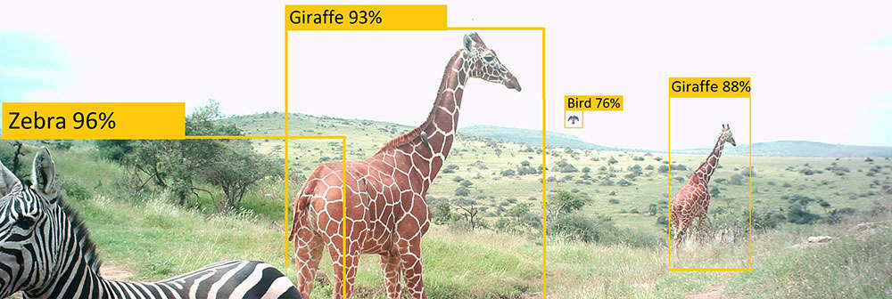
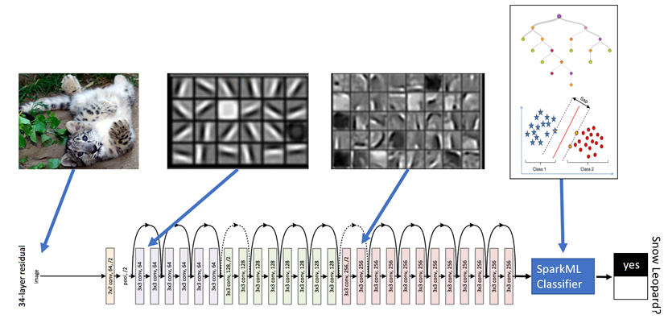
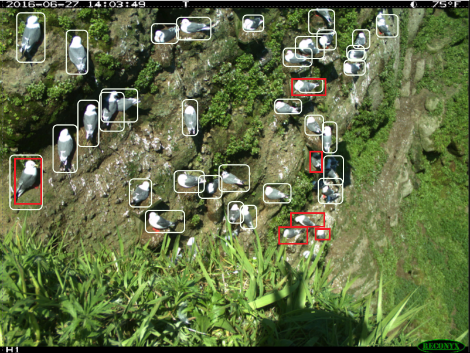

# Overview

This is a list of everything I know about machine learning and camera traps, which is presumably a strict subset of what&rsquo;s out there... <a href="mailto:agentmorris@gmail.com">email me</a> with updates, or submit pull requests.  Help me keep this page up to date!  And tell me what I got wrong about your software and your papers!

Maintained by [Dan Morris](http://dmorris.net).  I contribute to a project on [ML for camera traps](https://github.com/Microsoft/CameraTraps) and an [open repository for conservation data](http://lila.science).

# Table of Contents

[Camera trap systems using ML, *maybe* using ML, or *thinking about* ML](#camera-trap-systems-using-ml-maybe-using-ml-or-thinking-about-ml)  
&nbsp;&nbsp;&nbsp;&nbsp;[Wildlife Insights](#wildlife-insights)  
&nbsp;&nbsp;&nbsp;&nbsp;[Wildlife Protection Solutions](#wildlife-protection-solutions)  
&nbsp;&nbsp;&nbsp;&nbsp;[Microsoft AI for Earth Camera Trap API](#microsoft-ai-for-earth-camera-trap-api)  
&nbsp;&nbsp;&nbsp;&nbsp;[WII CaTRAT](#wii-catrat)  
&nbsp;&nbsp;&nbsp;&nbsp;[Project Zamba](#project-zamba)  
&nbsp;&nbsp;&nbsp;&nbsp;[EventFinder](#eventfinder)  
&nbsp;&nbsp;&nbsp;&nbsp;[Where&rsquo;s the Bear?](#wheres-the-bear)  
&nbsp;&nbsp;&nbsp;&nbsp;[AnDeNet (Animal Detection Network)](#andenet-animal-detection-network)  
&nbsp;&nbsp;&nbsp;&nbsp;[Trailcam Data](#trailcam-data)  
&nbsp;&nbsp;&nbsp;&nbsp;[BuckTracker](#bucktracker)  
&nbsp;&nbsp;&nbsp;&nbsp;[SnapCat](#snapcat)  
&nbsp;&nbsp;&nbsp;&nbsp;[ClassifyMe](#classifyme)  
[Public case studies using ML for camera traps (other than those captured under &ldquo;systems&rdquo;)](#public-case-studies-using-ml-for-camera-traps-other-than-those-captured-under-systems)  
&nbsp;&nbsp;&nbsp;&nbsp;[Zooniverse](#zooniverse)  
&nbsp;&nbsp;&nbsp;&nbsp;[ZSL + AutoML](#zsl--automl)  
&nbsp;&nbsp;&nbsp;&nbsp;[Snow Leopard Trust + Microsoft](#snow-leopard-trust--microsoft)  
&nbsp;&nbsp;&nbsp;&nbsp;[Conservation Metrics + Microsoft](#conservation-metrics--microsoft)  
&nbsp;&nbsp;&nbsp;&nbsp;[Peace Parks + Microsoft](#peace-parks--microsoft)  
[GitHub repos about ML for camera traps](#github-repos-about-ml-for-camera-traps)  
[Smart camera traps](#smart-camera-traps)  
&nbsp;&nbsp;&nbsp;&nbsp;[TrailGuard](#trailguard)  
&nbsp;&nbsp;&nbsp;&nbsp;[WAMCam (Wildlife Advanced Monitoring Camera)](#wamcam-wildlife-advanced-monitoring-camera)  
&nbsp;&nbsp;&nbsp;&nbsp;[InstantDetect (ZSL)](#instantdetect-zsl)  
&nbsp;&nbsp;&nbsp;&nbsp;[Sensing Clues (Jan Kees)](#sensing-clues-jan-kees)  
&nbsp;&nbsp;&nbsp;&nbsp;[PoacherCam (Panthera)](#poachercam-panthera)  
[Manual labeling tools people use for camera traps](#manual-labeling-tools-people-use-for-camera-traps)  
&nbsp;&nbsp;&nbsp;&nbsp;[Review articles about manual labeling](#review-articles-about-manual-labeling)  
&nbsp;&nbsp;&nbsp;&nbsp;[Atrium (San Diego Zoo)](#atrium-san-diego-zoo)  
&nbsp;&nbsp;&nbsp;&nbsp;[Agouti (Wageningen University)](#agouti-wageningen-university)  
&nbsp;&nbsp;&nbsp;&nbsp;[eMammal (Smithsonian)](#emammal-smithsonian)  
&nbsp;&nbsp;&nbsp;&nbsp;[TimeLapse2 (U Calgary)](#timelapse2-u-calgary)  
&nbsp;&nbsp;&nbsp;&nbsp;[Carnassial (Cascades Carnivore Project)](#carnassial-cascades-carnivore-project)  
&nbsp;&nbsp;&nbsp;&nbsp;[CPW Photo Warehouse (Colorado Parks and Wildlife)](#cpw-photo-warehouse-colorado-parks-and-wildlife)  
&nbsp;&nbsp;&nbsp;&nbsp;[Aardwolf2](#aardwolf2)  
&nbsp;&nbsp;&nbsp;&nbsp;[Camera Trap Manager](#camera-trap-manager-maintained-by-benito-zaragozí)  
&nbsp;&nbsp;&nbsp;&nbsp;[Camelot](#camelot)  
&nbsp;&nbsp;&nbsp;&nbsp;[Vixen](#vixen)  
&nbsp;&nbsp;&nbsp;&nbsp;[Trapper](#trapper)  
&nbsp;&nbsp;&nbsp;&nbsp;[Reconyx MapView](#reconyx-mapview)  
&nbsp;&nbsp;&nbsp;&nbsp;[Non-camera-trap-specific labeling tools at least one person has mentioned using](#non-camera-trap-specific-labeling-tools-at-least-one-person-has-mentioned-using)  
[Post-hoc analysis tools people use for labeled camera trap images](#post-hoc-analysis-tools-people-use-for-labeled-camera-trap-images)  
&nbsp;&nbsp;&nbsp;&nbsp;[CamTrapR](#camtrapr)  
&nbsp;&nbsp;&nbsp;&nbsp;[Presence](#presence)  
[Camera trap ML papers](#camera-trap-ml-papers)  
&nbsp;&nbsp;&nbsp;&nbsp;[With summaries](#with-summaries)  
&nbsp;&nbsp;&nbsp;&nbsp;[Waiting for summaries](#waiting-for-summaries)  
[Internal &ldquo;also see&rdquo; links](#internal-also-see-links)  
[Data sources for camera trap ML](#data-sources-for-camera-trap-ml)  
&nbsp;&nbsp;&nbsp;&nbsp;[LILA](#lila)  
&nbsp;&nbsp;&nbsp;&nbsp;[LILA&rsquo;s list of other data sets](#lilas-list-of-other-data-sets)  
&nbsp;&nbsp;&nbsp;&nbsp;[Somewhat-less-public data sources](#somewhat-less-public-data-sources)  
[Further reading](#further-reading)  

# Camera trap systems using ML, *maybe* using ML, or *thinking about* ML

## Wildlife Insights

[Wildlife Insights](https://wildlifeinsights.org/) is the evolution of the [TEAM network](http://www.teamnetwork.org/). TEAM was a network of camera traps and the researchers that use them; they provided some data management tools, but no AI. Wildlife Insights is a reboot of the platform, re-architected and intended to include both data management and ML. It&rsquo;s a collaboration among several NGOs, HQ&rsquo;d at Conservation International and Google Earth Outreach. Among the other NGOs involved, Smithsonian is particularly relevant to this page; WI may or may not become the logical evolution of eMammal as well.

## Wildlife Protection Solutions

Wildlife Protection Solutions deploys connected cameras in protected areas to detect and combat poaching.  They partnered with [Silverpond](https://silverpond.com.au) to build an [automated people-detection workflow](https://silverpond.com.au/case-studies/wildlife-protection-solutions/).

&nbsp;&nbsp;&nbsp;&nbsp;&nbsp;&nbsp;

## Microsoft AI for Earth Camera Trap API

> <https://github.com/microsoft/CameraTraps/tree/master/api/batch_processing>

AI for Earth (full disclosure: that includes me) runs an [API](https://github.com/microsoft/CameraTraps/tree/master/api/batch_processing) that performs large-scale batch inference on camera trap images.  The output of this API can be consumed directly in callers&rsquo; workflows, or it can be used in [Timelapse2](http://saul.cpsc.ucalgary.ca/timelapse/).

## WII CaTRAT

> [Wildlife Institute of India 2018 Tiger Status Report](https://projecttiger.nic.in/WriteReadData/PublicationFile/Tiger%20Status%20Report_XPS220719032%20%20new%20layout(1).pdf)

CaTRAT (Camera Trap Data Repository and Analysis Tool) is an internal tool used by the Wildlife Institute of India and the National Tiger Conservation Authority to accelerate the processing of camera trap images, with a focus on detecting tigers.  Not a lot of information is publicly available, but the report linked above suggests that CNNs are involved and that the workflow integrates [ExtractCompare](http://conservationresearch.org.uk/Home/ExtractCompare/index.html) for individual tiger identification.

&nbsp;&nbsp;&nbsp;&nbsp;&nbsp;&nbsp;

## Project Zamba

> <http://zamba.drivendata.org/>

> <https://github.com/drivendataorg/zamba>

Python tool to find species in camera trap videos, specifically tuned for 23 species often seen in central Africa. Algorithms were trained on data from the [Chimp & See](https://www.chimpandsee.org/#/) Zooniverse project. The description at:

> <http://zamba.drivendata.org/docs/algorithms.html>

...says it&rsquo;s a 5-model ensemble trained in Keras.

## EventFinder

> <http://cs.kingsu.ca/~mjanzen/CameraTrapSoftware.html>

Java-based tool to separate empty from non-empty images using background subtraction and color histogram comparisons.  Also see the associated [paper](https://link.springer.com/article/10.1007/s10661-019-7518-9).

&nbsp;&nbsp;&nbsp;&nbsp;&nbsp;&nbsp;

## Where's the Bear?

IoT system with computer vision pieces for managing camera traps, currently in Southern California. They refer to having processed 1.2M images, and have used Inception with some clever synthetic data generation to get pretty good results.

&ldquo;...is deployed at the UCSB Sedgwick Reserve, a 6000 acre site for environmental research and used to aggregate, manage, and analyze over 1.12M images.&rdquo;

> <https://www.cs.ucsb.edu/~ckrintz/projects/wtb.html>

## AnDeNet (Animal Detection Network)

Open-source project from the American Museum of Natural History, does semi-automated labeling. Thick-client Python tool, uses TensorFlow.

> <http://biodiversityinformatics.amnh.org/ml4conservation/animal-detection-network/>

> <https://github.com/persts/andenet-desktop>

&nbsp;&nbsp;&nbsp;&nbsp;&nbsp;&nbsp;

## Trailcam Data

> <https://www.trailcamdata.com/>

System for removing false positives from camera trap image collections. Unclear if this is automated or manual; I think manual.

&nbsp;&nbsp;&nbsp;&nbsp;&nbsp;&nbsp;

## BuckTracker

[BuckTracker](http://www.bucktracker.com/) is an app associated with [SpyPoint](https://www.spypoint.com) trail cameras, allowing users to filter photos by species for consumer hunting applications.

&nbsp;&nbsp;&nbsp;&nbsp;&nbsp;&nbsp;

## SnapCat

> <https://www.snapcatconservation.org/our-product>

TF model and maybe front-end, with plans to build a smart camera trap. Not sure how far along they are, but their Web page is nice, and they definitely make stuff, since they made this neat [waterproof scale for penguins](https://blog.synapse.com/post/how-much-does-a-magellanic-penguin-weigh).

&nbsp;&nbsp;&nbsp;&nbsp;&nbsp;&nbsp;

## ClassifyMe

Thick-client tool that allows a menu of Yolov2-based models.  Five models are provided out of the gate, trained primarily on open data sets (Snapshot Sergenti, Caltech Camera Traps, Snapshot Wisconsin).

Downloadable by request at <https://classifymeapp.com/>.

&nbsp;&nbsp;&nbsp;&nbsp;&nbsp;&nbsp;

# Public case studies using ML for camera traps (other than those captured under "systems")

## Zooniverse

A 2018 paper (Willi et al, Methods in Ecology and Evolution) described a preliminary approach to combining human- and machine-generated labels. Not fully deployed for general use on Zooniverse yet, but definitely a direction they&rsquo;re going.

See <a href="#willi2018">Willi et al.</a> below.

## ZSL + AutoML

> <https://www.zsl.org/conservation/conservation-initiatives/conservation-technology/machine-learning>

> <https://ai.google/stories/cloud-automl/>

ZSL has crowdsources some camera trap labeling via their [InstantWild](https://instantwild.zsl.org/) app, now exploring the use of ML. ZSL is working with the [AutoML](https://cloud.google.com/automl/) team at Google to build both models and model-training tools.  
  
Datatonic was involved as a contractor:

> <https://datatonic.com/insights/zsl-identifying-species-in-camera-trap-images-with-cloud-automl-vision/>

&nbsp;&nbsp;&nbsp;&nbsp;&nbsp;&nbsp;

## Snow Leopard Trust + Microsoft

> <https://blogs.technet.microsoft.com/machinelearning/2017/06/27/saving-snow-leopards-with-deep-learning-and-computer-vision-on-spark/>

> <https://news.microsoft.com/transform/snow-leopard-selfies-ai-save-species/>

Used ResNet on CNTK on MMLSpark to find snow leopards, showed results in a PowerBI dashboard.

&nbsp;&nbsp;&nbsp;&nbsp;&nbsp;&nbsp;

## Conservation Metrics + Microsoft

> <https://www.microsoft.com/developerblog/2018/11/06/active-learning-for-object-detection/>

This isn&rsquo;t specifically about camera traps, but it&rsquo;s about a general collaboration w/CM that applies to both aerial images and camera traps. The case study used in the blog post is about aerial images (for bird detection).

&nbsp;&nbsp;&nbsp;&nbsp;&nbsp;&nbsp;

## Peace Parks + Microsoft

> <https://www.microsoft.com/developerblog/2019/05/07/preventing-rhino-poaching-though-microsoft-azure/>

Focused primarily on scalable operationalization of machine learning services for real-time response to poaching threats.

&nbsp;&nbsp;&nbsp;&nbsp;&nbsp;&nbsp;

# GitHub repos about ML for camera traps

> <https://github.com/Microsoft/CameraTraps>

> <https://github.com/marco-willi/camera-trap-classifier>

> <https://github.com/mikeyEcology/MLWIC>

> <https://github.com/persts/andenet-desktop>

> <https://github.com/Evolving-AI-Lab/deep_learning_for_camera_trap_images>

> <https://github.com/qiantianpei/WildAnimalDetection>

> <https://github.com/drivendataorg/zamba>

# Smart camera traps

## TrailGuard

> <http://www.resolv.org/site-BiodiversityWildlifeSolutions/trailguard/>

> <https://venturebeat.com/2019/01/03/trailguard-ai-uses-intel-ai-tech-to-prevent-african-elephant-poaching/>

Their V2 camera does online human-vs-animal detection, and sends alerts via GSM/satellite. Running stock YOLO. Their V3 camera (now called &ldquo;TrailGuard AI&rdquo;) runs Movidius hardware.

&nbsp;&nbsp;&nbsp;&nbsp;&nbsp;&nbsp;

## WAMCam (Wildlife Advanced Monitoring Camera)

> <https://business.esa.int/projects/wamcam>

> <https://www.archangel.im/wamcam>

&ldquo;WAMCam started as a kickstart feasibility study. The study successfully completed with an end-to-end system prototype, facilitating user engagement and feedback on the system requirements. The devices have been tested in jungle conditions and reliably send AI-generated Iridium SBD status messages from beneath the forest canopy to remote end users who have cellular coverage.&rdquo;

Built as a contract project for the ESA by <https://www.archangel.im/>, who make unmanned cameras for other applications. Had &ldquo;AI on board&rdquo;, details unknown.

## InstantDetect (ZSL)

> <https://www.wildlabs.net/resources/case-studies/instant-detect-20-connected-future-conservation>

> <https://www.zsl.org/conservation/conservation-initiatives/conservation-technology/instant-detect>

InstantDetect 2.0 will be connected but will not have on-board AI; will move images to a base station. Iridium connection.

&nbsp;&nbsp;&nbsp;&nbsp;&nbsp;&nbsp;

## Sensing Clues (Jan Kees)

> <https://sensingclues.org/author/jankeesschakel/>

This appears to be a research lab with preliminary feelers in acoustic and image recognition; it&rsquo;s mostly on this list because of this screenshot from a blog post from 2017:

> <https://sensingclues.org/2017/03/16/smart-vision-update/>

&nbsp;&nbsp;&nbsp;&nbsp;&nbsp;&nbsp;

## PoacherCam (Panthera)

> <https://www.panthera.org/conservation-technology/poachercam>

> <https://www.panthera.org/panthera-poachercam-closer-look>

Web page says: &ldquo;Adapted from Panthera’s previous camera traps, the PoacherCam has a groundbreaking new feature: its motion-triggered detection system can now instantly distinguish between people and animals—the world&rsquo;s first camera to do so.&rdquo; This was from a 2015 blog post, unclear what the status is. I&rsquo;ve heard (anecdotally) that it wasn&rsquo;t exactly using machine learning, but was doing some amount of classical vision, i.e. change detection and moving-object geometry estimation.

&nbsp;&nbsp;&nbsp;&nbsp;&nbsp;&nbsp;

# Manual labeling tools people use for camera traps

## Review articles about manual labeling

Wearn, O., & Glover-Kapfer, P. (2017). Camera-trapping for Conservation: a Guide to Best-practices. *WWF-UK: Woking, UK*.

Not just about labeling tools, but contains a fantastic list of labeling tools, so including it here.

> <https://www.wwf.org.uk/conservationtechnology/camera-trap.html>

> <https://www.wwf.org.uk/conservationtechnology/documents/CameraTraps-WWF-guidelines.pdf>

Young, S., Rode-Margono, J., & Amin, R. (2018). Software to facilitate and streamline camera trap data management: A review. *Ecology and Evolution*, *8*(19), 9947-9957.

> <https://onlinelibrary.wiley.com/doi/full/10.1002/ece3.4464>

## Atrium (San Diego Zoo)

> <http://www.atrium-biodiversity.org/tools/camerabase/>

&nbsp;&nbsp;&nbsp;&nbsp;&nbsp;&nbsp;

## Agouti (Wageningen University)

> <https://agouti.eu/>

Web-based (requires upload), hosting is free for small student projects and gets more expensive as the user gets closer to commercial.

&nbsp;&nbsp;&nbsp;&nbsp;&nbsp;&nbsp;

## eMammal (Smithsonian)

> <https://emammal.si.edu/>

Software package and Smithsonian-hosted storage. All labeling happens through their tool prior to upload. Data stored by Smithsonian, owned by individual data set owners, and released to collaborators upon request.

I&rsquo;ve worked with a lot of camera trap data, and I will say that because the tool enforces consistent metadata at the time of labeling, in terms of organization and matching images to labels, data coming through eMammal is an order of magnitude cleaner than anything I&rsquo;ve worked with from any other source. eMammal metadata is provided in the Camera Trap Metadata Standard (XML variant).

&nbsp;&nbsp;&nbsp;&nbsp;&nbsp;&nbsp;

## TimeLapse2 (U Calgary)

> <http://saul.cpsc.ucalgary.ca/timelapse/>

> <https://github.com/saulgreenberg/Timelapse>

Thick-client, .net-based tool. In active development as of April 2019.

&nbsp;&nbsp;&nbsp;&nbsp;&nbsp;&nbsp;

## Carnassial (Cascades Carnivore Project)

> <https://github.com/CascadesCarnivoreProject/Carnassial>

Offshoot of TimeLapse2; both git pages acknowledge the divergence and refer to &ldquo;differing project requirements&rdquo;. Both appear to be in active development as of late 2018. According to the Carnassial github page:

&ldquo;Carnassial and Timelapse are broadly similar. As of March 2017 Carnassial offers faster analysis, more flexibility, and fewer defects than Timelapse.&rdquo;

## CPW Photo Warehouse (Colorado Parks and Wildlife)

Thick-client windows tool, appears to be .net-based, in active development as of 1/2019.

> <https://cpw.state.co.us/learn/Pages/ResearchMammalsSoftware.aspx>

> <http://biodiversityinformatics.amnh.org/ml4conservation/animal-detection-network/species-identification-localization/>

&nbsp;&nbsp;&nbsp;&nbsp;&nbsp;&nbsp;

## Aardwolf2

> <https://github.com/yathin/aardwolf2>

> <https://sourceforge.net/projects/aardwolf/>

As of version 2, this is browser-based (but runs locally) (v1 was a thick-client app). Linux only.

&nbsp;&nbsp;&nbsp;&nbsp;&nbsp;&nbsp;

## Camera Trap Manager (maintained by [Benito Zaragozí](https://benito-zaragozi.com/))

> <https://github.com/benizar/cameratrapmanager>

&ldquo;.NET desktop application for managing pictures taken by automatic camera traps&rdquo;

Looks slick and built easily, but appears to be linked deeply to GIS, which is good, except that I couldn&rsquo;t start a project without providing a shapefile. UI is in a mix of English and Spanish.

## Camelot 

Maintained by Chris Mann from [BitPattern](http://bitpattern.com.au/)

> <https://gitlab.com/camelot-project/camelot>

Open-source, runs in Java in a browser.  Developed in consultation with Fauna & Flora International.

&nbsp;&nbsp;&nbsp;&nbsp;&nbsp;&nbsp;

## Vixen

> <https://github.com/vixen-project/vixen>

Open-source, multi-platform, thick-client (Python). As of my last check (4/2019), this was last updated early 2018.

&nbsp;&nbsp;&nbsp;&nbsp;&nbsp;&nbsp;

## Trapper

> <https://gitlab.com/oscf/trapper-project>

Demo [here](https://demo.trapper-project.org/); you have to register and ask for a login, but they are responsive.

Open-source system, interaction is via a browser, data is stored in PostGres. Can be hosted either locally or on a Linux VM.

&nbsp;&nbsp;&nbsp;&nbsp;&nbsp;&nbsp;

## Reconyx MapView

> <https://www.reconyx.com/software/mapview>

&nbsp;&nbsp;&nbsp;&nbsp;&nbsp;&nbsp;

## Non-camera-trap-specific labeling tools at least one person has mentioned using

> Adobe Lightroom
> [www.adobe.com/Lightroom](http://www.adobe.com/Lightroom)‎

> Exif Pro
> <http://www.exifpro.com/>

> Digikam (OSS)
> <https://www.digikam.org/>
> <https://github.com/KDE/digikam>

# Post-hoc analysis tools people use for labeled camera trap images

## CamTrapR

I think CamTrapR generally assumes species labels, locations, etc. are in EXIF; it&rsquo;s agnostic about how you get them there.

> <https://cran.r-project.org/web/packages/camtrapR/index.html>

## Presence

Does species distribution modeling from observation data

> <https://www.mbr-pwrc.usgs.gov/software/doc/presence/presence.html>

# Camera trap ML papers

## With summaries

**Falzon, G., Lawson, C., Cheung, K. W., Vernes, K., Ballard, G., Fleming, P. J., ... & Meek, P. D. (2019). ClassifyMe: a field-scouting software for the identification of wildlife in camera trap images. bioRxiv, 646737.**

Present a thick-client tool (&ldquo;ClassifyMe&rdquo;) that allows a menu of Yolov2-based models.  Five models are provided out of the gate, trained primarily on open data sets (Snapshot Sergenti, Caltech Camera Traps, Snapshot Wisconsin).

Downloadable by request at <https://classifymeapp.com/>.

&nbsp;&nbsp;&nbsp;&nbsp;&nbsp;&nbsp;

**Janzen, M., Ritter, A., Walker, P. D., & Visscher, D. R. (2019). EventFinder: a program for screening remotely captured images. *Environmental Monitoring and Assessment*, 191(6), 406.**

Describe a thick-client tool for eliminating empty images, using background subtraction and color histogram comparisons.

&ldquo;The automated classification, on average, reduced the data requiring human input by 90.8% with an accuracy of 96.1%, and produced a false positive rate of only 3.4%.&rdquo;

Software available at:

> <http://cs.kingsu.ca/~mjanzen/CameraTrapSoftware.html>

&nbsp;&nbsp;&nbsp;&nbsp;&nbsp;&nbsp;

**Yousif, H., Yuan, J., Kays, R., & He, Z. (2019). Animal Scanner: Software for classifying humans, animals, and empty frames in camera trap images. *Ecology and Evolution*.**

&ldquo;We developed computer vision algorithms to detect and classify moving objects to aid the first step of camera trap image filtering—separating the animal detections from the empty frames and pictures of humans.&rdquo;

&ldquo;For those cameras with excessive empty frames due to camera malfunction or blowing vegetation automatically removes 54% of the false-triggers sequences without influencing the human/animal sequences. We achieve 99.58% on image-level empty versus object classification of Serengeti dataset.&rdquo; Validation split appears to be by sequence, not by location.

Divide the image into 736 blocks compute HOG features, diff these features to find moving regions, connect adjacent moving regions to find candidate moving objects.

Then use some color histogram features to separate clearly-bogus candidates (i.e., false positives on &ldquo;is this moving at all?&rdquo;) from plausible moving-object candidates.

Then use AlexNet-96 to classify candidate regions into moving person, moving animal, or moving background. Training data is \~460k images.

Code released as a GUI (Windows and Linux versions) and a command-line tool (not source) at:

> <https://figshare.com/s/cfc1070ca5a9bdda4cd8>

Data now available on LILA as [Missouri Camera Traps](http://lila.science/datasets/missouri-camera-traps).

&nbsp;&nbsp;&nbsp;&nbsp;&nbsp;&nbsp;

**Giraldo-Zuluaga, J. H., Salazar, A., Gomez, A., & Diaz-Pulido, A. (2019). Camera-trap images segmentation using multi-layer robust principal component analysis. The Visual Computer, 35(3), 335-347.**

Focus on foreground/background segmentation; compare both preprocessing techniques (e.g. histogram equalization) and foreground/background decomposition techniques (primarily focusing on multi-layer robust PCA).  Use a dataset of ~1000 images, report f-measures (I believe at the <i>pixel</i> level) in the neighborhood of 0.75, but the train/val split is unclear.

&nbsp;&nbsp;&nbsp;&nbsp;&nbsp;&nbsp;

**Glover-Kapfer, P., Soto-Navarro, C. A., & Wearn, O. R. (2019). Camera-trapping version 3.0: current constraints and future priorities for development. Remote Sensing in Ecology and Conservation.**

Not specifically focused on machine learning, but an excellent global survey (258 researchers) on the use of camera traps, with a nod toward a &ldquo;camera trap 3.0&rdquo; vision that includes some degree of automation.  If you&rsquo;re wondering after reading the title what &ldquo;camera trap 2.0&rdquo; was, they use that to refer to the curret, digital generation of camera traps.  In many ways this paper is a great reminder to computer vision folks that as important as machine learning is, there are 1000 other things that ecologists think about when they think about advances in camera trap technology, including durability, theft prevention, and connectivity.

&nbsp;&nbsp;&nbsp;&nbsp;&nbsp;&nbsp;

**Beery, S., Van Horn, G., & Perona, P. (2018). Recognition in Terra Incognita. *arXiv preprint arXiv:1807.04975*, *2*.**

Not primarily about building awesome models, rather about showing how catastrophically performance falls off at new locations.

Data a subset of [Caltech Camera Traps](http://lila.science/datasets/caltech-camera-traps), available on LILA.

**Willi, M., Pitman, R. T., Cardoso, A. W., Locke, C., Swanson, A., Boyer, A., ... & Fortson, L. (2018). Identifying animal species in camera trap images using deep learning and citizen science. *Methods in Ecology and Evolution*.**

Datasets: Snapshot Serengeti (7M), Camera CATalogue (0.5M), Elephant Expedition (0.5M), Snapshot Wisconsin (0.5M)

Models were all Resnet 18 trained in TF.

Whole-image classification for empty separation, species classification.

&ldquo;We did not directly (i.e., without transfer-learning) apply models trained on one dataset to another dataset even if the identification of empty images is the same task.&rdquo;

Incorporated into a live experiment on Zooniverse; if annotators agreed with model, image was retired early (i.e., with fewer annotators).

Cross-validation was by sequence, not by location. I.e., the same locations appeared in training and test.

Code and models available at:

> <https://conservancy.umn.edu/handle/11299/199818>

Data available as thumbnails (330x330) at:

> <https://conservancy.umn.edu/handle/11299/199819>

&nbsp;&nbsp;&nbsp;&nbsp;&nbsp;&nbsp;

**Norouzzadeh, M. S., Nguyen, A., Kosmala, M., Swanson, A., Palmer, M. S., Packer, C., & Clune, J. (2018). Automatically identifying, counting, and describing wild animals in camera-trap images with deep learning. *Proceedings of the National Academy of Sciences*, 201719367.**

They use VGG for detection (97% on a 50/50 rebalanced data set), an ensemble for identification (95% top-1 and 99% top-5), and an ensemble for counting (where they are running the ensemble as a classifier where the outputs are bins). Train their main networks from scratch on Snapshot Serengeti (~1.2M sequences), but also present experiments to simulate cases where Snapshot-Serengeti-sized training data is not available; in those experiments, they transfer from ImageNet.

Code and models available here:

> <https://github.com/Evolving-AI-Lab/deep_learning_for_camera_trap_images>

Cross-validation was by sequence, not by location. I.e., the same locations appeared in training and test.

&nbsp;&nbsp;&nbsp;&nbsp;&nbsp;&nbsp;

**Norouzzadeh, M. S., Nguyen, A., Kosmala, M., Swanson, A., Palmer, M., Packer, C., & Clune, J. Automatically identifying, counting, and describing wild animals in camera-trap images with deep learning.**

Pre-print of the above.

**Tabak, M. A., Norouzzadeh, M. S., Wolfson, D. W., Sweeney, S. J., VerCauteren, K. C., Snow, N. P., ... & Teton, B. (2018). Machine learning to classify animal species in camera trap images: applications in ecology. *Methods in Ecology and Evolution*.**

&ldquo;We trained machine learning models using convolutional neural networks with the ResNet-18 architecture and 3,367,383 images to automatically classify wildlife species from camera trap images obtained from five states across the United States.&rdquo;

They tested on smaller data sets from Canada (5900 images) and Tanzania (Snapshot Serengeti, just used for testing *detection* models).

98% top-1 accuracy on US images, 82% top-1 accuracy on Canada images, 94% detection accuracy on Tanzania images.

28 species, operated on images @ 256x256. 10% test set held out from the \~3M images. Trained in TF, based on ResNet-18. Collapsed species with \<2000 images into taxonomic groups, built a separate group-level model. For some reason they had lots of pigs, so they trained a separate pig/non-pig model. So that&rsquo;s three models total. I believe &ldquo;empty&rdquo; was a class in both the species- and group-level models, i.e. they did not train a separate detector.

Cross-validation was by sequence, not by location. I.e., the same locations appeared in training and test.

Data available on LILA as [North American Camera Trap Images](http://lila.science/datasets/nacti).

**Michael A Tabak, Mohammed S Norouzzadeh, David W Wolfson, Steven J Sweeney, Kurt C VerCauteren, Nathan P Snow, Joseph M Halseth, Paul A Di Salvo, Jesse S Lewis, Michael D White, Ben Teton, James C Beasley, Peter E Schlichting, Raoul K Boughton, Bethany Wight, Eric S Newkirk, Jacob S Ivan, Eric A Odell, Ryan K Brook, Paul M Lukacs, Anna K Moeller, Elizabeth G Mandeville, Jeff Clune, Ryan S Miller. Machine learning to classify animal species in camera trap images: applications in ecology. bioRxiv 346809.**

Pre-print of the above.

**Loos, A., Weigel, C., & Koehler, M. (2018, September). Towards Automatic Detection of Animals in Camera-Trap Images. In *2018 26th European Signal Processing Conference (EUSIPCO)* (pp. 1805-1809). IEEE.**

Train on Snapshot Serengeti (1.9M sequences, 3.2M images, 48 species), compare YOLOv2 and SSD. Created a new detection project @ Zooniverse, sourced 33k boxes on 17k images, then did random splits (kept sequences within a split, but did not use location information in drawing their split). Created a set of 300 empty images.

Evaluate with a normalized version of mAP they call nAP that normalizes to handle class imbalance (I didn&rsquo;t read into the details), results look like:

&nbsp;&nbsp;&nbsp;&nbsp;&nbsp;&nbsp;

**Schneider, S., Taylor, G. W., & Kremer, S. (2018, May). Deep learning object detection methods for ecological camera trap data. In *2018 15th Conference on Computer and Robot Vision (CRV)* (pp. 321-328). IEEE.**

Compares Faster-RCNN and Yolo v2 on the gold-standard Snapshot Serengeti data (\~4.5k images with bound boxes, 11 species with enough for them to count) and another data set they call &ldquo;Reconyx Camera Trap&rdquo; (Panama, Netherlands) (7k images, but only 946 images w/bounding boxes).

Both architectures used ResNet 101 backbones, pre-trained on COCO, fine-tuned only the last layer.

They didn&rsquo;t specify their splitting procedure, ergo I assume sequences may have been split across train/val.

Their evaluation metrics are &ldquo;accuracy&rdquo; (class accuracy only evaluated on true positives) and &ldquo;IOU&rdquo;, which I believe is being defined as something like &ldquo;average IOU for all super-threshold detections&rdquo;, where a total miss is given an IOU of 0.0.

&nbsp;&nbsp;&nbsp;&nbsp;&nbsp;&nbsp;

**Schneider, S., Taylor, G. W., Linquist, S., & Kremer, S. C. (2018). Past, present and future approaches using computer vision for animal re-identification from camera trap data. *Methods in Ecology and Evolution*.**

Excellent literature review (not a technical paper) on what species people have done automated individual ID for (not for camera traps), with an eye toward eventually supporting camera traps. Includes this awesome figure, and an equally-awesome table that goes with it:

&nbsp;&nbsp;&nbsp;&nbsp;&nbsp;&nbsp;

**Gomez, A., Salazar, A., & Vargas, F. (2016). Towards automatic wild animal monitoring: identification of animal species in camera-trap images using very deep convolutional neural networks. *arXiv preprint arXiv:1603.06169*.**

&ldquo;Snapshot Serengeti ... 225 camera-traps ... more than one million sets of pictures ... 48 animal species ... highly unbalanced ..., e.g., zebra class has 179683 images and the striped polecat (zorilla) only 29. In this work only 26 classes were selected for classification.&rdquo;

Best results came from ResNet-50, but architecture wasn&rsquo;t the main variable here. They played with a bunch of different data set permutations, re: balancing and manual segmentation/cropping, which (not surprisingly) helped. Generally somewhere around 60% top-whatever in the base data set, up to around 90% top-whatever in a segmented subset.

**Tack, J. L. P., West, B. S., McGowan, C. P., Ditchkoff, S. S., Reeves, S. J., Keever, A. C., & Grand, J. B. (2016). AnimalFinder: A semi-automated system for animal detection in time-lapse camera trap images. *Ecological informatics*, *36*, 145-151.**

Not a machine learning approach; they use edge detection to find deer, tune their detector specifically for this application, and don&rsquo;t make claims that this will generalize to lots of species.  In fact just one paragraph of this paper is spent on technical methods.

The reason this paper is exciting, and the reason I include it here, is that this is the only paper I&rsquo;m aware of (as of 11/2019) that evaluates a semi-automated system for its performance relative to manual annotation on very-high-level tasks, i.e. not just the image classification metrics that we carry over from the computer vision community.  Sometimes it&rsquo;s easy to get so into our machine learning that we forget that <i>ecologists don&rsquo;t care about annotated images</i>; they care about, e.g., population distributions.  So this paper compares methods not on image-level accuracy, but on, e.g., &ldquo;site-days with at least one detection&rdquo; and &ldquo;model-averaged abundance&rdquo;.  They also specifically report on the time saved by a semi-automated approach: &ldquo;AnimalFinder saved 14.8 h (~1 h per 4400 images) of manual review time compared to the manual-only method.&rdquo;  

Reporting on domain-relevant metrics is a great aspirational goal for all papers in this space!

&nbsp;&nbsp;&nbsp;&nbsp;&nbsp;&nbsp;

**Chen, G., Han, T. X., He, Z., Kays, R., & Forrester, T. (2014, October). Deep convolutional neural network based species recognition for wild animal monitoring. In *Image Processing (ICIP), 2014 IEEE International Conference on* (pp. 858-862). IEEE.**

Use a motion-based approach (on sequences) to get a loose ROI, then compare bag-of-words-based and CNN-based approaches to classifying those ROIs. CNN is custom (three layers). Report accuracies in the neighborhood of 35% on 20 classes. Data is publicly available, though not linked in the paper.

**Yu, X., Wang, J., Kays, R., Jansen, P. A., Wang, T., & Huang, T. (2013). Automated identification of animal species in camera trap images. *EURASIP Journal on Image and Video Processing*, *2013*(1), 52.**

Maybe the dawn of the field? I can&rsquo;t find much before 2013. Use SIFT and cLBP features, fed into an SVM.  Manually cropped ROIs, classified those crops.  Cross-validation used random splitting.  82% accuracy on 18 classes.  Dataset is 7000 crops from a variety of forest ecosystems.

&nbsp;&nbsp;&nbsp;&nbsp;&nbsp;&nbsp;

## Waiting for summaries

<!-- None right now, you should <a href="mailto:dmorris@cs.stanford.edu">email me</a> to tell me what I&rsquo;m missing! -->

Gomez, A., Diez, G., Salazar, A., & Diaz, A. (2016, December). Animal identification in low quality camera-trap images using very deep convolutional neural networks and confidence thresholds. In International Symposium on Visual Computing (pp. 747-756). Springer, Cham.

Yousif, H., Yuan, J., Kays, R., & He, Z. (2017, May). Fast human-animal detection from highly cluttered camera-trap images using joint background modeling and deep learning classification. In 2017 IEEE international symposium on circuits and systems (ISCAS) (pp. 1-4). IEEE.

Beery, S., Liu, Y., Morris, D., Piavis, J., Kapoor, A., Meister, M., & Perona, P. (2019). Synthetic examples improve generalization for rare classes. arXiv preprint arXiv:1904.05916.

# Data sources for camera trap ML

## LILA

> <http://lila.science>

lila.science is the only substantial repository of openly available camera trap images that I&rsquo;m aware of. It currently contains over 10M images spread over a few data sets, but we&rsquo;re just getting started!

## LILA&rsquo;s list of other data sets

We also include a list of other publicly-available data sets that we know about:

> <http://lila.science/otherdatasets>

&nbsp;&nbsp;&nbsp;&nbsp;&nbsp;&nbsp;

## Somewhat-less-public data sources

This is a very abbreviated list of organizations that internally have very large repositories of camera trap data, available at varying degrees of request complexity. If I were in the business of pestering people for camera trap data (and I am\!), these are the places I would invest most of my pestering time:

> <https://emammal.si.edu/>

> <https://zooniverse.org>

> <http://www.teamnetwork.org/>  
> Appears to be deprecated as of 3/2019 in preparation for migration to Wildlife Insights.

# Further reading

[Awesome Deep Ecology](https://github.com/patrickcgray/awesome-deep-ecology) (review of deep learning applications in ecology) 
[Computer Vision and Aerial Imagery for Wildlife Conservation](https://bkellenb.github.io/cv-for-wildlife-aerial-imagery/) (page similar to this one, focused on aerial imagery)
