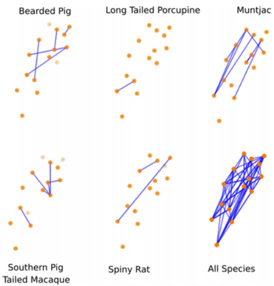

# Everything I know about ML and camera traps

## Overview

This is a list of everything I know about machine learning and camera traps, which is presumably just a subset of what's out there... <a href="mailto:agentmorris+cameratrapsurvey@gmail.com">email me</a> with updates, or submit pull requests.  Help me keep this page up to date!  And tell me what I got wrong about your software and your papers!

Maintained by [Dan Morris](http://dmorris.net).  Disclosure of what I work on: I contribute to several projects on ML for camera traps (particularly, [MegaDetector](https://github.com/agentmorris/MegaDetector), [SpeciesNet](https://github.com/google/cameratrapai), and [Wildlife Insights](https://wildlifeinsights.org)) and an open repository for conservation data ([lila.science](https://lila.science)).  And since I've disclosed that, I can say that although I don't filter papers for this list based on whether they use stuff I've worked on, I <i>do</i> use this list as a way of tracking how those systems are being used, so in the "papers" sections, you will see tags for a few things I want to track.

## Table of Contents

[Camera trap systems using ML](#camera-trap-systems-using-ml)  
&nbsp;&nbsp;&nbsp;&nbsp;[Systems in active development](#systems-that-appear-to-be-in-active-development)  
&nbsp;&nbsp;&nbsp;&nbsp;[Systems that appear to be less active](#systems-that-appear-to-be-less-active)  
&nbsp;&nbsp;&nbsp;&nbsp;[Systems that appear not to exist any more](#systems-that-appear-not-to-exist-any-more)
[OSS repos about ML for camera traps](#oss-repos-about-ml-for-camera-traps)  
&nbsp;&nbsp;&nbsp;&nbsp;[Active repos](#last-updated--2021)  
&nbsp;&nbsp;&nbsp;&nbsp;[Less active repos](#last-updated--2021-1)  
[Publicly-available ML models for camera traps](#publicly-available-ml-models-for-camera-traps)  
[Smart camera traps](#smart-camera-traps)  
[Manual labeling tools people use for camera traps](#manual-labeling-tools-people-use-for-camera-traps)  
&nbsp;&nbsp;&nbsp;&nbsp;[Review papers about labeling tools](#review-papers-about-labeling-tools)  
&nbsp;&nbsp;&nbsp;&nbsp;[Tools in active development](#tools-that-appear-to-be-online-or-were-last-updated--2021)  
&nbsp;&nbsp;&nbsp;&nbsp;[Tools that appear to be less active](#tools-that-appear-to-be-less-active)  
&nbsp;&nbsp;&nbsp;&nbsp;[Non-camera-trap-specific labeling tools that people use for camera trap data](#non-camera-trap-specific-labeling-tools-that-people-use-for-camera-trap-data)  
[Post-hoc analysis tools people use for camera trap data](#post-hoc-analysis-tools-people-use-for-camera-trap-data)  
[Camera trap ML papers](#camera-trap-ml-papers)  
&nbsp;&nbsp;&nbsp;&nbsp;[Papers with summaries](#papers-with-summaries)  
&nbsp;&nbsp;&nbsp;&nbsp;[Papers I haven't read yet](#papers-i-know-exist-and-i-have-access-to-and-plan-to-read)  
&nbsp;&nbsp;&nbsp;&nbsp;[Papers that use LILA data but mostly aren't about camera traps](#lila-only-non-camera-trap-papers)  
[Data sources for camera trap ML](#data-sources-for-camera-trap-ml)  
[Metadata standards for camera trap data](#metadata-standards-for-camera-trap-data)  
[Further reading](#further-reading)  
[Places to chat about this stuff](#places-to-chat-about-this-stuff)  

<!--&nbsp;&nbsp;&nbsp;&nbsp;[Papers I don't have access to](#papers-i-dont-have-access-to-but-would-read-if-i-did)  
&nbsp;&nbsp;&nbsp;&nbsp;[Papers that are redundant citations](#papers-that-are-more-or-less-pre-publication-versions-of-another-paper-that-is-already-included)  -->

## Camera trap systems using ML

I've broken this category out into "systems that look like they're being actively developed" and "systems that are less active".  This assessment is based on visiting links and searching the Web; if I've incorrectly put something in the latter category, please <a href="mailto:agentmorris+cameratrapsurvey@gmail.com">let me know</a>!

### Systems that appear to be in active development

#### Wildlife Insights

> <https://wildlifeinsights.org>

Wildlife Insights (WI) is a platform for camera trap image management that includes AI-accelerated annotation, as well as data management and spatial analysis tools.  WI is a collaboration among several NGOs, HQ'd at [WildMon](https://wildmon.ai/), with an AI component developed at Google.

&nbsp;&nbsp;&nbsp;&nbsp;&nbsp;&nbsp;

#### TrapTagger

> <https://wildeyeconservation.org/traptagger>

A free, [open-source](https://github.com/WildEyeConservation/TrapTagger) online platform for camera trap data management that includes AI (for blank elimination and species classification), integration with HotSpotter for individual identification, and spatiotemporal analysis.

&nbsp;&nbsp;&nbsp;&nbsp;&nbsp;&nbsp;

#### WildTrax

> <https://www.wildtrax.ca>

An online platform for camera trap data management that includes automated blank/non-blank elimination (using MegaDetector), species classification (as of the time I'm writing this, two models are available: (a) MegaClassifier, and (b) a platform-specific cattle/non-cattle model).  Also manages acoustic data, with some AI functionality for acoustic data as well.

&nbsp;&nbsp;&nbsp;&nbsp;&nbsp;&nbsp;

#### AddaxAI (formerly EcoAssist)

> <https://addaxdatascience.com/addaxai/>

[Open-source](https://github.com/PetervanLunteren/AddaxAI) client-side tool for running MegaDetector and a number of species classifiers, including various postprocessing steps.

&nbsp;&nbsp;&nbsp;&nbsp;&nbsp;&nbsp;

#### Camelot

> <https://gitlab.com/camelot-project/camelot>

Open-source, runs in Java in a browser.  Developed in consultation with Fauna & Flora International.  Preliminary integration with MegaDetector allows selective review of human/animal/empty/vehicle images.

&nbsp;&nbsp;&nbsp;&nbsp;&nbsp;&nbsp;

#### Trapper

> <https://gitlab.com/oscf/trapper-project>

Open-source system, interaction is via a browser, data is stored in Postgres. Can be hosted either locally or on a Linux VM.  Offers several AI models, including MD (see the [Trapper AI](https://gitlab.com/trapper-project/trapper-ai) module).

&nbsp;&nbsp;&nbsp;&nbsp;&nbsp;&nbsp;

#### Animl

> <https://animl.camera/>

OSS platform developed by TNC for managing data from biosecurity cameras, with real-time detection and classifications.  Code is [here](https://github.com/tnc-ca-geo/animl-frontend).

&nbsp;&nbsp;&nbsp;&nbsp;&nbsp;&nbsp;

#### DeepFaune

> <https://www.deepfaune.cnrs.fr/en/>

[Open-source](https://plmlab.math.cnrs.fr/deepfaune/software) thick-client tool with a custom detector (based on YOLOv8 as of 2023.12.05) (which can be swapped out for MD or run alongside MD) and a custom species classifier focused on European animals.

&nbsp;&nbsp;&nbsp;&nbsp;&nbsp;&nbsp;

#### wpsWatch

> <https://wildlabs.net/inventory/products/wpswatch>

<a href="https://wildlifeprotectionsolutions.org">Wildlife Protection Solutions</a> deploys connected cameras in protected areas to detect and combat poaching; wpsWatch is their monitoring platform, which leverages AI for both human/animal/vehicle detection (using MegaDetector) and species classification.

&nbsp;&nbsp;&nbsp;&nbsp;&nbsp;&nbsp;

#### AddaxAI-connect

> <https://addaxdatascience.com/early-warning-systems/>

Cloud-based platform that receives images from connected cameras, runs AI models, and sends notifications based on specific conditions (e.g. specific species).

&nbsp;&nbsp;&nbsp;&nbsp;&nbsp;&nbsp;

#### Zamba Cloud

> <https://www.zambacloud.com>

Cloud-based platform for no-code training of image and video classification models.  Explanatory video [here](https://www.youtube.com/watch?v=cvH9aQgYTv0).

They also maintain a [Python package](https://github.com/drivendataorg/zamba) that includes some of Zamba Cloud's functionality.  

&nbsp;&nbsp;&nbsp;&nbsp;&nbsp;&nbsp;

#### BoquilaHUB

> <https://boquila.org/hub>

Client-side tool that runs a variety of models (MD, SpeciesNet, custom animal detectors).  Code is [here](https://github.com/boquila/boquilahub).

&nbsp;&nbsp;&nbsp;&nbsp;&nbsp;&nbsp;

#### Mbaza

> <https://appsilon.com/data-for-good/mbaza-ai>

Open-source, client-side Shiny app that includes image review and client-side classifiers for two African ecosystems.  Code is <a href="https://github.com/Appsilon/mbaza">here</a>.  More information <a href="https://appsilon.com/mbaza-shiny-app-case-study/">here</a>, <a href="https://appsilon.com/applying-ai-to-nature-conservation/">here</a>, and <a href="https://appsilon.com/gabon-wildlife-ai-for-biodiversity-conservation/">here</a>.

&nbsp;&nbsp;&nbsp;&nbsp;&nbsp;&nbsp;

#### Conservation AI

> <https://conservationai.co.uk>

Includes a family (\~10) of region-specific object detection models for camera traps and drones.  Model selection and data upload are done with a desktop client.  Also supports acoustic classification.

&nbsp;&nbsp;&nbsp;&nbsp;&nbsp;&nbsp;

#### Agouti

> <https://agouti.eu> 

Web-based tool for camera trap data management, annotation, and spatial analysis.

The [documentation](https://docs.agouti.eu/general/automatic_annotation.html#ai-models-available-in-agouti) lists the available AI models, including MDv5a, DeepFaune's classifier for European Species, and Agouti-specific models for Western Europe, Europe, French Guiana, India, Nepal, Panama, and Southern Africa.  Early adopter of Camtrap DP export, especially to facilitate data release on GBIF.

&nbsp;&nbsp;&nbsp;&nbsp;&nbsp;&nbsp;

#### WildePod

> <https://wildepod.org/>

Web-based image management platform built for the Felidae Conservation Fund.  Uses MD for empty/animal/blank/vehicle categorization.

&nbsp;&nbsp;&nbsp;&nbsp;&nbsp;&nbsp;

#### MegaDetector

> <https://github.com/agentmorris/MegaDetector>

This is not a "platform" or "system" in the same sense as other items on this list, the tooling is *almost* a "system", so for this list, I'm upgrading MegaDetector to "system".  Full disclosure: I contribute to this project.

<a href="https://github.com/agentmorris/MegaDetector/blob/main/megadetector.md">MegaDetector</a> is an object detection model that is used to identify camera trap images that contain animals, people, vehicles, or none of the above; in practice, it's primarily used to eliminate blank images from large camera trap surveys.  The GitHub repo provides Python scripts to run MegaDetector and do stuff with the output, and the [MegaDetector Python package](https://pypi.org/project/megadetector/) wraps that up in pip-installable format.  MegaDetector (or its output) has also been integrated into some of the other items on this list.

&nbsp;&nbsp;&nbsp;&nbsp;&nbsp;&nbsp;

#### Timelapse2

> <https://timelapse.ucalgary.ca/>

> <https://github.com/saulgreenberg/Timelapse>

Thick-client, .net-based tool for reviewing camera trap images.  Incorporates ML in the sense that it has integrated the output from <a href="https://github.com/agentmorris/MegaDetector">MegaDetector</a> and associated species classifiers.

&nbsp;&nbsp;&nbsp;&nbsp;&nbsp;&nbsp;

#### eVorta

<!--
* [News story](https://www.abc.net.au/news/2021-07-31/evorta-smart-camera-system-feral-cats-kangaroo-island/100337978)
* [Demo video](http://51.161.196.64/)
* [App](https://play.google.com/store/apps/details?id=com.evorta.android&pli=1)
* [Kangaroo Island case study](https://www.naturefoundation.org.au/how-to-help/donate/feral-cat-eradication-program/sponsor-a-4g-camera)
-->

> <https://web.evorta.com/>

Connected camera network with cloud-based AI capabilities (for detecting and classifying Australian wildlife).

&nbsp;&nbsp;&nbsp;&nbsp;&nbsp;&nbsp;

#### Zooniverse

> <https://www.zooniverse.org>

This is a bit of an outlier on this list... Zooniverse is a platform for engaging <i>human</i> volunteers for data labeling.  It doesn't explicitly use ML, and it isn't explicitly about camera traps, but here's my rationalization for including it here:

1. By some arbitrary way of dividing projects, a weak plurality of the projects on Zooniverse are about camera traps.
2. By some arbitrary way of dividing data sources, Zooniverse projects <i>contribute</i> more data to the global pool of publicly-available camera trap data than any other data source (e.g. all of the <a href="https://lila.science/category/camera-traps/snapshot-safari/">Snapshot Safari projects on LILA</a> began life on Zooniverse.
3. Zooniverse is at least... noodling on the idea of incorporating ML for camera trap projects, e.g. see the <a href="https://github.com/zooniverse/subject-assistant">Zooniverse subject assistant</a>.
4. I know from anecdotal interactions that lots of Zooniverse project owners use AI to (a) remove images of humans and (b) manage the number of blanks prior to uploading images to Zooniverse.

&nbsp;&nbsp;&nbsp;&nbsp;&nbsp;&nbsp;

#### CamTrap Detector

* [Home](https://camtrap.net/detector)
* [Source](https://github.com/bencevans/camtrap-detector)

Client-side tool for running MegaDetector, including various postprocessing steps.

&nbsp;&nbsp;&nbsp;&nbsp;&nbsp;&nbsp;

#### OCAPI

> <https://www.terroiko.fr/ocapi/>

Web-based platform for camera trap data management, uses MegaDetector and a custom classifier for European taxa (class list [here](https://ocapi-doc.terroiko.fr/#categories)).

&nbsp;&nbsp;&nbsp;&nbsp;&nbsp;&nbsp;

#### Reconyx connect

* [Reconyx Connect for Android](https://play.google.com/store/apps/details?id=com.reconyx.reconyx2&hl=en_US&gl=US)
* [Reconyx Connect for iOS](https://apps.apple.com/us/app/reconyx-connect/id1497202185)

Reconyx mostly makes cameras, but their mobile app includes what appears to be cloud-based AI for classifying deer/buck/doe/turkey/human/vehicle in images from connected cameras ([video](https://www.youtube.com/watch?v=pRB15wrd2DE&t=5s&ab_channel=ReconyxCameras)).

&nbsp;&nbsp;&nbsp;&nbsp;&nbsp;&nbsp;

#### ecoSecrets

* [Code](https://github.com/naturalsolutions/ecoSecrets)
* [Docs](https://natural-solutions.gitlab.io/geonature/annotation/)

Web app for processing camera trap images.  Docs refer to the image processing approach presented in [Zhang et al.](https://ieeexplore.ieee.org/abstract/document/7523423); MegaDetector is also mentioned in the code.

&nbsp;&nbsp;&nbsp;&nbsp;&nbsp;&nbsp;

#### WildID

> <https://www.wildid.app>

Web-based platform for processing camera trap images, targeted for Southern Africa, that uses a custom multiclass detector.  Free trial available; paid version allows larger bulk uploads.

Not to be confused with [Wild.ID](https://github.com/ConservationInternational/Wild.ID) (a desktop tool for camera trap image processing that was used by the TEAM Network prior to Wildlife Insights) or [Wild-ID](https://faculty-directory.dartmouth.edu/douglas-thomas-bolger) (a desktop tool to accelerate the identification of individual animals).

&nbsp;&nbsp;&nbsp;&nbsp;&nbsp;&nbsp;

#### PantheraIDS (Integrated Data System)

> <http://www.pantheraids.org>

Image management and analysis software used at Panthera; includes machine learning functionality for blank removal, species classification, and individual ID.

&nbsp;&nbsp;&nbsp;&nbsp;&nbsp;&nbsp;

#### Dudek AI Image Toolkit

> <https://ait.dudek.com>

Cloud-based platform that leverages MDv5.

&nbsp;&nbsp;&nbsp;&nbsp;&nbsp;&nbsp;

#### Bounding Box Editor and Exporter (BBoxEE)

> <https://github.com/persts/BBoxEE>

Client-side tool for semi-automated labeling of camera trap images.

&nbsp;&nbsp;&nbsp;&nbsp;&nbsp;&nbsp;

#### Cacophony Project (2040) Thermal Predator Camera

* [Home](https://www.2040.co.nz/collections/frontpage/products/thermal-predator-camera)
* [Demo video](https://www.youtube.com/watch?v=eiopklk5iic)

Thermal camera with a cloud-based AI service.

&nbsp;&nbsp;&nbsp;&nbsp;&nbsp;&nbsp;

#### FASTCAT-Cloud

> <https://service.fastcat-cloud.org>

Online platform with several custom detectors for European wildlife, trained on GBIF data, which can be accessed via a Web demo or an API.  Integrated with <a href="https://www.ispotnature.org/">iSpot</a> (an iNat-like platform for biodiversity observation logging).  Also has a human/blank model, but details are not available on the Web page.

&nbsp;&nbsp;&nbsp;&nbsp;&nbsp;&nbsp;

#### Caption Pro

* [Camera trap user guide](https://captionpro.com.au:444/AlekaConsulting/index.php/camera-trap-data-analysis/)
* [Video](https://www.youtube.com/watch?v=zAygEAGwnJs&ab_channel=SimonKravis2)

Tool for captioning images and videos that includes a workflow for camera trap data, including running MegaDetector via a Web service.

&nbsp;&nbsp;&nbsp;&nbsp;&nbsp;&nbsp;

#### Declas

> <https://github.com/stangandaho/declas>

Cross-platform client-side tool for running MD and species classifiers.

&nbsp;&nbsp;&nbsp;&nbsp;&nbsp;&nbsp;

#### Animal Detect

> <https://www.animaldetect.com>

Online platform for processing camera trap images.  Uses MD for cropping and blank elimination, incorporates species classification, and allows similarity-based grouping in an embedding space.

&nbsp;&nbsp;&nbsp;&nbsp;&nbsp;&nbsp;

#### Grizzly Systems

> <https://www.grizcam.com>

They describe a device with edge inference capability ("smart trigger") and mesh networking, and AI-enabled software tools that run locally or in the cloud.

&nbsp;&nbsp;&nbsp;&nbsp;&nbsp;&nbsp;

#### EventFinder

> <http://cs.kingsu.ca/~mjanzen/CameraTrapSoftware.html>

Java-based tool to separate empty from non-empty images using background subtraction and color histogram comparisons.  Also see the associated [paper](https://link.springer.com/article/10.1007/s10661-019-7518-9).  Uses MD in the "EventFinder Suite" version, released in 2024.

&nbsp;&nbsp;&nbsp;&nbsp;&nbsp;&nbsp;

### Systems that appear to be less active

#### CAMinos

> <https://www.ischool.berkeley.edu/projects/2021/caminos-intelligent-trail-camera-annotation>

This looks to have been a student project, so normally I would say it's unfair to call it "inactive", but the page and video are so slick by the standards of student projects that my intention is to give it props by including it here.

Online annotation tool that combines MDv5 with a species classifier.

* [Home](https://www.ischool.berkeley.edu/projects/2021/caminos-intelligent-trail-camera-annotation)
* [Video](https://www.youtube.com/watch?v=LUnNxLg2qTo&ab_channel=StevenLeung)
* [Writeup](https://www.ischool.berkeley.edu/sites/default/files/sproject_attachments/copy_of_caminos_final_presentation.pdf)

&nbsp;&nbsp;&nbsp;&nbsp;&nbsp;&nbsp;

#### Where's the Bear?

> <https://www.cs.ucsb.edu/~ckrintz/projects/wtb.html>

IoT system with computer vision pieces for managing camera traps, currently in Southern California. They refer to having processed 1.2M images, and have used Inception with some clever synthetic data generation to get pretty good results.

"...is deployed at the UCSB Sedgwick Reserve, a 6000 acre site for environmental research and used to aggregate, manage, and analyze over 1.12M images."

#### Wildlife Institute of India CaTRAT

> <https://wii.gov.in/publications/software/tiger-monitoring-software>

CaTRAT (Camera Trap Data Repository and Analysis Tool) is an internal tool used by the Wildlife Institute of India, the National Tiger Conservation Authority, and regional wildlife authorities to accelerate the processing of camera trap images, with a focus on population surveys for tigers and snow leopards.  Not a lot of information is publicly available, but [this paper](https://journals.plos.org/plosone/article?id=10.1371/journal.pone.0322136) suggests that CaTRAT uses [ExtractCompare](http://conservationresearch.org.uk/Home/ExtractCompare/index.html) for individual tiger identification. [This article](https://www.outdoorjournal.com/indias-tiger-census-sets-a-world-record-ahead-of-international-tigers-day-2020/) suggests that HotSpotter is used as well, but I can't verify that anywhere else.  ([June 2025 story](https://timesofindia.indiatimes.com/india/scientists-use-clever-trick-to-count-ghosts-of-the-mountains/articleshow/122014350.cms), [July 2025 story](https://india.mongabay.com/2025/07/snow-leopard-survey-finds-the-elusive-cat-thriving/))

&nbsp;&nbsp;&nbsp;&nbsp;&nbsp;&nbsp;

#### MooseDar

> <https://www.moosedar.com>

Thermal-camera-based system that uses CNNs to detect moose, for accident prevention.

#### BuckTracker

> <https://www.spypoint.com/us/en/blog?id=298&topic=les-avantages-du-filtre-d-espces-buck-tracker-a.i>

App associated with [SpyPoint](https://www.spypoint.com) trail cameras, allowing users to filter photos by species for consumer hunting applications.

&nbsp;&nbsp;&nbsp;&nbsp;&nbsp;&nbsp;

### Systems that appear not to exist any more

This assessment is based mostly on 404's, please let me know if I've missed the boat on any of these moving somewhere I couldn't find them.

#### Wildlife Observer Network Image ID+

> <https://wildlifeobserver.net/imageidplus>

Web-based system that takes a zipfile of camera trap images and produces an estimate of the presence/number of animals in each image.

#### CAIMAN

> <https://sensingclues.org/caiman>

Cloud-based, AI-enabled system for camera trap image processing.  Integrated with online spatial analysis tools ([Focus](https://sensingclues.org/focus) and [WildCAT](https://sensingclues.org/wildcat)).  Listed as "available by the end of 2021", but not yet available as of 10/2024.

#### DeCaTron

* [Home](https://www.thinkevolveconsulting.com/green-ai-products)
* [Demo video](https://www.youtube.com/watch?v=QvNMJo3momQ)

AI-driven tool for camera trap image review, with spatial analytics.

&nbsp;&nbsp;&nbsp;&nbsp;&nbsp;&nbsp;

#### RECONN.AI

> <https://www.reconn.ai>

Cloud-based tool that includes a detector and species classifier.  Documentation suggests the classifier is tailored for the American Midwest.

&nbsp;&nbsp;&nbsp;&nbsp;&nbsp;&nbsp;

#### ClassifyMe

> <https://classifymeapp.com>

Thick-client tool that allows a menu of Yolov2-based models.  Five models are provided out of the gate, trained primarily on open data sets (Snapshot Serengeti, Caltech Camera Traps, Snapshot Wisconsin).  Downloadable by request.

&nbsp;&nbsp;&nbsp;&nbsp;&nbsp;&nbsp;

#### Mala ML

AI-accelerated review tool that advertises both browser-based and desktop experiences.

&nbsp;&nbsp;&nbsp;&nbsp;&nbsp;&nbsp;

#### Trailcam Data

> <https://www.trailcamdata.com>

System for removing false positives from camera trap image collections. Unclear if this is automated or manual; I think manual.

&nbsp;&nbsp;&nbsp;&nbsp;&nbsp;&nbsp;

<!--

#### SnapCat

> <https://www.snapcatconservation.org/our-product>

TF model and maybe front-end, with plans to build a smart camera trap. Not sure how far along they are, but their Web page is nice, and they definitely make stuff, since they made this neat [waterproof scale for penguins](https://blog.synapse.com/post/how-much-does-a-magellanic-penguin-weigh).

&nbsp;&nbsp;&nbsp;&nbsp;&nbsp;&nbsp;

-->

## OSS repos about ML for camera traps

Stratifying these based on whether they appear to be active, but this isn't updated automatically, so if I've incorrectly filed a project into the "last updated a long time ago" category, please <a href="mailto:agentmorris+cameratrapsurvey@gmail.com">let me know</a>!

### Last updated >= 2021

* Paying attention to other animal detections improves camera trap classification models ([github.com/gdussert/MCA_Classifier](https://github.com/gdussert/MCA_Classifier))
* A semi-automatic workflow to process camera trap images in R ([github.com/hannaboe/camera_trap_workflow](https://github.com/hannaboe/camera_trap_workflow))
* Bounding Box Editor and Exporter (BBoxEE) for the Animal Detection Network ([github.com/persts/BBoxEE](https://github.com/persts/BBoxEE))
* Camelot ([gitlab.com/camelot-project/camelot](https://gitlab.com/camelot-project/camelot))
* CameraTrapDetectoR ([github.com/TabakM/CameraTrapDetectoR](https://github.com/TabakM/CameraTrapDetectoR))
* DeepFaune software ([plmlab.math.cnrs.fr/deepfaune/software](https://plmlab.math.cnrs.fr/deepfaune/software))
* Image Level Label to Bounding Box Pipeline ([github.com/persts/IL2BB](https://github.com/persts/IL2BB))
* Trapper species classification ([gitlab.com/oscf/trapper-species-classifier](https://gitlab.com/oscf/trapper-species-classifier))
* Gimenez et al 2021 (integrating DL results into ecological statistics) ([github.com/oliviergimenez/computo-deeplearning-occupany-lynx](https://github.com/oliviergimenez/computo-deeplearning-occupany-lynx))
* Johanns et al 2022 (distance estimation and tracking) ([github.com/PJ-cs/DistanceEstimationTracking](https://github.com/PJ-cs/DistanceEstimationTracking))
* Pantazis et al 2021 (self-supervised learning) ([github.com/omipan/camera_traps_self_supervised](https://github.com/omipan/camera_traps_self_supervised/))
* Mbaza (species classification and Shiny app) ([github.com/Appsilon/mbaza](https://github.com/Appsilon/mbaza))
* Hilton et al 2022 (analyzing tortoise video) ([github.com/hiltonml/camera_trap_tools](https://github.com/hiltonml/camera_trap_tools))
* Haucke et al 2022 (depth from stereo) ([github.com/timmh/socrates](https://github.com/timmh/socrates))
* Cacophony Project: species classification in thermal images ([github.com/TheCacophonyProject/classifier-pipeline](https://github.com/TheCacophonyProject/classifier-pipeline))
* Oregon Critters (species classification) ([github.com/appelc/oregon_critters](https://github.com/appelc/oregon_critters))
* Mbaza AI (desktop app for CT data management) ([github.com/Appsilon/mbaza](https://github.com/Appsilon/mbaza))
* BatNet (classification of bats in CT images) ([github.com/GabiK-bat/BatNet](https://github.com/GabiK-bat/BatNet))
<!-- Related to MD, but not literally 1:1 with the list of repos on the MD README -->
* BoquilaHUB (client-side tool for running models) ([github.com/boquila/boquilahub](https://github.com/boquila/boquilahub))
* MegaDetector (finds animals/people/vehicles in camera trap images) ([github.com/agentmorris/MegaDetector](https://github.com/agentmorris/MegaDetector))
* TNC Animl platform ([github.com/tnc-ca-geo/animl-frontend](https://github.com/tnc-ca-geo/animl-frontend))
* AddaxAI (formerly EcoAssist) (GUI for running models) ([github.com/PetervanLunteren/AddaxAI](https://github.com/PetervanLunteren/AddaxAI))
* Zamba ([github.com/drivendataorg/zamba](https://github.com/drivendataorg/zamba))
* TrapTagger ([github.com/WildEyeConservation/TrapTagger](https://github.com/WildEyeConservation/TrapTagger))
* Goanna detector (detector for several Australian species, esp goannas) ([github.com/agentmorris/unsw-goannas](https://github.com/agentmorris/unsw-goannas))
* Tegu detector (detector for several species in Florida, esp tegus) ([github.com/agentmorris/usgs-tegus](https://github.com/agentmorris/usgs-tegus))
* ecoSecrets ([github.com/naturalsolutions/ecoSecrets](https://github.com/naturalsolutions/ecoSecrets))
* tapis-project camera traps (edge device tools for camera traps) ([github.com/tapis-project/camera-traps](https://github.com/tapis-project/camera-traps))
* Smart camera traps (see Velasco-Montero 2024 below) ([github.com/DVM000/smart_camera_trap_research](https://github.com/DVM000/smart_camera_trap_research/))
* European mammal/bird recognition (see Schneider 2024 below) ([github.com/umr-ds/Mammal-Bird-Camera-Trap-Recognition](https://github.com/umr-ds/Mammal-Bird-Camera-Trap-Recognition))
* WildCLIP (VLMs for camera trap analysis) ([github.com/amathislab/wildclip](https://github.com/amathislab/wildclip))
* TeraiNet (species classifier for Nepal) ([github.com/alexvmt/TeraiNet](https://github.com/alexvmt/TeraiNet))
* SpeciesNet-Rust (Rust port of SpeciesNet) ([github.com/zubalis/speciesnet-rust](https://github.com/zubalis/speciesnet-rust))
* Alita (species classifier for NZ wildlife) ([github.com/Wologman/Alita](https://github.com/Wologman/Alita))
<!-- Sync'd with the list of repos on the MD README -->
* SpeciesNet (global species classifier for ~2k species) ([github.com/google/cameratrapai](https://github.com/google/cameratrapai))
* Mega-Efficient Wildlife Classifier (MEWC) (tools for training classifiers on MD crops) ([github.com/zaandahl/mewc](https://github.com/zaandahl/mewc))
* MegaDetectorLite (ONNX/TensorRT conversions for MD) ([github.com/timmh/MegaDetectorLite](https://github.com/timmh/MegaDetectorLite))
* MegaDetector-FastAPI (MD serving via FastAPI/Streamlit) ([github.com/abhayolo/megadetector-fastapi](https://github.com/abhayolo/megadetector-fastapi))
* MegaDetector UI (tools for server-side invocation of MegaDetector) ([github.com/NINAnor/megadetector_ui](https://github.com/NINAnor/megadetector_ui))
* MegaDetector Container (Docker image for running MD) ([github.com/bencevans/megadetector-contained](https://github.com/bencevans/megadetector-contained))
* MegaDetector V5 - ONNX (tools for exporting MDv5 to ONNX) ([github.com/parlaynu/megadetector-v5-onnx](https://github.com/parlaynu/megadetector-v5-onnx))
* MEWC (Mega Efficient Wildlife Classifier) ([github.com/zaandahl/mewc](https://github.com/zaandahl/mewc))
* CamTrapML (Python library for camera trap ML) ([github.com/bencevans/camtrapml](https://github.com/bencevans/camtrapml))
* WildCo-Faceblur (MD-based human blurring tool for camera traps) ([github.com/WildCoLab/WildCo_Face_Blur](https://github.com/WildCoLab/WildCo_Face_Blur))
* CamTrap Detector (MDv5 GUI) ([github.com/bencevans/camtrap-detector](https://github.com/bencevans/camtrap-detector))
* SDZG Animl (package for running MD and other models via R) ([github.com/conservationtechlab/animl](https://github.com/conservationtechlab/animl))
* SpSeg (WII Species Segregator) ([github.com/bhlab/SpSeg](https://github.com/bhlab/SpSeg))
* Wildlife ML (detector/classifier training with active learning) ([github.com/slds-lmu/wildlife-ml](https://github.com/slds-lmu/wildlife-ml))
* BayDetect (GUI and automation pipeline for running MD) ([github.com/enguy-hub/BayDetect](https://github.com/enguy-hub/BayDetect))
* Automated Camera Trapping Identification and Organization Network (ACTION) ([github.com/humphrem/action](https://github.com/humphrem/action))
* TigerVid (animal frame/clip extraction from videos) ([github.com/sheneman/tigervid](https://github.com/sheneman/tigervid))
* Trapper AI (AI backend for the TRAPPER platform) ([gitlab.com/trapper-project/trapper-ai](https://gitlab.com/trapper-project/trapper-ai))
* video-processor (MD workflow for security camera footage) ([github.com/evz/video-processor](https://github.com/evz/video-processor))
* Declas (client-side tool for running MD and classifiers) ([github.com/stangandaho/declas](https://github.com/stangandaho/declas))
* AI for Wildlife Monitoring (real-time alerts using 4G camera traps) ([github.com/ratsakatika/camera-traps])(https://github.com/ratsakatika/camera-traps/)
* Identifying snow depth in camera trap images ([github.com/catherine-m-breen/snowpoles](https://github.com/catherine-m-breen/snowpoles))
* CATALOG: A Camera Trap Language-guided Contrastive Learning Model ([github.com/Julian075/CATALOG](https://github.com/Julian075/CATALOG))
* WildSight AI (autonomous pan/tilt camera that tracks wildlife) ([github.com/s59mz/wild-sight-ai](https://github.com/s59mz/wild-sight-ai))

### Last updated < 2021

* Autofocus species classifier ([github.com/uptake/autofocus](https://github.com/uptake/autofocus))
* Torch Traps (student project on training/running classifiers on LILA data) ([github.com/winzurk/torchtraps/](https://github.com/winzurk/torchtraps))
* Deep Learning for Nilgai Management (Kutugata et al, 2021) ([github.com/mkutu/Nilgai](https://github.com/mkutu/Nilgai))
* Deep Learning for Camera Trap Images (Norouzzadeh 2018) ([github.com/Evolving-AI-Lab/deep_learning_for_camera_trap_images](https://github.com/Evolving-AI-Lab/deep_learning_for_camera_trap_images))
* DrivenData classification competition winners ([github.com/drivendataorg/hakuna-madata/](https://github.com/drivendataorg/hakuna-madata/))
* WildAnimalDetection (Jasper Ridge Biological Preserve) ([github.com/qiantianpei/WildAnimalDetection](https://github.com/qiantianpei/WildAnimalDetection))
* Willi et al species classification ([github.com/marco-willi/camera-trap-classifier](https://github.com/marco-willi/camera-trap-classifier))
* MLWIC: Machine Learning for Wildlife Image Classification in R ([github.com/mikeyEcology/MLWIC](https://github.com/mikeyEcology/MLWIC))
* MLWIC2: Machine Learning for Wildlife Image Classification ([github.com/mikeyEcology/MLWIC2](https://github.com/mikeyEcology/MLWIC2))
* Wildlife detection and classification with MD and RetinaNet ([github.com/oliviergimenez/DLcamtrap](https://github.com/oliviergimenez/DLcamtrap))

## Publicly-available ML models for camera traps

This section lists ML models one can download and run locally on camera trap data (or use in cloud-based systems).  This section does not include models that exist in online platforms but can't be downloaded locally.  Almost everything in this section will also appear in either the [systems](#camera-trap-systems-using-ml) or [repos](#oss-repos-about-ml-for-camera-traps) section on this page.

My hope is that this section can grow into a more structured database of models with sample code... if you want to help with that, <a href="mailto:agentmorris+cameratrapsurvey@gmail.com">email me</a>.

I am making a very loose effort to include last-updated dates for each of these.  Those dates are meant to very loosely capture repo activity, so that if you go looking for a classifier for ecosystem X, you can start with more active sources.  But I'm not digging that deep; if someone trained a classifier in 2016 that is totally obsolete, but they corrected a bunch of typos in their repo in 2023, they will successfully trick my algorithm for determining the last-updated date.

When possible, the first link for each line item should get you pretty close to the model weights.

### Last updated 2025

* [TeraiNet](https://huggingface.co/alexvmt/TeraiNet) (EfficientNetV2M trained on MD crops for 10 classes relevant to the Terai region of Nepal) ([code](https://github.com/alexvmt/TeraiNet)) (2025)
* [U Tasmania model for Tasmanian vertebrates](https://huggingface.co/Addax-Data-Science/Tasmanian_vertebrates) (EfficientNetV2S trained on MD crops for 96 classes) (2025)
* [DeepFaune](http://pbil.univ-lyon1.fr/software/download/deepfaune/v1.3/) (custom detector and classifier for European wildlife, both in PyTorch) ([code](https://plmlab.math.cnrs.fr/deepfaune/software/-/tree/master)) (also deployed via the [DeepFaune client](https://www.deepfaune.cnrs.fr/en/)) (2025)
* [DeepFaune-New-England](https://code.usgs.gov/vtcfwru/deepfaune-new-england) (species classifier for New England wildlife, fine-tuned from the DeepFaune model, runs on crops) (2025)
* [SpeciesNet](https://github.com/google/cameratrapai) (global species classifier for ~2k categories) (2025)
* [MegaDetector](https://github.com/agentmorris/MegaDetector/releases/tag/v5.0) (v5a and v5b, both YOLOv5, human/animal/vehicle) (2022, metadata update in 2025)
  * [MegaDetectorLite](https://github.com/timmh/MegaDetectorLite/releases/tag/v0.2) (ONNX and TensorRT exports of MegaDetector v5) (2022)
  * [Animl's TF export of MDv5b](https://sandiegozoo.app.box.com/s/9f3xuqldvg9ysaix9c9ug8tdcrmc2eqx/folder/196934774550) (2022)
* [Addax Data Science Sub-Sarahan Drylands Classifier](https://huggingface.co/Addax-Data-Science/sub_saharan_drylands_v1.pt/tree/main) (EfficientNet-V2M trained on 2.8M MD crops from LILA images, covering 328 categories) (2025)
* [Addax Data Science Japan Gifu](https://huggingface.co/Addax-Data-Science/Japan_Gifu_v0.2) (ResNet-50 trained on 13 taxa from  Kuraiyama Experimental Forest in Japan)
* [Weka Research New Zealand Alita](https://huggingface.co/Addax-Data-Science/New_Zealand_Alita_v1/tree/main) (77 New Zealand taxa) ([source](https://github.com/Wologman/Alita)
* [Camera Trap Vehicle Classifier](https://github.com/agentmorris/camera-trap-vehicle-classifier) (classifies MegaDetector vehicle crops into car/bike/motorbike/quad) (2025)
* [Camera Trap Horse Classifier](https://github.com/agentmorris/camera-trap-horse-classifier) (classifies crops that SpeciesNet says are horses into packhorse/saddlehorse/free-ranging horse) (2025)

### Last updated 2024

* The SDZG [Animl](https://github.com/conservationtechlab/animl) package includes several [models](https://sandiegozoo.app.box.com/s/9f3xuqldvg9ysaix9c9ug8tdcrmc2eqx/folder/161119248144), all trained in TF, all run on MD crops:
  * [Southwest US v3](https://sandiegozoo.app.box.com/s/9f3xuqldvg9ysaix9c9ug8tdcrmc2eqx/folder/251181548722) (26 classes, including human and empty) (2024)
  * [Southwest US extended v3](https://sandiegozoo.app.box.com/s/9f3xuqldvg9ysaix9c9ug8tdcrmc2eqx/folder/188389181940) (33 classes, including human and empty) (2023)
  * [Kenyan savanna v3](https://sandiegozoo.app.box.com/s/9f3xuqldvg9ysaix9c9ug8tdcrmc2eqx/folder/196933085878) (60 classes, including human and empty) (2024)
  * [Peruvian Amazon v1](https://sandiegozoo.app.box.com/s/9f3xuqldvg9ysaix9c9ug8tdcrmc2eqx/folder/196929943950) (43 classes, including empty) (2024) ([on Hugging Face](https://huggingface.co/Addax-Data-Science/Peruvian_Amazon))
  * [Peruvian Andes v1](https://sandiegozoo.app.box.com/s/9f3xuqldvg9ysaix9c9ug8tdcrmc2eqx/folder/265140166999) (53 classes, including human and empty) (2024) ([on Hugging Face](https://huggingface.co/Addax-Data-Science/Peruvian_Andes))
* [Hex-Data/Panthera AI model for Kyrgyzstan](https://huggingface.co/Hex-Data/Panthera) (EfficientNetV2L trained on MD crops for 11 class-/family-level categories) (2024)
* [TRAPPER AI model for 18 European mammals](https://huggingface.co/OSCF/TrapperAI-v02.2024) (YOLOv8-m detector) (2024)
* [Addax Data Science New Zealand Classifier](https://huggingface.co/Addax-Data-Science/New_Zealand_v1) (YOLOv8 classifier trained on MD crops for 17 New Zealand mammal/bird classes) ([documentation](https://addaxdatascience.com/projects/#2024-06-NZF)) (2024)
* [Addax Data Science Iran Classifier](https://huggingface.co/Addax-Data-Science/Iran_v1) (YOLOv8 classifier trained on MD crops for 14 Iranian mammal/bird classes) (2024)
* [OSU small mammal classifier for Ohio](https://huggingface.co/spaces/sowbaranika13/ohio_space) (for [AHDriFT](https://meridian.allenpress.com/jfwm/article/12/1/197/447665/Evaluation-of-the-AHDriFT-Camera-Trap-System-to) cameras) (TF, whole-image classifier(s) at the class and species levels) ([code](https://github.com/sowbaranika1302/ohio_classifier)) (2024)

### Last updated 2023

* [Addax Data Science Namib Desert Classifier](https://huggingface.co/Addax-Data-Science/Namib-Desert-v1) (YOLOv8 classifier trained on MD crops for 30 African mammal/bird classes) ([documentation](https://addaxdatascience.com/projects/2023-01-dlc/)) (2023)
* [Marburg Camera Traps](https://data.uni-marburg.de/handle/dataumr/246)  (EfficientNetv2 and ConvNext classifiers in TF2 for European mammals and birds) ([code](https://github.com/umr-ds/Marburg-Camera-Traps)) ([paper](https://inf-cv.uni-jena.de/wordpress/wp-content/uploads/2023/09/Talk-8-Daniel-Schneider.pdf)) (2023)
* [MegaClassifier](https://github.com/agentmorris/MegaDetector/tree/main/megadetector/classification#megaclassifier-instructions) (EfficientNet, PyTorch, runs on crops, several hundred output classes but really only ever used for a small set of classes in North America) (2023)
* MegaClassifier's close cousin, the "[IDFG classifier](https://github.com/agentmorris/MegaDetector/tree/main/classification#megaclassifier-instructions)" (EfficientNet, PyTorch, runs on crops, \~10 categories relevant to Idaho) (2023)
* [Rewilding Europe YOLOv8](https://huggingface.co/skylord/ReWilding-Europe-Yolov8/tree/main) (detector trained from YOLOv8m on 30 European species) (requires login, but is otherwise publicly accessible) (2023)
* [Mbaza AI](https://github.com/Appsilon/mbaza/releases/tag/v2.1.1) (primarily intended for use in the [Mbaza AI desktop client](https://appsilon.com/data-for-good/mbaza-ai/), but model weights are available as part of the release (gabon.onnx, ol_pejeta.onnx, and serengeti.onnx) ([code](https://github.com/Appsilon/mbaza?tab=readme-ov-file)) (all three models are whole-image classifiers AFAIK) (2023)
* [Goanna detector](https://github.com/agentmorris/unsw-goannas/releases) (available as a YOLOv5x6 detector (trained from MDv5a) and a YOLOv8x detector, five Australian classes) (dingo, fox, goanna, possum, quoll) (2023)
* [Tegu detector](https://github.com/agentmorris/usgs-tegus/releases) (YOLOv5x6 detector for tegus and a few other species in Florida, trained from MDv5a) (2023)
* [AI4GAmazonRainforest](https://zenodo.org/records/10042023) (PyTorch ResNet-50, runs on MD crops, 34 Amazon species ([class info](https://github.com/microsoft/CameraTraps/blob/e9edc7c05525a7cc5ab39ed62bf9c0770813fc9b/PytorchWildlife/models/classification/resnet/amazon.py)) + human + unknown) ([code](https://github.com/microsoft/CameraTraps/)) (2023)
* [AI4GOpossum](https://zenodo.org/records/10042023) (PyTorch ResNet-50, runs on MD crops, binary opossum classifier) ([code](https://github.com/microsoft/CameraTraps/)) (2023)

### Last updated 2022

* [Small mammal classifier for Norway](https://zenodo.org/records/7142734) (TF, whole-image classifier, 8 classes including "empty") ([code](https://github.com/hannaboe/camera_trap_workflow?tab=readme-ov-file)) (2022)
* [SpSeg models](https://github.com/bhlab/SpSeg?tab=readme-ov-file#spseg-models) (TF classifier(s) that run on MD crops, 36 Indian species) ([code](https://github.com/bhlab/SpSeg)) (requires filling out a form, but access to model weights is granted automatically) (2022)

### Last updated earlier than 2022

* [MLWIC2](https://drive.google.com/file/d/1VkIBdA-oIsQ_Y83y0OWL6Afw6S9AQAbh/view) (TF, whole-image classifiers for (a) blank/non-blank, (b) 58 North American species) ([code](https://github.com/mikeyEcology/MLWIC2)) (2020)
* [Willi et al African Classifier](https://github.com/marco-willi/camera-trap-classifier/releases/tag/2.1) (TF1, whole-image classifier) (2019)
* [MLWIC](https://drive.google.com/file/d/1dY-49drRrSotFMHOOPZXrTgl5gqozGVL/view) (TF, whole-image classifier for North American species) ([code](https://github.com/mikeyEcology/MLWIC)) (2019)
* [Norouzzadeh et al. Serengeti Classifier](https://github.com/Evolving-AI-Lab/deep_learning_for_camera_trap_images?tab=readme-ov-file#2-running) (TF1, whole-image classifiers for blank/non-blank, species, and counting) (2018)

## Smart camera traps

### The Sentinel (Conservation X Labs)

> <https://sentinel.conservationxlabs.com/>

> <https://conservationxlabs.com/sentinel>

Module that attaches to existing camera traps to provide connectivity and AI.

Not related to this [other smart camera trap also called "Sentinel"](https://www.publish.csiro.au/wr/WR22183).

&nbsp;&nbsp;&nbsp;&nbsp;&nbsp;&nbsp;

### University of Idaho RCDS camera (no fancy name that I'm aware of)

> <https://www.iids.uidaho.edu/news.php?newsid=126>

AI-enabled camera with detection and classification capabilities.

&nbsp;&nbsp;&nbsp;&nbsp;&nbsp;&nbsp;

### TrailGuard AI

> <https://www.nightjar.tech>

AI-enabled camera developed for anti-poaching and HWC applications.

&nbsp;&nbsp;&nbsp;&nbsp;&nbsp;&nbsp;

### Thylation Felixer

> <https://thylation.com/>

AI-enabled camera trap for automated invasive predator control in Australia.

&nbsp;&nbsp;&nbsp;&nbsp;&nbsp;&nbsp;

### Behold

> <https://www.behold.cam/>

AI-enabled camera trap designed for backyard wildlife monitoring.  Still conceptual as of 2025.06, so still hard to say what this will be, or whether it will get made.

&nbsp;&nbsp;&nbsp;&nbsp;&nbsp;&nbsp;

### RobotEye Kapan

> <https://roboteye.ai> ([video](https://www.youtube.com/watch?v=jZWsryeafHo&t=2s&ab_channel=RobotEye))

AI-enabled camera trap designed for anti-poaching applications.

&nbsp;&nbsp;&nbsp;&nbsp;&nbsp;&nbsp;

### Instant Detect

> <https://instantdetect.co.uk>

Connected camera that transmits images via LoRa to a base station, which transmits images via Iridium.

&nbsp;&nbsp;&nbsp;&nbsp;&nbsp;&nbsp;

### Insect Detect

> <https://github.com/maxsitt/insect-detect>

AI-enabled, RPi-based camera trap for insect monitoring.

&nbsp;&nbsp;&nbsp;&nbsp;&nbsp;&nbsp;

### PoacherCam

> <https://www.panthera.org/conservation-technology/poachercam>

> <https://www.panthera.org/panthera-poachercam-closer-look>

Web page says: "Adapted from Panthera's previous camera traps, the PoacherCam has a groundbreaking new feature: its motion-triggered detection system can now instantly distinguish between people and animals—the world's first camera to do so." This was from a 2015 blog post, unclear what the status is.

&nbsp;&nbsp;&nbsp;&nbsp;&nbsp;&nbsp;

## Manual labeling tools people use for camera traps

I've broken this category out into "tools that look like they're being actively developed" and "tools that are less active".  This assessment is based on visiting links and searching the Web; if I've incorrectly put something in the latter category, please <a href="mailto:agentmorris+cameratrapsurvey@gmail.com">let me know</a>!

Not repeating items that were already included in the "AI-enabled" list above.  E.g., lots of people use Timelapse without AI, but I'm not including it in both lists.

### Review papers about labeling tools

Sneaking these in before I get to the list of actual labeling tools.  These aren't necessarily <i>just</i> about labeling tools, but if they're in this section, they at least contain a good review of labeling tools.

* Wearn, O., & Glover-Kapfer, P. (2017). <a href="https://www.wwf.org.uk/conservationtechnology/camera-trap.html">Camera-trapping for Conservation: a Guide to Best-practices</a>. WWF-UK: Woking, UK. ([pdf](https://www.wwf.org.uk/sites/default/files/2019-04/CameraTraps-WWF-guidelines.pdf))

* Young, S., Rode-Margono, J., & Amin, R. (2018). <a href="https://onlinelibrary.wiley.com/doi/full/10.1002/ece3.4464">Software to facilitate and streamline camera trap data management</a>: a review. Ecology and Evolution, 8(19), 9947-9957.

### Tools that appear to be online or were last updated >= 2021

#### eMammal (Smithsonian)

> <https://emammal.si.edu/>

Software package and Smithsonian-hosted storage. All labeling happens through their tool prior to upload. Data stored by Smithsonian, owned by individual data set owners, and released to collaborators upon request.

I've worked with a lot of camera trap data, and I will say that because the tool enforces consistent metadata at the time of labeling, in terms of organization and matching images to labels, data coming through eMammal is an order of magnitude cleaner than anything I've worked with from any other source. eMammal metadata is provided in the Camera Trap Metadata Standard (XML variant).

&nbsp;&nbsp;&nbsp;&nbsp;&nbsp;&nbsp;

#### Carnassial (Cascades Carnivore Project)

> <https://github.com/CascadesCarnivoreProject/Carnassial>

Offshoot of TimeLapse2; both git pages acknowledge the divergence and refer to differing project requirements.

#### SPARC'd

> <https://github.com/CulverLab/sparcd>

Thick-client Java-based tool. Open-source.

&nbsp;&nbsp;&nbsp;&nbsp;&nbsp;&nbsp;

#### Reconyx MapView

> <https://www.reconyx.com/software/mapview>

&nbsp;&nbsp;&nbsp;&nbsp;&nbsp;&nbsp;

#### CameraSweet

> <https://smallcats.org/camerasweet>

Series of command-line tools for image organization and annotation used by the Small Wild Cat Conservation Foundation.

#### Zip Classifier

> <https://zip.org.nz/products-list/2022/5/zip-classifier>

Thick-client Windows tool for tagging camera trap images.

&nbsp;&nbsp;&nbsp;&nbsp;&nbsp;&nbsp;

### Tools that appear to be less active

#### CPW Photo Warehouse

Thick-client (Windows) tool for image management, annotation, and spatial analysis.

> <https://cpw.state.co.us/learn/Pages/ResearchMammalsSoftware.aspx>

> <http://biodiversityinformatics.amnh.org/ml4conservation/animal-detection-network/species-identification-localization/>

&nbsp;&nbsp;&nbsp;&nbsp;&nbsp;&nbsp;

#### Vixen

> <https://github.com/vixen-project/vixen>

Open-source, multi-platform, thick-client (Python). As of 8/22, this appears to have been last updated in \~2019.

&nbsp;&nbsp;&nbsp;&nbsp;&nbsp;&nbsp;

#### Aardwolf2

> <https://github.com/yathin/aardwolf2>

> <https://sourceforge.net/projects/aardwolf/>

As of version 2, this is browser-based (but runs locally) (v1 was a thick-client app). Linux only.

As of 8/22, last update appears to be \~2017.

&nbsp;&nbsp;&nbsp;&nbsp;&nbsp;&nbsp;

#### Camera Base

> <http://www.atrium-biodiversity.org/tools/camerabase/>

Thick-client tool for Windows.  As of 8/22, it looks like the last update (at least to the user guide) was in 2015.

&nbsp;&nbsp;&nbsp;&nbsp;&nbsp;&nbsp;

#### Camera Trap Manager

> <https://github.com/benizar/cameratrapmanager>

".NET desktop application for managing pictures taken by automatic camera traps"

As of 8/22, the last update appears to have been \~2016.

### Non-camera-trap-specific labeling tools that people use for camera trap data

* [Adobe Lightroom](https://www.adobe.com/products/photoshop-lightroom/)
* [Exif Pro](http://www.exifpro.com)
* [digikam](https://www.digikam.org) ([code](https://github.com/KDE/digikam))

## Post-hoc analysis tools people use for camera trap data

* [camtrapR](https://cran.r-project.org/web/packages/camtrapR/index.html)
* [Presence](https://www.mbr-pwrc.usgs.gov/software/doc/presence/presence.html)

## Camera trap ML papers

### Tags in this section

As promised above, although I don't filter papers for this list based on whether they use stuff I've worked on, I <i>do</i> use this list as a way of tracking how those systems are being used.  So you will see the following tags throughout this section:

The first tag ("Ecology Paper") is used to indicate that this paper isn't <i>about</i> camera trap AI, it just happens to <i>use</i> AI for camera traps.  With any luck, a few years from now, this kind of paper will be 99% of this list!  NB: there is a gray area around ecology methods papers that are clearly not about AI, but aren't <i>exactly</i> ecology papers (e.g. papers comparing camera traps to other forms of observation); I've included those in this tag.

The "Individual ID" tag is new as of the time that I'm writing this, in fact it's possible that someone already has a survey on papers that used AI-assisted individual ID for camera trap images.  If that exists, <a href="mailto:agentmorris+cameratrapsurvey@gmail.com">email me</a>.  My goal is not to track the literature on individual ID, just to track papers that are pretty specific to camera traps, especially ecology papers that use AI-assisted individual ID in camera trap images.

If you have other tags you think I should be tracking here, <a href="mailto:agentmorris+cameratrapsurvey@gmail.com">email me</a>.

### Papers with summaries

#### <i>Papers from 2025</i>

**Mason RT, Rendall AR, Sinclair RD, Pestell AJ, Ritchie EG. What's on the menu? Examining native apex- and invasive meso-predator diets to understand impacts on ecosystems. Ecological Solutions and Evidence. 2025 Apr;6(2):e70032.**

Assessed the impacts of dingo, fox, and domestic cat predation on native and invasive prey in a semi-arid ecosystem in Southeast Australia.  Found that "dingoes  ... primarily consume large overabundant herbivores, while mesopredators, invasive foxes and cats, place disproportionate predatory pressure on smaller prey".  Collected scat along 451 transects in 2022/2023, placed camera traps at 160 of them.

Used MDv4 in Timelapse to remove blanks; species identification was manual.

 **Boyce PM, McLoughlin PD. Habitat selection and occupancy of feral horses in comparison to cattle and elk in the Rocky Mountain Foothills of Canada. Frontiers in Conservation Science. 2025 May 23;6:1585546.**

Use 120 cameras in Alberta to monitor occupancy of horses, domestic cattle, and elk.  Found that "trail-camera occupancy analyses ... pointed to the presence of cattle as a potential modulator of horse habitat use" and that "elk summer occupancy increased with decreasing distance to conifer forest and increasing native rangeland".

Had about 1/3rd of their images processed manually by students, the rest were initially processed by MD (version unspecified); all non-empty images from either batch were reviewed (for the manual first pass) or classified (for the MD first pass) by the authors.

 **Gurney SM, Christensen SA, Nichols MJ, Stewart CM, Williams DM, Mayhew SL, Gilbert NA, Etter DR.  Harvest restrictions fail to influence population abundance.  Ecosphere, August 2025.**

Use camera traps to assess the impact of limiting hunting via antler point restrictions (prohibiting the hunting of antlers with less than four points on one antler) in Michigan.  The goal of this restriction was to increase the population of legal-antlered deer (older males) while reducing the population overall.  Found that the restriction did not influence overall population; population increased in all categories.  It's unknown whether that's because enforcement was incomplete or because the strategy is ineffective.

Placed 144 cameras for two months each year for four years (2019-2022).  Used MDv3 to remove blanks (removed 44% of their images).

 **Miller S, Kirkland M, Hart KM, McCleery RA. Object detection-assisted workflow facilitates cryptic snake monitoring. Remote Sensing in Ecology and Conservation. 2025.**

Evaluate MDv5 on a snake dataset from Florida, where MD doesn't typically do very well.  They used a confidence threshold of 0.05 (appropriate, given how difficult snakes are for MDv5).  Had data from 42 time-triggered cameras, yielding 1.5M pictures over four weeks.  Reviewed images in Timelapse.  Found that manual review found 378 snakes (i.e., sequences with snakes) across 2747 total images; AI-accelerated review found 217 snakes in 487 total images.  Interesting the detected snakes didn't overlap as much as one might expect; the total number of snake detections summed across the methods was 447, i.e. AI-accelerated review was worse overall, but notice (447-378) snakes that manual review missed.  Hybrid review was 1672% (!) faster than manual processing (excluding compute time).

Overall this paper is optimistic about the role of AI-accelerated review, even for cases as difficult as this (this is close to a worse-case scenario for MDv5: relatively rare images of relatively small things that were not in represented well in training).

 **McCormack L, Hamilton G. Evaluating a popular open-source detection model for processing complex camera trap imagery. Available at SSRN 5510369.**

Evaluate MDv5a on 6500 camera trap images from Queensland and Tasmania.  Used confidence thresholds of 0.5 (!!!) and 0.9 (!!!!!), yielding 95-99% precision but recall values of 0.68 and 0.3, respectively.  The discussion highlights poor recall on small animals in particular.

Breaking the fourth wall a little: the low recall is expected here, since those are *very* high confidence thresholds, higher than would ever be recommended for a production workload.  In fact those are  2.5x and 4.5x the recommended threshold, respectively.  It's possible those were taken from previous MDv4 workloads, otherwise I don't know of any sources of guidance that would have led to those thresholds.  I hope the data is made available or P/R curves are published; it would be interesting to see what performance looks like closer to typical confidence threshold ranges.

 **Mirka B, Lippitt CD, Harris GM, Converse R, Gurule M, Sesnie SE, Bulter MJ, Stewart DR, Rossman Z. A photogrammetric approach to the estimation of distance to animals in camera trap images. Ecological Informatics. 2025 Mar 26:103120.**

Present and evaluate a pipeline for wildlife depth estimation with a single camera and a calibration step.

Deployed three camera traps in New Mexico, and placed 10 poles as distance markers/GCPs from 4m to 35m away from each camera.  Took a radial pattern of pictures on an iPhone by walking a 20m-radius circle around the camera (not standing at the camera and spinning around, but walking a circle and taking pictures <i>towards</i> the camera).  This was O(150) pictures per site.  Used Metashape to compute a 3D scene model from images and GCPs.

Collect ~1500 images of wildlife, and manually put boxes on them (in Zooniverse), then used those boxes - along with the precomputed scene map - to estimate animal depth, using the minimum distance to the bottom of each box.  

Data (including images and code) is [here](https://datadryad.org/share/Ud_-_rbaTfuki8oOXk6qLmDSuEWD0s-cNRp_eIgneN4).

&nbsp;&nbsp;&nbsp;&nbsp;&nbsp;&nbsp;

 **Labadie M, Morand S, Bourgarel M, Niama FR, Nguilili GF, Caron A, De Nys H. Habitat sharing and interspecies interactions in caves used by bats in the Republic of Congo. PeerJ. 2025 Jan 9;13:e18145.**

Used camera traps to study two caves in the Republic of Congo known to be rich bat habitats.  Used MegaDetector + Timelapse for image review; indicated that "MegaDetector falsely detected the presence of animals and humans in only 2.3% of all photos".  Reviewed all non-blanks manually for species identification and human behavior categorization.  Used video for behavioral tagging of both humans and animals.  Main findings include "greater species diversity and richness outside caves compared to inside", "during wet seasons, bats tend to be more numerous", frequent detection of rodents, and extensive use of the one of the caves by humans, for prayer activity and bat/guano harvesting.

They did not do a systematic recall analysis; and they highlight that "data processing with [MegaDetector] may also have had an impact on the detection of bats and insects, as it is not yet perfectly calibrated for this type of taxon".

 **Pestell AJ, Rendall AR, Sinclair RD, Ritchie EG, Nguyen DT, Corva DM, Eichholtzer AC, Kouzani AZ, Driscoll DA. Smart camera traps and computer vision improve detections of small fauna. Ecosphere. 2025 Mar;16(3):e70220.**

Compare AI performance of a smart camera ("DeakinCams") to traditional cameras with MegaDetector, on 86k and 51k videos, respectively.  Found that overall MD had higher accuracy (99% precision @ 98% recall compared to 98% precision @ 47% recall), but that only the DeakinCams system detected ectotherms/invertebrates.

Ran MDv5a via Camelot, reviewed images in Timelapse.  Found that "MegaDetector performed just as well as manual classification", but "some manual processing is necessary to validate model outputs, with the level of human intervention varying by model selection".

 **Mulero-Pázmány M, Hurtado S, Barba-González C, Antequera-Gómez ML, Díaz-Ruiz F, Real R, Navas-Delgado I, Aldana-Montes JF. Addressing significant challenges for animal detection in camera trap images: a novel deep learning-based approach. Scientific Reports. 2025 May 9;15(1):1-8.**

They propose a two-model ensemble, where the first model classifies objects based on animal size (large/medium/small/micro/blank), and an "expert" model is trained for each coarse size category.  Find that on a dataset of ~600k images from Spain, a two-stage approach raises accuracy from 92% to 96% on a test set of non-training cameras.

They used MDv5 for initial labeling, and after comparing other approaches, all models are also fine-tuned MDv5 instances.  Specifically, they froze the first 10 layers of MDv5, and trained for 300 epochs.

&nbsp;&nbsp;&nbsp;&nbsp;&nbsp;&nbsp;

 **Tjaden-McClement K, Gharajehdaghipour T, Shores C, White S, Steenweg R, Bourbonnais M, Konanz Z, Burton AC. Mixed evidence for disturbance-mediated apparent competition for declining caribou in western British Columbia, Canada. The Journal of Wildlife Management. 2025:e70040.**

Evaluated the relationship between post-fire vegetation recovery and caribou predation risk; found mixed support for disturbance-mediated apparent competition.

179 cameras deployed in 2020-2023.  Used MDv5 to streamline blank elimination; species classification was manual.

 **Rechter J. Improving the domain adaptation of camera trap image classifiers using inserted animal cutouts.  Doctoral dissertation, University of Guelph, 2025.**

Look at copy and paste augmentation for species classifier training.  Work with two private datasets from Canada, with ~650k and 3.3M images.  Restricted analysis to a small set of classes with large support in training.  Used MegaDetector (MDv5a) to remove blanks, then to generate boxes for cutouts.  Pixels within MD boxes were segmented with SAM prior to pasting.  Trained DenseNet201 models.

Without copy and paste augmentation, replicated previous results showing substantial accuracy falloff in new cameras; they report ~30 percentage points lower accuracy and ~40 percentage points lower F1 for trans-tested models.  Found that copy paste augmentation did not significantly improve cis-tested models.  Found that synthetic images (i.e., copy-paste augmentation) improved performance in trans-tested models, and that class-balancing hurt rather than helped performance.

 **Villalva P, Jordano P. A Machine Learning Application to Camera-Traps: Robust Species Interactions Datasets for Analysis of Mutualistic Networks. bioRxiv. 2025 Jan 1.**

Introduce a computer-vision-based workflow for assessing species-species interactions, including animal-animal and animal-plant interactions (specifically fruit consumption).  

They work with camera trap video; they use MD (version not specified) for blank video elimination, and review videos in Timelapse, for both species annotation and behavioral annotation (particularly fruit handling/consumption).  Found that their workflow had an overall accuracy of 0.92 in terms of the presence of behaviors of interest, but they also fine that a large number of videos with behaviors of interest were missed by MD.  However, this analysis is only done for a confidence threshold of 0.8 (which is *very* high for MDv5, and even for MDv4, this is very high for difficult data with obstruction by leaves, so they were heavily favoring precision over recall).  They include a discussion of the impacts of confidence threshold later in the paper, so the decision to favor precision overall is likely a design choice.

Code is [here](https://github.com/PJordano-Lab/Ecological-interactions-camtrap-protocol).

 **Okuley OS, Aiello CM, Glad W, Perkins K, Ianniello R, Darby N, Epps CW. Improving AI performance in wildlife monitoring through species and environment-specific training: A case study on desert Bighorn sheep. Ecological Informatics. 2025 May 2:103179.**

Compare species-specific (bespoke) and general (CameraTrapDetectoR) models for identifying bighorn sheep.  Found that the bespoke model substantially outperforms the more general model with less training data; i.e., in this case, training data specificity beats training data volume.

Trained on ~350k images from the Mojave and Colorado Deserts (with data from CDFW and NPS, about 50% containing the focal species (bighorn sheep).  Most of their analyses were based on random splitting, but a smaller test set was set aside for out-of-domain testing.  Classified whole images.  For sheep/not-sheep classification, their custom model yields ~80% accuracy (improving with further site-specific fine-tuning0, CameraTrapDetectoR yields 50%-60% accuracy.

Custom model is a fine-tuned Xception in Keras.  

Model training code is [here](https://github.com/wtglad/deep_sheep).

 **Sharpe CR, Hill RA, Chappell HM, Green SE, Holden K, Fergus P, Stephens PA. Increasing citizen scientist accuracy with artificial intelligence on UK camera trap data. Remote Sensing in Ecology and Conservation. 2025 May 5.**

Evaluate citizen-scientist accuracy on MammalWeb data, and show that a hybrid human/AI workflow can produce higher accuracy than human classifications alone.  Use Conservation AI for AI analyses.  Found that registered users' accuracy was 94%, but anonymous users (who may be the same users, but working on the mobile platform) had an accuracy of 55%.  AI accuracy was 78%.  Used a variety of heuristics to determine agreement between AI and humans, and found that for sequences with agreement, accuracy was between 95% and 98%, potentially allowing retirement of those sequences without expert review.

 **Jolin E. Quantifying Ecological Processes Predicting Barren-Ground Caribou (Ɂetthën; Rangifer tarandus groenlandicus) Occurrence Across a Heterogenous Northern Indigenous Protected and Conserved Area.  MS thesis, 2025.**

Use camera traps to assess the importance of apparent competition and other ecological factors on caribou population and land use in the Northwest Territories.  Found evidence for "a localized seasonal shift in the relative importance of ecological processes, where top-down pressures exerted by gray wolves were the dominant driver of winter caribou occurrence."

Used MDv4.1 in WildTrax to eliminate blanks, and used the image blurring functionality in WildTrax to blur human images.  They used a threshold of 0.15 for blank removal.  Highlight that in open tundra environments, nearby caribou are detected effectively, but MD will miss very distant caribou.

&nbsp;&nbsp;&nbsp;&nbsp;&nbsp;&nbsp;

 **Neave G, Murphy B, Rangers T, Davies H. Exotic megaherbivores as ecosystem engineers in Australian savannas: do they facilitate predator movement?  Authorea preprint, 2025.**

Used camera traps to compare predator activity on game trails vs. nearby undisturbed vegetation (&lt;60m away).  Found that "dingoes and cats were 34 times, and 6 times more likely to be detected on game trails than in adjacent vegetation, respectively, suggesting these predators preferentially use game trails".

Used MDv5a and Timelapse for image review.

 **Li HX, Zhang M, Meng DY, Geng B, Li ZK, Huang CF, Li WK, Jiang HL, Wu RH, Li XW, Chen BH. An automatic identification method of common species based on ensemble learning. Ecological Informatics. 2025 Jan 25:103046.**

Propose an ensemble learning approach for species classification, combining ResNet-18, ResNeXt-50, and ViT-Base on Snapshot Serengeti and Camera CATalogue (500k images).  They train separate models for "common species" (with a single "rare species" class) and "all species" (with labels per class, but rare species predictions were still condensed into a single "rare species" output label).  Trained on S1-S6, treated S7-S11 as test data (they acknowledge that they come from the same sites).  Because their goal is to have high precision on common species, their ensembling method basically looks for unanimous prediction across all three models.  Classify whole images.  With the caveat that "out of sample" is still just a temporal split on the same cameras, they report that "on the out-of-sample test set, all species except for Zebra, Buffalo, and [Grant's Gazelle] had a recall of over 95%. Apart from [Grant's Gazelle], the precision for the other species was above 90%."

 **Trevathan J, Tan WL, Xing W, Holzner D, Kerlin D, Zhou J, Castley G. A computer vision enhanced IoT system for koala monitoring and recognition. Internet of Things. 2025 Jan 1;29:101474.**

Deploy GPS-connected cameras for koala monitoring, and train a koala detector that runs in the cloud.  The paper is not primarily about ML, it's more about the practicality  and logistics of assembling a real-time monitoring system (everything from cost to insect infestation of the cameras).  But they also train YOLOv5 and YOLOv8 models for koala detection, so, I'm including it here.

 **Bruce T, Amir Z, Allen BL, Alting BF, Amos M, Augusteyn J, Ballard GA, Behrendorff LM, Bell K, Bengsen AJ, Bennett A. Large-scale and long-term wildlife research and monitoring using camera traps: a continental synthesis. Biological Reviews. 2025 Jan 17.**

A little off the beaten path for this list, because this paper isn't specifically about AI, rather it presents the results of a [survey](https://www.dropbox.com/scl/fi/94f4l4ev2k1z9vs6y9u5i/WildObs-Camera-trap-participant-survey-Google-Forms_2023_11_14.pdf?rlkey=yy840dyu58j5n5n9buf7bqj5c&e=1&dl=0) about the use of camera traps, deployed to 132 camera trappers in Australia.  I'm just summarizing the findings related to AI (or adjacent to AI).  In fact I don't need to summarize, there's a great paragraph about this already:

<i>&ldquo;There was little evidence that the use of AI/ML computer vision (CV) to process Australian images is widespread. Only 38/132 respondents indicated they used some form of CV in their image processing. Seven of the 38 respondents who indicated they used CV reported using custom or bespoke software during data processing. Online CV models were the most frequently used CV model, with 30/38 respondents using either a globally trained detection model (MegaDetector) and/or detector plus classifier (Wildlife Insights, which itself uses MegaDetector), or interfaces with MegaDetector (e.g. tools on Ecoassist). Three used Evorta, a for-profit Australian-specific online AI model that charges per image.&rdquo;</i>

 **Preiss-Bloom S, Shamon H, Ben-Ami D et al. Landscape of risk: responses of grey wolves to lethal control in a mosaic landscape. Eur J Wildl Res 71, 24 (2025).**

Used 60 camera traps to monitor wolf activity in Israel, specifically to assess the impact of wolf culling on wolf behavior.  Found that "Overall, culling did not deter wolves, singles or packs, from conflict zones; all zones were occupied by wolves. However, wolves shifted temporally to avoid daytime human activity and were predominantly nocturnal in high-culling areas."

Used MD to filter blanks; reviewed images in Camelot.

 **Genevier EE, Price C, Evans N, Streicher JP, Downs CT. Population dynamics and morphometrics of Nile monitors along a gradient of urbanization in KwaZulu-Natal, South Africa. Journal of Zoology.**

Evaluate whether morphological differences are evident between urban and rural populations of Nile monitors; find only insignificant differences, although urban individuals were slightly smaller.

Tried to use MDv5b, but even with a threshold of 0.05, MD wasn't very good at this and they had to review all images manually.

Breaking the fourth wall: it's great (and rare!) when authors at least mention tools that <i>didn't</i> work!

 **Privett-Mendoza AG, Oganesyan S, Fisher RN, Hitchcock CJ, Clark DR, Zellmer AJ. Terrestrial mammal diversity at Hansen Dam (Los Angeles, California, USA): flood control area acts as habitat in a human-dominated landscape. Check List. 2025 Feb 14;21(1):198-215.**

Deployed 36 cameras around the Hansen Dam flood control zone in LA; this dam creates rare riparian habitat in the LA area.  Found 15 species in this area using cameras and traps.

Eliminated blanks with MD using a confidence threshold of 0.8 (version unspecified, but given that confidence threshold, hopefully MDv4).  Species classification was done in Excel.

 **Zhu R, Zhao E, Hu C, Xie J, Zhang J, Hu H. Metric learning unveiling disparities: A novel approach to recognize false trigger images in wildlife monitoring. Ecological Informatics. 2025 Mar 5:103091.**

Present methods for blank classification that are suitable for embedded devices.  Use example blank images from each camera to train per-camera models, then re-train a base embedding to facilitate generalization to new cameras.  Worked with 100k images from 30 cameras in China.  Train MobileNetV1 with triplet loss.

Code is [here](https://github.com/hzl-bjfu/AIPL/tree/master/RFTI).

 **Trusca LM. Investigating suitable vision transformer models for wildlife camera trap data (Bachelor's thesis, University of Twente).**

Train species classifiers for bird species; compare DETA ("Detection Transformer with Assignment") and [OWL-ViT](https://huggingface.co/docs/transformers/en/model_doc/owlvit).  Find that "DETA performs best for known species detection, while OWLVIT offers more flexibility for handling new species".  Started with 77GB of images from the Netherlands; removed blank images from their dataset with MDv5b in EcoAssist, labeled the remaining images in Label Studio.

 **Davies Walsh N, Chalmers C, Fergus P, Longmore S, Johnson B, Wich S. Comparison of a computer vision model to a human observer in detecting African mammals in camera trap images within a safari park. bioRxiv. 2025:2025-06.**

Deploy a custom YOLOv10x (in the Conservation AI app) to monitor lions, rhino, zebras, and baboons in a UK safari park.  Compare manual to automated processing, for both species classification and counting.  Find good correlation, but significant differences between human and automated counts for lions, rhinos, and baboons (but not zebras).

Run fully automated counting on 3k baboon images, find that AI reduces processing time by 82% (the time taken in the AI case is just upload and management time).  The manual case was ~1k images per hour.

 **Muthivhi M, Huo J, Gustafsson F, van Zyl TL. Improving Wildlife Out-of-Distribution Detection: Africa's Big Five. arXiv preprint:2506.06719. 2025 Jun 7.**

They present methods for detecting out-of-distribution species.  "In distribution" is arbitrary here, they use the big five African safari species (buffalo, elephant, lion, leopard, rhino) as in-distribution, and impala/zebra/cheetah/giraffe/wildebeest/hippo as out of distribution (not seen in training), all from LILA.  They compare four pretrained encoders, which are fine-tuned as classifiers on the in-distribution species: SpeciesNet, MagaClassifier, BioCLIP, and an ImageNet-trained ViT, all running on MD crops (confidence threshold 0.2, presumably MDv5).

This isn't really the point of the paper, but they indicate that the ImageNet-trained backbone has the highest classification performance on the in-domain classes. (Breaking the fourth wall: I'm pretty suspicious of that result; there are a lot of hyperparameters that go into fine-tuning and this is sufficiently counter to intuition that IMO Occam's razor says something happened in the fine-tuning.  But in any case, that's not the point of the paper, so it doesn't really matter, in fact classification accuracy doesn't really matter.)

They also find that the ImageNet-trained model gives the highest performance for OOD detection, and there is not a clear winner among the several methods they tried for OOD detection for each backbone: their "energy-based", "max logit", and "nearest class mean" metrics for OOD detection all do well by various methods.

Code is intended to be [here](https://github.com/pxpana/BIG5OOD), and I think it will be, but the repo is empty as of the time I'm writing this (8/2025).

 **Jack AR, Sansom WC, Wolf TM, Zhang L, Schultze ML, Scott WJ, Forester JD. Assessment of Mammalian Scavenger and Wild White-Tailed Deer Activity at White-Tailed Deer Farms. Viruses. 2025 Jul 22;17(8):1024.**

Characterize scavenger and deer activities around deer farms, to assess the risk of chronic wasting disease (CWD) transmission.  They monitor 14 farms in MN, WI, and PA.  Found that "interactions between wild and farmed deer at the fence line were infrequent", but "mammalian scavengers were frequently observed inside and outside of the fence".  Covariate analysis of the likelihood of wild/farmed interactions suggests that "farm location is less important than management practices".

Use MDv5 with a confidence threshold of 0.1 to eliminate blanks.

 **Dussert G, Dray S, Chamaillé-Jammes S, Miele V. Paying Attention to Other Animal Detections Improves Camera Trap Classification Models. bioRxiv. 2025 Jan 1.**

Train a self-attention mechanism to improve classification of crops in multi-crop images, i.e. they use information from one crop to inform the classification of others in an image.  Train on Snapshot Serengeti, use Snapshot Safari for OOD eval.  Use MD+RDE results from LILA (MDv1000-redwood for Snapshot Serengeti, MDv5a for Snapshot Safari).  During training, all crops with confidence > 0.5 are given the sequence-level label.  They evaluate only on images with >= 2 crops (nothing interesting would happen in the within-image attention stage when only one crop is present).

Their baseline crop classifier is DINOv2, fine-tuned via timm (although the classifier is not the important part, and they are clear that you could swap in other classifiers).  Their proposed "multi-crop attention" classifier uses the same encoder as the baseline classifier, but embeddings are first passed through a set of transformer blocks that receive information from all crops in the image.  They find that their method improves accuracy from 90% to 95% on the training dataset, and from 93% to 95% on the OOD dataset.  They admit that test is a bit artificial, because they're using sequences with a single label, so simpler heuristics to integrate data across crops might achieve similar results, but they create a multi-species synthetic data benchmark and see similar improvements.

Code is [here](https://github.com/gdussert/MCA_Classifier).

Data (distilled from LILA data) is [here](https://zenodo.org/records/15736090).

&nbsp;&nbsp;&nbsp;&nbsp;&nbsp;&nbsp;

 **Stewart PS, Hill RA, Oduor AM, Stephens PA, Whittingham MJ, Dawson W. Multi-Species Impacts of Invasive Opuntia Cacti on Mammal Habitat Use. Ecology Letters. 2025 Jul;28(7):e70163.**

Evaluate the impacts of an invasive cactus on 12 mammals in Laikipia County, Kenya.  "We found clear effects of Opuntia on the occupancy and activity of multiple species, with the strength and direction of effects varying according to spatial scale and environmental context".  Used MDv4 with a threshold of 0.1 to eliminate humans and vehicles before uploading to Zooniverse.  If I'm reading this right, they used a threshold of 0.98 for animal images (that seems very very very high!).  MD took them from 1.7M images to 186k images, of which 22.7k were determined to be MD false positives.

Zooniverse project is [here](https://www.zooniverse.org/projects/peter-dot-stewart/prickly-pear-project-kenya).

&nbsp;&nbsp;&nbsp;&nbsp;&nbsp;&nbsp;

 **Boscoe B, Johnson S, Osborn A, Campbell C, Mager K. GreenCrossingAI: A Camera Trap/Computer Vision Pipeline for Environmental Science Research Groups. arXiv, July 2025.** 

Describe the GreenCrossingAI project, a workflow for AI-accelerated camera trap data review designed to meet the needs of their partner ecologists.  They run MD on a local GPU (1x4090) in Windows, and image review is done in Timelapse.  Their total volume is 6.7TB, including ~1M photos and videos from 20-35 camera traps, only 40k of which contain animals.  

Unlike other papers on this list, this is more like a practical experience report describing an end-to-end workflow, rather than a research paper per se.

 **Sanderson S, Haines GE, Reimchen TE, Beirne C, Burton C, Hendry AP. Inferring bird communities on remote freshwater lakes through time-lapse imagery. Canadian Journal of Zoology. 2025 Apr 14.**

They are trying to replace manual observation with timelapse imagery to monitor waterbirds in BC.  They find that MDv4 (with thresholds of 0.1 or 0.8) does not work well on their images.  Found a recall of 0.55 and a precision of either 0.64 or 0.025 at a MDv4 threshold of 0.1.  Conclusion: "overall, MegaDetector v4.1 performed poorly for our application".  They found that timelapse imagery (after manual review) was effective in capturing the maximum daily counts that were recorded by on-site observers.

Based on the sample images they show, I think MDv5 would do a lot better, but would still miss an unacceptable number of birds.

&nbsp;&nbsp;&nbsp;&nbsp;&nbsp;&nbsp;

 **Miles H. Spatiotemporal Patterns of Large Mammal Presence in a Megafire Impacted Landscape of Western Oregon.  Oregon State University thesis, 2025.**

Evaluate the response of elk and black-tailed deer after a megafire in Oregon, using 56 camera traps.  Find that "black-tailed deer displayed a clear preference for unburned and lowseverity areas, particularly in the fall, likely due to sustained forage availability and cover. Conversely, Roosevelt elk favored moderately burned areas exhibiting heterogeneous landscapes that balanced forage availability with sufficient structural complexity for cover".

Collected 3-image bursts and 5-minute timelapse images.  Used MDv5 to eliminate blanks, with a threshold of 0.75 (that's very very high!).  Acknowledgements suggest that the total data set was ~10M images.

#### <i>Papers from 2024</i>

**Aguirre I, Hood GA, Westbrook CJ. Short-term dynamics of beaver dam flow states. Science of The Total Environment. 2024 Feb 9:170825.**

Assess the impact of short-term events (particularly rainfall and wildlife activity) on flow states at beaver dams.  Find significant short-term effects of weather, but no short-term effect of wildlife activity.  Placed five camera traps at beaver dams in Alberta.

Used MDv5a, MDv5b, and CameraTrapDetectoR, reviewed images in Timelapse where any two of the three indicated that an image contained an animal.  Evaluated AI models on a random sample of 3206 images.  "In terms of accuracy, the best model was MDv5b with 0.96, and in terms of precision, the best model was MDv5a with 0.47."

 **Brookes O, Mirmehdi M, Stephens C, Angedakin S, Corogenes K, Dowd D, Dieguez P, Hicks TC, Jones S, Lee K, Leinert V. PanAf20K: A Large Video Dataset for Wild Ape Detection and Behaviour Recognition.  International Journal of Computer Vision, 2024.**

Describe the [PanAf20K dataset](https://obrookes.github.io/panaf.github.io/), with 7M frames from 20k camera trap videos of chimps and gorillas at 14 sites, with boxes, tracking IDs, and behavior labels.

Report benchmark results for ape detection and behavior recognition.  For detection, compare MegaDetector to several COCO-pretrained, fine-tuned detectors.  Fine that MD performs best in terms of overall mAP, but custom models trained for this task perform better for small objects and at very high recalls.  Compare a variety of architectures for behavior recognition, but results are complex and there's not a single winner.

&nbsp;&nbsp;&nbsp;&nbsp;&nbsp;&nbsp;

 **Smith J, Wycherley A, Mulvaney J, Lennane N, Reynolds E, Monks CA, Evans T, Mooney T, Fancourt B. Man versus machine: cost and carbon emission savings of 4G-connected Artificial Intelligence technology for classifying species in camera trap images. Scientific Reports. 2024 Jun 24;14(1):14530.**

The first paper I've seen to look at the cost savings associated with deploying AI for a camera trap project, and <i>also</i> the first paper I've seen to look at the carbon benefits of connected cameras.  Two totally new things in one paper!

They deployed 200 cameras on Kangaroo Island to monitor feral cats; they highlight that servicing all 200 cameras requires four staff-person-days (every time).  Compare a traditional (all-manual approach), traditional cameras with eVorta AI, and connected cameras with eVorta AI via modeling.  Their models suggest that after a three-year deployment, AI alone provides a 10% cost reduction; AI + connectivity provides an 80% cost reduction.  Also find that eVorta AI is around human partity for the focal species (cats).

 **Zeuss D, Bald L, Gottwald J, Becker M, Bellafkir H, Bendix J, Bengel P, Beumer LT, Brandl R, Brändle M, Dahlke S. Nature 4.0: A networked sensor system for integrated biodiversity monitoring. Global Change Biology. 2024 Jan;30(1):e17056.**

Describe a multimodal system for ecosystem monitoring that includes:

* A novel radio tracking system for bats
* Off-the-shelf collars for birds and small mammals
* A novel [bioacoustics system](https://github.com/umr-ds/BirdEdge) for birds that uses Jetson HW for edge inference
* A novel bioacoustics system for bats
* Camera traps, with a custom EfficientNetV2 that runs on MD crops
* Novel light traps for insects
* A novel radar system for insect monitoring
* A novel tree monitoring IoT device (monitoring, e.g., humidity and growth)
* Some remote sensing data
* Some citizen science data

...all flowing into a common DB.

That's a lot of modalities!

Code is [here](https://github.com/Nature40).

&nbsp;&nbsp;&nbsp;&nbsp;&nbsp;&nbsp;

 **Liu L, Mou C, Xu F. Improved Wildlife Recognition through Fusing Camera Trap Images and Temporal Metadata. Diversity. 2024 Feb 23;16(3):139.**

Integrate time metadata (as a cyclical encoding from midnight to midnight) directly into a modified ResNet-50 ("Temporal-SE-ResNet50").  Evaluate on Snapshot Cambdeboo, Snapshot Serengeti, and Snapshot Mountain Zebra.  Looks like their splitting was random (i.e., not by location).  Operated at 224x224.  Achieved a bump of a couple percent using timestamps, though it's hard to say whether that would hold when validating across locations.

&nbsp;&nbsp;&nbsp;&nbsp;&nbsp;&nbsp;

 **Bakana SR, Zhang Y, Twala B. WildARe-YOLO: A lightweight and efficient wild animal recognition model. Ecological Informatics. 2024 Feb 23:102541.**

This is not camera-trap-related, but it's close, and it includes a dataset that <i>could</i> be useful for camera trap applications, so I'm including it.

Introduce modifications to YOLOv5s (as in, literally modifying the backbone, this is a way-in-the-weeds object detection paper), to improve its suitability for wildlife monitoring applications.  Their changes are reasonable (swapping a few layers and a few convolutions out for different layers/convolutions), but I'm not clear on why they're particularly tailored for wildlife applications.  Evaluate on COCO, [Fishmarket](https://universe.roboflow.com/roboflow-100/fish-market-ggjso), and a novel [Wild Animal Facing Extinction](https://data.mendeley.com/datasets/vhmvfbgvxj/2) dataset (7634 mammals in daytime, Web-sourced, non-camera-trap images, with boxes).

 **Nepovinnykh E, Eerola T, Kälviäinen H, Chelak I. NORPPA: novel ringed seal re-identification by pelage pattern aggregation. In Proceedings of the IEEE/CVF Winter Conference on Applications of Computer Vision 2024 (pp. 1-10).**

Propose methods for individual ID of ringed seals in camera trap images.  First segment with a Mask R-CNN that was fine-tuned on a very similar species, then use a custom U-Net to segment edges in the masked seal, then use both [HardNet](https://arxiv.org/abs/1705.10872) (trained on matching image pairs) and [AffNet](https://github.com/ducha-aiki/affnet) to extract features that are used for querying the database of individuals.  Evaluate on a dataset of 2080 images of 57 individuals.  Find that their method outperforms HotSpotter on top-1, top-3, and top-5 accuracy metrics.

&nbsp;&nbsp;&nbsp;&nbsp;&nbsp;&nbsp;

 **Straka J, Hruz M, Picek L. The Hitchhiker's Guide to Endangered Species Pose Estimation. In Proceedings of the IEEE/CVF Winter Conference on Applications of Computer Vision 2024 (pp. 50-59).**

Compare methods for pose estimation on species for which we don't have lots of labeled examples, including generating synthetic data with Unity.  Find that "the best approach is to pre-train on domain-related data enriched with synthetic data and fine-tune it with any available real data".

Code for image generation is [here](https://github.com/strakaj/Synthetic-animal-pose-generation).

&nbsp;&nbsp;&nbsp;&nbsp;&nbsp;&nbsp;

 **Schindler F, Steinhage V, van Beeck Calkoen ST, Heurich M. Action Detection for Wildlife Monitoring with Camera Traps Based on Segmentation with Filtering of Tracklets (SWIFT) and Mask-Guided Action Recognition (MAROON). Applied Sciences. 2024 Jan 6;14(2):514.**

Build on their previous segmentation/tracking work ([SWIFT](https://www.sciencedirect.com/science/article/pii/S1574954122002448?casa_token=OK6Bv6MWsAEAAAAA:kF3urNCgz4leTq54RDoDLsVIkG8TMglyOaB5VdjozR1leXMuKkUmh3jHjxrQccgKmW0lxsWuPQ)) and add a novel architecture (MAROON) for action detection on top of the SWIFT masks.  Evaluate on three datasets of O(50) videos each, with O(10) behavior classes.  "The data presented in this study are available on request from the corresponding author".

Also see the first author's PhD thesis (Schindler F. Instance Segmentation, Tracking and Action Detection of Animals in Wildlife Videos.  Doctoral dissertation, Universitäts-und Landesbibliothek Bonn, 2024).

&nbsp;&nbsp;&nbsp;&nbsp;&nbsp;&nbsp;

 **Nazir S, Kaleem M. Object classification and visualization with edge artificial intelligence for a customized camera trap platform. Ecological Informatics. 2024 Jan 2:102453.**

Evaluate MobileNetV2 running on a Pi for species classification.  Evaluate on a Web-sourced (non-camera-trap) dataset, as well as a two-location camera trap dataset from Florida ("[Florida Wildlife Camera Trap Dataset](https://www.crcv.ucf.edu/research/projects/florida-wildlife-camera-trap-dataset/)") (\~100k images).  Classification accuracies were high even with MobileNetV2, but splitting was random (i.e., not by location), so a little hard to evaluate.

 **Alison J, Payne S, Alexander JM, Bjorkman AD, Clark VR, Gwate O, Huntsaar M, Iseli E, Lenoir J, Mann HM, Steenhuisen SL. Deep learning to extract the meteorological by-catch of wildlife cameras. Global Change Biology. 2024 Jan;30(1):e17078.**

Train models to classifier weather conditions from camera trap images in South Africa and Switzerland (overcast, sunshine, hail, snow), find \~92% accuracy on cameras not seen in training, and 94% accuracy for a two-class problem (overcast vs. sunshine) on a novel location (Norway).  Total dataset is \~9k images.  Train MobileNet and ensemble over five seeds.

Data is [here](https://zenodo.org/records/10137731).

&nbsp;&nbsp;&nbsp;&nbsp;&nbsp;&nbsp;

 **Mao W, Li G, Li X. Improved Re-Parameterized Convolution for Wildlife Detection in Neighboring Regions of Southwest China. Animals. 2024 Apr 10;14(8):1152.**

Train a multi-class detector on common species in SWG Camera Traps.  Replace the later stages of YOLOv6-N with custom branches, reporting a 3.1% mAP improvement over YOLOv6-N.  Report a rather scorching 300fps on an RTX 2060, also walk through deployment on a Jetson device.  It's not clear whether their modifications are specific to wildlife, or whether they are just proposing improvements to YOLOv6-N; they see improvements on Pascal-VOC as well.  Train/val/test split appears to have been by image, not by sequence or location, so YMMV.

 **Ma Z, Dong Y, Xia Y, Xu D, Xu F, Chen F. Wildlife Real-Time Detection in Complex Forest Scenes Based on YOLOv5s Deep Learning Network. Remote Sensing. 2024 Apr 11;16(8):1350.**

Modify YOLOv5s to improve performance on a camera trap dataset of 14k images in 14 species categories from China.

They refer to their modified YOLOv5s as "WL-YOLO"; the overall structure is the same, but each module has been replaced.  Report a significant speedup and an increase in mAP compared to YOLOv5s, and report mAP comparable to a \~50x larger Faster R-CNN implementation.  Train/val/test split appears to have been by image, not by sequence or location, so YMMV.

&nbsp;&nbsp;&nbsp;&nbsp;&nbsp;&nbsp;

 **Tjaden-McClement, K. G. (2024). Understanding drivers of caribou decline and feral horse dynamics in the Chilcotin Plateau of British Columbia (Doctoral dissertation, University of British Columbia). 2024.**

Evaluate the impact of fire on caribou populations in BC, and the impact of feral horses on moose and mule deer populations in BC.  Find that wildfires may be partially driving caribou decline, but find no evidence that feral horses are impacting moose/deer populations.

179 cameras deployed in 2020-2023.  Used MDv5 to streamline blank elimination; species classification was manual.

 **Dussert G, Miele V, Van Reeth C, Delestrade A, Dray S, Chamaille-Jammes S. Zero-shot animal behavior classification with image-text foundation models. bioRxiv. 2024:2024-04.**

Look at behavior classification in camera trap images using foundation models  Test with \~132k images labeled on Zooniverse with behavioral tags (eating, moving, resting).  Use MDv5 for cropping prior to zero-shot classification.

For image-text models, they ask the model for similarity scores with captions like "a camera trap picture of an animal eating".  Highest accuracy among off-the-shelf models is 91% (SigLIP), find \~92.5% accuracy for [WildCLIP](https://github.com/amathislab/wildclip) (which is trained on camera trap images).

For LLMs, they ask "is the animal in the image eating, moving, or resting?".   Highest accuracy is 97% (CogVLM).

Code and data will be available on [Zenodo](https://doi.org/10.5281/zenodo.10925926), but are not available as of the time I'm writing this summary.

 **Yang DQ, Meng DY, Li HX, Li MT, Jiang HL, Tan K, Huang ZP, Li N, Wu RH, Li XW, Chen BH. A systematic study on transfer learning: Automatically identifying empty camera trap images using deep convolutional neural networks. Ecological Informatics. 2024 Feb 17:102527.**

Evaluate alternative fine-tuning strategies when transfer-learning from ImageNet-trained models to camera trap data.  Evaluate on Snapshot Serengeti and a dataset from 218 cameras in China.  Use ResNext-101 for all their experiments.  Splitting was by sequence, but not by location.  Evaluate both binary and 10-species classification tasks.

Find a benefit to selecting layers beyond just the fully-connected layer for fine-tuning, also find that the optimal layers to update vary depending on the dataset.  Using 20k target-domain samples, their optimal layer selection approach gives around a 3% accuracy boost compared to just updating the fully-connected layer (92.9% --> 95.5% for Snapshot Serengeti).

(NB: I'm including the "LILA" tag here because they used Snapshot Serengeti, but in full disclosure, they report downloading the older Snapshot Serengeti data from Dryad.)

 **Celis G, Ungar P, Sokolov A, Sokolova N, Böhner H, Liu D, Gilg O, Fufachev I, Pokrovskaya O, Ims RA, Zhou W. A versatile, semi-automated image analysis workflow for time-lapse camera trap image classification. Ecological Informatics. 2024 Mar 26:102578.**

Describe a classification pipeline for arctic images that contain distant animals.  Use MDv5 prior to classification; assess the benefit of TTA, tiling, and RDE; find complementary benefits of each (i.e., TTA and tiling were trivially worth it, RDE improved accuracy and was probably worth it.)  Before training a species classifier, train a binary junk/not-junk model on crops to eliminate additional MD FPs.  Evaluate on <i>years</i> of data not seen in training, but not on <i>cameras</i> not seen in training.

Code is [here](https://github.com/gerlis22/CameraTrap).

(Disclosure: I'm an author on this paper.)

 **Procko M, Winder SG, Wood SA, Sevigny M, Collins DG, Alves M, Prugh LR.  Quantifying impacts of recreation on elk (Cervus canadensis) using novel modeling approaches.  2024.**

Paper appears not to have been published yet, so I'm basing this summary on the [data](https://zenodo.org/records/10766259) description.

Generate an elk habitat suitability model in Western Washington, to identify areas for camera trap deployment.  Used MD for coarse categorization, WildCo-Faceblur for face blurring, and Timelapse for manual classification of species and recreation categories.

Analysis code is [here](https://zenodo.org/records/10766259).

 **Morris SA. Influence of Cross-Country Skiing and Off-leash Dogs on Wildlife Habitat Use in Lubrecht Experimental Forest.  University of Montana MS thesis, 2024.**

(Only the abstract is available as of the time I'm writing this, but for purposes of this page, that's enough.)

Used camera traps to study the impact of winter sports on deer, coyote, and foxes in Montana.  Found that WTD daily activity varied on weekends vs. weekdays, and coyotes and foxes become more active later at night during periods of high recreational use.

Used MDv5 for blank elimination.

 **Alting BF, Pitcher BJ, Rees MW, Ferrer‐Paris JR, Jordan NR. Population density and ranging behaviour of a generalist carnivore varies with human population. Ecology and Evolution. 2024 May;14(5):e11404.**

Used camera traps to study the relationship between dingo ranges/density and human density.  Found "human population density to be a strong driver of dingo density (ranging from 0.025 to 0.433 dingoes/km2 across the natural-urban gradient), and to have a negative effect on dingo home range size."

Used MDv5 (the paper says MDv3, but I'm like 99% sure from both anecdotal communication and the threshold reported in the paper that it was MDv5) with a 15% confidence threshold to eliminate blanks (reduced 854k images to 160k images).

 **Bassing SB, Ho C, Gardner B. Anthropogenic activities influence spatiotemporal patterns of predator-prey interactions. Global Ecology and Conservation. 2024 May 29:e03017.**

Used camera traps to evaluate how cattle and human hunting activities influenced interactions among predators (black bear, bobcat, cougar, coyote, wolf) and prey (elk, moose, mule deer, wtd) in WA.  Found that mesopredators and deer were more likely to use areas with cattle activity, but cougars avoided cattle; predators and moose used areas with greater hunter activity. 

Used MDv5 to reduce blanks.

 **Felker L, Koch M, Schmidt H, Gethöffer F, Gräber R, Keuling O, Siebert U. Analyse des möglichen Einflusses des Wolfes (Canis lupus) und Luchses (Lynx lynx) auf das Verhalten des Rehwildes (Capreolus capreolus) in Niedersachsen (Analysis of the potential influence of wolf (Canis lupus) and lynx (Lynx lynx) on the behaviour of roe deer (Capreolus capreolus) in Lower Saxony). Wildbiologische Forschungsberichte.:208.**

Used camera traps to study interactions between predators and prey after relatively recent recolonization of wolves and lynx in Germany.

Used MD to remove non-animal images (removed \~200k of \~700k) before uploading to Agouti.

 **Hopkins J, Santos-Elizondo GM, Villablanca F. Detecting and monitoring rodents using camera traps and machine learning versus live trapping for occupancy modeling. Frontiers in Ecology and Evolution. 2024 May 22;12:1359201.**

Compare downward-facing camera traps with live trapping for estimating rodent occupancy.  Find that "live trapping yielded biasedly low estimates of occupancy, required greater effort, and had a lower probability of detection".  I'll summarize the ML below, but overall it's not central to the thesis, it's primarily a comparison of invasive and non-invasive sampling.  Train/val split appears to be random (i.e., not location-based), but the ML results are ancillary here, the point is that camera traps are likely competitive with live trapping for occupancy estimation.  But, FWIW, they trained YOLOv5x on \~1200 images total, annotated in CVAT. 

 **Shermeister B, Mor D, Levy O. Leveraging camera traps and artificial intelligence to explore thermoregulation behaviour. Journal of Animal Ecology. 2024.**

Oooh, it's fun when there's a paper that's neither about detection nor species classification.  Here they train a detector for agamas in images from an enclosure, then classify their thermoregulation behavior.  Trained Faster R-CNN on \~30k annotations generated in LabelImg.  Splitting is random.  Images are cropped according to the detector, and a ResNet-101 is trained to classify (a) whether the lizard is in sun or shade (so explicitly classifying something about the background microhabitat within the box) and (b) color (which is time-varying in this species).

&nbsp;&nbsp;&nbsp;&nbsp;&nbsp;&nbsp;

 **Yang Z, Tian Y, Zhang J. Adaptive image processing embedding to make the ecological tasks of deep learning more robust on camera traps images. Ecological Informatics. 2024 Jun 29:102705.**

Present a deep-learning-based image filtering approach to improve camera trap image quality, demonstrate that it improves classification accuracy.  Used \~12k images representing 13 species from NACTI.  Randomly split (i.e., did not split based on location or sequence).  Downsize to 256x256; jointly learn parameters of an image filtering model (e.g. gamma, contrast, tone) and YOLOv3.

&nbsp;&nbsp;&nbsp;&nbsp;&nbsp;&nbsp;

 **Tam J, Kay J. Comparing fine-grained and coarse-grained object detection for ecology. arXiv preprint arXiv:2407.00018. 2024 May 6.**

Compare species-level classification with classifying higher-level categories.  Evaluated on 15k images from 15 classes in 30 cameras in New South Wales.  Used MDv5 to remove blanks and generate boxes.  They trained a fine-grained model with 14 classes, and a coarse-grained model with 9 classes, e.g creating a "non-native predator" class.  Trained YOLOv8 "small" (which I think is YOLOv8s).  Found that coarse-grained models perform better, and discuss strategies for deciding when to merge classes.

 **Suessle V, Heurich M, Downs CT, Weinmann A, Hergenroether E. CNN Based Flank Predictor for Quadruped Animal Species. arXiv preprint arXiv:2406.13588. 2024 Jun 19.**

Train a model to classify which side of the animal is visible in an image, to facilitate individual ID.  Use a dataset of 26k images from 50 species (not camera traps), to train; specifically used ARTW, Animal Pose Dataset, AP-10k, and Stanford Dogs.  Cropped images with MegaDetector, trained ResNet-50, MobileNetV2, and EfficientNetV2-S.  Validated on (1) leopards and bobcats from AP-10k (not camera traps) and (2) a private dataset of lynx in Germany (camera traps).  EfficientNetV2-S outperformed the other architectures.

&nbsp;&nbsp;&nbsp;&nbsp;&nbsp;&nbsp;

 **Park S, Cho M, Kim S, Choi J, Song W, Kim W, Song Y, Park H, Yoo J, Seo SB, Park C. Exploring the potential application of a custom deep learning model for camera trap analysis of local urban species. Landscape and Ecological Engineering. 2024 Jul 22:1-0.**

Fine-tune Faster R-CNN on ResNet-101 with \~4k images of 18 species in South Korea.  Image split is random.

Compare against MDv5a run via AddaxAI (formerly EcoAssist), also compare to a COCO-trained EfficientDet D7.  found that MDv5a slightly outperformed the custom model, and both outperformed the generic COCO-trained model.

Images are available [here](https://figshare.com/s/3552bd60cffd3a850f48).

 **Werner S, duBois Z, Hazard M, LaMana N. Efficient Highlighting of Visual Targets in Complex Natural Scenes. Proceedings of the Human Factors and Ergonomics Society Annual Meeting 2024 Sep 9 (p. 10711813241263830). Sage CA: Los Angeles, CA: SAGE Publications.**

Compare different approaches to drawing a user's attention to a MegaDetector-identified animal in an image, specifically compare (1) boxes with varying degrees of padding and (2) blurring the image outside of the box.  Present iWildCam images to 57 participants.  Find that speed and accuracy of review are improved when boxes are padded, but the effect is only significant when the animal is subtle in the first place.

&nbsp;&nbsp;&nbsp;&nbsp;&nbsp;&nbsp;

 **Velasco-Montero D, Fernández-Berni J, Carmona-Galán R, Sanglas A, Palomares F. Reliable and efficient integration of AI into camera traps for smart wildlife monitoring based on continual learning. Ecological Informatics. 2024 Sep 8:102815.**

This paper addresses a number of problems related to edge AI systems for camera traps:

* They describe a Pi-based camera trap with edge inference capability.
* They train models for blank filtering and species identification, specifically training SqueezeNet on both a regional dataset from Spain and on Snapshot Serengeti.  Train/val split appears to be by image, not by location or sequence.
* They evaluate the generalizability of both of those models to a novel site in Spain.
* They evaluate the fine-tuning of both models based on a location-specific set of calibration images.
* They compare their model to a variety of public models - MDv4, DeepFaune, Willi, and Nourouzzadeh - finding that only DeepFaune exceeds their model in terms of F1.

 **Zampetti A, Mirante D, Palencia P, Santini L. Towards an automated protocol for wildlife density estimation using camera‐traps. Methods in Ecology and Evolution. 2024 Dec;15(12):2276-88.**

Assess progress toward automatic density estimation using AI tools (MegaDetector and Wildlife Insights).  Evaluate on \~30k images from 20 cameras in Italy with distance markers.  Ran MDv5a through AddaxAI (formerly EcoAssist), including RDE, and reviewed images in Timelapse.  Found that MDv5 has a precision of 0.98 at a recall of 0.9.  Evaluated WI species classification for three focal species: roe deer (recall=0.75), red badget (recall=0.56), and Eurasian badget (recall=0.15).  They find that despite errors in both detection and classification, distance-sampling-based density estimates are robust, and only slightly impacted by errors.

 **Cermak V, Picek L, Adam L, Neumann L, Matas J. WildFusion: Individual Animal Identification with Calibrated Similarity Fusion. arXiv preprint arXiv:2408.12934. 2024 Aug 23.**

Propose a novel ensembling method (WildFusion) for individual animal ID that combines embeddings from [MegaDescriptor](https://huggingface.co/BVRA/MegaDescriptor-L-384) and DINOv2, and local matching scores from a variety of similarity methods.  Find state-of-the-art performance on a 17 datasets representing a variety of taxa.  Find that the ensemble method significantly outperforms embeddings from MegaDescriptor or DINOv2 alone.

Datasets are published [here](https://github.com/WildlifeDatasets/wildlife-datasets), code [here](https://github.com/WildlifeDatasets/wildlife-tools).

&nbsp;&nbsp;&nbsp;&nbsp;&nbsp;&nbsp;

 **Schneider D, Lindner K, Vogelbacher M, Bellafkir H, Farwig N, Freisleben B. Recognition of European mammals and birds in camera trap images using deep neural networks. IET Computer Vision. 2024.**

Compare a variety of architectures for species classification on mammals and birds in camera trap images from Germany and Poland.

Use MDv5a for detection; classify within boxes (after resizing to 224x224).  Train models for 25 mammal species and 63 bird species.  In addition to training species-only models, for some architectures, they train an additional model with output heads for each taxonomic level.  Train on existing dataset from Germany (distinct from the val data), bird data from NABirds and Kaggle, and other camera trap data from a variety of LILA datasets.  Backfill some species from eMammal, iNat, and the Web.  Have a total of 1.2M boxes.  Split into train/val randomly (i.e., not based on location), although in this case it doesn't really matter since they are evaluating on new data.  Find that among the architectures they compare, ConvNeXt models perform best on the test data.

Code is available [here](https://github.com/umr-ds/Mammal-Bird-Camera-Trap-Recognition).

&nbsp;&nbsp;&nbsp;&nbsp;&nbsp;&nbsp;

 **McIntire SE. Woody Plant Expansion Drives Habitat Use in a Predator Community and Increases Rates of Nest Predation for an At-Risk Species (Master's thesis, University of Idaho). 2024.**

Evaluate the relationship between landscape changes (particularly conifer removal) and predator-prey dynamics (particularly wrt sage-grouse) in Idaho, using \~80 camera traps.  Found a positive association between conifer (particularly juniper) presence and habitat use by mesopredators.

Used MDv5a for blank removal, reviewed images in Timelapse.

 **Neave G, Murphy BP, Rangers T, Andersen AN, Davies HF. The intact and the imperilled: contrasting mammal population trajectories between two large adjacent islands. Wildlife Research. 2024 Aug 8;51(8).**

Evaluate native mammal populations with camera traps and live trapping on two islands with different densities of feral cats; find that the island with higher cat densities (Melville island) is experiencing a sharper decline in native mammal population than an island (Bathurst) with lower cat densities.

Deployed camera traps on both islands, processed with MDv4 (to eliminate blanks) and Timelapse.

 **Pantazis O, Bevan P, Pringle H, Ferreira GB, Ingram DJ, Madsen E, Thomas L, Thanet DR, Silwal T, Rayamajhi S, Brostow G. Deep learning-based ecological analysis of camera trap images is impacted by training data quality and size. arXiv preprint arXiv:2408.14348. 2024 Aug 26.**

Evaluate the impact of training dataset size on downstream ecological metrics derived from species classification models.  Look at 176 cameras from Kenya and 148 camera traps from Nepal.  Trained separate models for each of the two ecosystems, with O(50k) images for each ecosystem.  Looked at the automatic computation of activity patterns, occupancy, and species richness.  Varied architecture, synthetic label noise, and training set size.  Classify within MD boxes.  

Find that:

* Ecological metrics are pretty robust to architecture changes and label noise.
* ML accuracy metrics correlate well with species richness accuracy, less so with occupancy accuracy.

 **Wang Y, Wang J, Shang Y. New Methods for Animal Detection in Camera Trap Image Sequences. In2024 IEEE Intelligent Mobile Computing (MobileCloud) 2024 Jul 15 (pp. 32-37). IEEE.**

Present two strategies for improving counting performance (beyond just counting MD boxes) using sequence information:

1. Use [PWC-Net](https://github.com/NVlabs/PWC-Net) to compute optical flow, and assume that MD boxes containing no optical flow are more likely to be false positives, so they use a higher confidence threshold for those boxes.
2. Use median subtraction and smoothing to identify potential MD false negatives

Evaluate on a 13k image subset of iWildCam, and an 11k image non-public dataset from Missouri.  Demonstrate reduced counting error when combining MD with their heuristics.

&nbsp;&nbsp;&nbsp;&nbsp;&nbsp;&nbsp;

 **Serra A. An Investigation of Nocturnal Activity in American Pikas (Ochotona princeps) Using Camera Traps Along a Temperature Gradient.  Honors thesis, University of Colorado, 2024.**

Collected data from camera traps facing pika haypiles over two years at eight sites in Colorado.  Used MD to eliminate blanks, with a 50% confidence threshold (hopefully that was MDv4, that's a very high threshold for MDv5, especially given the small size of the focal species).  Reviewed images in Timelapse.  Found that "pika activity, both during daytime and nighttime were inversely related with mean daytime temperatures across the temperature/elevation gradient".

&nbsp;&nbsp;&nbsp;&nbsp;&nbsp;&nbsp;

 **Mustafić S, Dachs D, Prüller R, Schöggl F, Perko R. Improving Wildlife Management with AI: Species Detection and Classification from Camera Trap Data.  CamTrapAI workshop, 2024.**

Experimented on a dataset of 25,000 bounding boxes on wildlife in Austria, as part of the [Pentamap](https://pentamap.com/) [DeerAI](https://projekte.ffg.at/projekt/4352932) program.  Split train/val/test by image (not by location), though they acknowledged the limitations of this approach.  Compared multi-class detection (landing on [YOLOR](https://github.com/WongKinYiu/yolor)) with a two-stage approach (with a custom detector, IIUC also YOLOR, and EfficientNet-B7).  Did not find massive differences between the approaches, concluded they were data-limited.

 **Hamann F, Ghosh S, Martinez IJ, Hart T, Kacelnik A, Gallego G. Fourier-based Action Recognition for Wildlife Behavior Quantification with Event Cameras. arXiv preprint arXiv:2410.06698. 2024 Oct 9.**

Not <i>exactly</i> about camera traps, but close enough.  They work with images of penguin nests from a [DAVIS 346 event camera](https://inivation.com/wp-content/uploads/2019/08/DAVIS346.pdf), a 346x260 sensor that records per-pixel changes in brightness (i.e., it doesn't capture whole frames).  Nests are annotated to define ROIs, and the task is classification of 10ms windows into the "ecstatic display" behavior and the background class.  Build energy band classifiers, a 2D CNN (ResNet-18), and two NN-based classifiers (which use FFT features).  Find that ResNet-18 has the highest F1, but possibly more accuracy per cycle with the energy-based classifiers.

 **Schillé L, Plat N, Barbaro L, Jactel H, Raspail F, Rivoal JB, Castagneyrol B, Mrazova A. Camera traps unable to determine whether plasticine models of caterpillars reliably measure bird predation. bioRxiv. 2024 Oct 3:2024-10.**

Used camera traps to observe bird predation events (on caterpillars), primarily to assess whether this can complement and/or replace the use of artificial prey and/or dead prey as a survey tool.  Found that "camera trap analyses
revealed that birds respond similarly to plasticine models and dead caterpillars, suggesting no advantage in using dead prey for assessing avian predation", but also that "the results of posterior identification of predation marks showed contradictory results, making the interpretation of the results ambiguous".  I.e., visually assessing predation in camera trap images is hard.

Installed two cameras on the trunks of 12 oak trees in France, collected data for two weeks.  Used AddaxAI (formerly EcoAssist) to run MD, used a confidence threshold of 0.01; at that threshold, MD found animals in 37.5k out of 148k images.  Most of the paper is not about detecting birds, it's about detecting evidence of predation in images.

Originally published with the title "Accuracy in bird predation assessment: Camera traps testing the efficacy of plasticine caterpillars as prey models".

&nbsp;&nbsp;&nbsp;&nbsp;&nbsp;&nbsp;

 **Alipio C, McCullah-Boozer MR, Gaete CL, Hall LK. Spatiotemporal partitioning between the endangered San Joaquin kit fox and a novel mesocarnivore community in the urban environment as revealed by camera traps. Global Ecology and Conservation. 2024 Sep 10:e03184.**

"We used camera traps with scent lures at high school and college campuses across the southern San Joaquin Valley to monitor the visitation patterns of urban mesocarnivores from 2020 to 2022."  Found that "Kit foxes exhibited low spatial overlap ... with Virginia opossums ... and high spatial overlap ... with domestic cats ..., domestic dogs ..., northern raccoons ..., and striped skunks .... Kit foxes exhibited low to moderate levels of temporal overlap with other species...".

Used MDv5 to remove non-animal images.

 **Jasim E. Wildlife Animal Detection and Classification Using Deep Learning Models (Master's thesis, NTNU).**

Trained custom classifiers on MDv5 crops on Missouri Camera Traps.  Used AddaxAI (formerly EcoAssist) to run MDv5, left with \~15k crops.  Resized crops to 128x128, did a random (non-location-based) 80/20 split, trained a variety of classifiers.  Got the best performance from ConvNeXT.  Did not find huge variability in mAP, and the difference between mAP on COCO (30%-35%) and mAP on camera traps (\~80%) was much larger than the differences among architectures.

 **Kilima FG. Performance comparison of object detectors in detecting wildlife animals in camera-trap images vis-à-vis their performance on MS COCO. Computational Ecology and Software. 2024 Mar 1;14(1):30.**

Compared Faster-RCNN and SSD with a variety of backbones on an 11k image subset of Snapshot Serengeti, and on COCO.  Complemented Snapshot Serengeti with &lt;500 images from the Serengeti Biodiversity Program.

 **Rastikerdar MM, Huang J, Guan H, Ganesan D. In-Situ Fine-Tuning of Wildlife Models in IoT-Enabled Camera Traps for Efficient Adaptation. arXiv preprint arXiv:2409.07796. 2024 Sep 12.**

Explore the fine-tuning of models for specific locations, targeting embedded deployments, then adapting that fine-tuned model if the background drifts.  Specifically, they generate synthetic images for a new location by taking MDv5 crops from other locations, running them through SAM, and splatting the foreground onto the new environment.  Continuously monitor for pixel distribution changes that might require retraining on new synthetic images, and also monitor for class distribution changes (based on predictions), re-train (based on the synthetic oracle) if the class distribution changes.  Use data from Snapshot Serengeti and Snapshot Enonkishu.  Find better accuracy per compute cycle than a general (i.e., non-location-specific) classifier.

 **Mesnage C, Corbett A, Curry J, Rowlands S, Dutta A, Everson R, Simmons B. Copy-paste augmentation improves automatic species identification in camera trap images.  EcoEvoRxiv, 2024.**

Use copy-paste augmentation to fine-tune models on novel backgrounds.  Work with Snapshot Serengeti data (specifically the subset with ground truth bounding boxes), use a location-based split (huzzah).  Also caught the issue about quirky Snapshot Serengeti bounding boxes: "Another issue with the dataset is that images from some locations have been rescaled, while their bounding boxes have not; images from these locations were removed."  Sorry about that! 

Use [U-2-Net](https://github.com/xuebinqin/U-2-Net) to segment foregrounds from the boxes, and splat them onto novel backgrounds, then train YOLOv5 (doesn't specify which YOLOv5).  Found a boost when using synthetic images to train for new locations.

&nbsp;&nbsp;&nbsp;&nbsp;&nbsp;&nbsp;

 **Tam J, Kay J. Comparing fine-grained and coarse-grained object detection for ecology. arXiv preprint arXiv:2407.00018. 2024 May 6.**

Assess the costs/benefits of merging similar classes when training detectors.  Used \~6k images with 14 classes from 30 cameras in Australia.  Used all MDv5 boxes with confidence >= 0.9 to train a multi-class YOLOv8s.  Used a temporal train/val split.  Compared two models: a "fine-grained" 14-class model, and a "coarse-grained" 9-class model, where, e.g., cats and foxes were grouped together.  Found somewhat better mAP from the coarse-grained model.

 **Balasubramaniam S. Optimized Classification in Camera Trap Images: An Approach with Smart Camera Traps, Machine Learning, and Human Inference.  Master's thesis, The Ohio State University, 2024.**

Explore the training of classifiers on both whole images and MD crops, using Snapshot Serengeti, Caltech Camera Traps, ENA-24, and Ohio Small Animals.

They include a small evaluation of MD (on \~4.5k images), found somewhat low recall, but almost 100% precision, and the confidence threshold isn't specified, so this looks more like a decision to lean toward precision than a formal evaluation.

Independent of that evaluation, they compared whole-image classification to classifying MD crops, landed on the latter.  Train/val split is not location-based, but they find \~89% accuracy on 45 species, and estimate an overall accuracy of 95% at a review load of 11% (i.e., if you want 95% accuracy, you could discard 89% of images).

 **Hernández Celis AA. MACAW: Multimodal artificial intelligence for conservation of amazon wildlife.  Master's thesis, Fundación Universitaria de Ciencias de la Salud, 2024.**

Describe a two-stage classification approach based on MDv5 + ResNet-50.  Evaluate on \~101k images (\~43k blank) on a rainforest dataset from Colombia, and on a binary dataset of \~491k opossum videos (opossum/other) (no blanks).  Train/val split mechanics are not specified, random split is implied.  They achieve 86% and 98% accuracy on the two datasets, respectively.  Independent of the classifier, found that MDv5 showed a precision of 81.9% @ 90% recall.

 **Ireland M. Captive trials of a potential predator exclusion device for kea (Nestor notabilis) burrows and analysis of burrow monitoring footage.  Doctoral dissertation, Open Access Te Herenga Waka-Victoria University of Wellington, 2024.**

The primary goal of this work is to assess a physical device that excludes predators from kea burrows; they use camera traps to monitor kea and predator activity around burrows (both in captivity, using the proposed device, and in the wild.  They worked with \~1.6M images from NZ DOC and the Kea Conservation Trust, used MDv5 + the NZ DOC classifier.  The NZ DOC model is not open-source AFAIK, but supporting scripts for this work are [here](https://github.com/MatthewDIreland/Kea-MSc).

Primary findings are that (1) burrow protection devices need more work and (2) predation (particularly of eggs) is still a major issue at wild kea burrows, with predation as the primary cause of low fledging rates.

 **Vyskočil J, Picek L. Towards Zero-Shot Camera Trap Image Categorization. arXiv preprint arXiv:2410.12769. 2024 Oct 16.**

Compare a few classification architectures, under the following conditions:

* Whole-image classification
* Classifying MD crops
* Classifying MD crops, unless there are no detections, in which case, whole-image classification
* Classifying MD crops passed through SAM, unless there are no detections, in which case, whole-image classification

Evaluate on CCT, WCT, and a private dataset from Europe, using both cis- and trans-location validation.  On whole images, find that CNNs slightly outperform transformers for cis-validation, but transformers significantly outperform CNNs for trans-validation.  Find that cropping increases top-1 accuracy by ~10%, and applying SAM hurts.  Trans-validation accuracy is lower than cis-validation accuracy with or without cropping, but the falloff is more severe without cropping (30% vs. 15%).  They show an overall accuracy benefit of ~20% (!!!) from passing "empty" images according to MD into a second classifier, but they don't specify their threshold.  That huge gap suggests a high threshold.

Also evaluate zero-shot classification using LLMs.  Specifically, they evaluate two approaches: (1) ask [BLIP](https://github.com/salesforce/BLIP) to caption images, then filter the output with ChatGPT, and (@) use DINOv2 or [BioCLIP](https://imageomics.github.io/bioclip/) to generate embeddings, and use [FAISS](https://github.com/facebookresearch/faiss) to classify in that embedding space via similarity search (after populating an embedding DB) (so this part is not exactly zero-shot learning, but it's also not a fully-supervised model, so it's easy to, e.g., add new classes).  In both cases, they use MD crops.  For this part they evaluate on CCT and their European dataset, and also on Snapshot Safari ENO, KGA, and KRU.

They find that DINOv2 competes well with fully-supervised models.  BioCLIP did not work as well.

&nbsp;&nbsp;&nbsp;&nbsp;&nbsp;&nbsp;

 **Watkins J. Evaluating Risk to Koalas from Wild Canids in Southeast Queensland Using Remote Sensing and Machine Learning.  Doctoral dissertation, Queensland University of Technology. 2024.**

Trained a custom YOLOv5m model on 187k total images from three sites Australia (67.5k non-empty).  Annotated boxes in 19 classes (including "person" and "vehicle") with LabelImg.  Splitting was random.  Got an F1 of 0.873.  Found significant performance falloff when testing in a different nature reserve.

Also conducted a separate analysis (on manually-labeled data) to assess the risk that wild canids pose to koalas; found that there is no permanent presence of wild dogs in the area, the their risk is small compared to the risk posed by foxes, even though koalas are not typically preferred prey for foxes.

 **Huebner SE, Palmer MS, Packer C. Human Supervision is Key to Achieving Accurate AI-assisted Wildlife Identifications in Camera Trap Images. Citizen Science: Theory and Practice. 2024 Dec 9;9(1).**

Describe a hybrid pipeline for analyzing Snapshot Safari data, in which AI provides a first pass, but humans get the final say.  Evaluate on ~6000 "gold standard" captures from Snapshot Serengeti, containing 44 species.  Evaluate their pipeline using the [Willi et al. models](https://github.com/marco-willi/camera-trap-classifier) from 2019, trained mostly on Snapshot Serengeti data with a random split.  They trained separate classifiers for blank/non-blank and species.  Use a complex set of rules to decide how many human reviewers (non-expert volunteers) need to review each image (e.g. most species required 15 votes to reach consensus, but if the model is 80% confident that a wildebeest/zebra/impala is present, only five confirming votes are required to declare consensus).

In general found that the pipeline achieved high accuracy overall, despite AI performing poorly on rare species.  In one corner case, the hybrid error was higher than the AI error, because humans tend to mislabel aardwolves as striped hyena.

&nbsp;&nbsp;&nbsp;&nbsp;&nbsp;&nbsp;

 **Tjaden-McClement KG. Understanding drivers of caribou decline and feral horse dynamics in the Chilcotin Plateau of British Columbia. MS dissertation, University of British Columbia, 2024.**

Used camera traps to investigate (1) the role of disturbance-mediated apparent competition between caribou and wolves and (2) the impacts of feral horses on native ungulates.  Found mixed support for apparent competition, and no clear relationship between feral horses and mule deer or moose.

Used MDv5 to accelerate review of blanks/humans/vehicles, "but still reviewed all images to ensure they had not been misidentified".  I.e., it sounds like they used MD the way other users use MegaClassifier (sorting for faster review).

 **Schmidt G. Multi-scale approaches to wildlife ecology and conservation in arid environments. Doctoral dissertation, San Diego State University, 2024.**

Explores the impact of urbanization in San Diego County on bobcat ranges, using camera traps.  Used Wild-ID to accelerate individual ID of bobcats.

 **Wrazej MC. The impacts of recreation on mountain goats in Banff and Yoho national parks.  MS dissertation, University of British Columbia, 2024.**

Just like the title says: investigates the impacts of recreation on mountain goats, using camera traps.  Found evidence that recreation activity has a negative effect on goat space use, and that goats in high human use areas are more stressed.  Used MegaDetector and [WildCo-Faceblur](https://github.com/WildCoLab/WildCo_Face_Blur) for image review.  Unspecified whether MD was used to eliminate blanks, or only to blur humans.

 **Harbo V. Human Recreation in Protected Areas Impacts Spatial Dynamics and Risk-Resource Trade-Offs Among a Wildlife Community. MS dissertation, University of Victoria, 2024.**.

Assesses the impact of human recreation on (a) cougar risk-resource tradeoffs and (b) land use by large mammals.  Found that all species avoided public access sites, and that cougars avoid human presence.

Reviewed images in Timelapse, used MegaDetector to blur human images.  Unspecified whether MD was used to eliminate blanks, or only to blur humans.

 **Palencia P, Barroso P. Disentangling ground-nest predation rates through an artificial nests experiment in an area with western capercaillie (Tetrao urogallus) presence: martens are the key. European Journal of Wildlife Research. 2024 Oct;70(5):87.**

Used camera traps to investigate predator behavior at artificial capercaillie (a type of grouse... don't feel bad, I didn't know that either) nests in the Pyrenees.  Found that martens had higher predation rates than foxes, despite being less abundant.

Collected a total of ~185k camera trap images.  Eliminated blank images with MegaDetector, reviewed images in TrapTagger.

 **Keller AL. Using predictors of public reporting and reducing attractant accessibility can support proactive management of human conflict with urban coyotes. MS dissertation, University of Alberta, 2024.**

Investigated (1) public tendencies to report benign vs. conflict-prone coyote interactions in Edmonton, and (2) whether seed hoops on bird feeders (that minimize seed spillage) impact the presence of coyote and their prey in residential yards.  Found that seed hoops did not significantly impact coyote/prey detection near feeders, and that coyotes most frequently visited feeders near the edges of green spaces.

Reviewed ~4.3k trap-nights of images in WildTrax, using MD to limit review to animal images.

 **Granados A, McDonald Z, McPherson K, Stoner D. Unraveling the impact of dog‐friendly spaces on urban–wildland pumas and other wildlife. Wildlife Biology. 2024 Aug:e01290.**

Investigated the influence of domestic dogs on wildlife (puma, bobcat, coyote, mule deer) using 101 camera traps in the SF Bay Area and community science data about puma sightings.  Found evidence that bobcats and puma avoid areas with dogs, coyotes likely don't, and mule deer may select for areas with dogs.

Reviewed images in WildePod, which uses MegaDetector for empty/animal/person/vehicle separation.

 **Hogue KA. Land Guardians and Linear Corridors: Weaving Knowledge and Prioritizing Indigenous Values in Grey Wolf (Zhòh, Canis lupus) Research in the North Boreal.  MS dissertation, University of Guelph, 2024.**

Investigated the use of linear corridors by wolves in boreal forest; found that wolves use corridors significantly more than surrounding areas.  Deployed 72 cameras, report a 90% blank rate.  

Ran MD via AddaxAI (formerly EcoAssist), used MegaDetector at a confidence of 70% to eliminate blanks (that is a scary high confidence threshold!).  Reviewed images in Timelapse, including reviewing a random sample of 10,000 of the blanks.  They provide a super-detailed description of their workflow, including everything they did in Timelapse.  

 **Parsons MA. Ecological Interactions of Cougars, Deer, And Wild Pigs in the Central Coast Range, California.  PhD thesis, Utah State University, 2024.**

Investigated the impact of feral pigs on predator-prey interactions in California.  Found that pigs scavenge cougar kills, but did not impact kill rates; also found that pigs overlap with deer in time-space use, but did not find any negative impact of pigs on deer fitness.

Used MegaDetector to eliminate non-animal images, with a 70% confidence threshold (MD version unspecified).  Reviewed images in Timelapse.  Evaluated MD performance on a pilot dataset of 25k images, found 98% recall at an 80% threshold, and found that "most of the miss-classified photos in the pilot dataset were animals entering or leaving the frame".

 **Homoláč D. Spatio-temporal activity of African ungulates at water sources in Mogalakwena River Reserve, South Africa.  Undergrad thesis, Charles University, 2024.**

Assessed activity patterns of ungulates in a reserve in South Africa.  Found a shift toward evening hours during higher temperatures for small ungulates (<100kg), but not for large ungulates.  Large ungulate activity is more significantly influenced by the presence of juveniles.  Collected data from 20 camera traps.  Used TrapTagger for image review, using MD (version not specified here, but TrapTagger uses MDv5b AFAIK) to eliminate blanks, and reports that "I performed all manual work with the camera trap photos using TrapTagger on photos containing only the study species, which was allowed by the software".  (This is a strong use of the species classification in TrapTagger, which can also be used just for species grouping.)

 **Taraporevala NF. Citizen Science Project on Urban Canids Provides Different Results From Camera Traps but Generates Interest and Revenue.  MS thesis, Utah State University, 2024.**

Compare citizen science (via a [custom portal](https://ksoutdoors.com/Wildlife-Habitats/Wildlife-Sightings/Wichita-Urban-Coyote-and-Fox-Project)) to camera traps for studying coyotes and red foxes in Wichita.  Found that both species were most likely to be reported by citizens during crepuscular periods, but most likely to be detected by cameras at night.

Processed images from 67 cameras with MDv5 to eliminate non-animal images (threshold 0.2), reviewed images in Timelapse. 

 **Verschueren S. Strengthening cheetah population monitoring for biodiversity conservation.  Doctoral dissertation, University of Antwerp, 2024.**

Broad study of monitoring methods (some image-related, some not) for cheetahs, and associated conservation opportunities.

Deployed eight camera traps in one study, 35 in another.  Reviewed images in TrapTagger, using MD to eliminate blanks.  Also used HotSpotter within the African Carnivore Wildbook for individual cheetah ID.

 **Stift AM. Sagebrush Steppe Wildlife in a Working Landscape: Habitat Use, Abundance, and Detection.  MS thesis, Washington State University, 2024.**

Evaluated the impact of the [Conservation Reserve Program](https://www.fsa.usda.gov/resources/programs/conservation-reserve-program) (CRP) on biodiversity in Eastern Washington.  "We compared wildlife communities across the mosaic of sagebrush steppe, CRP, and row-crop agriculture within east-central Washington using camera trap and bird point count surveys at 89 sites ... and [we found] the highest number of species ... in sagebrush steppe, followed by CRP, conventional agriculture, then no-till agriculture. For several species, frequency of use and relative abundance were statistically equal or even higher in CRP sites than in sagebrush steppe sites, highlighting the effectiveness of CRP as a conservation initiative."  Used MegaDetector for blank elimination.

 **Harrity EJ, Traphagen M, Bethel M, Facka AN, Dax M, Burns E. USA-Mexico border wall impedes wildlife movement. Frontiers in Ecology and Evolution. 2024 Nov 21;12:1487911.**

Used 36 camera traps (9420 wildlife events) to monitor wildlife behavior at the US/Mexico border in Arizona and Sonora, which includes three types of potential crossings: (1) interstitial spaces (literally the space between fence posts), (2) vehicle barriers (which allow pedestrians to pass), and (3) small wildlife passages.  Found that all focal species could cross at vehicle barriers; small wildlife passages allowed some species to cross (badger, peccary, coyote, mountain lion), but that those small passages are only sparsely present (13 passages along 130km of border wall), and bear, deer, and wild turkey failed to cross.  Used video rather than stills, because they wanted to evaluate animal movement across the border wall.  Found that all focal species could pass through vehicle barriers.

Used MD for blank elimination; this is not discussed directly in the paper, but is mentioned in the acknowledgments and in private communication.

&nbsp;&nbsp;&nbsp;&nbsp;&nbsp;&nbsp;

 **Hickling GJ, Day TD. Brushtail possums (Trichosurus vulpecula) dominate dama wallabies (Notamacropus eugenii) and Bennett’s wallabies (Notamacropus rufogriseus) at bait feeders: implications for invasive species management. Wildlife Research. 2024 Aug 8;51(8).**

Investigate whether (native) possum interference can mess with bait stations set to eradicate (invasive) wallabies in NZ.  Found that "possums may empty feeders of bait before visiting wallabies have an opportunity to feed".  Used MDv5 to eliminate blank images.

 **Elihu AJ, Ortiz JL. Concrete Jungle to Urban Oasis: Scale, Greenspace Size and Patchiness Influence Wildlife in Cities of Eastern Los Angeles County, California.**

Used 26 camera traps in LA county to evaluate species richness in urban green spaces.  Found that over large scales, high herbaceous cover positively influences species richness; at smaller scales, high woody cover positively influences species richness.

Used AddaxAI (formerly EcoAssist) to run MDv5 to eliminate non-animal images.

 **Hedges BA, Beasley-Hall PG, Berry TE, Dawkins KL, Austin AD, Weinstein P, Guzik MT. Environmental DNA and wildlife camera traps uncover complementary vertebrate visitation patterns at freshwater granite rock-holes. bioRxiv. 2024:2024-10.**

Compared eDNA and camera traps for assessing vertebrates at freshwater sites in an arid Australian landscape.  Found that the results were complementary: eDNA detected 19 species, and "camera traps detected 32 species, and was much more successful at detecting bird visitation than eDNA".  But eDNA requires shorter deployments, and can shed light on the overlap between communities that is not possible from camera trap data.

Used MD to eliminate blanks, via [MegaDetector-GUI](https://github.com/petargyurov/megadetector-gui).

 **Cardona LM, Brook BW, Aandahl Z, Buettel JC. Survival analysis of wildlife cameras exposed to theft. EcoEcoRXiv, 2024.**

Assessed the factors impacting camera trap theft, over 564 sites and >300k camera-days (112 total thefts).  Found that road sites with low traffic and greater distance from the nearest town positively correlated with theft; human foot traffic did not.  

Used MD to restrict their analysis to human/vehicle images.

 **Silva-Rodríguez EA, Cortés EI, Álvarez X, Cabeza D, Cáceres B, Cariñanos A, Crego RD, Cisternas G, Fernández R, Godoy C, González J. A camera-trap assessment of the native and invasive mammals present in protected areas of Magallanes, Chilean Patagonia. Gayana (Concepción). 2024 Jun;88(1):27-43.**

Establish baseline detection rates for camera traps using various placement strategies in Chilean Patagonia. 

For some sites, images were reviewed without AI; for sites in one park, they used MegaDetector for blank elimination and Timelapse for image review.

 **Shreshtha S, Dutta B, Dosi M, Vatsa M, Singh R, Anand S, Sarkar S, Parihar SM. BirdCollect: A Comprehensive Benchmark for Analyzing Dense Bird Flock Attributes. In Proceedings of the AAAI Conference on Artificial Intelligence 2024 Mar 24 (Vol. 38, No. 20, pp. 21879-21887).**

This paper isn't exactly about camera traps; they analyze DSLR images of dense bird flocks.  But it's close, and it uses MD, so, close enough.  The main contribution is a [dataset](https://iab-rubric.org/resources/wildlife-dataset/birdcollect) of 2500 point-annotated images, along with benchmarks for counting, segmentation, species classification, and density estimation.  Used MD to crop birds for the species classification benchmark.

&nbsp;&nbsp;&nbsp;&nbsp;&nbsp;&nbsp;

 **Eriksson M. From Pixels to Predators: Wildlife Monitoring with Machine Learning. MS Thesis, Linköping University, 2024.**

Evaluated multiclass detection architectures using a database of ~15k images from a NINA database in five species (bear, wolverine, lynx, wolf, fox).  Train/val split was random.  Compared YOLOv5, YOLOv8, YOLOv9, and Faster R-CNN.  IIUC their YOLOv5 model was a set of fine-tuned MD models (for day/night/both), but they trained at 640px, with the initial layers frozen.  I'm not sure how that works given the change in input size.  Found mAP50 values in the 95% range for all models, but that's likely a consequence of the random splitting.

 **Labadie M, Do Linh San E, Morand S, Caron A, Niama FR, Nguilili GF, Tobi NK, De Nys HM, Bourgarel M. Video of rusty-spotted genets consuming bats and other prey: Behaviors observed and eco-epidemiological considerations. Ecosphere. 2024 Nov;15(11):e70011.**

Document predation of rusty-spotted genets on bats in a cave in the Republic of Congo; this is not a phenomenon that was previously captured on video.  Used MD to filter for animal videos.

 **Thuiller W, Saillard A, Abdulhak S, Augé V, Birck C, Bonet R, Choler P, Delestrade A, Kunstler G, Leccia MF, Lienard B. ORCHAMP: an observation network for monitoring biodiversity and ecosystem functioning across space and time in mountainous regions. Comptes Rendus. Biologies. 2024;347(G1):223-47.**

Describe a multimodal program (ORCHAMP) for monitoring bidiversity in the French Alps and Pyrenees.  Monitoring includes climate and soil data, visual observation of flora, etc.; it also includes a camera trap component (69 sites during the period described here).  Use MDv5 (threshold 0.5) to filter and crop animals; classify with the DeepFaune classifier.

 **Verschueren S, Hofmann T, Kakove M, Bauer H, Cristescu B, Marker L. High carnivore richness despite human pressure and prey depletion in the south-west of the Kavango–Zambezi Transfrontier Conservation Area. Oryx. 2024:1-9.**

Investigate the relationship between carnivore richness and (1) human land use and (2) prey richness in KAZA.  Found that carnivore occurrence increased with increasing distance from the main village and increasing proximity to a conservation area, and increased with local prey richness.  Used 35 camera traps.  Used TrapTagger for image review, and MD to eliminate blanks.

 **Palencia P, Barroso P. How many sequences should I track when applying the random encounter model to camera trap data?. Journal of Zoology. 2024.**

Explore the relationship between number of events (sequences) tracked per species and density estimates using the random encounter model; find that with ~100 sequences, you get around the same density estimates that you do for larger numbers of sequences, but smaller numbers hurt estimates.  Evaluate data from 28 cameras in the Spanish Pyrenees.

Used MD to eliminate blanks, reviewed images in TrapTagger.  Cameras are calibrated with a calibration pole so they can extract animal positions with [AnimalTracker](https://github.com/lauraVzarco/animaltracker) and [CTtracking](https://github.com/MarcusRowcliffe/CTtracking).

REM code used in this paper is [here](https://github.com/PabloPalencia/CameraTrappingAnalysis/tree/main/REM).

 **Verschueren S, Hofmann T, Schmidt-Küntzel A, Kakove M, Munyandi B, Bauer H, Balkenhol N, Leirs H, Neumann S, Cristescu B, Marker L. Combining detection dogs and camera traps improves minimally-invasive population monitoring for the cheetah, an elusive and rare large carnivore. Ecological Solutions and Evidence. 2024.**

Demonstrate that using detection dogs to identify cheetah marking sites to place camera traps results in more effective detection of cheetahs with camera traps (compared to not using detection dogs to select sites).  Used TrapTagger for image review, with MD for blank elimination.

 **Tøn A, Ahmed A, Imran AS, Ullah M, Azad RM. Metadata augmented deep neural networks for wild animal classification. Ecological Informatics. 2024 Nov 1;83:102805.**

Explore the integration of metadata (temperature, datetime, etc.) directly into a ResNet50 classifier for species classification, on a dataset of O(100k) images from NINA.  Find a small benefit for most classes.  

 **Jack AR. Examining Covariates Influencing the Spread of Chronic Wasting Disease Among White-Tailed Deer. Master's thesis, University of Minnesota, 2024.**

Used 100 cameras (in WI, MN, and PA) to explore the interactions between wildlife and farmed deer in the context of chronic wasting disease (CWD) transmission risk, and evaluate the role that weather plays in the spread of CWD.  Found fewer interactions between wildlife and farmed deer than they expected, suggesting a more nuanced picture for CWD transmission.

I can't actually see the whole document, but the preview includes the acknowledgments section, which says "I would especially like to thank David Wolfson for pointing me toward MegaDetector. This one tool saved my field assistant and I countless hours of sorting through empty images.".  So, it appears MD was used for blank image elimination.

 **Botet Rodriguez JA. Nest site selection and predator impacts on the reproductive success of three endangered waterbirds in Hawaii.  MS dissertation, University of Hawaii at Manoa, 2024.**

Investigated the impact of mammalian and avian predators on reproductive success of three Hawaiian waterbirds; found that mammals (particularly mongoose) had the highest impact on all three species.  Used both visual inspection and camera traps.  Used MD (unspecified version, threshold 0.5) to discard non-animal images; reviewed images in Timelapse.  Reviewed a subset (>1M) above-threshold images to verify that they contained animals, and a subset (100k) below-threshold images to verify that they didn't contain animals.  I couldn't find the total number of images, but if 1.1M is the subset they reviewed for accuracy, this must have been a very large dataset!

&nbsp;&nbsp;&nbsp;&nbsp;&nbsp;&nbsp;

 **Speiser J. Methods for Optimizing Detection and Evaluating Habitat Use of North American River Otters in South Dakota.  MS thesis, South Dakota State University, 2024.**

Explore the detectibility of river otters in different camera trap scenarios (specifically time vs. motion triggering); find that time triggering increases detection by 300% compared to motion triggering.  Also model otter occupancy against site-specific factors and land cover types.  

Collected >4M images from 71 sites.  Used MDv5 (threshold 0.2) to eliminate blanks, reviewed images in Timelapse.  Since MD doesn't work super-well on otters in these environments, whenever an otter was found at a site, they reviewed all images (regardless of MD output) at any sites with at least one known otter detection.

 **Kaltenbach TL. Smart wildlife monitoring: evaluating a camera trap enabled with artificial intelligence.  Doctoral dissertation, Montana State University-Bozeman, College of Agriculture, 2024.**

Compared an AI-enabled Grizzly Systems camera trap to traditional (non-AI-enabled, but cell-connected) camera traps) in Montana.  Found that the AI-enabled camera trap likely missed a bunch of detections, but overall this was a successful POC test with successful transmission from both types of device.  

The AI-enabled system used MDv5a on the server side, sending notifications for images above an animal confidence of 0.2.

 **Wang L, Wang S, Deng C, Zhu H, Tian Y, Zhang J. DeLoCo: Decoupled location context-guided framework for wildlife species classification using camera trap images. Ecological Informatics. 2024 Dec 19:102949.**

Present a method ("DeLoCo") for explicitly encoding location (i.e., camera background) into species classification.  Evaluate on iWildCam and "TerraInc" (referring to the splits proposed by Beery et al 2018).  Evaluate their location-encoding approach with three backbones (ResNet50, ConvNeXt-Tiny, SwinV2-Tiny).  Find the best F1 from ConvNeXt-Tiny, and an F1 boost of ~2% using their approach.

&nbsp;&nbsp;&nbsp;&nbsp;&nbsp;&nbsp;

 **Stewart PS, Hill RA, Oduor AM, Stephens PA, Whittingham MJ, Dawson W. Contrasting impacts of invasive Opuntia cacti on mammal habitat use. bioRxiv. 2024:2024-12.**

Use 27 camera traps to assess the impact of invasive cacti on twelve mammal species in Kenya.  Found that cacti were positively correlated with baboon and elephant activity (both eat the fruit from this cactus).  Used MDv4.1 to discard images of humans and vehicles (threshold 0.1) prior to upload to Zooniverse.  Also used MD animal confidence, but I couldn't quite follow the logic.  I think the gist of it was that they didn't upload very low-confidence images.

 **Santamaria JD, Isaza C, Giraldo JH. CATALOG: A Camera Trap Language-guided Contrastive Learning Model. In2025 IEEE/CVF Winter Conference on Applications of Computer Vision (WACV) 2025 Feb 26 (pp. 1197-1206). IEEE.**

Train a descriptive representation of camera trap images by combining text encodings from GPT 3.5 and CLIP with image encodings from CLIP, LLaVa, and BERT for zero-shot (sort of) species classification in camera trap images.  Evaluate on Snapshot Serengeti and Terra Incognita.  Find that their approach outperforms previous zero-shot approaches (CLIP, BioCLIP, WildCLIP), achieving 48.6% and 41.9% cis- and trans-test accuracy, respectively.

Process MDv5 crops, not whole images (0.7 threshold).

Code is [here](https://github.com/Julian075/CATALOG).

&nbsp;&nbsp;&nbsp;&nbsp;&nbsp;&nbsp;

 **Petroni L, Natucci L, Massolo A. An Ecologist-Friendly R Workflow for Expediting Species-Level Classification of Camera Trap Images. Ecology and Evolution. 2024 Dec;14(12):e70544.**

Propose an R workflow for using MDv5a boxes to train custom YOLOv8m.  Talks to Python via [reticulate](https://rstudio.github.io/reticulate/) (e.g. to run MD).  The workflow ends with labeling in Timelapse.

Code, model weights, and a Timelapse template are in the [supplementary material](https://onlinelibrary.wiley.com/action/downloadSupplement?doi=10.1002%2Fece3.70544&file=ece370544-sup-0001-DataS1.7z).

&nbsp;&nbsp;&nbsp;&nbsp;&nbsp;&nbsp;

 **Chalmers C, Fergus P, Wich S, Longmore SN, Walsh ND, Oliver L, Warrington J, Quinlan J, Appleby K. AI-Driven Real-Time Monitoring of Ground-Nesting Birds: A Case Study on Curlew Detection Using YOLOv10. arXiv preprint arXiv:2411.15263. 2024 Nov 22.**

Train YOLOv10x to detect several species (with a focus curlews an their predators and other co-occurring species); host the trained model via Conservation AI and demonstrated an end-to-end deployment with GSM-connected cameras uploading images to the platform.  Report F1s in the 95% range.

&nbsp;&nbsp;&nbsp;&nbsp;&nbsp;&nbsp;

 **Picek L, Neumann L, Matas J. Animal Identification with Independent Foreground and Background Modeling. arXiv preprint arXiv:2408.12930. 2024 Aug 23.**

Propose a method for individual ID from camera trap images using explicit foreground and background modeling.  Use MDv5 to crop animals, then use SAM to separate foreground from background within the crop.  Train a EffficientNet-B3 as a feature extractor for individual ID.  Propose a novel method for processing foreground and background separately.  Evaluate on datasets of lynx and sea turtles.  Find that masking out background pixels slightly worsens overall accuracy, but improves accuracy slightly at new locations, and that their method provides significantly better results than baseline methods.

 **Fergus P, Chalmers C, Matthews N, Nixon S, Burger A, Hartley O, Sutherland C, Lambin X, Longmore S, Wich S. Towards Context-Rich Automated Biodiversity Assessments: Deriving AI-Powered Insights from Camera Trap Data. arXiv preprint arXiv:2411.14219. 2024 Nov 21.**

Demonstrate a POC in which YOLOv10x is used to detect and classify species, and Phi-3.5-vision is used to read YOLOv10x labels (literally reading them from a rendered image) along with other metadata (time, temperature, etc.).  Use that information to drive a question-answering POC using Wikipedia and FAISS, to answer questions like "what animal is in this image, how much does it weight, and what is its IUCN status?".  Basically a broad exploration into lots of interesting ways one might use LLMs and RAG for camera trap applications.

 **Breen CM, Currier WR, Vuyovich C, Miao Z, Prugh LR. Snow depth extraction from time-lapse imagery using a keypoint deep learning model. Water Resources Research. 2024 Jul;60(7):e2023WR036682.**

Train a keypoint detector (using ResNet-50) to find the top and bottom of a snow pole (for snow depth estimation) in camera trap images.

Code is [here](https://github.com/catherine-m-breen/snowpoles).

&nbsp;&nbsp;&nbsp;&nbsp;&nbsp;&nbsp;

 **Gadot T, Istrate Ș, Kim H, Morris D, Beery S, Birch T, Ahumada J.  To crop or not to crop: Comparing whole-image and cropped classification on a large dataset of camera trap images. IET Computer Vision, Nov 2024.**

(Full disclosure: I'm an author on this paper.)

Main contributions:

* Evaluate the benefit of cropping (MDv5a) for species classification (compared to classifying whole images).  Find that cropping provides an F1 improvement of around 25% on Wildlife Insights (WI) data, and that this result is reproducible on a novel LILA subset, and on iWildCam.
* Demonstrate the benefit of principled training data cleanup (primarily using MD to eliminate false positive labels), particularly for noisy datasets like iWildCam.
* Describe the WI training data (~51M images, of the 118M verified images in WI) and classification architecture (EfficientNetV2-M), and demonstrate that this architecture is a good idea, i.e. it provides SOTA accuracy on iWildCam

 **Brook BW, Buettel JC, Aandahl Z. MEWC: A user-friendly AI workflow for customised wildlife-image classification. Preprint. 2024.**

Describe the [MEWC](https://github.com/zaandahl/mewc) framework for training and running classifiers on MegaDetector crops.  Available classifiers include EfficientNet B0, V2S, V2M, and V2L.  Everything is packaged and run via Docker.  MEWC plays nicely with Camelot, by writing predictions to EXIF data, specifically by co-opting some metadata fields that are searchable in Camelot, but that no one really uses (photo-iso-setting, photo-exposure-value, and photo-fnumber-setting).  Clever!  Present a case study on \~5000 images from Tasmania.

&nbsp;&nbsp;&nbsp;&nbsp;&nbsp;&nbsp;

#### <i>Papers from 2023</i>

**Fennell MJ, Ford AT, Martin TG, Burton AC. Assessing the impacts of recreation on the spatial and temporal activity of mammals in an isolated alpine protected area. Ecology and Evolution. 2023 Nov;13(11):e10733.**

Use 45 camera traps to assess the relationship between recreation activity and wildlife activity in Cathedral Provincial Park, BC.  Found "spatial co-occurrence between ungulates and recreation, consistent with the human shield hypothesis, but did not see the predicted negative relationship between larger carnivores and humans, except for coyotes".

Used MD (I'm mostly sure this was MDv4) to find human images with a confidence threshold of 0.9, then manually assigned recreation types (hiking, biking, etc.) to those images.

 **Ayars J, Emmet RL, Bassing SB, Sanderfoot OV, Raby S, Karambelas A, James EP, Ahmadov R, Gardner B. Camera traps link population-level activity patterns with wildfire smoke events for mammals in Eastern Washington State. Fire Ecology. 2023 Dec;19(1):1-5.**

Look at the effects of wildfire smoke (via PM2.5 measurement) on mammals in Washington; find a decrease in activity for bobcat, moose, and mule deer.  Used MD + Timelapse for image review.

 **Cultrera L, Seidenari L, Del Bimbo A. Leveraging Visual Attention for out-of-distribution Detection. InProceedings of the IEEE/CVF International Conference on Computer Vision 2023 (pp. 4447-4456).**

They aim to support the detection of out-of-domain examples, i.e. species that weren't present in training.  They propose doing this by (a) training a classifier (which happens to be a ViT, but that's not the point), (b) generating visual attention maps from that classifier, (c) training an autoencoder on the attention maps, and (d) treating poor reconstruction of the attention map as an indicator of OOD data.

They evaluate on the "WildCapture" dataset: 60k images of species that appear to come from a variety of ecosystems.  Images are cropped with MD prior to classification.  They also evaluate on Caltech Camera Traps as OOD data.  It's unclear exactly how splitting works into train/val, but since this paper isn't really about classification, that doesn't really matter here, it just means that the classification accuracies may not represent a typical real-world scenario.  But they're clear on splitting into ID/OOD, which is the only thing that matters here.

They demonstrate high accuracy re: classifying images into ID/OOD.

The WildCapture dataset is available ([here](https://github.com/lcultrera/WildCapture)).

&nbsp;&nbsp;&nbsp;&nbsp;&nbsp;&nbsp;

 **Charlton G, Falzon G, Shepley A, Fleming PJ, Ballard G, Meek PD. The Sentinel Bait Station: an automated, intelligent design pest animal baiting system. Wildlife Research. 2023 Apr 17.**

Describe a prototype camera trap with on-board AI, along with a nearby bait dispenser connected via a local wireless link.  On-board AI is MobileNet v1 on a Raspberry Pi, trained on FlickR and iNat data, plus some (non-public) camera trap data.  Bait station is designed to deploy "standard-sized manufactured dog baits"

&nbsp;&nbsp;&nbsp;&nbsp;&nbsp;&nbsp;

 **Dussert G, Chamaille-Jammes S, Dray S, Miele V. Beyond accuracy: score calibration in deep learning models for camera trap image sequences. bioRxiv. 2023:2023-11.**

Assess accuracy and calibration for several architectures at both the image and sequence level, and propose the use of [temperature scaling](https://docs.aws.amazon.com/prescriptive-guidance/latest/ml-quantifying-uncertainty/temp-scaling.html) to improve calibration.  Work with the DeepFaune dataset (European camera trap images), use MDv5 to remove blanks and humans and to crop animals, ended up with 429k crops.  Split train/val across backgrounds (aka cameras).  Also evaluated on three out-of-sample test sets ("Pyrenees", "Alps", and "[Portugal](https://www.gbif.org/dataset/88228250-e465-494e-858e-3bc327de01d7)").  When looking at sequence-level confidence values, they compared max vs. average, and pre-softmax vs. post-softmax.  Compared EfficientNetv2, ConvNext, ViT Swin v2, and MobileNet v3, all in TIMM.

Findings:

* Calibration is negatively correlated with accuracy
* ConvNext gave the highest accuracy by a little, and the best calibration by a lot
* Temperature scaling helped calibration
* Sequence-level classification was higher (of course) than image-level classification; average post-softmax score performed the best among the four ways of generating sequence-level scores, but pre-softmax average (aka average logit) was only slightly worse, and much better calibrated, so they deemed that the best overall.

Code and cropped images are available [here](https://zenodo.org/records/10014376), full images for one dataset (Portugal) are available [here](https://www.gbif.org/dataset/88228250-e465-494e-858e-3bc327de01d7) (the image links are actually public links into Agouti).

&nbsp;&nbsp;&nbsp;&nbsp;&nbsp;&nbsp;

 **Breen C, Vuyovich C, Odden J, Hall D, Prugh L. Evaluating MODIS snow products using an extensive wildlife camera network. Remote Sensing of Environment. 2023 Sep 1;295:113648.**

This is not exactly a machine learning paper, but it gets as close as you can get without actually doing the ML part, and I know the authors <i>are</i> doing the ML part (just not in this paper), and it tees up an interesting ML problem, so, I'm including it.

Classify snow into five cover levels from 1181 camera traps in Norway and Sweden and compare to MODIS Snow Cover.  Manually labeled images in Timelapse with a snow score from zero to four, show good correlation with MODIS Snow Cover, nicely teeing up the problem of doing this automatically.  It's like the cliffhanger at the end of season 1.

&nbsp;&nbsp;&nbsp;&nbsp;&nbsp;&nbsp;

 **Procko M, Naidoo R, LeMay V, Burton AC. Human presence and infrastructure impact wildlife nocturnality differently across an assemblage of mammalian species. PLoS ONE 18(5): e0286131. 2023.**

Look at impacts of human disturbance on wildlife nocturnality.  Black bears more nocturnal in response to human detections, coyotes + hares less nocturnal in areas of higher trail density.  Coyotes + deer + hares more nocturnal near urban-wildland boundaries. Use MD for animal/human/vehicle/blank categorization.

 **Ausband DE, Thompson SJ, Oates BA, Roberts SB, Hurley MA, Mumma MA. Examining dynamic occupancy of gray wolves in Idaho after a decade of managed harvest. The Journal of Wildlife Management. 2023:e22453.**

Evaluate wolf occupancy across Idaho from 2016-2021; found relatively constant occupancy throughout the study, suggesting that wolves remain well-distributed throughout Idaho despite ESA delisting in 2011 and subsequent managed harvest.  Used MDv4 with a confidence threshold of 0.8 to eliminate blanks.

 **McGee M. Mesopredator Occupancy and Passerine Richness Along an Urbanization Gradient in Central Coastal California.  Cal State Monterey Bay Master's Thesis.**

Evaluate interactions among apex predators (coyotes, mountain lions), mesopredators (bobcats, gray foxes, domestic cats), and passerine richness in the Salinas Valley (CA).  Predator occupancy is evaluated with camera traps; passerine richness is evaluated with manual counts.  "Gray foxes displayed a strong negative relationship with coyote activity and a strong positive relationship with mountain lion presence, while coyotes were negatively associated with mountain lions. Distance to wildland patches was the top predictor for both felid species, neither of which were notably impacted by coyotes. While natural landscape and topography predictors had the greatest explanatory power for passerine richness, domestic cat activity also had a notable adverse effect on passerines, with more explanatory power than all other carnivore and human-related metrics."

Used MD to eliminate blanks/people, did species classification in Timelapse.

 **Anderson AK, Waller JS, Thornton DH. Canada lynx occupancy and density in Glacier National Park. The Journal of Wildlife Management. 2023 May;87(4):e22383.**

Study lynx populations in Glacier National Park.  Used paired cameras on opposite sides of hiking trails, several meters off of the trail.  Used MD to isolate animal images, sorted images using Windows Explorer, and used CamtrapR for analysis.  

Conclusions:

* "...our results suggest that GNP may be more suitable for lynx than previously projected"
* "Although average park-wide lynx density was low (1.28/100km2) compared to populations in the core of the range, park-wide abundance was substantial ... . Based on our results, we propose that GNP should be considered as a potentially important area for lynx habitat refugia in a warming climate."
* "...the ability to estimate lynx density from coat markings during summer may be an important advancement for lynx conservation efforts in landscapes where winter monitoring techniques ... are difficult or impossible to apply."

 **Stewart LN. Integrating camera traps and autonomous recording units for wildlife monitoring in the Northwest Territories (Doctoral dissertation, University of British Columbia).**

Methodology work on combining camera traps and ARUs in the NWT, specifically to create habitat models for sandhill crane, found that "ARUs made the best inferences at the landscape scale, while cameras made the best inferences at the home range scale".  Used MDv4 (confidence threshold 0.2) to remove blanks, then processed images in WildTrax.

 **Justus W.  Activity Overlap and Risk of Mycobacterium bovis Transmission Between Wild European Mammals. Bangor University MSc thesis, 2023.**

Looks at interspecies overlap of species that may carry and transmit bovine tuberculosis in Wales (badgers, deer, boxes).  Found that there is badgers and foxes have a high degree of temporal overlap.  Used MegaDetector to filter out blanks, then processed in digiKam.

 **Clarfeld LA, Sirén AP, Mulhall BM, Wilson TL, Bernier E, Farrell J, Lunde G, Hardy N, Gieder KD, Abrams R, Staats S. Evaluating a tandem human-machine approach to labelling of wildlife in remote camera monitoring. Ecological Informatics. 2023 Aug 10:102257.**

Evaluate the benefits of showing bounding boxes on human annotator performance (but not on the task you might expect, more on this below).  Used data from 12 cameras, selected 100 consecutively-captured images from each camera (1200 total images) and chose the capture ranges to get to roughly a 50% blank rate.  Did their tagging in [AMMonitor](https://code.usgs.gov/vtcfwru/ammonitor), which allows both class and box annotations.  The six authors (all experts) were the annotators, and each image was subjected to three treatments: (1) bounding boxes added by MDv5 (threshold 0.1), annotators were expected to add/correct boxes, (2) no ML assistance, annotators were expected to add/correct boxes, (3) no boxes provided or expected.

At ct=0.1, they found a MD recall of 91.5% and a precision of 92.6% (3.6% FN rate).

Summary of findings: "Overall, we found that tagging images with ML bounding boxes is nearly twice as fast as tagging with bounding boxes, unassisted. Tagging images with only the species label (without bounding boxes) was the fastest tagging method, although not significantly different relative to tagging with ML bounding boxes."  

<i>Breaking the fourth wall and leaving "objective summary mode"...</i>

The condition I really want to know about was not tested: using ML bounding boxes but with no expectation that images end up with boxes.  This is 99.999% of MD use, and while it's always been a hypothesis that boxes make users faster at the thing they spend most of their time on (species classification, after blanke elimination with MD), we've never evaluated it.  This paper answers some interesting questions, but *just* misses the one I would most like to see answered.  This paper is really asking about the value of bounding boxes for <i>preparing detector (or cropped classifier) training sets</i>, which is an important question, just not the one that's top of mind for me and most MD-based workflows.

 **Check C. A Mechanistic Examination of Interspecific Competition Between Wild and Domestic Herbivores.**

Analyzes forage competition between mule deer and cattle in Utah, found evidence that "cattle abundance reduces deer abundance in forage-rich areas".  Used MD to filter blanks, then processed images in Camelot.

 **Barash, A., Preiss-Bloom, S., Machluf, Y., Fabbri, E., Malkinson, D., Velli, E., Mucci, N., Barash, A., Caniglia, R., Dayan, T. and Dekel, Y., 2023. Possible origins and implications of atypical morphologies and domestication-like traits in wild golden jackals (Canis aureus). Scientific Reports, 13(1), p.7388.**

Case study exploring four golden jackals in Israel that appeared in camera trap data, showing unusual morphological traits (e.g. white patches).  Camera trap data included \~1M images from \~60 cameras, including \~65k images of golden jackals.  Most of the paper is about genetic analysis to determine lineage, e.g. the presence of domestic dog DNA.  But this is a survey about camera trap ML, so... I'm just noting that they collected 1M images, and filtered out \~65% of them using MegaDetector, presumably MDv4 based on their confidence threhsold of 0.8.  Reviewed the remaining (animal) images in Camelot.

 **Jia L, Tian Y, Zhang J. Neural architecture search based on packed samples for identifying animals in camera trap images. Neural Computing and Applications. 2023 Jan 29:1-23.**

Explore neural architecture search to generate edge-friendly architectures for camera trap data.  Also propose a novel mosaic approach that they call "animal-patch packing", to pack lots of cropped animals into each image to accelerate training, and use a multi-label loss function so they can pack multiple species into the same training image (see packing examples belolow).  Evaluate on NACTI, and a dataset that I think used to be available [here](https://computervisionlabudea.wordpress.com/identification-of-animal-species-on-camera-trap-images/), but now 404s.  Prototype on a Jetson TX2.

Publish additional bounding boxes for both datasets [here](https://github.com/wildlifeZhang/dataset_annotations/).

&nbsp;&nbsp;&nbsp;&nbsp;&nbsp;&nbsp;

 **Bassing SB, DeVivo M, Ganz TR, Kertson BN, Prugh LR, Roussin T, Satterfield L, Windell RM, Wirsing AJ, Gardner B. Are we telling the same story? Comparing inferences made from camera trap and telemetry data for wildlife monitoring. Ecological Applications. 2023 Jan;33(1):e2745.**

Compared camera trap and collar data for spatial distribution analysis.  Looked at two areas in Eastern Washington, totaling 240 unique sites, each monitored for one year.  Processed images with MegaDetector and Timelapse; two technicians reviewed each non-empty image.

Found overall agreement in occupancy analysis and in the directionality of predictors, but also found substantial discrepancies in effect sizes of predictors and the ranked importance of predictors.  "Our findings demonstrate that data from camera traps and GPS-collars yield inconsistent inferences about covariate-specific estimates of wildlife-habitat associations, but inferences are more consistent at broad-scales and from a more qualitative perspective."

 **Anderson AK, Waller JS, Thornton DH. Partial COVID-19 closure of a national park reveals negative influence of low-impact recreation on wildlife spatiotemporal ecology. Scientific Reports. 2023 Jan 13;13(1):687.**

Looked at the impact of COVID-19 closure on wildlife space use in Glacier National Park; found consistent negative responses to human recreation across most species, e.g.: "12 of 14 species used a fewer number of sites in the year that the park was open to recreation".  Also found that carnivores (bears, coyotes, foxes) were more nocturnal during the open period.

Used camera traps at 40 sites in each year (during and after COVID closures) (i.e., 2020 and 2021).  Used MegaDetector to separate animals/blanks/humans.

 **Munguía-Carrara M, Schmidt MF, Sierra R, López JC, Valenzuela-Galván D. Comparison of Biomass of Exotic and Native Mammals Between Temperate and Tropical Forests of Mexico. In Mexican Fauna in the Anthropocene 2023 Jan 31 (pp. 515-525). Cham: Springer International Publishing.**

Assess the difference between domestic and wild animals in Mexican temperate and tropical forests, using camera trap data from 2014-2018.  They find that the biomass of exotic (domestic) animals (as a fraction of total mammalian biomass) is 80% and 87%, respectively, in tropical and temperate forests.

They had a wild number of blanks; only 7604 positives in 370,800 total images.  Used MegaDetector (version unspecified, confidence threshold 0.3, so probably MDv5) to eliminate blanks.

 **Penn MJ, Miles V, Astley KL, Ham C, Woodroffe R, Rowcliffe M, Donnelly CA. Sherlock—A flexible, low‐resource tool for processing camera‐trapping images. Methods in Ecology and Evolution. 2024 Jan;15(1):91-102.**

Present a new tool (Sherlock) for camera trap image processing; test it on \~241k images from 46 cameras in the UK to identify badgers.  Correctly classified 91.9% of badgers and removed 49.3% of blanks.

Use background subtraction, based on a rolling window of N images.  A background series must consist of consecutive day/night images (i.e., a background series can't span the transition from non-flash to flash images).  Generate bounding boxes by sampling random points on an image and comparing to background, and do a sort of floodfill from "disturbance" points (points that are different from the background) to find the extent of the animal.  Use the disturbance region to estimate a bounding box.  Do an analysis of human time saving, finding that Sherlock substantially reduces human tagging time.

&nbsp;&nbsp;&nbsp;&nbsp;&nbsp;&nbsp;

 **Simões F, Bouveyron C, Precioso F. Simões F, Bouveyron C, Precioso F. DeepWILD: Wildlife Identification, Localisation and estimation on camera trap videos using Deep learning. Ecological Informatics. 2023 Jul 1;75:102095.**

Test on videos from 35 camera traps in France, containing 31 species, from which they extract \~88k frames.  Used MDv4 with a 90% confidence threshold to generate boxes and assign labels for all the single-species images; for the 4% that were multi-species, they handled those manually.  Used those species-labeled boxes to fine-tune MDv4 (!!!).  This is the only time I've ever hear of <i>anyone</i> fine-tuning MDv4!  Props to them.  Used box counts for counting.

&nbsp;&nbsp;&nbsp;&nbsp;&nbsp;&nbsp;

 **De Lorm T, Horswill C, Rabaiotti D, Ewers R, Groom R, Watermeyer J, Woodroffe R, Fund AW. Optimising the automated recognition of individual animals to support population monitoring. Ecology and Evolution. 2023 Jun 28.**

Develop a pipeline for isolating and cropping images of wild dogs, and performing automated individual ID.  Compare [HotSpotter](https://oar.princeton.edu/bitstream/88435/pr1dz29/1/AM_HotSpotter_Patterned_Species_Instance_Recognition.pdf), [I3S Pattern](https://reijns.com/i3s/i3s-pattern/), and [Wild-ID](https://faculty-directory.dartmouth.edu/douglas-thomas-bolger).  Using handheld images, not camera trap images.

Pipeline stages:

* Used MegaDetector for cropping
* Filtered crops based on aspect ratio
* Used a custom CNN to identify individuals that were standing (which are more suitable for individual ID)
* Used another custom CNN to recognize left vs. right flanks
* Used [rembg](https://github.com/danielgatis/rembg) to crop backgrounds out of the crops
* Fed to each of the three candidate individual ID tools

Evaluated MegaDetector (version unknown), but confidence thresholds aren't specified, so it's hard to interpret this particular analysis.  Found that MegaDetector had a false positive rate of 4.9%, and - by the definition that matters for their application, based on suitable crops, not just the presence of an animal - a false negative rate of 0.7%.  A different definition of false negative rate yields a (pretty dismal) false negative rate of 17.4%.  Which, in my super-duper-biased opinion, seems really unusual for large animals in well-lit images, so I'm not sure what's up there; I'd be interested in seeing confidence thresholds.

Found that HotSpotter achieved the highest matching accuracy among the individual ID systems they compared.  Found the best performance when using full crops (rather than just cropped flanks) and background removal (rather than the raw pixels).  Found better performance on Zimbabwean wild dogs than Kenyan wild dogs, due du the latter having darker and more uniform coats.

 **Suessle V, Arandjelovic M, Kalan AK, Agbor A, Boesch C, Brazzola G, Deschner T, Dieguez P, Granjon AC, Kuehl H, Landsmann A. Automatic Individual Identification of Patterned Solitary Species Based on Unlabeled Video Data. arXiv preprint arXiv:2304.09657. 2023 Apr 19.**

Address the open set problem for individual ID of patterned species (particularly solitary species) in camera trap images by assuming that within a video, an animal is unique, so you get many views of a new data point for free.  Focus on leopards.  Use MD to extract boxes around leopards, and Zooniverse to pull leopard videos from the original dataset.  Use HotSpotter for feature extraction.

Tested on 210 videos from the PanAf leopard dataset, finding 116 matches (I think this indicates 55% recall), of which 97 were correct (83.6% precision).

&nbsp;&nbsp;&nbsp;&nbsp;&nbsp;&nbsp;

 **Bothmann L, Wimmer L, Charrakh O, Weber T, Edelhoff H, Peters W, Nguyen H, Benjamin C, Menzel A. Automated wildlife image classification: An active learning tool for ecological applications. arXiv preprint arXiv:2303.15823. 2023 Mar 28.**

Present an active learning pipeline for detection and classification for camera traps, including a pretrained model for six European deer species.  Code is available [here](https://github.com/slds-lmu/wildlife-ml).

Experiment on a dataset of \~50k images from 37 camera traps in Europe.  Use MD (version not specified) for cropping and blank elimination; optimize the threshold during the training process, rather than using a fixed threshold.  Crop boxes and resize to 224x224, assigning the image-level label to each box (their data doesn't have multi-species images).

Compare InceptionResNetv2, Xception, and DenseNet121; compare MD thresholds from 0.1 to 0.9.  Get the highest F1 from Xception and a MegaDetector confidence threshold of 0.5.  Also compare to not cropping at all, and show that cropping provides an F1 boost of around 0.05: significant, though not overwhelming, largely because their classification accuracy is pretty high to start with.

Evaluate on Channel Islands Camera Traps in an appendix

Code is [here](https://github.com/slds-lmu/wildlife-ml) and [here](https://github.com/slds-lmu/wildlife-experiments/).

 **He W, Luo Z, Tong X, Hu X, Chen C, Shu Z. Long-Tailed Metrics and Object Detection in Camera Trap Datasets. Applied Sciences. 2023 May 14;13(10):6029.**

Quantify the "long-tailedness" of camera trap datasets, in terms of both class distribution and box size distribution, and also introduce a novel detection approach intended to better handle box size imbalance. 

Used 11 datasets from LILA, and a new camera trap dataset from the Chebaling Reserve in China, on which they ran MegaDetector to get boxes, then manually filtered out bad boxes.

Used the [Gini coefficient](https://en.wikipedia.org/wiki/Gini_coefficient) to assess class imbalance; they find that "the Gini Coefficient of the camera trap datasets is generally very large, reaching over 0.9: this indicates that the sample size of various species in camera trap datasets is generally and extremely imbalanced."

Also used the Gini coffidience to assess box size imbalance; they find that "the Gini Coefficients of the object/box-level scale imbalance of the three camera trap datasets were all greater than COCO and LVIS 1.0, so the object/box-level scale imbalance was also extremely long-tailed. Moreover, according to the areas of the objects shown in Table 5, we can conclude that there is a huge difference between camera trap and benchmark datasets."

They asses the [DINO](https://github.com/IDEA-Research/DINO) object detection framework with the [BatchFormer](https://github.com/zhihou7/BatchFormer) module (which is intended to handle imbalanced distributions), showing that the BatchFormer module helps.

Breaking the fourth wall for a moment: I couldn't resist including their nice collection of LILA thumbnails...

&nbsp;&nbsp;&nbsp;&nbsp;&nbsp;&nbsp;

 **Norman DL, Bischoff PH, Wearn OR, Ewers RM, Rowcliffe JM, Evans B, Sethi S, Chapman PM, Freeman R. Can CNN-based species classification generalise across variation in habitat within a camera trap survey?. Methods in Ecology and Evolution. 2023 Jan;14(1):242-51.**

Compare three architectures wrt their ability to generalize to new camera locations in Borneo.

Evaluate on a dataset of \~378k images from 640 cameras.  Downsized images are available [here](https://zenodo.org/record/6627707).  Limited images per class to 5000, finding that using more than that improved Top-1 accuracy but reduced F1 (suggesting bias toward common classes).  Resized to 256x256 prior to training.

Compared VGG16, Inceptionv3, and ResNet-50.  Also compared cropping with MDv3 prior to resizing.  Found the highest F1 from Inceptionv3.

Used a measure of habitat disturbance to separate the cameras into different ecosystem types for testing generalization.  Found that cropping prior to resizing increased both F1 and generalizability, with the caveat that they manually filtered MDv3 false negatives; when they include those, the image-level F1 goes *down* with cropping, but not because of the cropping.  Also found that performance was worse not only at new cameras, but at unseen disturbance levels, i.e., cameras that are measurably different than the training cameras.

"This study highlights the ongoing issue of poor performance of automated species classifiers across unseen locations in camera trap studies. Importantly, it also demonstrates that unseen backgrounds (here disturbance levels) can further impair classification performance. ... Generalisability can be improved by the use of bounding-box object detection prior to species classification, but the use of bounding boxes did not completely eliminate the problem."

 **Beirne C, Thomas M, Bastoe A, Flatt E, Diaz GI, Chulla DR, Mullisaca FP, Quispe RV, Quispe CQ, Forsyth A, Whitworth A. Scouts vs usurpers: alternative foraging strategies facilitate coexistence between neotropical cathartid vultures. Authorea Preprints. 2023 Apr 26.**

Characterize scavenger behavior at carcass sites in the Peruvian Amazon, using a combination of movement data (from vultures) and camera traps.  Two camera traps were placed at each carcass site during the study (2m and 5m away, respectively); images were identified to the species level using Wildlife Insights.  Conclude, for example, "at carcasses, Greater-yellow headed vultures typically arrived first, but were rapidly outnumbered by both King and Black vultures".

 **Chalmers C, Fergus P, Wich S, Longmore SN, Walsh ND, Stephens P, Sutherland C, Matthews N, Mudde J, Nuseibeh A. Removing Human Bottlenecks in Bird Classification Using Camera Trap Images and Deep Learning. arXiv preprint arXiv:2305.02097. 2023 May 3.**

They aim to automate camera-trap-based bird surveys.  They train on \~33k images of 10 European bird species, from iNaturalist and some private camera deployments.  Annotated the images with Conservation AI, trained Faster-RCNN on ResNet-101 in TF.  Also present an implementation of a service running on the Conservation AI platform, with real-time cameras near bird feeders.

&nbsp;&nbsp;&nbsp;&nbsp;&nbsp;&nbsp;

 **Parsons SM. Out of the Frying Pan and Into the Fire: How Hunting Affects the Diel Activity Patterns of Ungulates in Lubrecht Experimental Forest.  University of Montana undergraduate thesis. 2023.**

Look at he impact of hunting activity on ungulate (white-tailed deer) and puma behavior in Montana.  Found weak (and less than expected) but non-zero evidence for hunting avoidance behavior in deer.

Processed \~41k images from 30 cameras through Wildlife Insights.  Cite some accuracy stats that I'm 95% sure are from Velez et al.; they're cited as "Wildlife Insights 2022".  In context it's slightly hard to tell whether these are new stats being reported on the present data, or citing Velez et al, or another paper, but I'm going with Velez et al.

 **Cremeans A. Predators in Paradise: Ecotourism and Predator-Prey Dynamics in Monteverde, Costa Rica.  University of Montana undergraduate thesis. 2023.**

Look at data from 16 camera traps to evaluate the impact of ecotourism on the temporal overlap of predator-prey species in Costa Rica.  They found that "overlap between predators and prey increased by about 23% at the site with higher human activity."

For one of the two sites, they classified \~5k images with Wildlife Insights.  They indicate that "Preliminary data suggests species were correctly classified > 95% of the time, even in Monteverde. Example species that Wildlife Insights struggled to correctly classify margay versus ocelot, opossums, and rodents. Manually correcting the few incorrect classifications took minimal time investment compared to classifying all 5,002 images without Wildlife Insights."  The other site used video, for which they used Timelapse.

 **Brookes O, Mirmehdi M, Kühl H, Burghardt T. Triple-stream Deep Metric Learning of Great Ape Behavioural Actions. arXiv preprint arXiv:2301.02642. 2023 Jan 6.**

Combine three data streams - body part segmentation / pose analysis, RGB video, and optical flow - to analyze ape behavior from video.  Classify behaviors like sitting, walking, standing, etc.  Data is 500 annotated videos from Africa, with per-frame body part annotations and behavioral labels.  Each of the three streams is fed into a ResNet-50 backbone, and the final output vectors from all three models are combined into the final behavioral classifier.  Data are not publicly available, but metadata [here](http://people.cs.bris.ac.uk/~burghard/mpi2019.txt) suggests contacting the data owner, who may make the data available by request.

&nbsp;&nbsp;&nbsp;&nbsp;&nbsp;&nbsp;

 **Fergus P, Chalmers C, Longmore S, Wich S, Warmenhove C, Swart J, Ngongwane T, Burger A, Ledgard J, Meijaard E. Empowering Wildlife Guardians: An Equitable Digital Stewardship and Reward System for Biodiversity Conservation using Deep Learning and 3/4G Camera Traps. Remote Sens. 2023, 15(11).**

Explore the use of an automated, connected camera trap system to pay guardians/stewards for wildlife observations.  Used Conservation AI to annotate data, and used the TFODAPI to train a new Faster-RCNN with a ResNet-101 backbone.  Cameras are 3/4G-connected.  Demonstrate that the system is robust in the field for several months.

&nbsp;&nbsp;&nbsp;&nbsp;&nbsp;&nbsp;

 **Maile RE, Duggan MT, Mousseau TA. The successes and pitfalls: Deep-learning effectiveness in a Chernobyl field camera trap application. Ecology and Evolution. 2023 Sep;13(9):e10454.**

Train a custom detector for 16 species, try to assess environmental factors that impact classification accuracy with GLMMs.  Didn't find much in terms of unexpected variables, but maaaaaybe some positive impact of higher temperature, and clear but unsurprising impact of day vs. night and precipitation.  Trained Faster-RCNN in TensorFlow.

 **Dertien JS, Negi H, Dinerstein E, Krishnamurthy R, Negi HS, Gopal R, Gulick S, Pathak SK, Kapoor M, Yadav P, Benitez M, Ferreira M, Wijnveen AJ, Lee ATL, Wright B, Baldwin RF. Mitigating human–wildlife conflict and monitoring endangered tigers using a real-time camera-based alert system, BioScience, 2023.**

Case study on a deployment of [TrailGuard AI](https://www.nightjar.tech/) in India.  Supplementary material has some description of the AI components, but not a lot; they mention that [CVEDIA](https://www.cvedia.com/) did the training, and that synthetic 3D models are used for training.  They also indicate that after the edge model detects and transmits an event of interest, a trained YOLOv5 is used in the cloud.  Edge inference runs on an Intel Myriad X.  Primary transmission is cellular, though the device supports a long-range radio.

&nbsp;&nbsp;&nbsp;&nbsp;&nbsp;&nbsp;

 **Mitterwallner V, Peters A, Edelhoff H, Mathes G, Nguyen H, Peters W, Heurich M, Steinbauer MJ. Automated visitor and wildlife monitoring with camera traps and machine learning. Remote Sensing in Ecology and Conservation. 2024 Apr;10(2):236-47.**

Evaluate MDv4.1 in a mostly-automated context for counting humans, vehicles, and animals in park trails in Germany.  Evaluated on 352,426 images (229k humans/vehicles, 114k animals).  Tagged with xnviewmp and Trapper.  Generally report results at a 95% confidence threshold, which is really high for most applications, but they are optimizing for counting accuracy, not for recall, so, it's reasonable.  On a relatively balanced dataset, found 96% accuracy for animals, 94% accuracy for people, and 99% accuracy for vehicles.  Found accuracy \~3% lower at night for animals @ the 95% confidence threshold.  Find that daily counts from MDv4.1 correlate well with manual counts (see below).  Really nice figure highlighting what a multi-stage workflow might look like (also see below).

&nbsp;&nbsp;&nbsp;&nbsp;&nbsp;&nbsp;

&nbsp;&nbsp;&nbsp;&nbsp;&nbsp;&nbsp;

 **Henrich M, Burgueño M, Hoyer J, Haucke T, Steinhage V, Kühl HS, Heurich M. A semi-automated camera trap distance sampling approach for population density estimation. Remote Sensing in Ecology and Conservation. 2023.**

Highlight the importance of distance estimation in population estimation, and propose a semi-automated workflow for population estimation for 10 European species.  For each camera, they collected calibration images with a ranging pole (or human serving as a ranging pole) at distances 1-15m @ 1m intervals.  Used the [distance-estimation toolkit](https://github.com/timmh/distance-estimation) to estimate distances within MDv4 boxes (threshold 0.75), and used the 20th percentile of estimated distance within a box as the distance to the animal.

Re: MDv4 accuracy: "The percentage of animals not detected by MegaDetector varied widely between species, ranging from 4% for water rail to 39% for wild boar". ... In general, recall across species was not related to the distance from the CT ... . However, distance had a negative effect on the proportion of automatically detected roe deer (P=0.03), beaver (P=0.006) and wild boar (P=0.0001) relative to the overall trend ... . In this study area, 3.8% of the automated detections were false positives and their distribution closely followed that of true positives, with a peak at the 4- to 5-m interval ... ."  I'm not sure what's up with poor performance on wild boar.

Generally pretty bullish on automating depth measurement: "Our study demonstrates that distance estimates obtained with a deep-learning approach based on standard monocular photos can provide reliable population density estimates, assuming both a small number of missed animals not accounted for by the detection probability and unbiased reference depth images. Potential errors can be minimized by compliance with CT placement guidelines as well as analytical approaches. The method is an important step in the establishment of a largely automated pipeline for the analysis of CT data aimed at the estimation of population densities, which includes the detection of animals in the images, species classification and distance estimation."  Estimate a \~13x reduction in data processing time for workflows where distance sampling is necessary.

&nbsp;&nbsp;&nbsp;&nbsp;&nbsp;&nbsp;

&nbsp;&nbsp;&nbsp;&nbsp;&nbsp;&nbsp;

 **van Lunteren P. AddaxAI (formerly EcoAssist): A no-code platform to train and deploy custom YOLOv5 object detection models. Journal of Open Source Software. 2023 Aug 4;8(88):5581.**

Describes the main components of [AddaxAI](https://github.com/PetervanLunteren/AddaxAI).

&nbsp;&nbsp;&nbsp;&nbsp;&nbsp;&nbsp;

 **Lonsinger RC, Dart MM, Larsen RT, Knight RN. Efficacy of machine learning image classification for automated occupancy-based monitoring. Remote Sensing in Ecology and Conservation. 2023.**

Evaluate various semi-automated workflows to assess potential time-savings for annotating \~400k images of rabbits, foxes, and pronghorns (from Utah).

Classified images using two manual approaches, one semi-automated approach, and four fully automated approaches.  Used MLWIC2 for classification.  Assessed accuracy, but also the impact of an automated approach on occupancy estimation.  Really thorough evaluation of the impact of all types of ML errors in semi- and fully-automated approaches on species-specific occupancy models, though somewhat specific to MLWIC2. Generally pessimistic on full automation any time soon, but somewhat optimistic on semi-automated approaches that save time: "Our study demonstrates that error rates of fully automated image classification approaches may lead to unreliable occupancy-based estimates and erroneous conclusions, but that a semi-automated approach with automated removal of empty images can reduce labor without significantly altering estimates or inferences".

 **Bohnett E, Faryabi SP, Lewison R, An L, Bian X, Rajabi AM, Jahed N, Rooyesh H, Mills E, Ramos S, Mesnildrey N. Human expertise combined with artificial intelligence improves performance of snow leopard camera trap studies. Global Ecology and Conservation. 2023 Jan 1;41:e02350.**

Evaluate the use of Whiskerbook to accelerate individual ID for snow leopards with both novices and experts.  Founds that Whiskerbook helped everyone, but even with Whiskerbook, novices make more mistakes than is probably tolerable for abundance estimates. Images are from zoos, but still, that's progress toward individual ID using camera traps.

 **Bjerge K, Alison J, Dyrmann M, Frigaard CE, Mann HM, Høye TT. Accurate detection and identification of insects from camera trap images with deep learning. PLOS Sustainability and Transformation. 2023 Mar 15;2(3):e0000051.**

Trained YOLOv5 to recognize insects in a dataset of \~30k images, with \~93% precision and \~93% recall.  Found that YOLOv5 was lots better than YOLOv3, but within YOLOv5, found that "the increased image and model size from 640 (640v5m) to 1280 (1280v5s6) pixels provides only a slight improvement with an increased F1-score of 0.01 with nine classes. The difference between the 1280v5s6 and 1280v5m6 models was also minimal...".

Camera trap setup looks like this:

&nbsp;&nbsp;&nbsp;&nbsp;&nbsp;&nbsp;

...such that objects of interest look like this:

&nbsp;&nbsp;&nbsp;&nbsp;&nbsp;&nbsp;

Annotations were collected on Zooniverse ([PollinatorWatch](https://www.zooniverse.org/projects/tokehoye/pollinatorwatch)).  Data is available [here](https://doi.org/10.5281/zenodo.7395751).

 **Krivek G, Gillert A, Harder M, Fritze M, Frankowski K, Timm L, Meyer-Olbersleben L, von Lukas UF, Kerth G, van Schaik J. BatNet: a deep learning-based tool for automated bat species identification from camera trap images. Remote Sensing in Ecology and Conservation. 2023 May 9.**

Trained a multi-stage pipeline for detecting and classifying nine species of bats in a custom camera trap: (1) a species-agnostic Faster-RCNN on ResNet-50, (2) a U-Net run on the crops to remove background, and a 3 x MobileNetv3 ensemble for species classification.  Achieved a test accuracy on untrained sites ranging from 0.95 to 1.0 at most sites, but only 0.38 at one site (a bit of site-specific training fixed that issue).  Classification accuracy at untrained sites ranged from 18% to 90%, but in all cases, a bit of site-specific training improved performance to >95%.

Code is [here](https://github.com/GabiK-bat/BatNet).

Gestalt of the images:

&nbsp;&nbsp;&nbsp;&nbsp;&nbsp;&nbsp;

 **Xie P, Gao R, Lu W, Shen L. Weakly supervised bounding‐box generation for camera‐trap image based animal detection. IET Computer Vision. 2025 Jan;19(1):e12332.**

Explore a bootstrapping approach where they train a small, single-class detector (SSD) on a small subset of Snapshot Serengeti, run that on lots of Snapshot Serengeti images, filter detections with a low confidence threshold but only keep images where the number of boxes is reasonable, and use the boxes from that inference pass - and the very large number of species labels - to train a larger, multi-class detector.

 **Pahuja V, Luo W, Gu Y, Tu CH, Chen HY, Berger-Wolf T, Stewart C, Gao S, Chao WL, Su Y. Bringing Back the Context: Camera Trap Species Identification as Link Prediction on Multimodal Knowledge Graphs. arXiv preprint arXiv:2401.00608. 2023 Dec 31.**

Formulate species classification as a multimodal graph prediction problem, where each training image is represented as the image, location (if available), time, and taxonomic information.  Images are encoded using a pre-trained ResNet-50; the learning in this paper isn't the image processing, it's the embedding of all the inputs (including the image embedding) into a space that allows prediction of a knowledge graph edge (e.g., is this image likely a member of this category?) (or, in theory, is this image likely taken from this lat/lon?).  Evaluate on iWildCam-WILDS and Snapshot Mounta Zebra.  Split based on location.  Find a performance benefit from using their system (COSMO) with taxonomic information.

Code is [here](https://github.com/OSU-NLP-Group/COSMO).

&nbsp;&nbsp;&nbsp;&nbsp;&nbsp;&nbsp;

 **Gabeff V, Russwurm M, Tuia D, Mathis A. WildCLIP: Scene and animal attribute retrieval from camera trap data with domain-adapted vision-language models. bioRxiv. 2023:2023-12.**

Fine-tune [CLIP](https://openai.com/research/clip) on camera trap images.  The text encoder is frozen; they fine-tune the visual backbone, by generating text descriptions based on metadata.  They use Snapshot Serengeti S1-S6, so they have metadata about time and age, and can generate training examples like "a moving leopard in the morning".  Train and evaluate on the public MD crops (single-species images only).  The task they want to evaluate is a retrieval task, which <i>can</i> just be used for species classification (e.g. "show me all the lions", "show me all the wildebeest"), but can also be used for more complex queries ("show me all the topi calves at location x").  Find that domain-specific fine-tuning significantly improves performance compared to off-the-shelf CLIP.

Code is [here](https://github.com/amathislab/wildclip).

&nbsp;&nbsp;&nbsp;&nbsp;&nbsp;&nbsp;

 **de la Rosa D, Rivera AJ, del Jesus MJ, Charte F. PARDINUS: Weakly supervised discarding of photo-trapping empty images based on autoencoders. arXiv preprint arXiv:2312.14812. 2023 Dec 22.**

Propose an autoencoder to facilitate empty image identification.  Cluster images into groups using K-means directly on RGB values (it's unclear what tends to fall out of these groups, i.e. whether these are locations, vegetation types, etc.), then train an autoencoder per cluster.  Determine whether an animal is present by "analyzing the dissimilarities between the original image and its reconstruction generated by the RAE".  Evaluate on a dataset of \~46k images from Spain.  Splitting appears to be random, i.e. not by location, though this is a little less problematic here than it usually is, since the assumption is that images would be re-clustered for every study.  Found an AUC of .97, compared to .93 for MegaDetector, but higher accuracy (93% vs. 88%) for MD.

 **Bohnett E, Holmberg J, Faryabi SP, An L, Ahmad B, Rashid W, Ostrowski S. Comparison of two individual identification algorithms for snow leopards (Panthera uncia) after automated detection. Ecological Informatics. 2023 Nov 1;77:102214.**

Train a ResNeXt-based PIE network for individual ID of snow leopards, and compare to HotSpotter; find that combining both approaches outperforms either approach alone.  Both are deployed in Whiskerbook.

Operate on cropped snow leopards, using a custom YOLOv2, and do background subtraction within the box using Wild Me's custom background subtractor.  PIE training uses 829 annotations for 126 individuals from wild and captive sites.

Code for the PIE piece is [here](https://github.com/WildMeOrg/wbia-plugin-pie-v2).  

&nbsp;&nbsp;&nbsp;&nbsp;&nbsp;&nbsp;

 **Schneider D, Lindner K, Vogelbacher M, Bellafkir H, Mühling M, Farwig N, Freisleben B. Recognizing European mammals and birds in camera trap images using convolutional neural networks. In 3rd International Workshop on Camera Traps, AI, and Ecology 2023.**

Train EfficientNetV2 and ConvNextBase to recognize European wildlife in camera trap images, calling particular attention to the presence of birds in data.  Data and models are released publicly.  Classifiers are run on MDv5a crops, resized to 300x300.  Included an "empty" class.  Although they are targeting European species, they also pull in data from Caltech Camera Traps, ENA24, Idaho Camera Traps, Missouri Camera Traps, NACTI, and WCS Camera Traps, as well as non-camera-tra data from Kaggle and NABirds.  Found that ConvNext slightly outperforms EfficientNet V2.

Code is [here](https://github.com/umr-ds/Marburg-Camera-Traps).

Data and models are [here](https://data.uni-marburg.de/handle/dataumr/246).

&nbsp;&nbsp;&nbsp;&nbsp;&nbsp;&nbsp;

 **Fabian Z, Miao Z, Li C, Zhang Y, Liu Z, Hernández A, Montes-Rojas A, Escucha R, Siabatto L, Link A, Arbeláez P. Multimodal Foundation Models for Zero-shot Animal Species Recognition in Camera Trap Images. arXiv preprint arXiv:2311.01064. 2023 Nov 2.**

Propose the use of large multimodal models to extract text descriptions of camera trap images, which are classified by using an LLM to query a large text knowledge base.  The knowledge base is constructed by automatic summarization of the Wikipedia articles on species present in camera trap images on LILA.  Do some prompt and threshold tuning on data from LILA, evaluate on a novel dataset from Colombia.  The images being evaluated are MD crops.  Find that their approach ("WildMatch") provides better results than off-the-shelf CLIP.

 **Chen H, Lindshield S, Ndiaye PI, Ndiaye YH, Pruetz JD, Reibman AR. Applying Few-Shot Learning for In-the-Wild Camera-Trap Species Classification. AI. 2023 Jul 31;4(3):574-97.**

Describe methods for few-shot learning on a dataset of ~55k videos and ~122k images from camera traps in Senegal.  Run MegaDetector on one frame per 3s in the videos, then sample 8k of the resulting ~64k bounding boxes as a benchmark.  Train a classifier on Snapshot Serengeti data, and another on ImageNet, then experiment with few-shot learning approaches for fine-tuning or searching those networks using images from their Senegal dataset.  Also compare to using DINO and a nearest-neighbor search.  In all cases, they are using only cropped pixels, not whole images.

Find that the DINO-based approach outperforms all the other approaches, even with no fine-tuning.

 **Wang H. When Segment and Track Anything Meets Wildlife Videos.  MS thesis, 2023.**

Propose and evaluate a pipeline ("MegaCutie") for segmenting and tracking animals from camera trap videos, using MD, SAM, and [Cutie](https://github.com/hkchengrex/Cutie).  Evaluate on data from the [PanAF](https://link.springer.com/article/10.1007/s11263-024-02003-z) dataset.  Overall SAM works well in this context; they report a Mask IoU > 0.85.

&nbsp;&nbsp;&nbsp;&nbsp;&nbsp;&nbsp;

#### <i>Papers from 2022</i>

**Goward S. I Spy Through a Camera’s Eye: Divii in the Gwich’in Settlement Area. ARCTIC. 2022 Dec 15;75(4):510-5.**

This paper provides an overview of Dall sheep population monitoring using camera traps and aerial surveys in Canada.  Processed \~500k images through MD + Timelapse.

 **WildEye.  MegaDetector Version 5 evaluation.  White paper, august 2022.**

Evaluate MDv4, MDv5a, and MDv5b on ~43k images from the Okavango Delta.  For confidence thresholds from 0.05 to 0.25, find >99% animal precision for both MDv5a, and recall values ranging from 95% to 99%.  Overall end up favoring MDv5b with a threshold of 9.1, with 99.37% recall at 97.72% precision for animals, and 98.00% recall and 99.46% precision overall.  The compare this to MDv4 (97.94% recall and 95.9% precision for animals, 94.67% recall and 97.16% precision overall), and to humans (99.46% recall and 99.82% precision for animals, 93.39% recall and 99.87% precision overall).

 **Thompson S, Hurley M, Roberts S, Lukacs P, Oates B, Mumma M. Camera-Based Estimation of Statewide Wolf Abundance in Idaho-2019–2021.  Interim Report, 2/28/22.**

Captured 10M images per year (30M images total) from \~528 cameras during the summers of 2019, 2020, and 2021.  Captured both motion-triggers and time-triggered images, to support abundance estimation.  Estimated the statewide wolf population at 1500 individuals.

Used MDv4 (confidence threshold == 0.8) and Timelapse, which allowed them to eliminate 85% of images.  Evaluated MegaDetector on a subset of the data, and found that "MegaDetector found >99% of the wolves, elk, deer, bears, and moose that were located by humans".

 **Muthoka JM, Antonarakis AS, Vrieling A, Fava F, Salakpi EE, Rowhani P. Assessing drivers of intra-seaso nal grassland dynamics in a Kenyan savannah using digital repeat photography. Ecological Indicators. 2022 Sep 1;142:109223.**

They're assessing the relationship between weather, grazing, and grassland health.  Precipitation and weather data come from an in situ weather station, with gaps filled from CHIRPS.  Collected soil and herbaceous composition data from each site.  Collected time-triggered camera trap data to estimate some properties of vegetation (using [Phenopix](https://cran.r-project.org/web/packages/phenopix/index.html)) (a package that estimates vegetation properties from images), and to count grazers.  Used MD (likely either v3 or v4 based on the description) with a confidence threshold of 45% to detect animals.  Screenshots suggest they are using Timelapse.

Results show "...precipitation driving mainly early-season and in some cases mid-season flushing, temperature driving end-of-season senescence, and grazing influencing mid-season declines", but different grass species show different effect magnitudes.

&nbsp;&nbsp;&nbsp;&nbsp;&nbsp;&nbsp;

 **Böhner H, Kleiven EF, Ims RA, Soininen EM. A semi-automatic workflow to process images from small mammal camera traps. Ecological Informatics. 2023 Jun 5:102150.**

Propose a workflow for camera trap image processing in R, somewhere between "best practices" and "a piece of code you can run":

* Rename images by camera (i.e., turn IMG_0001.JPG into something like camera_001_2019_04_03_12_21_10.JPG)
* Run an image classifier to produce per-class confidence values (the description is agnostic to what the classifier is)
* Check classifier accuracy on a subset of images and tune confidence thresholds
* Possibly fine-tune the classifier
* Do some manual classification, e.g. for error-prone species
* Post-processing and ecological analysis

They present a case study on camera trap data from Norway, from 92 camera traps, target species are small mammals (lemmings, voles, stoats, weasels).  Trained a six-class ResNet-50 classifier using TF via KerasR.  Splitting appears to have been random (not by camera), but this may matter less than usual here, because their cameras are enclosed in a metal box, so the background is very controlled (see below).  Resizing to ImageNet resolution probably also matters less here than it would for small mammals in typical camera traps.  

They found 99.3% accuracy on the 97.3% of images that were classified above a confidence threshold.  On data from a subsequent season, accuracy fell to 95.3% on existing cameras, and 90.7% on new cameras.

Code is [here](https://github.com/hannaboe/camera_trap_workflow).  Training images and trained model are [here](https://zenodo.org/record/7142734).

(Technically I summarized a biorxiv pre-print of this paper.)

&nbsp;&nbsp;&nbsp;&nbsp;&nbsp;&nbsp;

 **Anderson AK. Glacier’s Wildlife: A Noninvasive Investigation of a Canada Lynx Population and Wildlife Spatiotemporal Response to Recreation in a Popular National Park. MSc thesis, Washington State University; 2022.**

Evaluate the relationship between human activity and wildlife behavior in Glacier National Park, including an analysis of the natural experiment during COVID closures.  "Using single-species occupancy models and coefficient of activity overlap methods, we found evidence that recreation affects the spatiotemporal ecology of many medium-large mammalian species in GNP. The influence of recreation was quite pronounced in some cases and highly variable among species, with both positive and negative associations between increased human recreation activity and species’ spatial and temporal responses. We recommend future studies focus on how these behavioral shifts may impact wildlife fitness to help managers understand the tradeoffs associated with increasing recreation on public lands."  

Used MegaDetector for separating animal/empty/human images.

 **Marneweck CJ, Forehand CR, Waggy CD, Harris SN, Katzner TE, Jachowski DS. Nocturnal light-specific temporal partitioning facilitates coexistence for a small mesopredator, the eastern spotted skunk. Journal of Ethology. 2022 May;40(2):193-8.**

Study spotted skunk activity in West Virginia; find that "spotted skunk activity shifted during moonlit nights, where overlap with all predators was reduced, suggesting avoidance of both predators and competitors."  Processed images to the species level using digiKam for some images, and Wildlife Insights for others.

 **Clapham M, Miller E, Nguyen M, Van Horn RC. Multispecies facial detection for individual identification of wildlife: a case study across ursids. Mammalian Biology. 2022 Jun;102(3):921-33.**

Present the BearID individual ID pipeline for eight species of bear; indicate an average precision of >=9.1 across all eight species, and good transferability from a training species (Andean bears) to a new species (brown bears).  Images are handheld images from a variety of zoos. (So, technically not directly camera-trap-related, but close enough to include on this list.)

Their pipeline includes a face detector, a face orientation and cropping step ("bearchip"), a CNN-based feature encoder ("bearembed"), and a matching step ("bearsvm").

Code is [here](https://github.com/hypraptive/bearid).  Models are [here](https://github.com/hypraptive/bearid-models).

For more details about the underlying methodology, also see their earlier paper:

> Clapham M, Miller E, Nguyen M, Darimont CT. Automated facial recognition for wildlife that lack unique markings: A deep learning approach for brown bears. Ecology and evolution. 2020 Dec;10(23):12883-92.

 **Stennett M, Rubenstein DI, Burghardt T. Towards Individual Grevy's Zebra Identification via Deep 3D Fitting and Metric Learning. arXiv preprint arXiv:2206.02261. 2022 Jun 5.**

Presents a pipeline for individual zebra ID that combines detection (with MDv4), cropping, species classification (specifically zebra-or-not-zebra, from the AI for Earth species classification model), projection onto a 3D template, and embedding into a feature space for individual matching.  Used 148 images from a zebra-specific repository, plus 687 images from WCS camera traps.

Not directly related to camera traps, but so close that it seemed relevant to include here (uses LILA camera trap data and MDv4).  Code is [here](https://github.com/Lm0079/grevys-zebra-individual-identification).

&nbsp;&nbsp;&nbsp;&nbsp;&nbsp;&nbsp;

 **Wang Y, Zhang Y, Feng Y, Shang Y. Deep Learning Methods for Animal Counting in Camera Trap Images. In 2022 IEEE 34th International Conference on Tools with Artificial Intelligence (ICTAI) 2022 Oct 31 (pp. 939-943). IEEE.**

They propose two counting methods based on MDv4, and evaluate on iWildCam data.

The first method is basically some clever tricks they do with MDv4 results:

* For images with >8 boxes ("high-density images"), they observe that MD is less reliable, so they use a lower confidence threshold.
* For images with few boxes, they observe that prior to NMS, true positives tend to have more redundant boxes, so they use pre-NMS boxes to tune confidence thresholds.

Neat ideas!

The second method is an ensemble with a few different tricks:

* They use high-confidence MDv4 boxes to tune a bespoke Mask R-CNN model that they ensemble with MDv4
* They train a bespoke, dataset-specific binary classifier to eliminate additional false positives
* They're actually trying to acount animals in *sequences*, so they use some time heuristics to determine whether unique groups of animals have moved through the frame, in which case they add those numbers

&nbsp;&nbsp;&nbsp;&nbsp;&nbsp;&nbsp;

 **Cabon V, Bùi M, Kühne H, Seitz B, Kowarik I, von Der Lippe M, Buchholz S. Endangered animals and plants are positively or neutrally related to wild boar (Sus scrofa) soil disturbance in urban grasslands. Scientific reports. 2022 Oct 5;12(1):1-0.**

Placed cameras at sites where they were also doing soil sampling.  Used MegaDetector to eliminate empty images, then calculated mean relative abundance index of boars from cameras at each site.  Concluded that soil disturbance by wild boars is not necessarily a threat to biodiversity; "grasshopper diversity, total richness, and richness of endangered and specialist species were positively related to [boar activity], as was sand lizard abundance."

Use MD to extract animal images.

 **Hewitt MO, Karelus DL, Harveson LA, Martin RL, Harveson PM. Modeling habitat use and potential distribution of kit fox in the Trans-Pecos, Texas. The Journal of Wildlife Management. 2022 Nov;86(8):e22303.**

Developed baseline occupancy maps for kit foxes in Texas, with covariate analysis (found that gentler slopes, lower elevations, shorter shrubs, and bare ground were positively correlated with use by kit fox).

Used what I believe was MDv3 with a 70% confidence threshold to process images in Timelapse.  At least three authors confirmed each kit fox detection.

 **Leorna S, Brinkman T. Human vs. machine: Detecting wildlife in camera trap images. Ecological Informatics. 2022 Oct 27:101876.**

They look at the fundamental limits in object size that are detectable by humans and by MDv4, finding that human review can detect objects an order of magnitude smaller than MegaDetector, which in turn can detect objects an order of magnitude smaller than a camera trap's PIR sensor.  They are studying caribou in tundra areas that appear as tiny moving specks on the horizon.  IMO this figure is fantastic and summarizes the paper very nicely:

&nbsp;&nbsp;&nbsp;&nbsp;&nbsp;&nbsp;

Those caribou are really small!

Breaking the fourth wall with some thoughts that are outside the scope of the paper:

* It's likely that these tiny caribou-dots are easily detectable in a simple multi-frame ML, but will never be detectable by a traditional object detector, even with infinite resolution
* MDv5 can probably detect objects that are \~4x smaller in area than MDv4, but that minimum size is still far larger than humans can detect in multi-frame sequences.  So if the analysis from this paper were run again now, the size limit would have changed, but the qualitative conclusions would have been the same.
* When users are looking for small things near the lower size limit (not caribou-on-the-horizon small, but small), and you have more than \~2000 pixels on the long side of your images, it's often helpful to tile images (otherwise you're just throwing away pixels).  We have preliminary code for that [here](https://github.com/agentmorris/MegaDetector/blob/main/sandbox/tile_images.py).  This paper didn't explore that; the size limit would have changed had they tiled images, though the qualitative conclusions would have been the same.

 **Hilton ML, Goessling JM, Knezevich LM, Downer JM. Utility of machine learning for segmenting camera trap timelapse recordings. Wildlife Society Bulletin. 2022 Sep;46(4):e1342.**

They develop a tool for finding regions of interest in camera trap videos, specifically for tortoises.  They show that their system finds 90% of sequences with tortoises, compared to 93% for student reviewers, and reduces the analysis from by about 75%.  

They trained  EfficientDet to find animals of interest, then fed the detections into MobileNet for confirmation that the animal is a tortoise.  Events are reviewed in a custom review application.  Training images are selected by hand to get an appropriate mix of lightning conditions and animal appearances.  It sounds like the segmentation study was run on locations that weren't included in training, though it's not explicitly stated ("To assess the segmentation performance of the animal detector, we segmented the recordings taken by overhead cameras in an eight-burrow pilot study...").

Code is available [here](https://github.com/hiltonml/camera_trap_tools).

&nbsp;&nbsp;&nbsp;&nbsp;&nbsp;&nbsp;

 **Tabak MA, Falbel D, Hamzeh T, Brook RK, Goolsby JA, Zoromski LD, Boughton RK, Snow NP, VerCauteren KC, Miller RS. CameraTrapDetectoR: Automatically detect, classify, and count animals in camera trap images using artificial intelligence. bioRxiv. 2022 Jan 1.**

Describes the release of a family of PyTorch Faster R-CNN models - each categorizing images to a different level: species, families, classes - and an accompanying R package.  Code is available on [GitHub](https://github.com/TabakM/CameraTrapDetectoR).  A major motivating factor is improving support for the R community, so the R wrapper code is as important to the contribution as the model weights.

Used primarily NACTI data, with MegaDetector (probably v4) as an oracle, then augmented the dataset with manual annotations on some species from other datasets.  Total is 168 North American species.  Train/val split is ambiguous (re: whether splitting is random or by location).  Trained Faster R-CNN with a ResNet-50 backbone @ 408 x 307.

&nbsp;&nbsp;&nbsp;&nbsp;&nbsp;&nbsp;

 **Jia L, Tian Y, Zhang J. Domain-Aware Neural Architecture Search for Classifying Animals in Camera Trap Images. Animals. 2022 Feb 11;12(4):437.**

Used an LSTM to perform neural architecture search over candidate classification networks for camera trap images, targeting Jetson-friendly lightweight architectures.  Evaluated on Missouri Camera Traps and a subset of NACTI.  Splitting within each dataset was random, i.e. not by location.  Comparisons were primarily to other architecture search methods, not to other classification architectures.

&nbsp;&nbsp;&nbsp;&nbsp;&nbsp;&nbsp;

 **Cunha F, dos Santos EM, Colonna JG. Bag of tricks for long-tail visual recognition of animal species in camera-trap images. Ecological Informatics. 2023 Sep 1;76:102060.**

Evaluate several methods for handling class imbalance in camera trap images, and compare those methods over multiple architectures and multiple datasets, all with location-based splitting.  They find that most resampling techniques either don't help or just trade rare-class for common-class accuracy.

Evaluate on Snapshot Serengeti, Caltech Camera Traps, WCS Camera Traps, and Wellington Camera Traps.

Compared ResNet-50, MobileNetV3, EfficientNet-V2-B2, and Swin-S.  Among architectures, they find that [Swin Transformers](https://github.com/microsoft/Swin-Transformer) provide the best results, and made more of a difference than any of the resampling techniques.

For evaluation, they bin classes into rareness categories so that the evaluation isn't overwhelmed by common classes, and report class-averaged F1 score. 

Compare resampling, re-weighting, two-stage training (training the full network on the imbalanced dataset, and rebalancing just for classifier training), and multi-branch networks (training different branches/sub-networks with different class balancing schemes).  Found that basically none of these things helped rare classes without hurting common classes.

Also experimented with using MegaDetector v4 to crop prior to classification.  Found that this helped for CCT and WCT, but for SS and WCSCT, they had to resize images to get MD run in a reasonable amount of time, so they didn't end up with a ton of boxes, so the results were worse overall with MD cropping for SS and WCSCT.

(Technically I summarized an arxiv pre-print of this paper.)

 **Fennell M, Beirne C, Burton AC. Use of object detection in camera trap image identification: Assessing a method to rapidly and accurately classify human and animal detections for research and application in recreation ecology. Global Ecology and Conservation. 2022 Jun 1;35:e02104.**

Evaluate MegaDetector v4 on images of people and animals from recreational areas in Canada, find 99% precision @ 95% recall for humans, 95% precision @ 92% recall for animals, and estimated an overall reduction of 8.4x in the manual processing time for this dataset.  Also introduce their [open-source tool for blurring humans](https://github.com/WildCoLab/WildCo_Face_Blur) using MD results.

&nbsp;&nbsp;&nbsp;&nbsp;&nbsp;&nbsp;

 **Stančić A, Vyroubal V, Slijepčević V. Classification Efficiency of Pre-Trained Deep CNN Models on Camera Trap Images. Journal of Imaging. 2022 Jan 20;8(2):20.**

Compare stock ImageNet-trained TF models wrt their ability to distinguish lynx images from non-lynx images, based on the closest-to-lynx-like classes that exist in the ImageNet taxonomy.  Evaluated on a dataset of \~300k images, of which 1630 have lynx.  Found that Inception v1 provides the best performance among stock models, but basically they were all bad.  Ensembling helped a little, but not enough to be useful.  Hence bespoke training is necessary, hence all the other papers in this survey.

 **Pochelu P, Erard C, Cordier P, Petiton SG, Conche B. Weakly Supervised Faster-RCNN+ FPN to classify animals in camera trap images. In 2022 4th International Conference on Image, Video and Signal Processing 2022 Mar 18 (pp. 14-24).**

Technically I read an older, open-access version: Pochelu P, Erard C, Cordier P, Petiton SG, Conche B. Weakly Supervised Faster-RCNN+ FPN to classify small animals in camera trap images.  I can't access the ICIVSP paper.

Use motion cues to create bounding boxes on probably animals, and use those boxes to train Faster-RCNN.  Evaluated on a small data set from PNG, plus Missouri Camera Traps.

Trained Faster R-CNN (ResNet-50 backbone) and RetinaNet. mAP was highest for RetinaNet, \~0.75.

 **Vecvanags A, Aktas K, Pavlovs I, Avots E, Filipovs J, Brauns A, Done G, Jakovels D, Anbarjafari G. Ungulate Detection and Species Classification from Camera Trap Images Using RetinaNet and Faster R-CNN. Entropy. 2022 Feb 28;24(3):353.**

Evaluate on a dataset of \~8k videos from Latvia, and specifically trained models to find wild boar and deer (1128 annotated images in the test set).

Training data was a combination of \~10k annotations from the target domain (Latvia) (unknown whether camera locations are shared across training and test), augmented with deer and boar images from LILA.

 **Santangeli A, Chen Y, Boorman M, Sales Ligero S, Albert García G. Semi-automated detection of tagged animals from camera trap images using artificial intelligence. Ibis.**

Train YOLOv3 to identify vultures with wing tags (1379 positive, 817 negative in their training set) in camera trap images from Namibia.  Found 95.1% precision @ 78.1% recall.

&nbsp;&nbsp;&nbsp;&nbsp;&nbsp;&nbsp;

 **Haucke T, Kühl HS, Hoyer J, Steinhage V. Overcoming the distance estimation bottleneck in estimating animal abundance with camera traps. Ecological Informatics. 2022 May 1;68:101536.**

(Technically I read the arXiv version with the same title.)

Highlight the role of area estimation in abundance estimation, and the role of distance estimation in area estimation.  Provide a good overview of how distance estimation is done today (in the rare cases where it's done): using markers (which are subject to occlusion) and post-hoc measurement of distances to the locations of observed animals.

They propose a calibration process using reference images collected at the time of setup (people holding pieces of paper that indicate the distance to the camera), then an estimation of animal locations based on calibration data and single RGB images (i.e., no stereo or range measurement hardware).  Depth estimation for individual animals uses MegaDetector to localize the animal and a RANSAC-based procedure for estimating the depth of pixels within each bounding boxes (constrained by the calibration data).

Project home page is [here](https://timm.haucke.xyz/publications/distance-estimation-animal-abundance).

Closely-related paper:

Johanns P, Haucke T, Steinhage V. Automated distance estimation for wildlife camera trapping. Ecological Informatics. 2022 Jun 26:101734.

...with [code](https://github.com/PJ-cs/DistanceEstimationTracking).

&nbsp;&nbsp;&nbsp;&nbsp;&nbsp;&nbsp;

 **Nouzille CM. Mammal recolonization and recovery following the Woolsey Fire. University of California, Los Angeles, MSc thesis. 2022.**

Examine mammal recovery after the [Woolsey Fire](https://en.wikipedia.org/wiki/Woolsey_Fire) in Southern California in 2018.  Found a complicated array of results: for example, at 40-54 weeks post fire, some species (e.g. striped skunks, mountain lions, opossums) were less likely to appear in burned areas, others (e.g. bobcats and gray foxes) were more likely to occur in burned areas, and some (e.g. mule deer and coyotes) showed no preference.  But they find that there is definitely a strong effect of fire that requires continued monitoring.

Used MegaDetector to isolate animal photos, which were uploaded to Zooniverse.

 **Procko M. Right place, right time: large mammal spatiotemporal trends in and around a heavily recreated protected area (Doctoral dissertation, University of British Columbia). 2022.**

Look at the effect of human recreational use on activity patterns of cougars, black bears, black-tailed deers, snowshoe hares, coyotes, and bobcats in a protected area in BC, including an analysis of the impact of COVID closures.  Found that hikers negatively impact bobcat habitat use, and vehicles negatively impacts black bear habitat use.  Found that detection rates for cougars went up during COVID, but decreased on re-opening.  Found that black bears became slightly more nocturnal in times/places of higher human activity.

Collected data from 58 camera traps, used MegaDetector to sort images into human/vehicle/animal/blank (in the context of the WildCo Lab image management system).

 **Fennell MJ. Multispecies mammal monitoring in Cathedral Provincial Park (Doctoral dissertation, University of British Columbia). 2022.**

Look at the impacts of recreational land use in Cathedral Provincial Park in BC on mammal habitat use, and estimate population density of an at-risk mountain goat.  Found "spatial co-occurrence between ungulates and recreation, suggesting that these species may be using people as a shield from predators or for nutritional subsidies, but did not see the predicted negative relationship between predators and humans, except for coyotes (Canis latrans). Temporally, all species other than cougars (...) had activity patterns significantly different from that of recreationists, suggesting stronger displacement in the temporal niche, while wolves (...) and mountain goats
showed significantly different use of on and off-trail habitat in time."

Deployed 45 camera traps, filtered with MDv4.1 and used WildCo-Faceblur to blur human images.  "Due to the immense number of human images captured, I used MegaDetector to automatically detect any images containing humans. Using a confidence threshold of 90% and manual visual confirmation, I classified all photos containing at least one human by the activity type."

 **Zurita Mena MJ. Extending automatic animal classification in wildlife environments for native species in the Amazon.  Bachelor's thesis, Universidad San Francisco de Quito, 2022.**

Compare Faster R-CNN (InceptionV2) (TF) and YOLOv5 for peccary detection on a dataset of \~8k bounding box annotations from Ecuador, find that YOLOv5 provides substantially higher mAP.

Use MegaDetector to filter an initial dataset of \~26k images, and I'm mostly sure the bounding boxes from MD were used subject to refinement in Roboflow.

 **Bodesheim P, Blunk J, Körschens M, Brust CA, Käding C, Denzler J. Pre-trained models are not enough: active and lifelong learning is important for long-term visual monitoring of mammals in biodiversity research—Individual identification and attribute prediction with image features from deep neural networks and decoupled decision models applied to elephants and great apes. Mammalian Biology. 2022 Jun;102(3):853-75.**

Technically not camera-trap-related, but close enough to include on this list.

They look at individual ID for elephants and great apes; they also explore using the same feature extraction network for other attributes (sex, age).  Propose the use of lifelong learning (i.e., periodically collecting new data) to accommodate changes in individual appearance and background.  First train a species-specific object detector (e.g. an ape face detector), then train a species-specific feature extractor, which can feed features into a variety of task-specific networks. 

Use the [ELPephants](https://ieeexplore.ieee.org/document/9022365) dataset for elephant re-ID (\~2k images total of 276 individuals).  (I looked briefly, but can't find a public link to the dataset.)  Trained an elephant head detector using YOLO (implicitly YOLOv1?) and a feature extractor using ResNet-50.  They do something similar for Asian elephants, but instead of using the elephant head extractor, they use MegaDetector, finding that MD "worked surprisingly well for both daytime and nighttime footage in our elephant dataset such that we did not need to carry out any additional training step with annotated elephant images."

Repeat the same set of steps for the gorilla datasets, using the same overall architecture but training different models.

 **Vidondoa B, Glügeb S, Huberc L, Fischerc C, Le Grandd L. Animal detection and species classification on Swiss camera trap images using AI. In Bern Data Science Day (BDSD), Bern, 6 May 2022 2022 May 6. ZHAW Zürcher Hochschule für Angewandte Wissenschaften.**

Just a conference poster introducing AI for animal detection to a new audience, but I'm shamelessly including it here because I want to show the great grid of difficult MD hits:

&nbsp;&nbsp;&nbsp;&nbsp;&nbsp;&nbsp;

 **Boyce P. Feral Horse Ecology in the Rocky Mountain Foothills of Alberta, Canada (Doctoral dissertation, University of Saskatchewan). 2022.**

Study feral horse ecology in Alberta using a combination of collar data and camera trap data.  Quantified band (group) size, sex ratios, home range, abundance (declining), and terrain/habitat preference.

Classified \~250k images manually in Timelapse, processed another \~750k with MegaDetector and MegaClassifier.

 **Gao I, Sagawa S, Koh PW, Hashimoto T, Liang P. Out-of-Distribution Robustness via Targeted Augmentations. In NeurIPS 2022 Workshop on Distribution Shifts: Connecting Methods and Applications.**

Not a paper about camera traps per se, rather about using data augmentation to make models more robust to significant distribution shifts.  iWildCam data is one of the datasets they use.  The augmentation they evaluate for iWildCam data is a copy-and-paste augmentation that segments animals and pastes them onto other cameras that have observed that species at least once.  Segmentation masks are generated by passing images through MegaDetector, then passing MD crops through DeepMAC.  Demonstrate a significant performance boost using this augmentation trick.

&nbsp;&nbsp;&nbsp;&nbsp;&nbsp;&nbsp;

 **Corva DM, Semianiw NI, Eichholtzer AC, Adams SD, Mahmud MP, Gaur K, Pestell AJ, Driscoll DA, Kouzani AZ. A Smart Camera Trap for Detection of Endotherms and Ectotherms. Sensors. 2022 May 28;22(11):4094.**

Point out that PIR sensors require a 2.7C difference in temperature (compared to background) to detect an animal, which you don't really get from ecotherms.  They propose an AI-based trigger based on a mixture-of-Guassians approach to F/B segmentation, and also present a hardware implementation that includes solar power, supporting a peak power consumption of 5W.  If I'm reading correctly, capture is time-triggered (frequently), with the MoG approach being run frequently, and used to determine whether to store a video.  Intended for support small ectotherms (their sample images include, e.g., worms).

 **Banerjee A, Dinesh DA, Bhavsar A. Perusal of Camera Trap Sequences Across Locations. In Pattern Recognition Applications and Methods: 10th International Conference, ICPRAM 2021, and 11th International Conference, ICPRAM 2022, Virtual Event, February 4–6, 2021 and February 3–5, 2022, Revised Selected Papers 2023 Jan 27 (pp. 152-174). Cham: Springer International Publishing.**

Propose a novel pipeline for camera trap image analysis, using a ViT for empty frame removal, [DETR](https://github.com/facebookresearch/detr) for detection (i.e., bounding box assignment), and Inception v3 for species classification.

Evaluate on Caltech Camera Traps.

 **Park B, Kim J, Cho S, Kim H. Balancing Domain Experts for Long-Tailed Camera-Trap Recognition. arXiv preprint arXiv:2202.07215. 2022 Feb 15.**

Propose a novel architecture to (a) address class imbalance and (b) leverage sequence data via optical flow, for classifying camera trap data.  Use iWildCam data, which they break into "WCS-LT" (WCS Camera Traps long tail) and "DMZ-LT" (a dataset of \~4800 sequences from the Korean DMZ).  Propose a network that leverages optical flow and a mixture of experts for different domains (specifically, experts for day/night images).

 **Riechmann M, Gardiner R, Waddington K, Rueger R, Leymarie FF, Rueger S. Motion vectors and deep neural networks for video camera traps. Ecological Informatics. 2022 May 13:101657.**

Propose the use of video analysis to trigger image capture, instead of PIR (assumes power is available, but storage and/or bandwidth are limited).  Good overview of the limitations of PIR triggering.  Compare differencing, MOG2, and H264 motion analysis as an initial screening stage, then YOLOv4 (training on public boxes from WCS Camera Traps) as a second stage.  Implementation tested on RPi.

Project home page is [here](https://dynaikon.com/trap/).

&nbsp;&nbsp;&nbsp;&nbsp;&nbsp;&nbsp;

 **Gupta A, Chang T, Walker J, Letcher B.  Towards Continuous Streamflow Monitoring with Time-Lapse Cameras and Deep Learning.  Proceedings of ACM COMPASS 2022.**

Related to camera traps and deep learning, though maybe the only paper in survey not related to animals per se... rather, the cameras are monitoring streams where flow gauges are available, and models are trained either to predict absolute flow or to determine which of two images is higher-flow.  The relative ranking task can be trained using human annotations, and does not require gauge data.  Use ResNet-18 both both tasks.

 **Rigoudy N, Benyoub A, Besnard A, Birck C, Bollet Y, Bunz Y, De Backer N, Caussimont G, Delestrade A, Dispan L, Elder JF. The DeepFaune initiative: a collaborative effort towards the automatic identification of the French fauna in camera-trap images. bioRxiv. 2022 Jan 1.**

Describe a camera trap data management platform they're developing for a number of French institutions, including the data platform and the AI tools (which use MegaDetector for detection and a custom CNN for classification).

Use MDv4 for filtering and cropping, with a 0.9 confidence threshold.  Train EfficientNetB3 on MD crops for species classification.

Also trained an alternative YOLOv4 model based on MD boxes, for interactive inference in a GUI.

For individual images, they found the MD FN rate to be <10% for big things, 25% for small mammals, and a whopping 50% for birds (!).  These issues are addressed to some extent by using whole sequences, but it seems like MDv4 just failed on their birds, hopefully MDv5a is helping!

Found 95% classification accuracy on their validation set.

Project home page is [here](https://www.deepfaune.cnrs.fr/en/).

Code is [here](https://plmlab.math.cnrs.fr/deepfaune/software).

 **Westworth SO, Chalmers C, Fergus P, Longmore SN, Piel AK, Wich SA. Understanding External Influences on Target Detection and Classification Using Camera Trap Images and Machine Learning. Sensors. 2022 Jul 19;22(14):5386.**

They look at the influence of several factors on ML detection of humans and animals in camera trap images: species, analyst performance, vegetation type, degree of occlusion, distance from the CT, time of day, target height, color of clothing (for human images), and orientation towards the camera.

To evaluate factors related to human detection, they did a controlled experiment where 15 participants walked by two cameras under various conditions.

Trained a bespoke model for human/animal detection, and ran it on the Conservation AI platform.

Found that increasing distance (over 10m) and occlusion showed adverse effects on detection probability.  Distance wasn't an issue below 10m.  Also found significant influences from species size and time of day (darkness).  Darker clothing colors negatively impacted the probability of human detection.

 **Vélez J, McShea W, Shamon H, Castiblanco-Camacho PJ, Tabak MA, Chalmers C, Fergus P, Fieberg J. An evaluation of platforms for processing camera-trap data using artificial intelligence. Methods in Ecology and Evolution. 2023 Feb;14(2):459-77.**

Compare four AI-enabled tools for camera trap data processing: Conservation AI, MegaDetector v4, MLWIC2, and Wildlife Insights.  Includes a general overview of what each tool is and what it does beyond AI, as well as some quantitative comparisons on three publicly-available datasets ([Orinoquía Camera Traps](https://lila.science/datasets/orinoquia-camera-traps/), [Snapshot Kgalagadi](https://lila.science/datasets/snapshot-kgalagadi), and [SWG Camera Traps](https://lila.science/datasets/swg-camera-traps)) and one private dataset from Montana.

Wrt animal detection results, MDv4 F1 varied from 0.87 to 0.96.  MLWIC2 F1 varied from 0.53 to 0.89.

Species-level results are a little too complicated to summarize here quantitatively, so I'll just paste their summary:

> "We found that species classifications from Conservation AI, MLWIC2 and Wildlife Insights generally had low to moderate recall. Yet, the precision for some species and higher taxonomic groups was high, and MegaDetector and MLWIC2 had high precision and recall when classifying images as either ‘blank’ or ‘animal’. These results suggest that most users will need to review AI predictions, but that AI platforms can improve efficiency of camera-trap-data processing by allowing users to filter their dataset into subsets (e.g. of certain taxonomic groups or blanks) that can be verified using bulk actions."

 **Zualkernan I, Dhou S, Judas J, Sajun AR, Gomez BR, Hussain LA. An IoT System Using Deep Learning to Classify Camera Trap Images on the Edge. Computers. 2022 Jan;11(1):13.**

Assessed the feasibility of model optimization of image classifiers (on 66k images from UAE) for edge deployment; found that the best-performing architecture (Xception) achieved an F1 of .87 prior to optimization for edge deployment, but optimization reduced the average F1 to 0.7, and had an even more extreme effect on rare classes (F1 0.18).  80/20 train/test split appears to have been based on images, not sequences or locations.

 **Berry P. Automated species identification for camera trapping in the Iona Skeleton Coast Trans-Frontier Conservation Area (Doctoral dissertation, Namibia University of Science and Technology).**

Used off-the-shelf YOLOv3 for detecting animals, then train Inceptionv3 @ 299x299 to classify crops.  Used \~4k images from Etosha NP in Namibia.

#### <i>Papers from 2021</i>

**Gimenez, O., Kervellec, M., Fanjul, J.B., Chaine, A., Marescot, L., Bollet, Y. and Duchamp, C., 2021. Trade-off between deep learning for species identification and inference about predator-prey co-occurrence: Reproducible R workflow integrating models in computer vision and ecological statistics. arXiv preprint arXiv:2108.11509.**

Trained a custom CNN to identify lynx in a study of \~60k images.  Train/val split appears to have been by image ("we selected at random 80% of the annotated images for each species in the Jura study site for training,
and 20% for testing."), and they report validation accuracy, but they also report accuracy on a location unseen during training, where they see significant performance falloff ("Overall, our model trained on images from the Jura study site did poorly at correctly predicting species on images from the Ain study site").

Code is [here](https://github.com/oliviergimenez/computo-deeplearning-occupany-lynx).

 **Pantazis O, Brostow GJ, Jones KE, Mac Aodha O. Focus on the positives: Self-supervised learning for biodiversity monitoring. InProceedings of the IEEE/CVF International Conference on Computer Vision 2021 (pp. 10583-10592).**

Explore self-supervised representation learning for camera trap data when labels aren't available, but time and location are (which describes basically every unlabeled camera trap dataset).

For unsupervised learning, they compare sequence-based selection (learning representations that make images from the same sequence map to similar features), context-based selection (learning representations that capture similarity based on arbitrary metadata, in practice time and location), a baseline method that assumes no metadata, and an oracle that assumes labels.

Evaluate on Caltech Camera Traps, Island Conservation Camera Traps, Snapshot Serengeti, and Masai Mara Camera Traps (classifiers are trained and tested within each dataset).  For all datasets other than Snapshot Serengeti, locations are shared across train and test.  Use a ResNet-18 backbone for all experiments, which they train via self-supervised training, then they train a linear classifier with class labels (so class labels are never used for deep training).  Find substantial benefit to self-supervised pre-training (compared to ImageNet-initialized weights), generally finding that the context-based selection works best among the self-supervised methods, with a boost of around 5% top-1 accuracy relative to no pre-training.

Code is available on [GitHub](https://github.com/omipan/camera_traps_self_supervised/).

&nbsp;&nbsp;&nbsp;&nbsp;&nbsp;&nbsp;

 **Norouzzadeh MS, Morris D, Beery S, Joshi N, Jojic N, Clune J. A deep active learning system for species identification and counting in camera trap images. Methods in Ecology and Evolution. 2021 Jan;12(1):150-61.**

Take an active learning approach to adapting species classification models to new species distributions; describe an architecture that uses a large embedding model (trained infrequently) and a small classification model (trained frequently), along with active learning selection strategies. Though only in a simulated active learning environment, they show the same results on Snapshot Serengeti with 14.1k labels as was previously achieved with 3.2M labels.  Classification is run on MegaDetector crops and whole images; they demonstrate significantly better results on crops.

(Disclosure: I'm an author on this paper.)

&nbsp;&nbsp;&nbsp;&nbsp;&nbsp;&nbsp;

 **Staab J, Udas E, Mayer M, Taubenböck H, Job H. Comparing established visitor monitoring approaches with triggered trail camera images and machine learning based computer vision. Journal of Outdoor Recreation and Tourism. 2021 Sep 1;35:100387.**

Proposed automated counting of human activities in recreational areas based on a custom CNN.  Tested in a nature reserve in Germany.  Compared manual counts, pressure-sensor-based counts, and camera-based counts (with cameras placed at entry points).  Annotated 250 images for each of three cameras with the number of humans visible or implied, and the direction of motion.  Used what I believe to be off-the-shelf YOLOv3 for automation, but did not try to train it to recognize direction.

Find that the pressure sensor correlates well with human observation.  Find high correlation between YOLOv5 and manual evaluation of images, and good-but-not-perfect correlation between image-based counts and manual/pressure-based counts.

Highlight some of the challenges of using cameras that aren't related to AI: ethical issues, but also theft ("all cameras were stolen before the end of our monitoring phase").

&nbsp;&nbsp;&nbsp;&nbsp;&nbsp;&nbsp;

 **Örn F. Computer Vision for Camera Trap Footage: Comparing classification with object detection.  Uppsala University, independent thesis.  June 2021.**

Compare DesneNet201, YOLOv3, and MegaDetector v4 for empty/animal/human classification.  Work with \~15k images from the [INTERACT](https://eu-interact.org/) network of Arctic-ish cameras.  Used MDv4 with a threshold of 0.8.  MDv4 achieved the highest performance overall, although the report includes a good summary of cases where MDv4 struggled.

 **Auer D, Bodesheim P, Fiderer C, Heurich M, Denzler J. Minimizing the Annotation Effort for Detecting Wildlife in Camera Trap Images with Active Learning. INFORMATIK 2021. 2021.**

Based on a study of camera trap locations in Germany, they demonstrate that an active learning approach can train location-specific blank/non-blank models that may outperform MegaDetector for those locations.  In short: location-specific models outperform MegaDetector in the regions where MegaDetector performs worse overall.  In this scenario, they also found that having separate models for day- and night-time images yields better performance.

 **Kutugata M, Baumgardt J, Goolsby JA, Racelis AE, Kutugata M, Racelis AE, Baumgardt J, Goolsby A. Automatic Camera Trap Classification Using Wildlife-Specific Deep Learning in Nilgai Management. Journal of Fish and Wildlife Management, 2021.**

Train a model primarily to find nilgai in a dataset from Texas (2.5M images, which they reduce to 120k to oversample nilgai).  Split into 85/5/10 train/val/test, but don't clarify how images are split; the language loosely implies that splitting is random, i.e. locations and even sequences *may* be split across train/val/test.  With that caveat, they achieve a .85 F1 for nilgai, and somewhere in the 0.8-0.9 range for most classes.  Test on Caltech Camera Traps, demonstrate severe falloff in performance.  Code and trained weights are [available](https://github.com/mkutu/Nilgai).

 **Cunha F, dos Santos EM, Barreto R, Colonna JG. Filtering Empty Camera Trap Images in Embedded Systems. In Proceedings of the IEEE/CVF Conference on Computer Vision and Pattern Recognition 2021 (pp. 2438-2446).**

Compare classifiers (MobileNetV2-224, MobileNetV2-320, EfficientNet-B0, and EfficientNet-B3) and detectors (SSDLite+MNetV2, EfficientDet-D0) for blank elimination; find that for comparable training volumes, detectors substantially outperform classifiers even after controlling for latency.  However, when the cost of annotation is taken into account, classifiers approach detector performance at much lower latency.  Assessed latency on a Raspberry Pi, compared performance on Snapshot Serengeti and Caltech Camera Traps.

&nbsp;&nbsp;&nbsp;&nbsp;&nbsp;&nbsp;

 **Choiński M, Rogowski M, Tynecki P, Kuijper DP, Churski M, Bubnicki JW. A first step towards automated species recognition from camera trap images of mammals using AI in a European temperate forest. In International Conference on Computer Information Systems and Industrial Management 2021 Sep 24 (pp. 299-310). Springer, Cham.**

Evaluate YOLOv5l on 2700 images from Poland.  Cross-validation appears to have been based on images, not sequences or locations.  Achieve an F1 of 0.85, express optimism about YOLOv5.  Code is [available on GitHub](https://gitlab.com/oscf/trapper-species-classifier).

 **Yang DQ, Li T, Liu M, Chen B.  A systematic study of the class imbalance problem: Automatically identifying empty camera trap images using convolutional neural networks.  Ecological Informatics. 2021 June 10.**

(I only have access to the abstract for this one, YMMV.)

They look at the impact of high blank rates in camera trap data sets when training classifiers; conclude that this imbalance doesn't mess things up too much when the empty rate is between 10% and 70%, but recommend over/undersampling when the empty rate exceeds 70%.

 **Yang DQ, Tan K, Huang ZP, Li XW, Chen BH, Ren GP, Xiao W. An automatic method for removing empty camera trap images using ensemble learning. Ecology and Evolution. 2021 May 2.**

Compare methods for blank elimination using a data set of 270k images (90k sequences) from China, with an empty fraction of 78%.  Train/val split is done based on capture events, but not locations.  Trained AlexNet, InceptionV3, and ResNet-18, and ensembled them together post-hoc.  Propose three schemes (ensembling methods) that they suggest could be presented to users as different precision/recall tradeoffs, and present results as "% of empty images removed given a % of false negatives" (huzzah!).  Different schemes yield % empty removed (% false negatives) as 51% (0.7%), 58% (1.1%), and 77.5% (2.5%).  Repeat the analysis at the event level (huzzah!) and those numbers become 40% (0.2%), 49% (0.6%), and 71% (1.6%).  Found substantial falloff in accuracy when transferring to Snapshot Serengeti.

 **Miao Z, Liu Z, Gaynor KM, Palmer MS, Yu SX, Getz WM. Iterative human and automated identification of wildlife images. Nature Machine Intelligence. 2021 Oct;3(10):885-95.**

Propose an active learning approach for species classification, evaluated on a dataset of 630k images from Mozambique.  Train/val split is by sequence, not by location.  Most of the paper is about active learning sampling strategies and confidence thresholding approaches.   Report 88% "automatic" accuracy, which they roughly define as automating high-confidence predictions (78% of their test data).

 **Whytock RC, Świeżewski J, Zwerts JA, Bara-Słupski T, Koumba Pambo AF, Rogala M, Bahaa-el-din L, Boekee K, Brittain S, Cardoso AW, Henschel P. Robust ecological analysis of camera trap data labelled by a machine learning model. Methods in Ecology and Evolution. 2021 Jun;12(6):1080-92.**

Train a species classifier on 347k images from various locations in Central Africa.  Train/test split is on *locations* (huzzah!), and they also have a clean test set from new locations (double-huzzah!).  They train ResNet-50 in fast.ai .

Results summary (on the test set): "Top one accuracy for the overall machine learning model was 77.63% and top five accuracy was 94.24%. ... After aggregating labels of similar species that were frequently mis-classified by the model into a reduced set of 11 classes, top one and top five accuracies increased to 79.92% and 95.99%, respectively." ... "To achieve a top one balanced accuracy of 90% or more for the overall model, a threshold of ≥70% confidence was required and >25% of the data were discarded."

They also compared to Wildlife Insights, found that for the WI classifier "with a threshold of 70% confidence (i.e. excluding labelled images below 70% confidence), top one balanced accuracies for 16 of the 27 classes were >90% and a further five were >75% ... Top one balanced accuracies for the remaining seven classes ranged from 50% to 70%".

IMO the most interesting part of this paper is that they compute species richness, activity patterns for four focal species, and occupancy models, and basically show that ML-generated results are as good as expert-generated results.  I.e., for a lot of applications, maybe all of this labeling of every single image is overkill.

 **Shepley A, Falzon G, Meek PD, Kwan P. Automated Location Invariant Animal Detection In Camera Trap Images Using Publicly Available Data Sources. Ecology and Evolution, March 2021.**

Demonstrate that including images from Flickr and iNaturalist can train reasonable detectors for camera trap images when infused with some camera trap data.  Collected hyena, rhino, and pig images from Flickr and iNat, as well as from WCS CT, Snapshot Serengeti, Missouri CT, and NACTI.

The paper does not include details about how the 90/10 train/val split works for the camera trap data (it's pretty self-explanatory for the Flickr/iNat data).  The implication is random splitting at the image level, but it turns out this won't be a limitation, since their real evaluation is on out-of-domain data (Snapshot Serengeti).  They train models on Flickr/iNat data alone, and camera trap data alone, then use an active-learning-like approach to sample camera trap images to add to the training set (the assumption is that you have gobs of camera trap data, but want to minimize training complexity).  Train on everything but Snapshot Serengeti, evaluate on Snapshot Serengeti.

Show very good results generalizing from Flickr/iNat to Snapshot Serengeti (better than when generalizing from models trained on camera trap data alone), propose that this is likely due to higher intra-dataset variability for Flickr/iNat data.

Show additional benefit (when transferring to Snapshot Serengeti) when adding some camera trap data (still from non-Snapshot-Serengeti data).

 **Curry R, Trotter C, McGough AS. Application of deep learning to camera trap data for ecologists in planning/engineering – can captivity imagery train a model which generalises to the wild?. In 2021 IEEE International Conference on Big Data (Big Data) 2021 Dec 15 (pp. 4011-4020). IEEE.**

Attempt to train a model to detect Scottish wild cats with extremely high recall, which also detects other animals, but with a higher tolerance for false negatives outside of the species of interest.  Also attempt to train on captive images, from three cameras in a single enclosure.  Also generated non-wildcat images from iNat 2018, using MegaDetector as a filter.  A small test set (1k images, 42 wildcats) was collected from a camera trap survey.

Used MegaDetector for cropping, then compared a variety of architectures and ensembles for classification.  Found that "The most promising combination found during the research is the use of MegaDetector to identify the location of animals in imagery, DeepMAC to subsequently segment those images, and a trio of image classification models (DenseNet201, MobileNet and ResNet152V2) with two classes (Wildcat and Not Wildcat) to classify those images. An ensembled score, calculated through a Best Accuracy vote, provided the best overall system. This classified Wildcat with 54.8% accuracy and has an overall model accuracy of 81.6% against the Wild test set."

Conclude that this approach (using captive wildcat images to train a model that will be deployed on wild images) is promising, but not yet ready for prime time.

 **Vargas-Felipe M, Pellegrin L, Guevara-Carrizales AA, López-Monroy AP, Escalante HJ, Gonzalez-Fraga JA. Desert bighorn sheep (Ovis canadensis) recognition from camera traps based on learned features. Ecological Informatics. 2021 May 29:101328.**

Specifically interested in finding desert bighorn sheep (DBS), so they compare classifiers trained as (a) DBS vs. no animal (binary), (b) DBS vs. other animal (binary), and (c) DBS vs. everything else (binary), as well as a multiclass classifier (six animal classes + empty).

Compare several CNN architectures for feature generation (chose ResNet50), then compared several classical ML approaches (via Weka) for classification (i.e., they aren't using a typical fully-connected last layer with softmax for classification).  Train on \~18k images from 5 cameras in Mexico, plus supplementary data from public sources (LILA+iNat).  Splitting appears to be by image, not by location or sequence.

Find the best results from the SVM, with around 99% accuracy for the binary problems (with or without public data, though results were improved with public data), and  around 90% for the multiclass problem.

 **Whytock RC, Suijten T, van Deursen T, Świeżewski J, Mermiaghe H, Madamba N, Mouckoumou N, Zwerts JA, Pambo AF, Bahaa-el-din L, Brittain S. Real-time alerts from AI-enabled camera traps using the Iridium satellite network: A case study in Gabon, Central Africa. Methods in Ecology and Evolution. 2021 Nov 13.**

Modify a Bushnell camera to include a LoRa radio and a WiFi SD card, so it can communicate with a nearby base station ("smart bridge").  The base station is a Raspberry Pi that receives images over WiFi, runs a TF Lite model trained using Auto ML (elephant/human/other), and sends alerts (with images) over Iridium.   They indicate that they got \~85% accuracy from their on-board model.

Ran a field test in Africa for about 2.5 camera-months, spread over five sites.  571 of 814 alerts were sent successfully, with a median latency of 7.35 minutes.

&nbsp;&nbsp;&nbsp;&nbsp;&nbsp;&nbsp;

#### <i>Papers from 2020</i>

**Evans BC, Tucker A, Wearn OR, Carbone C. Reasoning About Neural Network Activations: An Application in Spatial Animal Behaviour from Camera Trap Classifications. In Joint European Conference on Machine Learning and Knowledge Discovery in Databases 2020 Sep 14 (pp. 26-37). Springer, Cham.**

Data is 47 cameras from Borneo ("publicly available at a later date").  Use MD (maybe v3, based on the date?) to filter and crop, and train CNNs on crops.  Split train/val based on location.  Train a ResNet-50-v2 architecture for species classification.

But the paper isn't about species classification; that was all just to get network activations they can feed into a graphical, time-series model they use for longer-term prediction of presence and multi-species interactions.

&nbsp;&nbsp;&nbsp;&nbsp;&nbsp;&nbsp;

 **Ahumada JA, Fegraus E, Birch T, Flores N, Kays R, O’Brien TG, Palmer J, Schuttler S, Zhao JY, Jetz W, Kinnaird M. Wildlife insights: A platform to maximize the potential of camera trap and other passive sensor wildlife data for the planet. Environmental Conservation. 2020 Mar;47(1):1-6.**

Not a methods paper, rather a high-level description of the WI platform, so a bit of an outlier on this list.

&nbsp;&nbsp;&nbsp;&nbsp;&nbsp;&nbsp;

 **Greenberg S. Automated Image Recognition for Wildlife Camera Traps: Making it Work for You. Technical Report, University of Calgary. 2020 Jan 12.**

Advice for ecologists on the AI landscape for camera trap images, along with a terminology overview.  Encourages some skepticism about averaged results presented in the literature, particularly wrt generalization (models don't generalize well) and species balance (high accuracy on average leaves room for very low accuracy on some species).  Highlights a Timelapse-based workflow for accelerated review with AI-based blank elimination (using on MegaDetector).

 **Tabak MA, Norouzzadeh MS, Wolfson DW, Newton EJ, Boughton RK, Ivan JS, Odell EA, Newkirk ES, Conrey RY, Stenglein JL, Iannarilli F, Erb J, Brook R, Davis A, Lewis J, Walsh D, Beasley J, VerCauteren K, Clune J, Miller R. Improving the accessibility and transferability of machine learning algorithms for identification of animals in camera trap images: MLWIC2. Ecology and Evolution, September 2020.**

Train a species classification model and a blank/non-blank model on NACTI images.  Resample so that no class has more than 100,000 images.  For the evaluation on NACTI data train/val split appears to be random (i.e., locations and sequences may appear in train and val), but this turns out not to be an issue, because they also include analyses on Caltech Camera Traps, ENA24, Missouri Camera Traps, and a dataset from Saskatchewan for species classification; and from Wellington Camera Traps, Snapshot Serengeti, and Snapshot Karoo for blank/non-blank classification.

Use ResNet-18 for both the species classification and blank/non-blank models.

On the out-of-sample datasets for species classification, find around 50% accuracy on average for all but the Saskatchewan data (91%).  For the blank/non-blank, find >90% accuracy on all three out-of-sample datasets.  I.e., blank/non-blank generalizes well from NACTI to even very different datasets (like Snapshot Karoo), but species classification generalizes poorly to even pretty similar datasets (like Missouri Camera Traps).

 **Carl C, Schönfeld F, Profft I, Klamm A, Landgraf D. Automated detection of European wild mammal species in camera trap images with an existing and pre-trained computer vision model. European Journal of Wildlife Research. 2020 Aug;66(4):1-7.**

Evaluated the pretrained [Faster-RCNN on InceptionResNetv2 from TF Hub](https://tfhub.dev/google/faster_rcnn/openimages_v4/inception_resnet_v2/1) on a small dataset (110 images) from Germany.  Found 94% detection accuracy, and 71% species classification accuracy (with reasonable class mapping applied).  The number of blank images isn't specified, but they report 100% accuracy on blank detection.

If this result holds for larger datasets, that's amazing!

&nbsp;&nbsp;&nbsp;&nbsp;&nbsp;&nbsp;

 **Egna N, O'Connor D, Stacy-Dawes J, Tobler MW, Pilfold N, Neilson K, Simmons B, Davis EO, Bowler M, Fennessy J, Glikman JA, Larpei L, Lekalgitele J, Lekupanai R, Lekushan J, Lemingani L, Lemirigishan J, Lenaipa D, Lenyakopiro J, Lesipiti RL, Lororua M, Muneza A, Rabhayo S, Ranah SMO, Ruppert K, Owen M. Camera settings and biome influence the accuracy of citizen science approaches to camera trap image classification. Ecology and evolution. 2020 Nov;10(21):11954-65.**

Assess the factors that influence volunteer annotation accuracy for camera trap images.  Not actually about ML, but highly relevant to ML, and a great analysis for someone to repeat for machine-classified images.  

Aggregate existing annotations for Snapshot Serengeti, Wildwatch Kenya, and AmazonCam Tambopata, all from Zooniverse.  Compare non-expert plurality vote to an expert assessment.  Where expert and volunteer annotations disagreed, the expert provided a subjective assessment of the most likely reason the image was difficult.

Found volunteer accuracies of 83% for WWK, 93% for ACT, and 98% for SS.  For one site, found that the most common reason for errors (both missed animals and incorrect classification) was that the animal was off in the distance; for another site, found that the most common reason for errors was that the animal was only partially visible.  Distance was not an issue for the ACT dataset, which had a very limited field of view.

They note that the dataset with the lowest accuracy (WWK) did not have an "I don't know" option, which may have led to volunteers clicking "empty" when an animal was only partially visible.

(Tagging as "LILA" because it uses Snapshot Serengeti data, though it's unclear in this case whether they pulled these from LILA, or directly from Zooniverse/UMN.)

 **Winners of the [DrivenData / AI for Earth ML competition](https://www.drivendata.co/blog/wildlife-serengeti-winners/) (2020)**

Not exactly a paper, but it belongs here somewhere.  This competition allowed training on several seasons of Snapshot Serengeti, but tested on a previously-unreleased season that competitors never saw.  The winning entry showed 98%/99% precision/recall on empty images, and 86% species classification accuracy on single-species images.  All evaluation was at the sequence level.  Code is [here](https://github.com/drivendataorg/hakuna-madata/tree/09cebae07d668751f364b7da3a6c46afdb804253/1st%20Place) for the winners and [here](https://github.com/drivendataorg/hakuna-madata/) for the top N entries.  The winners used a weighted ensemble of classifiers (EfficientNet B1, EfficientNet B3, SE-ResNext50).

 **Shashidhara BM, Mehta D, Kale Y, Morris D, Hazen M. Sequence Information Channel Concatenation for Improving Camera Trap Image Burst Classification. arXiv preprint arXiv:2005.00116. 2020 Apr 30.**

Show that using information from a three-image-burst improves the AUC by around 20% on new camera sites, for blank/non-blank classification.  Consider both the situations where you have stable camera deployments (so splitting train/val by sequences is appropriate) and where you want to generalize to new cameras (so train/val should be split by location).  Evaluate on Wellington Camera Traps.

Found that ResNet-152 outperformed other architectures as a single-image baseline.

Propose a few methods for capturing change information in each sequence, using OpenCV's MOG2 background/foreground segmenter for image sequences, and an optical flow implementation.  Each of those produces an additional motion channel, and in a three-image burst, you could prepare multidimensional CNN inputs with basically any combination of those motion channels and the RGB channels from each image.  The paper compares several of those combinations.

Find that sequence models outperform baseline significantly, with the "throw everything in" model (images+MOG2+flow, 13 channels total) performing best when splitting train/val by sequence, and the flow+MOG2 (without any raw image data!) performing best when splitting by location.

(Disclosure: I'm an author on this paper.)

&nbsp;&nbsp;&nbsp;&nbsp;&nbsp;&nbsp;

 **Beery S, Wu G, Rathod V, Votel R, Huang J. Context r-cnn: Long term temporal context for per-camera object detection. In Proceedings of the IEEE/CVF Conference on Computer Vision and Pattern Recognition 2020 (pp. 13075-13085).**

Propose a novel detection architecture that takes advantage of both short-term (sequence) and long-term (stationary camera for weeks or months) temporal context.

Build on top of Faster R-CNN (with a Resnet-101 backbone), but use only the output from the Faster R-CNN region proposal network, not the classification and refinement stages.  Instead, they take the proposed boxes from the RPN, and add a bunch of context/memory features to refine and classify boxes.  Before training the final prediction network, the Faster R-CNN backbone is frozen (using either COCO only or a bit of the new training set), and feature banks are generated for all images in a long window (up to a month) and a short window (basically the current sequence), with much more detailed per-box features used in the short window.

Evaluate on Snapshot Serengeti and Caltech Camera Traps, using the public bounding boxes and labels, along with some MD-generated boxes, as training data.  Split train/val based on location.

Find that their method (Context R-CNN) significantly outperforms the single-frame baseline on both data sets (mAP @ 0.5 IoU improvement of 19.5% on CCT and 17.9% on SS) (!).  Also compare to simpler methods, e.g. a majority vote over high-confidence single-frame detections provides no improvement at all over the single-frame detector, none of which are competitive with the Context R-CNN result.

&nbsp;&nbsp;&nbsp;&nbsp;&nbsp;&nbsp;

 **Beery S, Liu Y, Morris D, Piavis J, Kapoor A, Joshi N, Meister M, Perona P. Synthetic examples improve generalization for rare classes. IEEE Winter Conference on Applications of Computer Vision 2020 (pp. 863-873).**

Propose the use of synthetic data (rendered from 3D animal models) to bolster training data for rare classes.  Evaluate on Caltech Camera Traps (splitting by location), and use Unity and AirSim as synthetic environments.  Also compare to generating synthetic images by putting synthetic (rendered) animals on real (empty) camera trap backgrounds.  See a significant increase in accuracy on the rare classes with even 120 simulated images, with a minimal decrease in accuracy on other classes.  Do not see the same benefit (in fact see a negative impact) from just oversampling the rare classes in training.  See substantial benefit to significant variation in pose/lighting/model when generating the simulated images.

(Disclosure: I'm an author on this paper.)

&nbsp;&nbsp;&nbsp;&nbsp;&nbsp;&nbsp;

 **Shahinfar S, Meek P, Falzon G. “How many images do I need?†Understanding how sample size per class affects deep learning model performance metrics for balanced designs in autonomous wildlife monitoring. Ecological Informatics. 2020 Mar 19:101085.**

Examine the effect of training set size (varying from 10 to 1000 per class) on data from Snapshot Australia, Snapshot Serengeti, and Snapshot Wisconsin.  Train/test split appears to be by image, not by location or sequence, but highlight this in discussion (evaluation is limited to the scope of stationary cameras).  Also compare a variety of architectures and hyperparameters.

Overall, performance improves logarithmically until around 500 images per class, after which there is no significant benefit in their scenario.  Got the best classification performance from DenseNet-161.

 **Schneider S, Greenberg S, Taylor GW, Kremer SC. Three critical factors affecting automated image species recognition performance for camera traps. Ecology and evolution. 2020 Apr;10(7):3503-17.**

Evaluate species classification performance on around 47k images from Canada (around 9k empty).  Experiment with validation within and across locations.  When validating within locations, DenseNet201 provides the highest accuracy (95.6%, F1=.79), with slightly higher accuracy from an ensemble.  See substantial falloff when moving to new locations (down to 71% accuracy, F1=0.7 from the ensemble).

Also look at how performance varies across classes, highlight the impact of class imbalance, and find that they need to group species into classes to get at least 1000 images per class before they hit an average of 95% recall at the class level.

 **Greenberg S. Automated Image Recognition for Wildlife Camera Traps: Making it Work for You. Research report, University of Calgary: Prism Digital Repository; 2020.**

Ecologist-facing overview of terminology, opportunities, challenges, tools, and hype in the space of AI for camera traps.

&nbsp;&nbsp;&nbsp;&nbsp;&nbsp;&nbsp;

 **Wei W, Luo G, Ran J, Li J. Zilong: A tool to identify empty images in camera-trap data. Ecological Informatics. 2020 Jan 1;55:101021.**

Present a non-ML technique that uses edge detection and frame-to-frame differencing to identify animals.  Test on 30k images from SS and 25k images from a private data set.  Compare results to MLWIC, report 87% (85%) accuracy on animal (no-animal) images.  Have slightly separate pipelines for foggy images, as reported by the user.

&nbsp;&nbsp;&nbsp;&nbsp;&nbsp;&nbsp;

 **Falzon G, Lawson C, Cheung KW, Vernes K, Ballard GA, Fleming PJ, Glen AS, Milne H, Mather-Zardain A, Meek PD. ClassifyMe: a field-scouting software for the identification of wildlife in camera trap images. Animals. 2020 Jan;10(1):58.**

Present a thick-client tool ("ClassifyMe") that allows a menu of Yolov2-based models.  Five models are provided out of the gate, trained primarily on open data sets (Snapshot Serengeti, Caltech Camera Traps, Snapshot Wisconsin).

&nbsp;&nbsp;&nbsp;&nbsp;&nbsp;&nbsp;

#### <i>Papers from 2019 and earlier</i>

**Devost E, Lai S, Casajus N, Berteaux D. FoxMask: a new automated tool for animal detection in camera trap images. BioRxiv. 2019 May 17:640037.**

Propose a background subtraction approach for blank elimination, based on within-sequence background subtrction.  Evaluated on 14.5k images of arctic fox dens.  

Not exactly ML, but kudos to them for doing this in 2019.

Code is [here](https://github.com/edevost/foxmask).

&nbsp;&nbsp;&nbsp;&nbsp;&nbsp;&nbsp;

 **Janzen M, Ritter A, Walker PD, Visscher DR. EventFinder: a program for screening remotely captured images. Environmental monitoring and assessment. 2019 Jun;191(6):1-0.**

Describe a thick-client tool (EventFinder) for eliminating empty images, using background subtraction and color histogram comparisons.

"The automated classification, on average, reduced the data requiring human input by 90.8% with an accuracy of 96.1%, and produced a false positive rate of only 3.4%."

Software available [here](http://cs.kingsu.ca/~mjanzen/CameraTrapSoftware.html).

&nbsp;&nbsp;&nbsp;&nbsp;&nbsp;&nbsp;

 **Yousif H, Yuan J, Kays R, He Z. Animal Scanner: Software for classifying humans, animals, and empty frames in camera trap images. Ecology and evolution. 2019 Feb;9(4):1578-89..**

"We developed computer vision algorithms to detect and classify moving objects to aid the first step of camera trap image filtering—separating the animal detections from the empty frames and pictures of humans."

"For those cameras with excessive empty frames due to camera malfunction or blowing vegetation automatically removes 54% of the false-triggers sequences without influencing the human/animal sequences. We achieve 99.58% on image-level empty versus object classification of Serengeti dataset." Validation split appears to be by sequence, not by location.

Divide the image into 736 blocks compute HOG features, diff these features to find moving regions, connect adjacent moving regions to find candidate moving objects.

Then use some color histogram features to separate clearly-bogus candidates (i.e., false positives on "is this moving at all?") from plausible moving-object candidates.

Then use AlexNet-96 to classify candidate regions into moving person, moving animal, or moving background. Training data is \~460k images.

Code released as a GUI (Windows and Linux versions) and a command-line tool (not source) [here](https://figshare.com/s/cfc1070ca5a9bdda4cd8).

Data available on LILA as [Missouri Camera Traps](http://lila.science/datasets/missouri-camera-traps).

&nbsp;&nbsp;&nbsp;&nbsp;&nbsp;&nbsp;

 **Tabak MA, Norouzzadeh MS, Wolfson DW, Sweeney SJ, VerCauteren KC, Snow NP, Halseth JM, Di Salvo PA, Lewis JS, White MD, Teton B. Machine learning to classify animal species in camera trap images: Applications in ecology. Methods in Ecology and Evolution. 2019 Apr;10(4):585-90.**

"We trained machine learning models using convolutional neural networks with the ResNet-18 architecture and 3,367,383 images to automatically classify wildlife species from camera trap images obtained from five states across the United States."

They tested on smaller data sets from Canada (5900 images) and Tanzania (Snapshot Serengeti, just used for testing *detection* models).

98% top-1 accuracy on US images, 82% top-1 accuracy on Canada images, 94% detection accuracy on Tanzania images.

28 species, operated on images @ 256x256. 10% test set held out from the \~3M images. Trained in TF, based on ResNet-18. Collapsed species with \<2000 images into taxonomic groups, built a separate group-level model. They had lots of pigs, so they trained a separate pig/non-pig model. So that's three models total. I believe "empty" was a class in both the species- and group-level models, i.e. they did not train a separate detector.

Cross-validation was by sequence, not by location.

Data available on LILA as [North American Camera Trap Images](http://lila.science/datasets/nacti).

 **Miao Z, Gaynor KM, Wang J, Liu Z, Muellerklein O, Norouzzadeh MS, McInturff A, Bowie RC, Nathan R, Yu SX, Getz WM. Insights and approaches using deep learning to classify wildlife. Scientific reports. 2019 May 31;9(1):8137.**

Train a custom CNN for African wildlife, achieve 87.5% accuracy on a dataset of 111k images.  Trained VGG-16 on data from Gorongosa NP, compared to ResNet-50; found slightly higher accuracy with ResNet-50.Explore [Grad-CAM](https://github.com/jacobgil/pytorch-grad-cam) for visualizing activations, and explore class relationships within the embedding space.

 **Giraldo-Zuluaga JH, Salazar A, Gomez A, Diaz-Pulido A. Camera-trap images segmentation using multi-layer robust principal component analysis. The Visual Computer. 2019 Mar;35(3):335-47.s**

Focus on foreground/background segmentation; compare both preprocessing techniques (e.g. histogram equalization) and foreground/background decomposition techniques (primarily focusing on multi-layer robust PCA).  Use a dataset of ~1000 images, report f-measures (I believe at the <i>pixel</i> level) in the neighborhood of 0.75, but the train/val split is unclear.

&nbsp;&nbsp;&nbsp;&nbsp;&nbsp;&nbsp;

 **Schneider S, Taylor GW, Linquist S, Kremer SC. Past, present and future approaches using computer vision for animal re-identification from camera trap data. Methods in Ecology and Evolution. 2019 Apr;10(4):461-70.**

Excellent literature review (not a technical paper) on what species people have done automated individual ID for (not for camera traps), with an eye toward eventually supporting camera traps. Includes this awesome figure, and an equally-awesome table that goes with it:

&nbsp;&nbsp;&nbsp;&nbsp;&nbsp;&nbsp;

 **Glover-Kapfer P, Soto-Navarro CA, Wearn OR. Camera-trapping version 3.0: current constraints and future priorities for development. Remote Sensing in Ecology and Conservation. 2019 Sep;5(3):209-23.**

Not specifically focused on machine learning, but an excellent global survey (258 researchers) on the use of camera traps, with a nod toward a "camera trap 3.0" vision that includes some degree of automation.  If you're wondering after reading the title what "camera trap 2.0" was, they use that to refer to the curret, digital generation of camera traps.  In many ways this paper is a great reminder to computer vision folks that as important as machine learning is, there are 1000 other things that ecologists think about when they think about advances in camera trap technology, including durability, theft prevention, and connectivity.

&nbsp;&nbsp;&nbsp;&nbsp;&nbsp;&nbsp;

 **Beery S, Van Horn G, Perona P. Recognition in terra incognita. In Proceedings of the European conference on computer vision (ECCV) 2018 (pp. 456-473).**

Not primarily about building awesome models, rather about showing how performance falls off catastrophically at new locations.

Data a subset of [Caltech Camera Traps](http://lila.science/datasets/caltech-camera-traps), available on LILA.

 **Willi M, Pitman RT, Cardoso AW, Locke C, Swanson A, Boyer A, Veldthuis M, Fortson L. Identifying animal species in camera trap images using deep learning and citizen science. Methods in Ecology and Evolution. 2019 Jan;10(1):80-91.**

Datasets: Snapshot Serengeti (7M), Camera CATalogue (0.5M), Elephant Expedition (0.5M), Snapshot Wisconsin (0.5M)

Models were all ResNet-18 trained in TF.

Whole-image classification for empty separation, species classification.

"We did not directly (i.e., without transfer-learning) apply models trained on one dataset to another dataset even if the identification of empty images is the same task."

Incorporated into a live experiment on Zooniverse; if annotators agreed with model, image was retired early (i.e., with fewer annotators).

"To process all experiment-eligible capture events, 49% fewer annotations by citizen scientists were required. Accounting for the non-eligible subjects for which the model supplied no opinion and thus were processed by the standard logic, 43% fewer annotations were needed to retire all images."

Cross-validation was by sequence, not by location.

Code and models available [here](https://conservancy.umn.edu/handle/11299/199818).

Data available as thumbnails (330x330) [here](https://conservancy.umn.edu/handle/11299/199819).

&nbsp;&nbsp;&nbsp;&nbsp;&nbsp;&nbsp;

 **Norouzzadeh MS, Nguyen A, Kosmala M, Swanson A, Palmer MS, Packer C, Clune J. Automatically identifying, counting, and describing wild animals in camera-trap images with deep learning. Proceedings of the National Academy of Sciences. 2018 Jun 19;115(25):E5716-25.**

They use VGG for detection (97% on a 50/50 rebalanced data set), an ensemble for identification (95% top-1 and 99% top-5), and an ensemble for counting (where they are running the ensemble as a classifier where the outputs are bins). Train their main networks from scratch on Snapshot Serengeti (~1.2M sequences), but also present experiments to simulate cases where Snapshot-Serengeti-sized training data is not available; in those experiments, they transfer from ImageNet.

Code and models available [here](https://github.com/Evolving-AI-Lab/deep_learning_for_camera_trap_images).

Cross-validation was by sequence, not by location.  Results should be interpreted in the context of a network of stationary cameras (like Snapshot Serengeti).

(Tagging as "LILA", though this is a gray area, since this paper predates LILA and was critical to the creation of LILA.)

&nbsp;&nbsp;&nbsp;&nbsp;&nbsp;&nbsp;

 **Loos A, Weigel C, Koehler M. Towards automatic detection of animals in camera-trap images. In 2018 26th European Signal Processing Conference (EUSIPCO) 2018 Sep 3 (pp. 1805-1809). IEEE.**

Train on Snapshot Serengeti (1.9M sequences, 3.2M images, 48 species), compare YOLOv2 and SSD. Created a new detection project @ Zooniverse, sourced 33k boxes on 17k images, then did random splits (kept sequences within a split, but did not use location information in drawing their split). Created a set of 300 empty images.

Evaluate with a normalized version of mAP they call nAP that normalizes to handle class imbalance (I didn't read into the details), results look like:

(Tagging as "LILA", though this is a gray area, since the paper predates LILA, but LILA is how one would find the data now.)

&nbsp;&nbsp;&nbsp;&nbsp;&nbsp;&nbsp;

 **Schneider S, Taylor GW, Kremer S. Deep learning object detection methods for ecological camera trap data. In 2018 15th Conference on computer and robot vision (CRV) 2018 May 8 (pp. 321-328). IEEE.**

Compares Faster-RCNN and Yolo v2 on the gold-standard Snapshot Serengeti data (\~4.5k images with bound boxes, 11 species with enough for them to count) and another data set they call "Reconyx Camera Trap" (Panama, Netherlands) (7k images, but only 946 images w/bounding boxes).

Both architectures used ResNet 101 backbones, pre-trained on COCO, fine-tuned only the last layer.

They didn't specify their splitting procedure, ergo I assume sequences may have been split across train/val.

Their evaluation metrics are "accuracy" (class accuracy only evaluated on true positives) and "IOU", which I believe is being defined as something like "average IOU for all super-threshold detections", where a total miss is given an IOU of 0.0.

&nbsp;&nbsp;&nbsp;&nbsp;&nbsp;&nbsp;

 **Villa AG, Salazar A, Vargas F. Towards automatic wild animal monitoring: Identification of animal species in camera-trap images using very deep convolutional neural networks. Ecological informatics. 2017 Sep 1;41:24-32.**

"Snapshot Serengeti ... 225 camera-traps ... more than one million sets of pictures ... 48 animal species ... highly unbalanced ..., e.g., zebra class has 179683 images and the striped polecat (zorilla) only 29. In this work only 26 classes were selected for classification."

Best results came from ResNet-50, but architecture wasn't the main variable here. They played with a bunch of different data set permutations, re: balancing and manual segmentation/cropping, which (not surprisingly) helped. Generally somewhere around 60% top-whatever in the base data set, up to around 90% top-whatever in a segmented subset.

(Tagging as "LILA", though this is a gray area, since the paper predates LILA, but LILA is how one would find the data now.)

 **Tack JL, West BS, McGowan CP, Ditchkoff SS, Reeves SJ, Keever AC, Grand JB. AnimalFinder: A semi-automated system for animal detection in time-lapse camera trap images. Ecological Informatics. 2016 Nov 1;36:145-51.**

Not a machine learning approach; they use edge detection to find deer, tune their detector specifically for this application, and don't make claims that this will generalize to lots of species.  In fact just one paragraph of this paper is spent on technical methods.

The reason this paper is exciting, and the reason I include it here, is that this is the only paper I'm aware of (as of 11/2019) that evaluates a semi-automated system for its performance relative to manual annotation on very-high-level tasks, i.e. not just the image classification metrics that we carry over from the computer vision community.  Sometimes it's easy to get so into our machine learning that we forget that <i>ecologists don't care about annotated images</i>; they care about, e.g., population distributions.  So this paper compares methods not on image-level accuracy, but on, e.g., "site-days with at least one detection" and "model-averaged abundance".  They also specifically report on the time saved by a semi-automated approach: "AnimalFinder saved 14.8 h (~1 h per 4400 images) of manual review time compared to the manual-only method."  

Reporting on domain-relevant metrics is a great aspirational goal for all papers in this space!

&nbsp;&nbsp;&nbsp;&nbsp;&nbsp;&nbsp;

 **Chen G, Han TX, He Z, Kays R, Forrester T. Deep convolutional neural network based species recognition for wild animal monitoring. In 2014 IEEE international conference on image processing (ICIP) 2014 Oct 27 (pp. 858-862). IEEE.**

Use a motion-based approach (on sequences) to get a loose ROI, then compare bag-of-words-based and CNN-based approaches to classifying those ROIs. CNN is custom (three layers). Report accuracies in the neighborhood of 35% on 20 classes. Data is publicly available, though not linked in the paper.

 **Yu X, Wang J, Kays R, Jansen PA, Wang T, Huang T. Automated identification of animal species in camera trap images. EURASIP Journal on Image and Video Processing. 2013 Dec;2013(1):1-0.**

Maybe the dawn of the field? I can't find much before 2013. Use SIFT and cLBP features, fed into an SVM.  Manually cropped ROIs, classified those crops.  Cross-validation used random splitting.  82% accuracy on 18 classes.  Dataset is 7000 crops from a variety of forest ecosystems.

&nbsp;&nbsp;&nbsp;&nbsp;&nbsp;&nbsp;

### LILA-only (non-camera-trap) papers

This section tracks papers that use data from LILA, but don't have anything to do with camera traps.  This section is basically me overloading the use of this document to track things I want to track.  This section will likely migrate to another document at some point.

 **Wu L, Jinma Y, Wang X, Yang F, Xu F, Cui X, Sun Q. Amur Tiger Individual Identification Based on the Improved InceptionResNetV2. Animals. 2024 Aug 9;14(16):2312.**

Use [ARTW](https://lila.science/datasets/atrw) data to train a two-stage (detection then classification) process for individual tiger ID.  Train YOLOv5 (they don't say which YOLOv5) to detect body components (head, flank, etc.), then train InceptionResNetV2 to classify individuals (so they treat this as a closed-set re-ID problem).  Found that with large data sets (O(thousands)), deep embeddings (MiewID, MegaDescriptor) perform best, but for small data sets (<500 images), local methods (particularly ALRE-ID) perform best.

 **Algasov A, Nepovinnykh E, Eerola T, Kälviäinen H, Stewart CV, Otarashvili L, Holmberg JA. Understanding the Impact of Training Set Size on Animal Re-identification. arXiv preprint arXiv:2405.15976. 2024 May 24.**

Compare a variety of re-ID methods (Hotspotter, ALFRE-ID, MiewID, TransReID, MegaDescriptor, and BioCLIP), not so much for absolute accuracy, but rather for their relative sensitivity to training set size.  Evaluate on Seal ID, Whale Shark ID, Grevy's Zebra ID, a giraffe dataset from SDZ, and Beluga ID.

 **Harley AW, You Y, Sun A, Zheng Y, Raghuraman N, Liang S, Chu WH, You S, Dave A, Tokmakov P, Ambrus R. TAG: Tracking at Any Granularity.  Draft, 2024.**

Train a transformer (a pretty big one, with 285M parameters) for object tracking in video based on a variety of datasets.  Evaluate on a different (and also diverse) collection of datasets, including [NZ Thermal Imaging](https://lila.science/datasets/new-zealand-wildlife-thermal-imaging/).

[project home](https://adamharley.com/tag/index.html), [code](https://github.com/aharley/tag)

 **Senatore S, Albamonte G, Falcone G. Remote Glacier Monitoring Through Semantic Fusion of Geographic and Contextual Data. Preprint, 2024.**

Train a segmentation model on [HKH Glacier Mapping](https://lila.science/datasets/hkh-glacier-mapping), propose the combination of this segmentation model with semantic information from other sources to analyze glacier change in the HKH region.

 **Turri V, Morrison K, Robinson KM, Abidi C, Perer A, Forlizzi J, Dzombak R. Transparency in the Wild: Navigating Transparency in a Deployed AI System to Broaden Need-Finding Approaches. In 2024 ACM Conference on Fairness, Accountability, and Transparency 2024 Jun 3 (pp. 1494-1514).**

Evaluate ML transparency in the context of a case study on Wildbook; in the process of that case study, they trained a MiewID-based beluga identifier using [Beluga ID](https://lila.science/datasets/beluga-id-2022/) data.

 **Norinder U, Lowry S. Predicting Larch Casebearer damage with confidence using Yolo network models and conformal prediction. Remote Sensing Letters. 2023 Oct 3;14(10):1021-33.**

Train a classify the level of moth damage in UAV images, using a [private dataset from the Swedish Forest Agency](https://skogsdatalabbet.se/delning_av_ai_larksackmal/) and the [Forest Damages - Larch Casebearer](https://lila.science/datasets/forest-damages-larch-casebearer/) dataset on LILA.  Use YOLOv5s-cls for classification, detection is outside the scope of this paper.

 **Yang X, Burghardt T, Mirmehdi M. Dynamic curriculum learning for great ape detection in the wild. International Journal of Computer Vision. 2023 May;131(5):1163-81.**

Propose an iterative process for co-training a student-teacher network pair for detecting apes in video.  Primarily leverage the PanAF dataset, but also evaluate on out of domain datasets: Boxes on Bees, Snapshot Serengeti, COCO, and PASCAL-VOC.  Compare their method to MDv5 on Snapshot Serengeti, though they note that it's not apples-to-apples, since their method is specifically about bootstrapping from relatively small datasets.

&nbsp;&nbsp;&nbsp;&nbsp;&nbsp;&nbsp;

 **Le VA, Reddy V, Chen Z, Li M, Tang X, Ortiz A, Nsutezo SF, Robinson C. Mask Conditional Synthetic Satellite Imagery. arXiv preprint arXiv:2302.04305. 2023 Feb 8.**

Evaluate the use of synthetic segmentation labels to train an overhead image segmenter, using [Chesapeake Land Cover](https://lila.science/datasets/chesapeakelandcover).  Find that a model trained on their synthetic data performs similarly to a model trained on real data.

&nbsp;&nbsp;&nbsp;&nbsp;&nbsp;&nbsp;

 **Rolf E, Malkin N, Graikos A, Jojic A, Robinson C, Jojic N. Resolving label uncertainty with implicit posterior models. arXiv preprint arXiv:2202.14000. 2022 Feb 28.**

Propose a method for training models (particularly segmenters, but they also explore text classification) based on probabilistic (not just noisy, but uncertain) labels, particularly labels that are provided at a lower resolution than the training resolution.  Benchmark by training a segmenter on [Chesapeake Land Cover](https://lila.science/datasets/chesapeakelandcover) using only NLCD labels as a prior.

Code is [here](https://github.com/estherrolf/implicit-posterior).

&nbsp;&nbsp;&nbsp;&nbsp;&nbsp;&nbsp;

 **Bondi E, Koster R, Sheahan H, Chadwick M, Bachrach Y, Cemgil T, Paquet U, Dvijotham K. Role of human-AI interaction in selective prediction. In Proceedings of the AAAI Conference on Artificial Intelligence 2022 Jun 28 (Vol. 36, No. 5, pp. 5286-5294).**

Look at the influence on human labelers in a hybrid human/AI system re: varying degrees of feedback about the AI component's decisions, in particular the decision to defer a specific datum to human expertise.  Their method is not necessarily focused on camera traps of ecology, but they work with Snapshot Serengeti data, specifically in the context of blank/non-blank determination.

 **Pochelu P. Ensembles of Deep Neural Networks distributed and parallel for the energy industry. Doctoral dissertation, Université de Lille, France, 2022.**

Propose methods for ensembling models for a variety of environmental applications.  For the chapter focused on biodiversity, they use a private dataset from PNG containing 5.4k images of 25 taxa, as well as [Missouri Camera Traps](https://lila.science/datasets/missouricameratraps).  Use background subtraction to get an approximate object mask that's used as a weak label for detector training.

 **Wang P, Cai Z, Yang H, Swaminathan G, Vasconcelos N, Schiele B, Soatto S. Omni-detr: Omni-supervised object detection with transformers. In Proceedings of the IEEE/CVF conference on computer vision and pattern recognition 2022 (pp. 9367-9376).**

Propose a method for using fully-, partially-, and un-labeled images for detector training.  Use a variety of datasets not related to wildlife, but also use [Boxes on Bees and Pollen](https://lila.science/datasets/boxes-on-bees-and-pollen) for training.

Code is [here](https://github.com/amazon-science/omni-detr).

 **Jakuschona N, Niers T, Stenkamp J, Bartoschek T, Schade S, Cardoso A. Evaluating image-based species recognition models suitable for citizen science application to support European invasive alien species policy.  EC JRC white paper, 2022.**

I'm <i>really</i> stretching the definition of this section, which already stretches the definition of this page, by including this paper; it <i>mentions</i> LILA data, but actually the reason I include it is that it's a rare (unique?) legit use of the model formerly known as the [AI for Earth Species Classification API](https://github.com/agentmorris/speciesclassification).

They evaluate the use of AI models to support classifying invasive species in citizen science images from Europe.  Survey a variety of models (available as open weights or via APIs), including models designed for camera traps, aquatic cameras, and handheld cameras.  Compare accuracy on a dataset of ~1k images of ~96 known invasive species provided by the JRC.

Breaking the fourth wall for second: to my enormous surprise, not only did they include the AI for Earth Species Classification API in their evaluation, they found it to be by far the most accurate model: 

* On gold standard images: "Microsoft AI for Earth [Species Classification API] still provides the highest accuracy with 83.33%. Second in terms of the user observations is the iNaturalist model with 70.18%. ... In third place for the observations is Plant.id (65.38%), followed by iNaturalist Competition (64.34%) and Flora Incognita (60.49%). These models performed way better with golden standard images than with user observations. The Pl@ntNet API (52.56 %) performed as good as with the golden standard images, but still has a lower accuracy than the other models.

* On a larger dataset of images with more variable quality: "Again, Microsoft AI for Earth (78.89%) has the highest accuracy followed by the model from Plant.id (70.97%) and Flora Incognita (66.67%). Next, we have the iNaturalist API with 65.68% followed by iNaturalist Competition (62.12%). ... The lowest percentage of images were correctly identified by Pl@ntNet API (54.44%) and NIA (41.16%).

A short version of this report is available as:

> Niers T, Stenkamp J, Jakuschona NP, Bartoschek T, Schade S. Benchmarking Invasive Alien Species Image Recognition Models for a Citizen Science Based Spatial Distribution Monitoring. AGILE: GIScience Series. 2022 Jun 10;3:10.

All the repos relevant to this work are forked [here](https://github.com/EibSReM).

 **Jain A, Lee K, Swaminathan G, Yang H, Schiele B, Ravichandran A, Dabeer O. ComplETR: Reducing the cost of annotations for object detection in dense scenes with vision transformers. arXiv preprint arXiv:2209.05654. 2022 Sep 13.**

Propose a detection framework "designed to explicitly complete missing annotations in partially annotated dense scene datasets", leveraging the high probability of objects being similar within an image.  Trained by sampling a subset of boxes from fully-annotated training images, then fine-tune on a per-dataset basis on partially annotated images, then depending on your workflow, maybe you're done, or maybe you train an off-the-shelf detector.  Evaluate on a variety of datasets, included here because one of those datasets is [Boxes on Bees and Pollen](https://lila.science/datasets/boxes-on-bees-and-pollen).

 **Hammond P. Life on the ground: the behavioural ecology of risk and terrestriality in primates.  Doctoral dissertation, University of Oxford, 2022.**

Look at the relationship between behavior and predation fear in primates, primarily in Mozambique, but also in a number of other sites across Africa, using a variety of methods (including camera traps).  Included on this list because it looks like the actual data records for Snapshot Kruger, Snapshot Mountain Zebra, and Snapshot Karoo were retrieved from LILA, presumably coupled with spatial metadata that was obtained directly from the Snapshot Safari program (this is consistent with acknowledgments in the text).

### Papers I know exist, and I have access to, and plan to read

#### Papers from 2025

* Shameer M, Mubeena V. Comparative Analysis Of Various Opencv Methods For Automatic Species Detection Using Camera Trap Images. International Journal of Environmental Sciences. 2025 Jun 10;11(9s):1121-7.

* Pautrel L, Moulherat S, Charrasse B, Debat G, Gendron L, Kellner K, Etienne MP, Gimenez O. When does temporal resolution matter? Including detection covariates in discrete-versus continuous-time occupancy and N-mixture models. bioRxiv. 2025:2025-08.

* Veazey L, Latty C, Chapman Z, Hollmen TE. Applying computer vision to accelerate monitoring and analysis of bird incubation behaviors: a case study using common eider nest camera footage. Remote Sensing in Ecology and Conservation. 2025.

* Sharpe C. Innovations in camera trapping: Streamlining image classification and adapting camera traps for small mammal monitoring.  Doctoral dissertation, Durham University. 2025.

* Barnas AF, Fisher JT. Will using artificial intelligence to review camera trap images reduce human connection to wildlife research?. Wildlife Society Bulletin. 2025 Jun;49(2):e1588.

* Mononen T, Hardwick B, Alcobia S, Barrett A, Blagoev GA, Boyer S, Gonçalves P, Gottsberger B, Groner E, Ho CC, Houska Tahadlova M. An active ensemble classifier for detecting animal sequences from global camera trap data. Methods in Ecology and Evolution.

* Yamashita TJ, Wester DB, Wardle ZM, Scognamillo DG, Schofield LR, Tewes ME, Young Jr JH, Lombardi JV. Influence of traffic volume on mammal beta diversity within the road effect zone. Biological Conservation. 2025 Nov 1;311:111428.

* Gruner P, Beukes M, Suessle V, Biber M, Jansen M, Hergenröther E, Weinmann A. Fine-Grained Visual Classification of Antelope Species. InIberian Conference on Pattern Recognition and Image Analysis 2025 Jul 1 (pp. 325-339). Cham: Springer Nature Switzerland.

* Moreno H, Gómez A, Andújar D. Deep learning-based video analysis for visitor detection and tracking in protected areas. Journal of Outdoor Recreation and Tourism. 2025 Jun 1;50:100890.

* Brenner LJ, Rindlaub N, Matos J, Meyler S, Pollock S, Schuetzenmeister F, Holmes ND. Real-time island biosecurity surveillance: evaluating a wireless camera network for AI-assisted early detection of invasive mammals on Santa Cruz Island, CA. Western North American Naturalist. 2025 May;85(2):365-75.

* Muhammad S, Xiang W, Mann S, Han K, Nair S. TemporalSwin-FPN Net: A Novel Pipeline for Metadata-Driven Sequence Classification in Camera Trap Imagery. In2024 International Conference on Digital Image Computing: Techniques and Applications (DICTA) 2024 Nov 27 (pp. 616-623). IEEE.

* Villalva P, Arroyo-Correa B, Calvo G, Homet P, Isla J, Mendoza I, Moracho E, Quintero E, Rodríguez-Sánchez F, Jordano P. FRUGIVORY CAMTRAP: A dataset of plant-animal interactions recorded with camera traps. Ecology. 2024 Nov 1;105(11):e4424.

* Rudebjer D, Tångring T. Smartphone-Based CameraTraps: On-Device Wildlife Detection: Comparing Detection Accuracy, Bandwidth Efficiency, and Per-formance Against Traditional Camera Traps, 2025.

* Muthivhi M, van Zyl TL. Wildlife Target Re-Identification Using Self-supervised Learning in Non-Urban Settings. arXiv, July 2025.

* Cai Y, Tian K, Ji L, Xiao Y, Pang D, Hou P, Ji Y, Wang L, Li X, Lu J, Zhang W. A novel target-oriented enhanced infrared camera trap data screening method. Scientific Reports. 2025 May 10;15(1):1-4.

* Stubbs J, Balasubramaniam S, Khuvis S, Withana S, Vallabhajosyula MS, Cardone R, Garcia C, Freeman N, Guzman C, Plale B, Ramnath R. ML Field Planner: Analyzing and Optimizing ML Pipelines For Field Research. In Practice and Experience in Advanced Research Computing 2025: The Power of Collaboration 2025 Jul 20 (pp. 1-9).

* Chan AH, Putra P, Schupp H, Köchling J, Straßheim J, Renner B, Schroeder J, Pearse WD, Nakagawa S, Burke T, Griesser M. YOLO-Behaviour: A simple, flexible framework to automatically quantify animal behaviours from videos. Methods in Ecology and Evolution. 2025 Apr;16(4):760-74.

* Dussert G, Miele V, Van Reeth C, Delestrade A, Dray S, Chamaillé-Jammes S. Zero-shot animal behaviour classification with vision-language foundation models. Methods in Ecology and Evolution. 2025 May 20

#### Papers from 2024
 
* Kissling WD, Evans JC, Zilber R, Breeze TD, Shinneman S, Schneider LC, Chalmers C, Fergus P, Wich S, Geelen LH. Development of a cost-efficient automated wildlife camera network in a European Natura 2000 site. Basic and Applied Ecology. 2024 Sep 1;79:141-52.

* Zhao W. Beyond Humanity: Leveraging Pre-trained Human Video Classification Models for Data-Efficient Multi-species Wildlife Animal Action Recognition. CamTrapAI workshop, 2024.

#### Papers from 2023

* Mounir R, Shahabaz A, Gula R, Theuerkauf J, Sarkar S. Towards automated ethogramming: Cognitively-inspired event segmentation for streaming wildlife video monitoring. International journal of computer vision. 2023 Sep;131(9):2267-97.

* Pochelu P, Erard C, Cordier P, Petiton SG, Conche B. Weakly Supervised Faster-RCNN+ FPN to classify small animals in camera trap images. Authorea Preprints. 2023 Oct 30. (This <i>may</i> be the same as a paper I've already summarized, double-check.)

* Sakthivanitha M, Lakshmi RB, Chitra A, Priscila SS. Detection of Animal Hunters in Forest Using Regional Convolutional Neural Network Algorithm. In 2023 International Conference on New Frontiers in Communication, Automation, Management and Security (ICCAMS) 2023 Oct 27 (Vol. 1, pp. 1-8). IEEE.

#### Papers from <= 2022

* Tan M, Chao W, Cheng JK, Zhou M, Ma Y, Jiang X, Ge J, Yu L, Feng L. Animal detection and classification from camera trap images using different mainstream object detection architectures. Animals. 2022 Aug 4;12(15):1976.

* Schindler F, Steinhage V. Instance segmentation and tracking of animals in wildlife videos: SWIFT-segmentation with filtering of tracklets. Ecological Informatics. 2022 Nov 1;71:101794.

* Giraldo-Zuluaga JH, Salazar A, Gomez A, Diaz-Pulido A. Recognition of mammal genera on camera-trap images using multi-layer robust principal component analysis and mixture neural networks. In 2017 IEEE 29th International Conference on Tools with Artificial Intelligence (ICTAI) 2017 Nov 6 (pp. 53-60). IEEE.

#### Papers I don't have access to but would read if I did

* Ruto V, Njathi Y, Ligawa T, wa Maina C. Camera Trap Data Analysis for Grevy's Zebra Monitoring. In2025 IST-Africa Conference (IST-Africa) 2025 May 28 (pp. 1-8). IEEE.

* Muhammad S, Xiang W, Mann S, Han K, Nair S, Nair J. MoVE: multi-expert vision encoder fusion for zero-shot species classification in camera trap images. InEighth International Conference on Machine Vision and Applications (ICMVA 2025) 2025 Aug 1 (Vol. 13734, pp. 75-84). SPIE.

* Ruto V, Njathi Y, Ligawa T, wa Maina C. Camera Trap Data Analysis for Grevy's Zebra Monitoring. In 2025 IST-Africa Conference (IST-Africa) 2025 May 28.

* Katayama LS. Wild Ungulate Impacts on Ranchlands and Across Managed Landscapes in the Hawaiian Islands.  Master's thesis, University of Hawai'i at Manoa.  2025.

* Burgstahler K. Climatic Adaptability and Resiliency of North American Sagebrush-Steppe Mammals and Birds.  Master's thesis, Washington State University.  2025.

* Singh S. Will a Tale of Two Cats Become a Tale of One? Canada Lynx and Bobcat Density and Dynamic Occupancy in a Mountain Ecosystem.  Master's thesis, Washington State University.  2025.

* Mahmoud M. Montane Carnivore Detection and Occupancy in the High Oregon Cascades.  Master's thesis, Washington State University.  2025.

* Bassing SB, Ausband DE, Mumma MA, Thompson S, Hurley MA, Falcy MR. Mammalian predator co-occurrence affected by prey and habitat more than competitor presence at multiple time scales. Ecological Monographs. 2025 Feb;95(1):e1648

* Moreno H, Gómez A, Andújar D. Deep learning-based video analysis for visitor detection and tracking in protected areas. Journal of Outdoor Recreation and Tourism. 2025 Jun 1;50:100890.

* Maierdiyali A, Wang Y, Chen J, Li R, Yang Y, Tao S, Kong Y, Lu Z. The interspecies relationships among the wildlife crossing structures of the Qinghai-Tibet Railway. Journal for Nature Conservation. 2025 May 4:126957.*

* Chen H, Reibman AR. Minimizing Human Labor for In-the-Wild Camera Trap Processing Pipeline. In 2024 IEEE 26th International Workshop on Multimedia Signal Processing (MMSP) 2024 Oct 2 (pp. 1-6). IEEE.

* Singh GK, Saini S, Kaur N, Shukla S. Artificial Intelligence in Wildlife Forensics. In Artificial Intelligence in Forensic Science 2024 (pp. 112-129). CRC Press.

* Curran B, Nekooei SM, Chen G. Accurate New Zealand wildlife image classification-deep learning approach. In Australasian Joint Conference on Artificial Intelligence 2022 Feb 2 (pp. 632-644). Cham: Springer International Publishing.

* de la Rosa D, Álvarez A, Pérez R, Garrote G, Rivera AJ, del Jesus MJ, Charte F. NOSpcimen: A First Approach to Unsupervised Discarding of Empty Photo Trap Images. In International Work-Conference on Artificial Neural Networks 2023 Jun 19 (pp. 39-51). Cham: Springer Nature Switzerland.

* Meng DY, Li T, Li HX, Tan K, Huang ZP, Li N, Wu RH, Li XW, Chen BH, Ren GP, Xiao W. A method for automatic identification and separation of wildlife images using ensemble learning. Ecological Informatics. 2023 Aug 12:102262.

* Binta Islam S, Valles D, Hibbitts TJ, Ryberg WA, Walkup DK, Forstner MR. Animal Species Recognition with Deep Convolutional Neural Networks from Ecological Camera Trap Images. Animals. 2023 Jan;13(9):1526.

* Schneider S, Taylor GW, Kremer SC. Similarity learning networks for animal individual re-identification: an ecological perspective. Mammalian Biology. 2022 Apr 27:1-6.

* Kays R, Lasky M, Allen ML, Dowler RC, Hawkins MT, Hope AG, Kohli BA, Mathis VL, McLean B, Olson LE, Thompson CW. Which mammals can be identified from camera traps and crowdsourced photographs?. Journal of Mammalogy. 2022 Apr 7.

* Barr B, Underwood H, Mountrakis G, Quackenbush L. Automated Mammal Localization and Identification in Camera Trap Images for the Northeastern United States.  Authorea preprints, 04 Jul 2022.

* Radig B, Bodesheim P, Korsch D, Denzler J, Haucke T, Klasen M, Steinhage V. Automated Visual Large Scale Monitoring of Faunal Biodiversity. Pattern Recognition and Image Analysis. 2021 Jul;31(3):477-88.

<!--

### Papers that are more or less pre-publication / alternative versions of another paper that is already included

...or were otherwise redundant or out of scope in a way that made summarization unnecessary.  This section is basically here to remind me that I've already come across something.

* Zhang Q, Ahmed K, Khan MI, Wang H, Qu Y.  YOLO-FCE: A Feature and Clustering Enhanced Object Detection Model for Species Classification. Pattern Recognition, 2025 July.

* Velez Gomez J. Enhancing mammal conservation in multi-functional landscapes using artificial intelligence, joint species distribution modeling and ecological experimentation.  PhD thesis, 2022.

* Arends AJ. Monitoring endangered wildlife utilising computer vision models (Bachelor's thesis, University of Twente).

* Ma Y, Tan M, Liu X, Zhang Y, Xu Z, Sun W, Ge J, Feng L. Deep learning for Amur tiger re-identification in camera traps: A tool assisting population monitoring and spatio-temporal analysis. Ecological Indicators. 2025 Feb 1;171:113227.

* Dede J, Förster A. Thewolf – Automatic Labelling, Evaluation and Model Training Optimised for Camera Trap Wildlife Images.

* Antonov A. Development and Evaluation of an AI-Driven Pipeline for Wildlife Monitoring (Bachelor's thesis, University of Twente).

* He H, Xie H, Shen G, Fu B, You H, Sanchez Silva V. 4S-Classifier: empowering conservation through semi-supervised learning for rare and endangered species.  2025.

* Yang Z, Tian Y, Wang L, Zhang J. Enhancing generalization in camera trap image recognition: Fine-tuning visual language models. Neurocomputing. 2025 Jun 14;634:129826.

* Murali K, Prashanthi R, Bai JN, Reddy MC. Automated Detection of Large Animals in Road Scene Environments Using Deep Learning. International Journal of Human Computations & Intelligence. 2025 May 16;4(4):500-10.

* Darras KF, Balle M, Xu W, Yan Y, Zakka VG, Toledo-Hernández M, Sheng D, Lin W, Zhang B, Lan Z, Fupeng L. Eyes on nature: Embedded vision cameras for multidisciplinary biodiversity monitoring. BioRxiv. 2023 Jul 29:2023-07.

* Hijii J, Naguwa W, Chhimcanal B. Creating a Framework to Test the Effectiveness of a Suite of Projects in the Maunalua Region.  University of Hawaii student project.

* Lamb G, Lo CH, Wu J, Lee CK. An active learning model to classify animal species in Hong Kong. arXiv preprint arXiv:2403.15675. 2024 Mar 23.

* Zhong Y, Li X, Xie J, Zhang J. A Lightweight Automatic Wildlife Recognition Model Design Method Mitigating Shortcut Learning. Animals. 2023 Feb 25;13(5):838.

* de la Rosa D, Álvarez A, Pérez R, Garrote G, Rivera AJ, del Jesus MJ, Charte F. NOSpcimen: A First Approach to Unsupervised Discarding of Empty Photo Trap Images. In International Work-Conference on Artificial Neural Networks 2023 Jun 19 (pp. 39-51). Cham: Springer Nature Switzerland.

* Gurule M. The Impacts of Transfer Learning for Ungulate Recognition at Sevilleta National Wildlife Refuge. 2023.

* Singh K, Singhal M, Singh N, Rawat SS, Gupta V. A review on wildlife identification and classification. Artificial Intelligence, Blockchain, Computing and Security Volume 1. 2023:21-5.

* Barta Z. Deep learning in terrestrial conservation biology. Biologia Futura. 2024 Jan 16:1-9.

* Thangaraj, R., Rajendar, S., Sanjith, M., Sasikumar, S. and Chandhru, L., 2023, January. Automated Recognition of Wild Animal Species in Camera Trap Images Using Deep Learning Models. In 2023 Third International Conference on Advances in Electrical, Computing, Communication and Sustainable Technologies (ICAECT) (pp. 1-5). IEEE.

* Miao Z, Gaynor KM, Wang J, Liu Z, Muellerklein O, Norouzzadeh MS, McInturff A, Bowie RC, Nathan R, Yu SX, Getz WM. A comparison of visual features used by humans and machines to classify wildlife. BioRxiv. 2018 Oct 22:450189.

* Chiang VS, Park JH. Using DeepLabCut to study sexual behaviour in the lab and the wild. Science Open Posters. 2022 Dec 13.

* Battu T, Lakshmi DS. Animal image identification and classification using deep neural networks techniques. Measurement: Sensors. 2023 Feb 1;25:100611.

* Neupane SB, Sato K, Gautam BP. A literature review of computer vision techniques in wildlife monitoring.

* Jia L, Tian Y, Zhang J. Identifying Animals in Camera Trap Images via Neural Architecture Search. Computational intelligence and neuroscience. 2022 Feb 7;2022.

* Shepley A, Falzon G, Lawson C, Meek P, Kwan P. U-Infuse: Democratization of Customizable AI for Object Detection. bioRxiv. 2020 Jan 1.

* Islam SB, Valles D. Identification of Wild Species in Texas from Camera-trap Images using Deep Neural Network for Conservation Monitoring. 10th Annual Computing and Communication Workshop and Conference (CCWC) 2020 Jan 6 (pp. 0537-0542). IEEE.

*  Zualkernan IA, Dhou S, Judas J, Sajun AR, Gomez BR, Hussain LA, Sakhnini D. Towards an iot-based deep learning architecture for camera trap image classification. In 2020 IEEE Global Conference on Artificial Intelligence and Internet of Things (GCAIoT) 2020 Dec 12 (pp. 1-6). IEEE.

* Yousif H, Kays R, Zhihai H. Dynamic Programming Selection of Object Proposals for Sequence-Level Animal Species Classification in the Wild. IEEE Transactions on Circuits and Systems for Video Technology, 2019.

*  Yousif H, Yuan J, Kays R, He Z. (2017, May). Fast human-animal detection from highly cluttered camera-trap images using joint background modeling and deep learning classification. In 2017 IEEE international symposium on circuits and systems (ISCAS) (pp. 1-4). IEEE.

* Miguel A, Beard JS, Bales-Heisterkamp C, Bayrakcismith R. (2017, November). Sorting camera trap images. In 2017 IEEE Global Conference on Signal and Information Processing (GlobalSIP) (pp. 249-253). IEEE.

* Miguel A, Beery S, Flores E, Klemesrud L, Bayrakcismith R (2016, September). Finding areas of motion in camera trap images. In 2016 IEEE international conference on image processing (ICIP) (pp. 1334-1338). IEEE.

* Zheng X, Owen MA, Nie Y, Hu Y, Swaisgood RR, Yan L, Wei F. Individual identification of wild giant pandas from camera trap photos–a systematic and hierarchical approach. Journal of Zoology. 2016 Dec;300(4):247-56.

* Gomez A, Diez G, Salazar A, Diaz A. (2016, December). Animal identification in low quality camera-trap images using very deep convolutional neural networks and confidence thresholds. In International Symposium on Visual Computing (pp. 747-756). Springer, Cham.

* Anantha Babu S, Manikandan V, Jaiganesh M, John Basha M, Divya P. Detecting Wildlife Trapped Images Using Automatically Shared Nearest Neighbouring Pixels (ASNNP). In Inventive Computation and Information Technologies: Proceedings of ICICIT 2022 2023 Mar 2 (pp. 1-14). Singapore: Springer Nature Singapore.

-->

#### LILA-only (non-camera-trap) papers

## Data sources for camera trap ML

### LILA

> <http://lila.science>

LILA BC (Labeled Information Library of Alexandria: Biology and Conservation) is the only large repository of openly available camera trap images that I'm aware of. It currently contains several tens of millions of images spread over ~30 data sets, a bit more than half of which are <a href="https://lila.science/category/camera-traps/">camera trap data</a>.  (Full disclosure: I maintain LILA, so my claim that it's the only repository of its kind is likely quite biased. YMMV.) 

### Wildlife Insights

> <https://wildlifeinsights.org>

Noting Wildlife Insights here too in anticipation of future data release; as embargo periods expire, Wildlife Insights will easily eclipse LILA wrt total number of publicly available labeled images.

### Camera-trap-related competitions (with training data)

* [Conser-vision Practice Area](https://www.drivendata.org/competitions/87/competition-image-classification-wildlife-conservation/) (camera trap image classification)
* [Deep Chimpact](https://www.drivendata.org/competitions/82/competition-wildlife-video-depth-estimation/) (depth estimation for wildlife conservation)
* [Hakuna Ma-data](https://www.drivendata.org/competitions/59/camera-trap-serengeti/) (camera trap image classification)
* [Pri-matrix Factorization](https://www.drivendata.org/competitions/49/deep-learning-camera-trap-animals/) (individual chimp recognition)
* [iWildCam](https://github.com/visipedia/iwildcam_comp) (camera trap image classification)

### All the other camera trap datasets I know about

The [terrestrial wild animals](https://lila.science/otherdatasets#images-terrestrial-animals-ground) section of LILA's "other data sets" list (i.e., data sets that aren't "on" LILA, just listed there) isn't exclusively camera trap datasets, but it includes a handful of camera trap datasets.

## Metadata standards for camera trap data

### Camtrap DP

> <https://camtrap-dp.tdwg.org>

> <https://github.com/tdwg/camtrap-dp>

Bubnicki JW, Norton B, Baskauf SJ, Bruce T, Cagnacci F, Casaer J, Churski M, Cromsigt JP, Dal Farra S, Fiderer C, Forrester TD. Camtrap DP: An open standard for the FAIR exchange and archiving of camera trap data.  EcoEvoRxiv, 2023.

As of 10/2023, export to Camtrap DP is supported by Agouti and Trapper; import from Camtrap DP is supported by GBIF.  If you are looking for a standard to consume or publish, my relatively unbiased opinion is that Camtrap DP is the one to which you want to hitch your wagon.

### Camera Trap Metadata Standard (CTMS)

Forrester T, O'Brien T, Fegraus E, Jansen PA, Palmer J, Kays R, Ahumada J, Stern B, McShea W. An open standard for camera trap data. Biodiversity Data Journal. 2016(4).

Mentioning this here mostly to highlight that it's superseded by Camtrap DP.

### COCO Camera Traps

[COCO Camera Traps](https://github.com/agentmorris/MegaDetector/blob/main/megadetector/data_management/README.md#coco-camera-traps-format) is a minor extension to the [COCO format](https://docs.aws.amazon.com/rekognition/latest/customlabels-dg/md-coco-overview.html), relevant only because it's used for all the camera trap data on [LILA](https://lila.science).  Suitable for representing ML training data, but incomplete for ecology applications.

## Further reading

* [Awesome Deep Ecology](https://github.com/patrickcgray/awesome-deep-ecology) (review of deep learning applications in ecology)
* [Computer Vision and Aerial Imagery for Wildlife Conservation](https://bkellenb.github.io/cv-for-wildlife-aerial-imagery/) (page similar to this one, focused on aerial imagery)
* [Datasets with annotated wildlife in drone/aerial images](https://github.com/agentmorris/agentmorrispublic/blob/main/drone-datasets.md) (tracks datasets and models related to drone/aerial wildlife surveys)

## Places to chat about this stuff

* ["Camera Traps" group at WILDLABS](https://wildlabs.net/groups/camera-traps)
* ["Camera Traps" channel in the "AI for Conservation" Slack workspace](https://aiforconservation.slack.com/archives/CM7GR4DB6)
