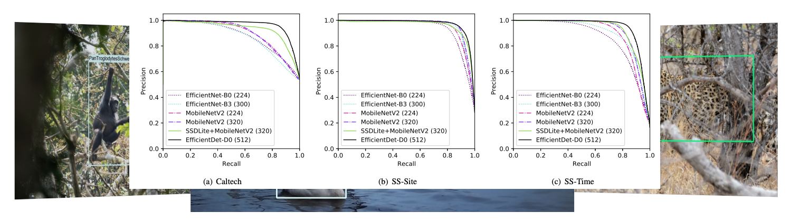
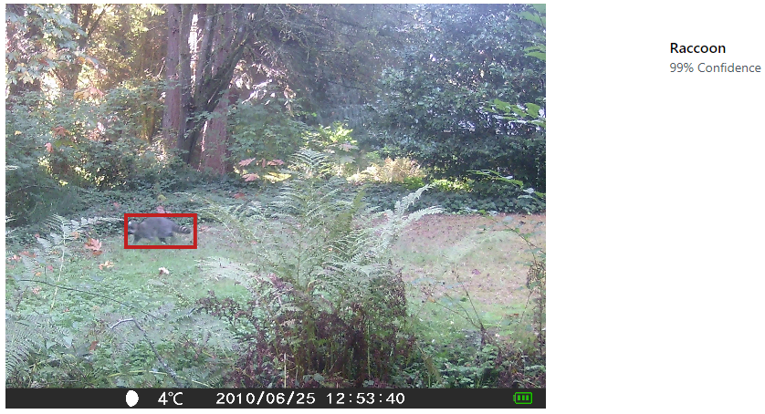

## Everything I know about ML and camera traps

This is a list of everything I know about machine learning and camera traps, which is presumably a subset of what's out there... <a href="mailto:agentmorris+cameratrapsurvey@gmail.com">email me</a> with updates, or submit pull requests.  Help me keep this page up to date!  And tell me what I got wrong about your software and your papers!

Maintained by [Dan Morris](http://dmorris.net).  Disclosure of what I work on: I contribute to two projects on ML for camera traps ([MegaDetector](https://github.com/agentmorris/MegaDetector) and [Wildlife Insights](https://wildlifeinsights.org)) and an open repository for conservation data ([lila.science](https://lila.science)).  And since I've disclosed that, I can say that although I don't filter papers for this list based on whether they use stuff I've worked on, I <i>do</i> use this list as a way of tracking how those systems are being used, so in the "papers" sections, you will see tags for a few things I want to track.

## Table of Contents

[Camera trap systems using ML (or at least thinking about ML)](#camera-trap-platforms-using-ml-or-at-least-thinking-about-ml)  
&nbsp;&nbsp;&nbsp;&nbsp;[Platforms in active development](#platforms-that-appear-to-be-in-active-development)  
&nbsp;&nbsp;&nbsp;&nbsp;[Platforms that appear to be less active](#platforms-that-appear-to-be-less-active)  
[OSS repos about ML for camera traps](#oss-repos-about-ml-for-camera-traps)  
&nbsp;&nbsp;&nbsp;&nbsp;[Active repos](#last-updated--2021)  
&nbsp;&nbsp;&nbsp;&nbsp;[Less active repos](#last-updated--2021-1)  
[Smart camera traps](#smart-camera-traps)  
[Manual labeling tools people use for camera traps](#manual-labeling-tools-people-use-for-camera-traps)  
&nbsp;&nbsp;&nbsp;&nbsp;[Review papers about labeling tools](#review-papers-about-labeling-tools)  
&nbsp;&nbsp;&nbsp;&nbsp;[Tools in active development](#tools-in-active-development)  
&nbsp;&nbsp;&nbsp;&nbsp;[Tools that appear to be less active](#tools-that-appear-to-be-less-active)  
&nbsp;&nbsp;&nbsp;&nbsp;[Non-camera-trap-specific labeling tools that people use for camera trap data](#non-camera-trap-specific-labeling-tools-that-people-use-for-camera-trap-data)  
[Post-hoc analysis tools people use for camera trap data](#post-hoc-analysis-tools-people-use-for-camera-trap-data)  
[Camera trap ML papers](#camera-trap-ml-papers)  
&nbsp;&nbsp;&nbsp;&nbsp;[Papers with summaries](#papers-with-summaries)  
&nbsp;&nbsp;&nbsp;&nbsp;[Papers I haven't read yet](#papers-i-know-exist-and-i-have-access-to-but-i-havent-read-yet)  
[Data sources for camera trap ML](#data-sources-for-camera-trap-ml)  
[Further reading](#further-reading)  
[Places to chat about this stuff](#places-to-chat-about-this-stuff)  

<!--&nbsp;&nbsp;&nbsp;&nbsp;[Papers I don't have access to](#papers-i-dont-have-access-to-but-would-read-if-i-did)  
&nbsp;&nbsp;&nbsp;&nbsp;[Papers that are redundant citations](#papers-that-are-more-or-less-pre-publication-versions-of-another-paper-that-is-already-included)  -->

## Camera trap platforms using ML (or at least thinking about ML)

I've broken this category out into "platforms that look like they're being actively developed" and "platforms that are less active".  This assessment is based on visiting links and searching the Web; if I've incorrectly put something in the latter category, please <a href="mailto:agentmorris+cameratrapsurvey@gmail.com">let me know</a>!

### Platforms that appear to be in active development

#### Wildlife Insights

[Wildlife Insights](https://wildlifeinsights.org/) (WI) is a platform for camera trap image management that includes AI-accelerated annotation, as well as data management and spatial analysis tools.  WI is a collaboration among several NGOs, HQ'd at Conservation International, with AI work HQ'd at Google.

&nbsp;&nbsp;&nbsp;&nbsp;&nbsp;&nbsp;

#### TrapTagger

> <https://wildeyeconservation.org/traptagger/>

An online platform for camera trap data management that includes automated blank/non-blank elimination (not ecosystem-specific, uses MegaDetector), species classification (for South African species), and an integration with HotSpotter for individual identification.

&nbsp;&nbsp;&nbsp;&nbsp;&nbsp;&nbsp;

#### WildTrax

> <https://www.wildtrax.ca/>

An online platform for camera trap data management that includes automated blank/non-blank elimination (not ecosystem-specific, uses MegaDetector), species classification (specifically for cattle as of the time I'm writing this).  Also manages acoustic data, with some AI functionality for acoustic data as well.

&nbsp;&nbsp;&nbsp;&nbsp;&nbsp;&nbsp;

#### Camelot

> <https://gitlab.com/camelot-project/camelot>

Open-source, runs in Java in a browser.  Developed in consultation with Fauna & Flora International.  Preliminary integration with MegaDetector allows selective review of human/animal/empty/vehicle images.

&nbsp;&nbsp;&nbsp;&nbsp;&nbsp;&nbsp;

#### Trapper

> <https://gitlab.com/oscf/trapper-project>

Demo [here](https://demo.trapper-project.org/); you have to register and ask for a login, but they are responsive.

Open-source system, interaction is via a browser, data is stored in Postgres. Can be hosted either locally or on a Linux VM.  Experimenting with ML, including preliminary use of MegaDetector.

&nbsp;&nbsp;&nbsp;&nbsp;&nbsp;&nbsp;

#### Animl

> <https://github.com/tnc-ca-geo/animl-frontend>

OSS platform developed by TNC for managing data from biosecurity cameras, with real-time detection and classifications.

&nbsp;&nbsp;&nbsp;&nbsp;&nbsp;&nbsp;

#### WildID

> <https://www.wildid.app/>

Web-based platform for processing camera trap images, targeted for Southern Africa, that uses a custom multiclass detector.  Free trial available; paid version allows larger bulk uploads.

Not to be confused with [Wild.ID](https://github.com/ConservationInternational/Wild.ID) (a desktop tool for camera trap image processing that was used by the TEAM Network prior to Wildlife Insights) or [Wild-ID](https://faculty-directory.dartmouth.edu/douglas-thomas-bolger) (a desktop tool to accelerate the identification of individual animals).

&nbsp;&nbsp;&nbsp;&nbsp;&nbsp;&nbsp;

#### wpsWatch

<a href="https://wildlifeprotectionsolutions.org">Wildlife Protection Solutions</a> deploys connected cameras in protected areas to detect and combat poaching.  They partnered with [Silverpond](https://silverpond.com.au) to build an [automated people-detection workflow](https://silverpond.com.au/case-studies/wildlife-protection-solutions/), and later <a href="https://customers.microsoft.com/en-us/story/1384184517929343083-wildlife-protection-solutions-nonprofit-ai-for-earth">integrated MegaDetector</a> into their workflow.

&nbsp;&nbsp;&nbsp;&nbsp;&nbsp;&nbsp;

#### Project Zamba

> <http://zamba.drivendata.org/>

> <https://www.zambacloud.com/>

> <https://github.com/drivendataorg/zamba>

Python toolkit (Project Zamba) to find species in camera trap videos, specifically tuned for 23 species often seen in central Africa. Algorithms were trained on data from the [Chimp & See](https://www.chimpandsee.org/#/) Zooniverse project. The [description](http://zamba.drivendata.org/docs/algorithms.html) says it's a five-model ensemble trained in Keras.

Evolved into the application available at <https://www.zambacloud.com/>.

&nbsp;&nbsp;&nbsp;&nbsp;&nbsp;&nbsp;

#### Mbaza

> <https://appsilon.com/data-for-good/mbaza-ai/>

Open-source, client-side Shiny app that includes image review and client-side classifiers for two African ecosystems.  Code is <a href="https://github.com/Appsilon/mbaza">here</a>.  More information <a href="https://appsilon.com/mbaza-shiny-app-case-study/">here</a>, <a href="https://appsilon.com/applying-ai-to-nature-conservation/">here</a>, and <a href="https://appsilon.com/gabon-wildlife-ai-for-biodiversity-conservation/">here</a>.

&nbsp;&nbsp;&nbsp;&nbsp;&nbsp;&nbsp;

#### Conservation AI

> <https://conservationai.co.uk/>

Family of region-specific object detection models for camera traps and drones, backed by real-time and batch processing services, with a browser-based <a href="https://conservationai.co.uk/trymodel">demo</a>.  Also supports acoustic classification.

&nbsp;&nbsp;&nbsp;&nbsp;&nbsp;&nbsp;

#### Mala ML

> <https://www.envir.ai/>

AI-accelerated review tool that advertises both browser-based and desktop experiences.

&nbsp;&nbsp;&nbsp;&nbsp;&nbsp;&nbsp;

#### Agouti

> <https://agouti.eu/> 

Web-based tool for camera trap data management, annotation, and spatial analysis. [2022 roadmap update](https://www.efsa.europa.eu/en/supporting/pub/en-7327).

Described in Casaer J, Milotic T, Liefting Y, Desmet P, Jansen P. <a href="https://search.proquest.com/openview/409a3fc07525678bbaf3f4d87c076d58/1?pq-origsite=gscholar&cbl=2049297">Agouti: A platform for processing and archiving of camera trap images</a>. Biodiversity Information Science and Standards. 2019 Sep 24.

&nbsp;&nbsp;&nbsp;&nbsp;&nbsp;&nbsp;

#### RECONN.AI

> <https://www.reconn.ai/>

Cloud-based tool that includes a detector and species classifier.  Documentation suggests the classifier is tailored for the American Midwest.

&nbsp;&nbsp;&nbsp;&nbsp;&nbsp;&nbsp;

#### PantheraIDS (Integrated Data System)

> <https://www.pantheraids.org/features.html>

Image management and analysis software used at Panthera; includes machine learning functionality for blank removal, species classification, and individual ID.

&nbsp;&nbsp;&nbsp;&nbsp;&nbsp;&nbsp;

#### Wildlife Observer Network Image ID+

> <https://wildlifeobserver.net/imageidplus/>

Web-based system that takes a zipfile of camera trap images and produces an estimate of the presence/number of animals in each image.

#### MegaDetector

This is not a "platform" or "system" in the same sense as other items on this list, but there aren't enough open models for me to make a separate "models" section, and the tooling is *almost* a "system", so for this list, I'm upgrading MegaDetector to "system".  Full disclosure: I contribute to this project.

<a href="https://github.com/agentmorris/MegaDetector/blob/main/megadetector.md">MegaDetector</a> is an object detection model that is used to identify camera trap images that contain animals, people, vehicles, or none of the above; in practice, it's primarily used to eliminate blank images from large camera trap surveys.  The GitHub repo provides Python scripts to run MegaDetector and do stuff with the output, and the model (or its output) has also been integrated into some of the other items on this list.

&nbsp;&nbsp;&nbsp;&nbsp;&nbsp;&nbsp;

#### Timelapse2

> <http://saul.cpsc.ucalgary.ca/timelapse/>

> <https://github.com/saulgreenberg/Timelapse>

Thick-client, .net-based tool. In active development as of 2022. Incorporates ML in the sense that it has integrated the output from <a href="https://github.com/agentmorris/MegaDetector">MegaDetector</a> to allow selective review of human/animal/empty/vehicle images.

&nbsp;&nbsp;&nbsp;&nbsp;&nbsp;&nbsp;

#### eVorta

* [News story](https://www.abc.net.au/news/2021-07-31/evorta-smart-camera-system-feral-cats-kangaroo-island/100337978)
* [Demo video](http://51.161.196.64/)
* [App](https://play.google.com/store/apps/details?id=com.evorta.android&pli=1)
* [Kangaroo Island case study](https://www.naturefoundation.org.au/how-to-help/donate/feral-cat-eradication-program/sponsor-a-4g-camera)

Connected camera network with cloud-based AI capabilities, and a mobile app.

&nbsp;&nbsp;&nbsp;&nbsp;&nbsp;&nbsp;

#### DeCaTron

> <https://www.thinkevolveconsulting.com/green-ai-products/>

> <https://www.youtube.com/watch?v=QvNMJo3momQ>

AI-driven tool for camera trap image review, with spatial analytics.

&nbsp;&nbsp;&nbsp;&nbsp;&nbsp;&nbsp;

#### Dudek AI Image Toolkit

> <https://dudek.com/services/wildlife-camera-trap-ai-image-processing-and-management/>

Cloud-based platform that leverages MDv5; the image indicates that a species classifier is involved as well, but I don't have more information.

&nbsp;&nbsp;&nbsp;&nbsp;&nbsp;&nbsp;

#### Bounding Box Editor and Exporter (BBoxEE) (formerly "Animal Detection Network")

> <https://github.com/persts/BBoxEE>

> <http://biodiversityinformatics.amnh.org/ml4conservation/animal-detection-network>

Open-source project ([code](https://github.com/persts/andenet-desktop)), does semi-automated labeling. Thick-client Python tool, uses TensorFlow.

&nbsp;&nbsp;&nbsp;&nbsp;&nbsp;&nbsp;

#### Cacophony Project (2040) Thermal Predator Camera

> <https://www.2040.co.nz/collections/frontpage/products/thermal-predator-camera>

> <https://www.youtube.com/watch?v=eiopklk5iic>

Thermal camera with a cloud-based AI service.

&nbsp;&nbsp;&nbsp;&nbsp;&nbsp;&nbsp;

#### FASTCAT-Cloud

> <https://service.fastcat-cloud.org/>

Online platform with several ecosystem-specific detectors, which can be accessed via a Web demo or an API.  Integrated with <a href="https://www.ispotnature.org/">iSpot</a> (an iNat-like platform for biodiversity observation logging).

&nbsp;&nbsp;&nbsp;&nbsp;&nbsp;&nbsp;

#### Caption Pro

> [Home](https://captionpro.com.au:444/AlekaConsulting/index.php/caption-photos/)

> [Camera trap user guide](https://captionpro.com.au:444/AlekaConsulting/CaptionProFiles/Processing%20Camera%20Trap%20Data%20with%20Caption%20Pro.pdf)

> [Video](https://www.youtube.com/watch?v=zAygEAGwnJs&ab_channel=SimonKravis2)

Tool for captioning images and videos that includes a workflow for camera trap data, including running MegaDetector via a Web service.

&nbsp;&nbsp;&nbsp;&nbsp;&nbsp;&nbsp;

### Platforms that appear to be less active

#### CAIMAN

> <https://sensingclues.org/caiman>

Cloud-based, AI-enabled system for camera trap image processing.  Integrated with online spatial analysis tools ([Focus](https://sensingclues.org/focus) and [WildCAT](https://sensingclues.org/wildcat)).  Listed as "available by the end of 2021", but not yet available as of 5/23.

#### CAMinos

<https://www.ischool.berkeley.edu/projects/2021/caminos-intelligent-trail-camera-annotation>

This looks to have been a student project, so normally I would say it's unfair to call it "inactive", but the page and video are so slick by the standards of student projects that my intention is to give it props by including it here.

Online annotation tool that combines MDv5 with a species classifier.

* [Home](https://www.ischool.berkeley.edu/projects/2021/caminos-intelligent-trail-camera-annotation)
* [Video](https://www.youtube.com/watch?v=LUnNxLg2qTo&ab_channel=StevenLeung)
* [Writeup](https://www.ischool.berkeley.edu/sites/default/files/sproject_attachments/copy_of_caminos_final_presentation.pdf)

&nbsp;&nbsp;&nbsp;&nbsp;&nbsp;&nbsp;

#### Where's the Bear?

> <https://www.cs.ucsb.edu/~ckrintz/projects/wtb.html>

IoT system with computer vision pieces for managing camera traps, currently in Southern California. They refer to having processed 1.2M images, and have used Inception with some clever synthetic data generation to get pretty good results.

"...is deployed at the UCSB Sedgwick Reserve, a 6000 acre site for environmental research and used to aggregate, manage, and analyze over 1.12M images."

#### EventFinder

> <http://cs.kingsu.ca/~mjanzen/CameraTrapSoftware.html>

Java-based tool to separate empty from non-empty images using background subtraction and color histogram comparisons.  Also see the associated [paper](https://link.springer.com/article/10.1007/s10661-019-7518-9).

&nbsp;&nbsp;&nbsp;&nbsp;&nbsp;&nbsp;

#### Wildlife Institute of India CaTRAT

> <https://wii.gov.in/tiger_monitoring_software>

> [Wildlife Institute of India 2018 Tiger Status Report](https://ntca.gov.in/assets/uploads/Reports/AITM/Status_Tigers_India_summary_2018.pdf)

CaTRAT (Camera Trap Data Repository and Analysis Tool) is an internal tool used by the Wildlife Institute of India and the National Tiger Conservation Authority to accelerate the processing of camera trap images, with a focus on detecting tigers.  Not a lot of information is publicly available, but the report linked above suggests that CNNs are involved and that the workflow integrates [ExtractCompare](http://conservationresearch.org.uk/Home/ExtractCompare/index.html) for individual tiger identification.

&nbsp;&nbsp;&nbsp;&nbsp;&nbsp;&nbsp;

#### Trailcam Data

> <https://www.trailcamdata.com>

System for removing false positives from camera trap image collections. Unclear if this is automated or manual; I think manual.

&nbsp;&nbsp;&nbsp;&nbsp;&nbsp;&nbsp;

#### SnapCat

> <https://www.snapcatconservation.org/our-product>

TF model and maybe front-end, with plans to build a smart camera trap. Not sure how far along they are, but their Web page is nice, and they definitely make stuff, since they made this neat [waterproof scale for penguins](https://blog.synapse.com/post/how-much-does-a-magellanic-penguin-weigh).

&nbsp;&nbsp;&nbsp;&nbsp;&nbsp;&nbsp;

#### ClassifyMe

> <https://classifymeapp.com>

Thick-client tool that allows a menu of Yolov2-based models.  Five models are provided out of the gate, trained primarily on open data sets (Snapshot Serengeti, Caltech Camera Traps, Snapshot Wisconsin).  Downloadable by request.

&nbsp;&nbsp;&nbsp;&nbsp;&nbsp;&nbsp;

#### MooseDar

> <https://www.moosedar.com>

Thermal-camera-based system that uses CNNs to detect moose, for accident prevention.

#### BuckTracker

> <http://www.bucktracker.com>

App associated with [SpyPoint](https://www.spypoint.com) trail cameras, allowing users to filter photos by species for consumer hunting applications.

&nbsp;&nbsp;&nbsp;&nbsp;&nbsp;&nbsp;

## OSS repos about ML for camera traps

Stratifying these based on whether they appear to be active, but this isn't updated automatically, so if I've incorrectly filed a project into the "last updated a long time ago" category, please <a href="mailto:agentmorris+cameratrapsurvey@gmail.com">let me know</a>!

### Last updated >= 2021

* Wildlife ML (detector/classifier training with active learning) ([github.com/slds-lmu/wildlife-ml](https://github.com/slds-lmu/wildlife-ml))
* A semi-automatic workflow to process camera trap images in R ([github.com/hannaboe/camera_trap_workflow](https://github.com/hannaboe/camera_trap_workflow))
* Bounding Box Editor and Exporter (BBoxEE) for the Animal Detection Network ([github.com/persts/BBoxEE](https://github.com/persts/BBoxEE))
* WildCo-Faceblur (MD-based human blurring tool for camera traps) ([github.com/WildCoLab/WildCo_Face_Blur](https://github.com/WildCoLab/WildCo_Face_Blur))
* Camelot ([gitlab.com/camelot-project/camelot](https://gitlab.com/camelot-project/camelot))
* CameraTrapDetectoR ([github.com/TabakM/CameraTrapDetectoR](https://github.com/TabakM/CameraTrapDetectoR))
* CamTrapML (Python library for camera trap ML) ([github.com/bencevans/camtrapml](https://github.com/bencevans/camtrapml))
* CamTrap Detector (MDv5 GUI) ([github.com/bencevans/camtrap-detector](https://github.com/bencevans/camtrap-detector))
* DeepFaune software ([plmlab.math.cnrs.fr/deepfaune/software](https://plmlab.math.cnrs.fr/deepfaune/software))
* EcoAssist (MDv5 GUI) ([github.com/PetervanLunteren/EcoAssist](https://github.com/PetervanLunteren/EcoAssist))
* Image Level Label to Bounding Box Pipeline ([github.com/persts/IL2BB](https://github.com/persts/IL2BB))
* MegaDetector ([github.com/agentmorris/MegaDetector](https://github.com/agentmorris/MegaDetector))
* TNC Animl platform ([github.com/tnc-ca-geo/animl-frontend](https://github.com/tnc-ca-geo/animl-frontend))
* SDZG Animl package for running MD and other models via R ([github.com/conservationtechlab/animl](https://github.com/conservationtechlab/animl))
* Trapper species classification ([gitlab.com/oscf/trapper-species-classifier](https://gitlab.com/oscf/trapper-species-classifier))
* SpSeg (WII Species Segregator) ([github.com/bhlab/SpSeg](https://github.com/bhlab/SpSeg))
* FastAPI/Streamlit package for serving MD and visualizing results ([github.com/abhayolo/megadetector-fastapi](https://github.com/abhayolo/megadetector-fastapi))
* TrapTagger ([github.com/WildEyeConservation/TrapTagger](https://github.com/WildEyeConservation/TrapTagger))
* Zamba ([github.com/drivendataorg/zamba](https://github.com/drivendataorg/zamba))
* Gimenez et al 2021 (integrating DL results into ecological statistics) ([github.com/oliviergimenez/computo-deeplearning-occupany-lynx](https://github.com/oliviergimenez/computo-deeplearning-occupany-lynx))
* Johanns et al 2022 (distance estimation and tracking) ([github.com/PJ-cs/DistanceEstimationTracking](https://github.com/PJ-cs/DistanceEstimationTracking))
* Pantazis et al 2021 (self-supervised learning) ([github.com/omipan/camera_traps_self_supervised](https://github.com/omipan/camera_traps_self_supervised/))
* Mbaza (species classification and Shiny app) ([github.com/Appsilon/mbaza](https://github.com/Appsilon/mbaza))
* Hilton et al 2022 (analyzing tortoise video) ([github.com/hiltonml/camera_trap_tools](https://github.com/hiltonml/camera_trap_tools))
* Haucke et al 2022 (depth from stereo) ([github.com/timmh/socrates](https://github.com/timmh/socrates))
* Cacophony Project: species classification in thermal images ([github.com/TheCacophonyProject/classifier-pipeline](https://github.com/TheCacophonyProject/classifier-pipeline))

### Last updated < 2021

* Autofocus species classifier ([github.com/uptake/autofocus](https://github.com/uptake/autofocus))
* Deep Learning for Nilgai Management (Kutugata et al, 2021) ([github.com/mkutu/Nilgai](https://github.com/mkutu/Nilgai))
* Deep Learning for Camera Trap Images (Norouzzadeh 2018) ([github.com/Evolving-AI-Lab/deep_learning_for_camera_trap_images](https://github.com/Evolving-AI-Lab/deep_learning_for_camera_trap_images))
* DrivenData classification competition winners ([github.com/drivendataorg/hakuna-madata/](https://github.com/drivendataorg/hakuna-madata/))
* WildAnimalDetection (Jasper Ridge Biological Preserve) ([github.com/qiantianpei/WildAnimalDetection](https://github.com/qiantianpei/WildAnimalDetection))
* Willi et al species classification ([github.com/marco-willi/camera-trap-classifier](https://github.com/marco-willi/camera-trap-classifier))
* MLWIC: Machine Learning for Wildlife Image Classification in R ([github.com/mikeyEcology/MLWIC](https://github.com/mikeyEcology/MLWIC))
* MLWIC2: Machine Learning for Wildlife Image Classification ([github.com/mikeyEcology/MLWIC2](https://github.com/mikeyEcology/MLWIC2))
* Wildlife detection and classification with MD and RetinaNet ([github.com/oliviergimenez/DLcamtrap](https://github.com/oliviergimenez/DLcamtrap))

## Smart camera traps

### The Sentinel (Conservation X Labs)

> <https://sentinel.conservationxlabs.com/>

> <https://conservationxlabs.com/sentinel>

Module that attaches to existing camera traps to provide connectivity and AI.

&nbsp;&nbsp;&nbsp;&nbsp;&nbsp;&nbsp;

### TrailGuard AI (RESOLVE)

> <https://www.resolve.ngo/trailguard.htm>

AI-enabled camera directed primarily at anti-poaching applications.

&nbsp;&nbsp;&nbsp;&nbsp;&nbsp;&nbsp;

### Thylation Felixer

> <https://thylation.com/>

AI-enabled camera trap for automated invasive predator control in Australia.

&nbsp;&nbsp;&nbsp;&nbsp;&nbsp;&nbsp;

### InstantDetect (ZSL)

> <https://www.zsl.org/conservation/how-we-work/monitoring-and-technology/instant-detect-20>

> <https://www.zsl.org/conservation/conservation-initiatives/conservation-technology/instant-detect>

InstantDetect 2.0 will be connected but will not have on-board AI; will move images to a base station. Iridium connection.

&nbsp;&nbsp;&nbsp;&nbsp;&nbsp;&nbsp;

### Insect Detect

> <https://github.com/maxsitt/insect-detect>

AI-enabled, RPi-based camera trap for insect monitoring.

&nbsp;&nbsp;&nbsp;&nbsp;&nbsp;&nbsp;

### PoacherCam (Panthera)

> <https://www.panthera.org/conservation-technology/poachercam>

> <https://www.panthera.org/panthera-poachercam-closer-look>

Web page says: "Adapted from Panthera's previous camera traps, the PoacherCam has a groundbreaking new feature: its motion-triggered detection system can now instantly distinguish between people and animals—the world's first camera to do so." This was from a 2015 blog post, unclear what the status is.

&nbsp;&nbsp;&nbsp;&nbsp;&nbsp;&nbsp;

## Manual labeling tools people use for camera traps

I've broken this category out into "tools that look like they're being actively developed" and "tools that are less active".  This assessment is based on visiting links and searching the Web; if I've incorrectly put something in the latter category, please <a href="mailto:agentmorris+cameratrapsurvey@gmail.com">let me know</a>!

Not repeating items that were already included in the "AI-enabled" list above.  E.g., lots of people use Timelapse without AI, but I'm not including it in both lists.

### Review papers about labeling tools

Sneaking these in before I get to the list of actual labeling tools.  These aren't necessarily <i>just</i> about labeling tools, but if they're in this section, they at least contain a good review of labeling tools.

* Wearn, O., & Glover-Kapfer, P. (2017). <a href="https://www.wwf.org.uk/conservationtechnology/camera-trap.html">Camera-trapping for Conservation: a Guide to Best-practices</a>. WWF-UK: Woking, UK. ([pdf](https://www.wwf.org.uk/conservationtechnology/documents/CameraTraps-WWF-guidelines.pdf))

* Young, S., Rode-Margono, J., & Amin, R. (2018). <a href="https://onlinelibrary.wiley.com/doi/full/10.1002/ece3.4464">Software to facilitate and streamline camera trap data management</a>: A review. Ecology and Evolution*, 8(19), 9947-9957.

### Tools in active development

#### eMammal (Smithsonian)

> <https://emammal.si.edu/>

Software package and Smithsonian-hosted storage. All labeling happens through their tool prior to upload. Data stored by Smithsonian, owned by individual data set owners, and released to collaborators upon request.

I've worked with a lot of camera trap data, and I will say that because the tool enforces consistent metadata at the time of labeling, in terms of organization and matching images to labels, data coming through eMammal is an order of magnitude cleaner than anything I've worked with from any other source. eMammal metadata is provided in the Camera Trap Metadata Standard (XML variant).

&nbsp;&nbsp;&nbsp;&nbsp;&nbsp;&nbsp;

#### CPW Photo Warehouse

Thick-client (Windows) tool for image management, annotation, and spatial analysis.

> <https://cpw.state.co.us/learn/Pages/ResearchMammalsSoftware.aspx>

> <http://biodiversityinformatics.amnh.org/ml4conservation/animal-detection-network/species-identification-localization/>

&nbsp;&nbsp;&nbsp;&nbsp;&nbsp;&nbsp;

#### Carnassial (Cascades Carnivore Project)

> <https://github.com/CascadesCarnivoreProject/Carnassial>

Offshoot of TimeLapse2; both git pages acknowledge the divergence and refer to differing project requirements.

#### SPARC'd

> <https://github.com/CulverLab/sparcd>

Thick-client Java-based tool. Open-source.

&nbsp;&nbsp;&nbsp;&nbsp;&nbsp;&nbsp;

#### Reconyx MapView

> <https://www.reconyx.com/software/mapview>

&nbsp;&nbsp;&nbsp;&nbsp;&nbsp;&nbsp;

#### CameraSweet

> <https://smallcats.org/resources/#camerasweet>

Series of command-line tools for image organization and annotation used by the Small Wild Cat Conservation Foundation.

### Tools that appear to be less active

#### Vixen

> <https://github.com/vixen-project/vixen>

Open-source, multi-platform, thick-client (Python). As of 8/22, this appears to have been last updated in ~2019.

&nbsp;&nbsp;&nbsp;&nbsp;&nbsp;&nbsp;

#### Aardwolf2

> <https://github.com/yathin/aardwolf2>

> <https://sourceforge.net/projects/aardwolf/>

As of version 2, this is browser-based (but runs locally) (v1 was a thick-client app). Linux only.

As of 8/22, last update appears to be ~2017.

&nbsp;&nbsp;&nbsp;&nbsp;&nbsp;&nbsp;

#### Camera Base

> <http://www.atrium-biodiversity.org/tools/camerabase/>

Thick-client tool for Windows.  As of 8/22, it looks like the last update (at least to the user guide) was in 2015.

&nbsp;&nbsp;&nbsp;&nbsp;&nbsp;&nbsp;

#### Camera Trap Manager

> <https://github.com/benizar/cameratrapmanager>

".NET desktop application for managing pictures taken by automatic camera traps"

As of 8/22, the last update appears to have been ~2016.

### Non-camera-trap-specific labeling tools that people use for camera trap data

* [Adobe Lightroom](www.adobe.com/Lightroom](http://www.adobe.com/Lightroom))
* [Exif Pro](http://www.exifpro.com)
* [digikam](https://www.digikam.org) ([code](https://github.com/KDE/digikam))

## Post-hoc analysis tools people use for camera trap data

* [camtrapR](https://cran.r-project.org/web/packages/camtrapR/index.html)
* [Presence](https://www.mbr-pwrc.usgs.gov/software/doc/presence/presence.html)

## Camera trap ML papers

### Tags in this section

As promised above, although I don't filter papers for this list based on whether they use stuff I've worked on, I <i>do</i> use this list as a way of tracking how those systems are being used.  So you will see the following tags throughout this section:

The fist tag ("Ecology Paper") is used to indicate that this paper isn't <i>about</i> camera trap AI, it just happens to <i>use</i> AI for camera traps.  With any luck, a few years from now, this kind of paper will be 99% of this list!

If you have other tags you think I should be tracking here, <a href="mailto:agentmorris+cameratrapsurvey@gmail.com">email me</a>.

### Papers with summaries

#### Papers from 2023

**Procko M, Naidoo R, LeMay V, Burton AC. Human presence and infrastructure impact wildlife nocturnality differently across an assemblage of mammalian species. PLoS ONE 18(5): e0286131. 2023.**

Look at impacts of human disturbance on wildlife nocturnality.  Black bears more nocturnal in response to human detections, coyotes + hares less nocturnal in areas of higher trail density.  Coyotes + deer + hares more nocturnal near urban-wildland boundaries. Use MD for animal/human/vechicle/blank categorization.

 **Anderson AK, Waller JS, Thornton DH. Canada lynx occupancy and density in Glacier National Park. The Journal of Wildlife Management. 2023 May;87(4):e22383.**

Study lynx populations in Glacier National Park.  Used paired cameras on opposite sides of hiking trails, several meters off of the trail.  Used MD to isolate animal images, sorted images using Windows Explorer, and used CamtrapR for analysis.  

Conclusions:

* "...our results suggest that GNP may be more suitable for lynx than previously projected"
* "Although average park-wide lynx density was low (1.28/100km2) compared to populations in the core of the range, park-wide abundance was substantial ... . Based on our results, we propose that GNP should be considered as a potentially important area for lynx habitat refugia in a warming climate."
* "...the ability to estimate lynx density from coat markings during summer may be an important advancement for lynx conservation efforts in landscapes where winter monitoring techniques ... are difficult or impossible to apply."

 **Barash, A., Preiss-Bloom, S., Machluf, Y., Fabbri, E., Malkinson, D., Velli, E., Mucci, N., Barash, A., Caniglia, R., Dayan, T. and Dekel, Y., 2023. Possible origins and implications of atypical morphologies and domestication-like traits in wild golden jackals (Canis aureus). Scientific Reports, 13(1), p.7388.**

Case study exploring four golden jackals in Israel that appeared in camera trap data, showing unusual morphological traits (e.g. white patches).  Camera trap data included ~1M images from ~60 cameras, including ~65k images of golden jackals.  Most of the paper is about genetic analysis to determine lineage, e.g. the presence of domestic dog DNA.  But this is a survey about camera trap ML, so... I'm just noting that they collected 1M images, and filtered out ~65% of them using MegaDetector, presumably MDv4 based on their confidence threhsold of 0.8.  Reviewed the remaining (animal) images in Camelot.

 **Jia L, Tian Y, Zhang J. Neural architecture search based on packed samples for identifying animals in camera trap images. Neural Computing and Applications. 2023 Jan 29:1-23.**

Explore neural architecture search to generate edge-friendly architectures for camera trap data.  Also propose a novel mosaic approach that they call "animal-patch packing", to pack lots of cropped animals into each image to accelerate training, and use a multi-label loss function so they can pack multiple species into the same training image (see packing examples belolow).  Evaluate on NACTI, and a dataset that I think used to be available [here](https://computervisionlabudea.wordpress.com/identification-of-animal-species-on-camera-trap-images/), but now 404s.  Prototype on a Jetson TX2.

Publish additional bounding boxes for both datasets [here](https://github.com/wildlifeZhang/dataset_annotations/).

&nbsp;&nbsp;&nbsp;&nbsp;&nbsp;&nbsp;

 **Bassing SB, DeVivo M, Ganz TR, Kertson BN, Prugh LR, Roussin T, Satterfield L, Windell RM, Wirsing AJ, Gardner B. Are we telling the same story? Comparing inferences made from camera trap and telemetry data for wildlife monitoring. Ecological Applications. 2023 Jan;33(1):e2745.**

Compared camera trap and collar data for spatial distribution analysis.  Looked at two areas in Eastern Washington, totaling 240 unique sites, each monitored for one year.  Procesed images with MegaDetector and Timelapse; two technicians reviewed each non-empty image.

Found overall agreement in occupancy analysis and in the directionality of predictors, but also found substantial discrepancies in effect sizes of predictors and the ranked importance of predictors.  "Our findings demonstrate that data from camera traps and GPS-collars yield inconsistent inferences about covariate-specific estimates of wildlife-habitat associations, but inferences are more consistent at broad-scales and from a more qualitative perspective."

 **Anderson AK, Waller JS, Thornton DH. Partial COVID-19 closure of a national park reveals negative influence of low-impact recreation on wildlife spatiotemporal ecology. Scientific Reports. 2023 Jan 13;13(1):687.**

Looked at the impact of COVID-19 closure on wildlife space use in Glacier National Park; found consistent negative responses to human recreation across most species, e.g.: "12 of 14 species used a fewer number of sites in the year that the park was open to recreation".  Also found that carnivores (bears, coyotes, foxes) were more nocturnal during the open period.

Used camera traps at 40 sites in each year (during and after COVID closures) (i.e., 2020 and 2021).  Used MegaDetector to separate animals/blanks/humans.

 **Munguía-Carrara M, Schmidt MF, Sierra R, López JC, Valenzuela-Galván D. Comparison of Biomass of Exotic and Native Mammals Between Temperate and Tropical Forests of Mexico. In Mexican Fauna in the Anthropocene 2023 Jan 31 (pp. 515-525). Cham: Springer International Publishing.**

Assess the difference between domestic and wild animals in Mexican temperate and tropical forests, using camera trap data from 2014-2018.  They find that the biomass of exotic (domestic) animals (as a fraction of total mammalian biomass) is 80% and 87%, respectively, in tropical and temperate forests.

They had a wild number of blanks; only 7604 positives in 370,800 total images.  Used MegaDetector (version unspecified, confidence threshold 0.3, so probably MDv5) to eliminate blanks.

 **Penn M, Miles V, Astley KL, Ham C, Woodroffe R, Rowcliffe M, Donnelly CA. Sherlock-A flexible, low-resource tool for processing camera-trapping images. bioRxiv. 2023:2023-03.**

Present a new tool (Sherlock) for camera trap image processing; test it on ~241k images from 46 cameras in the UK to identify badgers.  Correctly classified 91.9% of badgers and removed 49.3% of blanks.

Use background subtraction, based on a rolling window of N images.  A background series must consist of consecutive day/night images (i.e., a background series can't span the transition from non-flash to flash images).  Generate bounding boxes by sampling random points on an image and comparing to background, and do a sort of floodfill from "disturbance" points (points that are different from the background) to find the extent of the animal.  Use the disturbance region to estimate a bounding box.  Do an analysis of human time saving, finding that Sherlock substantially reduces human tagging time.

&nbsp;&nbsp;&nbsp;&nbsp;&nbsp;&nbsp;

 **Simões F, Bouveyron C, Precioso F. Simões F, Bouveyron C, Precioso F. DeepWILD: Wildlife Identification, Localisation and estimation on camera trap videos using Deep learning. Ecological Informatics. 2023 Jul 1;75:102095.**

Test on videos from 35 camera traps in France, containing 31 species, from which they extract ~88k frames.  Used MDv4 with a 90% confidence threshold to generate boxes and assign labels for all the single-species images; for the 4% that were multi-species, they handled those manually.  Used those species-labeled boxes to fine-tune MDv4 (!!!).  This is the only time I've ever hear of <i>anyone</i> fine-tuning MDv4!  Props to them.  Used box counts for counting.

&nbsp;&nbsp;&nbsp;&nbsp;&nbsp;&nbsp;
 **de Lorm T, Horswill C, Rabaiotti D, Ewers R, Groom R, Watermeyer J, Woodroffe R, Fund AW. Optimising the automated recognition of individual animals to support population monitoring. Authorea prepint, March 2023.**

Develop a pipeline for isolating and cropping images of wild dogs, and performing automated individual ID.  Compare [HotSpotter](http://cs.rpi.edu/hotspotter/crall-hotspotter-wacv-2013.pdf), [I3S Pattern](https://reijns.com/i3s/i3s-pattern/), and [Wild-ID](https://faculty-directory.dartmouth.edu/douglas-thomas-bolger).  Using handheld images, not camera trap images.

Pipeline stages:

* Used MegaDetector for cropping
* Filtered crops based on aspect ratio
* Used a custom CNN to identify individuals that were standing (which are more suitable for individual ID)
* Used another custom CNN to recognize left vs. right flanks
* Used [rembg](https://github.com/danielgatis/rembg) to crop backgrounds out of the crops
* Fed to each of the three candidate individual ID tools

Evaluated MegaDetector (version unknown), but confidence thresholds aren't specified, so it's hard to interpret this particular analysis.  Found that MegaDetector had a false positive rate of 4.9%, and - by the definition that matters for their application, based on suitable crops, not just the presence of an animal - a false negative rate of 0.7%.  A different definition of false negative rate yields a (pretty dismal) false negative rate of 17.4%.  Which, in my super-duper-biased opinion, seems really unusual for large animals in well-lit images, so I'm not sure what's up there; I'd be interested in seeing confidence thresholds.

Found that HotSpotter achieved the highest matching accuracy among the individual ID systems they compared.  Found the best performance when using full crops (rather than just cropped flanks) and background removal (rather than the raw pixels).  Found better performance on Zimbabwean wild dogs than Kenyan wild dogs, due du the latter having darker and more uniform coats.

 **Suessle V, Arandjelovic M, Kalan AK, Agbor A, Boesch C, Brazzola G, Deschner T, Dieguez P, Granjon AC, Kuehl H, Landsmann A. Automatic Individual Identification of Patterned Solitary Species Based on Unlabeled Video Data. arXiv preprint arXiv:2304.09657. 2023 Apr 19.**

Address the open set problem for individual ID of patterned species (particularly solitary species) in camera trap images by assuming that within a video, an animal is unique, so you get many views of a new data point for free.  Focus on leopards.  Use MD to extract boxes around leopards, and Zooniverse to pull leopard videos from the original dataset.  Use HotSpotter for feature extraction.

Tested on 210 videos from the PanAf leopard dataset, finding 116 matches (I think this indicates 55% recall), of which 97 were correct (83.6% precision).

&nbsp;&nbsp;&nbsp;&nbsp;&nbsp;&nbsp;

 **Bothmann L, Wimmer L, Charrakh O, Weber T, Edelhoff H, Peters W, Nguyen H, Benjamin C, Menzel A. Automated wildlife image classification: An active learning tool for ecological applications. arXiv preprint arXiv:2303.15823. 2023 Mar 28.**

Present an active learning pipeline for detection and classification for camera traps, including a pretrained model for six European deer species.  Code is available [here](https://github.com/slds-lmu).

Experiment on a dataset of ~50k images from 37 camera traps in Europe.  Use MD (version not specified) for cropping and blank elimination; optimize the threshold during the training process, rather than using a fixed threshold.  Crop boxes and resize to 224x224, assigning the image-level label to each box (their data doesn't have multi-species images).

Compare InceptionResNetv2, Xception, and DenseNet121; compare MD thresholds from 0.1 to 0.9.  Get the highest F1 from Xception and a MegaDetector confidence threshold of 0.5.  Also compare to not cropping at all, and show that cropping provides an F1 boost of around 0.05: significant, though not overwhelming, largely because their classification accuracy is pretty high to start with.

 **He W, Luo Z, Tong X, Hu X, Chen C, Shu Z. Long-Tailed Metrics and Object Detection in Camera Trap Datasets. Applied Sciences. 2023 May 14;13(10):6029.**

Quantify the "long-tailedness" of camera trap datasets, in terms of both class distribution and box size distribution, and also introduce a novel detection approach intended to better handle box size imbalance. 

Used 11 datasets from LILA, and a new camera trap dataset from the Chebaling Reserve in China, on which they ran MegaDetector to get boxes, then manually filtered out bad boxes.

Used the [Gini coefficient](https://en.wikipedia.org/wiki/Gini_coefficient) to assess class imbalance; they find that "the Gini Coefficient of the camera trap datasets is generally very large, reaching over 0.9: this indicates that the sample size of various species in camera trap datasets is generally and extremely imbalanced."

Also used the Gini coffidience to assess box size imbalance; they find that "the Gini Coefficients of the object/box-level scale imbalance of the three camera trap datasets were all greater than COCO and LVIS 1.0, so the object/box-level scale imbalance was also extremely long-tailed. Moreover, according to the areas of the objects shown in Table 5, we can conclude that there is a huge difference between camera trap and benchmark datasets."

They asses the [DINO](https://github.com/IDEA-Research/DINO) object detection framework with the [BatchFormer](https://github.com/zhihou7/BatchFormer) module (which is intended to handle imbalanced distributions), showing that the BatchFormer module helps.

Breaking the fourth wall for a moment: I couldn't resist including their nice collection of LILA thumbnails...

&nbsp;&nbsp;&nbsp;&nbsp;&nbsp;&nbsp;

 **Norman DL, Bischoff PH, Wearn OR, Ewers RM, Rowcliffe JM, Evans B, Sethi S, Chapman PM, Freeman R. Can CNN-based species classification generalise across variation in habitat within a camera trap survey?. Methods in Ecology and Evolution. 2023 Jan;14(1):242-51.**

Compare three architectures wrt their ability to generalize to new camera locations in Borneo.

Evaluate on a dataset of ~378k images from 640 cameras.  Downsized images are available [here](https://zenodo.org/record/6627707).  Limited images per class to 5000, finding that using more than that improved Top-1 accuracy but reduced F1 (suggesting bias toward common classes).  Resized to 256x256 prior to training.

Compared VGG16, Inceptionv3, and ResNet-50.  Also compared cropping with MDv3 prior to resizing.  Found the highest F1 from Inceptionv3.

Used a measure of habitat disturbance to separate the cameras into different ecosystem types for testing generalization.  Found that cropping prior to resizing increased both F1 and generalizability, with the caveat that they manually filtered MDv3 false negatives; when they include those, the image-level F1 goes *down* with cropping, but not because of the cropping.  Also found that performance was worse not only at new cameras, but at unseen disturbance levels, i.e., cameras that are measurably different than the training cameras.

"This study highlights the ongoing issue of poor performance of automated species classifiers across unseen locations in camera trap studies. Importantly, it also demonstrates that unseen backgrounds (here disturbance levels) can further impair classification performance. ... Generalisability can be improved by the use of bounding-box object detection prior to species classification, but the use of bounding boxes did not completely eliminate the problem."

 **Beirne C, Thomas M, Bastoe A, Flatt E, Diaz GI, Chulla DR, Mullisaca FP, Quispe RV, Quispe CQ, Forsyth A, Whitworth A. Scouts vs usurpers: alternative foraging strategies facilitate coexistence between neotropical cathartid vultures. Authorea Preprints. 2023 Apr 26.**

Characterize scavenger behavior at carcass sites in the Peruvian Amazon, using a combination of movement data (from vultures) and camera traps.  Two camera traps were placed at each carcass site during the study (2m and 5m away, respectively); images were identified to the species level using Wildlife Insights.  Conclude, for example, "at carcasses, Greater-yellow headed vultures typically arrived first, but were rapidly outnumbered by both King and Black vultures".

 **Chalmers C, Fergus P, Wich S, Longmore SN, Walsh ND, Stephens P, Sutherland C, Matthews N, Mudde J, Nuseibeh A. Removing Human Bottlenecks in Bird Classification Using Camera Trap Images and Deep Learning. arXiv preprint arXiv:2305.02097. 2023 May 3.**

They aim to automate camera-trap-based bird surveys.  They train on ~33k images of 10 European bird species, from iNaturalist and some private camera deployments.  Annotated the images with Conservation AI, trained Faster-RCNN on ResNet-101 in TF.  Also present an implementation of a service running on the Conservation AI platform, with real-time cameras near bird feeders.

&nbsp;&nbsp;&nbsp;&nbsp;&nbsp;&nbsp;

 **Parsons SM. Out of the Frying Pan and Into the Fire: How Hunting Affects the Diel Activity Patterns of Ungulates in Lubrecht Experimental Forest.  University of Montana undergraduate thesis. 2023.**

Look at he impact of hunting activity on ungulate (white-tailed deer) and puma behavior in Montana.  Found weak (and less than expected) but non-zero evidence for hunting avoidance behavior in deer.

Processed ~41k images from 30 cameras through Wildlife Insights.  Cite some accuracy stats that I'm 95% sure are from Velez et al.; they're cited as "Wildlife Insights 2022".  In context it's slightly hard to tell whether these are new stats being reported on the present data, or citing Velez et al, or another paper, but I'm going with Velez et al.

 **Cremeans A. Predators in Paradise: Ecotourism and Predator-Prey Dynamics in Monteverde, Costa Rica.  University of Montana undergraduate thesis. 2023.**

Look at data from 16 camera traps to evaluate the impact of ecotourism on the temporal overlap of predator-prey species in Costa Rica.  They found that "overlap between predators and prey increased by about 23% at the site with higher human activity."

For one of the two sites, they classified ~5k images with Wildlife Insights.  They indicate that "Preliminary data suggests species were correctly classified > 95% of the time, even in Monteverde. Example species that Wildlife Insights struggled to correctly classify margay versus ocelot, opossums, and rodents. Manually correcting the few incorrect classifications took minimal time investment compared to classifying all 5,002 images without Wildlife Insights."  The other site used video, for which they used Timelapse.

 **Brookes O, Mirmehdi M, Kühl H, Burghardt T. Triple-stream Deep Metric Learning of Great Ape Behavioural Actions. arXiv preprint arXiv:2301.02642. 2023 Jan 6.**

Combine three data streams - body part segmentation / pose analysis, RGB video, and optical flow - to analyze ape behavior from video.  Classify behaviors like sitting, walking, standing, etc.  Data is 500 annotated videos from Africa, with per-frame body part annotations and behavioral labels.  Each of the three streams is fed into a ResNet-50 backbone, and the final output vectors from all three models are combined into the final behavioral classifier.  Data are not publicly available, but metadata [here](http://people.cs.bris.ac.uk/~burghard/mpi2019.txt) suggests contacting the data owner, who may make the data available by request.

&nbsp;&nbsp;&nbsp;&nbsp;&nbsp;&nbsp;

 **Fergus P, Chalmers C, Longmore S, Wich S, Warmenhove C, Swart J, Ngongwane T, Burger A, Ledgard J, Meijaard E. Empowering Wildlife Guardians: An Equitable Digital Stewardship and Reward System for Biodiversity Conservation using Deep Learning and 3/4G Camera Traps. Remote Sens. 2023, 15(11).**

Explore the use of an automated, connected camera trap system to pay guardians/stewards for wildlife observations.  Used Conservation AI to annotate data, and used the TFODAPI to train a new Faster-RCNN with a ResNet-101 backbone.  Cameras are 3/4G-connected.  Demonstrate that the system is robust in the field for several months.

&nbsp;&nbsp;&nbsp;&nbsp;&nbsp;&nbsp;

#### Papers from 2022

**Goward S. I Spy Through a Camera’s Eye: Divii in the Gwich’in Settlement Area. ARCTIC. 2022 Dec 15;75(4):510-5.**

This paper provides an overview of Dall sheep population monitoring using camera traps and aerial surveys in Canada.  Processed ~500k images through MD + Timelapse.

 **Thompson S, Hurley M, Roberts S, Lukacs P, Oates B, Mumma M. Camera-Based Estimation of Statewide Wolf Abundance in Idaho-2019–2021.  Interim Report, 2/28/22.**

Captured 10M images per year (30M images total) from ~528 cameras during the summers of 2019, 2020, and 2021.  Captured both motion-triggers and time-triggered images, to support abundance estimation.  Estimated the statewide wolf population at 1500 individuals.

Used MDv4 (confidence threshold == 0.8) and Timelapse, which allowed them to eliminate 85% of images.  Evaluated MegaDetector on a subset of the data, and found that "MegaDetector found >99% of the wolves, elk, deer, bears, and moose that were located by humans".

 **Muthoka JM, Antonarakis AS, Vrieling A, Fava F, Salakpi EE, Rowhani P. Assessing drivers of intra-seaso nal grassland dynamics in a Kenyan savannah using digital repeat photography. Ecological Indicators. 2022 Sep 1;142:109223.**

They're assessing the relationship between weather, grazing, and grassland health.  Precipitation and weather data come from an in situ weather station, with gaps filled from CHIRPS.  Collected soil and herbaceous composition data from each site.  Collected time-triggered camera trap data to estimate some properties of vegetation (using [Phenopix](https://cran.r-project.org/web/packages/phenopix/index.html)) (a package that estimates vegetation properties from images), and to count grazers.  Used MD (likely either v3 or v4 based on the description) with a confidence threshold of 45% to detect animals.  Screenshots suggest they are using Timelapse.

Results show "...precipitation driving mainly early-season and in some cases mid-season flushing, temperature driving end-of-season senescence, and grazing influencing mid-season declines", but different grass species show different effect magnitudes.

&nbsp;&nbsp;&nbsp;&nbsp;&nbsp;&nbsp;

 **Böhner H, Kleiven EF, Ims RA, Soininen EM. A semi-automatic workflow to process camera trap images in R. bioRxiv. 2022:2022-10.**

Propose a workflow for camera trap image processing in R, somewhere between "best practices" and "a piece of code you can run":

* Rename images by camera (i.e., turn IMG_0001.JPG into something like camera_001_2019_04_03_12_21_10.JPG)
* Run an image classifier to produce per-class confidence values (the description is agnostic to what the classifier is)
* Check classifier accuracy on a subset of images and tune confidence thresholds
* Possibly fine-tune the classifier
* Do some manual classification, e.g. for error-prone species
* Post-processing and ecological analysis

They present a case study on camera trap data from Norway, from 92 camera traps, target species are small mammals (lemmings, voles, stoats, weasels).  Trained a six-class ResNet-50 classifier using TF via KerasR.  Splitting appears to have been random (not by camera), but this may matter less than usual here, because their camera are enclosed in a metal box, so the background is very controlled (see below).  Resizing to ImageNet resolution probably also matters less here than it would for small mammals in typical camera traps.  

They found 99.3% accuracy on the 97.3% of images that were classified above a confidence threshold.  On data from a subsequent season, accuracy fell to 95.3% on existing cameras, and 90.7% on new cameras.

Code is [here](https://github.com/hannaboe/camera_trap_workflow).  Training images and trained model are [here](https://zenodo.org/record/7142734).

&nbsp;&nbsp;&nbsp;&nbsp;&nbsp;&nbsp;

 **Anderson AK. Glacier’s Wildlife: A Noninvasive Investigation of a Canada Lynx Population and Wildlife Spatiotemporal Response to Recreation in a Popular National Park. MSc thesis, Washington State University; 2022.**

Evaluate the relationship between human activity and wildlife behavior in Glacier National Park, including an analysis of the natural experiment during COVID closures.  "Using single-species occupancy models and coefficient of activity overlap methods, we found evidence that recreation affects the spatiotemporal ecology of many medium-large mammalian species in GNP. The influence of recreation was quite pronounced in some cases and highly variable among species, with both positive and negative associations between increased human recreation activity and species’ spatial and temporal responses. We recommend future studies focus on how these behavioral shifts may impact wildlife fitness to help managers understand the tradeoffs associated with increasing recreation on public lands."  

Used MegaDetector for separating animal/empty/human images.

 **Marneweck CJ, Forehand CR, Waggy CD, Harris SN, Katzner TE, Jachowski DS. Nocturnal light-specific temporal partitioning facilitates coexistence for a small mesopredator, the eastern spotted skunk. Journal of Ethology. 2022 May;40(2):193-8.**

Study spotted skunk activity in West Virginia; find that "spotted skunk activity shifted during moonlit nights, where overlap with all predators was reduced, suggesting avoidance of both predators and competitors."  Processed images to the species level using digiKam for some images, and Wildlife Insights for others.

 **Clapham M, Miller E, Nguyen M, Van Horn RC. Multispecies facial detection for individual identification of wildlife: a case study across ursids. Mammalian Biology. 2022 Jun;102(3):921-33.**

Present the BearID individual ID pipeline for eight species of bear; indicate an average precision of >=9.1 across all eight species, and good transferability from a training species (Andean bears) to a new species (brown bears).  Images are handheld images from a variety of zoos. (So, technically not directly camera-trap-related, but close enough to include on this list.)

Their pipeline includes a face detector, a face orientation and cropping step ("bearchip"), a CNN-based feature encoder ("bearembed"), and a matching step ("bearsvm").

Code is [here](https://github.com/hypraptive/bearid).  Models are [here](https://github.com/hypraptive/bearid-models).

For more details about the underlying methodology, also see their earlier paper:

> Clapham M, Miller E, Nguyen M, Darimont CT. Automated facial recognition for wildlife that lack unique markings: A deep learning approach for brown bears. Ecology and evolution. 2020 Dec;10(23):12883-92.

 **Stennett M, Rubenstein DI, Burghardt T. Towards Individual Grevy's Zebra Identification via Deep 3D Fitting and Metric Learning. arXiv preprint arXiv:2206.02261. 2022 Jun 5.**

Presents a pipeline for individual zebra ID that combines detection (with MDv4), cropping, species classification (specifically zebra-or-not-zebra, from the AI for Earth species classification model), projection onto a 3D template, and embedding into a feature space for individual matching.  Used 148 images from a zebra-specific repository, plus 687 images from WCS camera traps.

Not directly related to camera traps, but so close that it seemed relevant to include here (uses LILA camera trap data and MDv4).  Code is [here](https://github.com/Lm0079/grevys-zebra-individual-identification).

&nbsp;&nbsp;&nbsp;&nbsp;&nbsp;&nbsp;

 **Wang Y, Zhang Y, Feng Y, Shang Y. Deep Learning Methods for Animal Counting in Camera Trap Images. In 2022 IEEE 34th International Conference on Tools with Artificial Intelligence (ICTAI) 2022 Oct 31 (pp. 939-943). IEEE.**

They propose two counting methods based on MDv4, and evaluate on iWildCam data.

The first method is basically some clever tricks they do with MDv4 results:

* For images with >8 boxes ("high-density images"), they observe that MD is less reliable, so they use a lower confidence threshold.
* For images with few boxes, they observe that prior to NMS, true positives tend to have more redundant boxes, so they use pre-NMS boxes to tune confidence thresholds.

Neat ideas!

The second method is an ensemble with a few different tricks:

* They use high-confidence MDv4 boxes to tune a bespoke Mask R-CNN model that they ensemble with MDv4
* They train a bespoke, dataset-specific binary classifier to eliminate additional false positives
* They're actually trying to acount animals in *sequences*, so they use some time heuristics to determine whether unique groups of animals have moved through the frame, in which case they add those numbers

&nbsp;&nbsp;&nbsp;&nbsp;&nbsp;&nbsp;

 **Cabon V, Bùi M, Kühne H, Seitz B, Kowarik I, von Der Lippe M, Buchholz S. Endangered animals and plants are positively or neutrally related to wild boar (Sus scrofa) soil disturbance in urban grasslands. Scientific reports. 2022 Oct 5;12(1):1-0.**

Placed cameras at sites where they were also doing soil sampling.  Used MegaDetector to eliminate empty images, then calculated mean relative abundance index of boars from cameras at each site.  Concluded that soil disturbance by wild boars is not necessarily a threat to biodiversity; "grasshopper diversity, total richness, and richness of endangered and specialist species were positively related to [boar activity], as was sand lizard abundance."

Use MD to extract animal images.

 **Hewitt MO, Karelus DL, Harveson LA, Martin RL, Harveson PM. Modeling habitat use and potential distribution of kit fox in the Trans-Pecos, Texas. The Journal of Wildlife Management. 2022 Nov;86(8):e22303.**

Developed baseline occupancy maps for kit foxes in Texas, with covariate analysis (found that gentler slopes, lower elevations, shorter shrubs, and bare ground were positively correlated with use by kit fox).

Used what I believe was MDv3 with a 70% confidence threshold to process images in Timelapse.  At least three authors confirmed each kit fox detection.

 **Leorna S, Brinkman T. Human vs. machine: Detecting wildlife in camera trap images. Ecological Informatics. 2022 Oct 27:101876.**

They look at the fundamental limits in object size that are detectable by humans and by MDv4, finding that human review can detect objects an order of magnitude smaller than MegaDetector, which in turn can detect objects an order of magnitude smaller than a camera trap's PIR sensor.  They are studying caribou in tundra areas that appear as tiny moving specks on the horizon.  IMO this figure is fantastic and summarizes the paper very nicely:

&nbsp;&nbsp;&nbsp;&nbsp;&nbsp;&nbsp;

Those caribou are really small!

Breaking the fourth wall with some thoughts that are outside the scope of the paper:

* It's likely that these tiny caribou-dots are easily detectable in a simple multi-frame ML, but will never be detectable by a traditional object detector, even with infinite resolution
* MDv5 can probably detect objects that are ~4x smaller in area than MDv4, but that minimum size is still far larger than humans can detect in multi-frame sequences.  So if the analysis from this paper were run again now, the size limit would have changed, but the qualitative conclusions would have been the same.
* When users are looking for small things near the lower size limit (not caribou-on-the-horizon small, but small), and you have more than ~2000 pixels on the long side of your images, it's often helpful to tile images (otherwise you're just throwing away pixels).  We have preliminary code for that [here](https://github.com/agentmorris/MegaDetector/blob/main/sandbox/tile_images.py).  This paper didn't explore that; the size limit would have changed had they tiled images, though the qualitative conclusions would have been the same.

 **Hilton ML, Goessling JM, Knezevich LM, Downer JM. Utility of machine learning for segmenting camera trap timelapse recordings. Wildlife Society Bulletin. 2022 Sep;46(4):e1342.**

They develop a tool for finding regions of interest in camera trap videos, specifically for tortoises.  They show that their system finds 90% of sequences with tortoises, compared to 93% for student reviewers, and reduces the analysis from by about 75%.  

They trained  EfficientDet to find animals of interest, then fed the detections into MobileNet for confirmation that the animal is a tortoise.  Events are reviewed in a custom review application.  Training images are selected by hand to get an appropriate mix of lightning conditions and animal appearances.  It sounds like the segmentation study was run on locations that weren't included in training, though it's not explicitly stated ("To assess the segmentation performance of the animal detector, we segmented the recordings taken by overhead cameras in an eight-burrow pilot study...").

Code is available [here](https://github.com/hiltonml/camera_trap_tools).

&nbsp;&nbsp;&nbsp;&nbsp;&nbsp;&nbsp;

 **Tabak MA, Falbel D, Hamzeh T, Brook RK, Goolsby JA, Zoromski LD, Boughton RK, Snow NP, VerCauteren KC, Miller RS. CameraTrapDetectoR: Automatically detect, classify, and count animals in camera trap images using artificial intelligence. bioRxiv. 2022 Jan 1.**

Describes the release of a family of PyTorch Faster R-CNN models - each categorizing images to a different level: species, families, classes - and an accompanying R package.  Code is available on [GitHub](https://github.com/TabakM/CameraTrapDetectoR).  A major motivating factor is improving support for the R community, so the R wrapper code is as important to the contribution as the model weights.

Used primarily NACTI data, with MegaDetector (probably v4) as an oracle, then augmented the dataset with manual annotations on some species from other datasets.  Total is 168 North American species.  Train/val split is ambiguous (re: whether splitting is random or by location).  Trained at Faster R-CNN with a ResNet-50 backbone @ 408 x 307.

&nbsp;&nbsp;&nbsp;&nbsp;&nbsp;&nbsp;

 **Jia L, Tian Y, Zhang J. Domain-Aware Neural Architecture Search for Classifying Animals in Camera Trap Images. Animals. 2022 Feb 11;12(4):437.**

Used an LSTM to perform neural architecture search over candidate classification networks for camera trap images, targeting Jetson-friendly lightweight architectures.  Evaluated on Missouri Camera Traps and a subset of NACTI.  Splitting within each dataset was random, i.e. not by location.  Comparisons were primarily to other architecture search methods, not to other classification architectures.

&nbsp;&nbsp;&nbsp;&nbsp;&nbsp;&nbsp;

 **Cunha F, Santos EM, Colonna JG. Bag of Tricks for Long-Tail Visual Recognition of Animal Species in Camera Trap Images. arXiv preprint arXiv:2206.12458. 2022 Jun 24.**

Evaluate several methods for handling class imbalance in camera trap images, and compare those methods over multiple architectures and multiple datasets, all with location-based splitting.  They find that most resampling techniques either don't help or just trade rare-class for common-class accuracy.

Evaluate on Snapshot Serengeti, Caltech Camera Traps, WCS Camera Traps, and Wellington Camera Traps.

Compared ResNet-50, MobileNetV3, EfficientNet-V2-B2, and Swin-S.  Among architectures, they find that [Swin Transformers](https://github.com/microsoft/Swin-Transformer) provide the best results, and made more of a difference than any of the resampling techniques.

For evaluation, they bin classes into rareness categories so that the evaluation isn't overwhelmed by common classes, and report class-averaged F1 score. 

Compare resampling, re-weighting, two-stage training (training the full network on the imbalanced dataset, and rebalancing just for classifier training), and multi-branch networks (training different branches/sub-networks with different class balancing schemes).  Found that basically none of these things helped rare classes without hurting common classes.

Also experimented with using MegaDetector v4 to crop prior to classification.  Found that this helped for CCT and WCT, but for SS and WCSCT, they had to resize images to get MD run in a reasonable amount of time, so they didn't end up with a ton of boxes, so the results were worse overall with MD cropping for SS and WCSCT.

 **Fennell M, Beirne C, Burton AC. Use of object detection in camera trap image identification: Assessing a method to rapidly and accurately classify human and animal detections for research and application in recreation ecology. Global Ecology and Conservation. 2022 Jun 1;35:e02104.**

Evaluate MegaDetector v4 on images of people and animals from recreational areas in Canada, find 99% precision @ 95% recall for humans, 95% precision @ 92% recall for animals, and estimated an overall reduction of 8.4x in the manual processing time for this dataset.  Also introduce their [open-source tool for blurring humans](https://github.com/WildCoLab/WildCo_Face_Blur) using MD results.

&nbsp;&nbsp;&nbsp;&nbsp;&nbsp;&nbsp;

 **Stančić A, Vyroubal V, Slijepčević V. Classification Efficiency of Pre-Trained Deep CNN Models on Camera Trap Images. Journal of Imaging. 2022 Jan 20;8(2):20.**

Compare stock ImageNet-trained TF models wrt their ability to distinguish lynx images from non-lynx images, based on the closest-to-lynx-like classes that exist in the ImageNet taxonomy.  Evaluated on a dataset of ~300k images, of which 1630 have lynx.  Found that Inception v1 provides the best performance among stock models, but basically they were all bad.  Ensembling helped a little, but not enough to be useful.  Hence bespoke training is necessary, hence all the other papers in this survey.

 **Pochelu P, Erard C, Cordier P, Petiton SG, Conche B. Weakly Supervised Faster-RCNN+ FPN to classify animals in camera trap images. In 2022 4th International Conference on Image, Video and Signal Processing 2022 Mar 18 (pp. 14-24).**

Technically I read an older, open-access version: Pochelu P, Erard C, Cordier P, Petiton SG, Conche B. Weakly Supervised Faster-RCNN+ FPN to classify small animals in camera trap images.  I can't access the ICIVSP paper.

Use motion cues to create bounding boxes on probably animals, and use those boxes to train Faster-RCNN.  Evaluated on a small data set from PNG, plus Missouri Camera Traps.

Trained Faster R-CNN (ResNet-50 backbone) and RetinaNet. mAP was highest for RetinaNet, ~0.75.

 **Vecvanags A, Aktas K, Pavlovs I, Avots E, Filipovs J, Brauns A, Done G, Jakovels D, Anbarjafari G. Ungulate Detection and Species Classification from Camera Trap Images Using RetinaNet and Faster R-CNN. Entropy. 2022 Feb 28;24(3):353.**

Evaluate on a dataset of ~8k videos from Latvia, and specifically trained models to find wild boar and deer (1128 annotated images in the test set).

Training data was a combination of ~10k annotations from the target domain (Latvia) (unknown whether camera locations are shared across training and test), augmented with deer and boar images from LILA.

 **Santangeli A, Chen Y, Boorman M, Sales Ligero S, Albert García G. Semi-automated detection of tagged animals from camera trap images using artificial intelligence. Ibis.**

Train YOLOv3 to identify vultures with wing tags (1379 positive, 817 negative in their training set) in camera trap images from Namibia.  Found 95.1% precision @ 78.1% recall.

&nbsp;&nbsp;&nbsp;&nbsp;&nbsp;&nbsp;

 **Haucke T, Kühl HS, Hoyer J, Steinhage V. Overcoming the distance estimation bottleneck in estimating animal abundance with camera traps. Ecological Informatics. 2022 May 1;68:101536.**

(Technically I read the arXiv version with the same title.)

Highlight the role of area estimation in abundance estimation, and the role of distance estimation in area estimation.  Provide a good overview of how distance estimation is done today (in the rare cases where it's done): using markers (which are subject to occlusion) and post-hoc measurement of distances to the locations of observed animals.

They propose a calibration process using reference images collected at the time of setup (people holding pieces of paper that indicate the distance to the camera), then an estimation of animal locations based on calibration data and single RGB images (i.e., no stereo or range measurement hardware).  Depth estimation for individual animals uses MegaDetector to localize the animal and a RANSAC-based procedure for estimating the depth of pixels within each bounding boxes (constrained by the calibration data).

Project home page is [here](https://timm.haucke.xyz/publications/distance-estimation-animal-abundance).

Closely-related paper:

Johanns P, Haucke T, Steinhage V. Automated distance estimation for wildlife camera trapping. Ecological Informatics. 2022 Jun 26:101734.

...with [code](https://github.com/PJ-cs/DistanceEstimationTracking).

&nbsp;&nbsp;&nbsp;&nbsp;&nbsp;&nbsp;

 **Nouzille CM. Mammal recolonization and recovery following the Woolsey Fire. University of California, Los Angeles, MSc thesis. 2022.**

Examine mammal recovery after the [Woolsey Fire](https://en.wikipedia.org/wiki/Woolsey_Fire) in Southern California in 2018.  Found a complicated array of results: for example, at 40-54 weeks post fire, some species (e.g. striped skunks, mountain lions, opossums) were less likely to appear in burned areas, others (e.g. bobcats and gray foxes) were more likely to occur in burned areas, and some (e.g. mule deer and coyotes) showed no preference.  But they find that there is definitely a strong effect of fire that requires continued monitoring.

Used MegaDetector to isolate animal photos, which were uploaded to Zooniverse.

 **Procko M. Right place, right time: large mammal spatiotemporal trends in and around a heavily recreated protected area (Doctoral dissertation, University of British Columbia). 2022. **

Look at the effect of human recreational use on activity patterns of cougars, black bears, black-tailed deers, snowshoe hares, coyotes, and bobcats in a protected area in BC, including an analysis of the impact of COVID closures.  Found that hikers negatively impact bobcat habitat use, and vehicles negatively impacts black bear habitat use.  Found that detection rates for cougars went up during COVID, but decreased on re-opening.  Found that black bears became slightly more nocturnal in times/places of higher human activity.

Collected data from 58 camera traps, used MegaDetector to sort images into human/vehicle/animal/blank (in the context of the WildCo Lab image management system).

 **Fennell MJ. Multispecies mammal monitoring in Cathedral Provincial Park (Doctoral dissertation, University of British Columbia). 2022.**

Look at the impacts of recreational land use in Cathedral Provincial Park in BC on mammal habitat use, and estimate population density of an at-risk mountain goat.  Found "spatial co-occurrence between ungulates and recreation, suggesting that these species may be using people as a shield from predators or for nutritional subsidies, but did not see the predicted negative relationship between predators and humans, except for coyotes (Canis latrans). Temporally, all species other than cougars (...) had activity patterns significantly different from that of recreationists, suggesting stronger displacement in the temporal niche, while wolves (...) and mountain goats
showed significantly different use of on and off-trail habitat in time."

Deployed 45 camera traps, filtered with MDv4.1 and used WildCo-Faceblur to blur human images.  "Due to the immense number of human images captured, I used MegaDetector to automatically detect any images containing humans. Using a confidence threshold of 90% and manual visual confirmation, I classified all photos containing at least one human by the activity type."

 **Zurita Mena MJ. Extending automatic animal classification in wildlife environments for native species in the Amazon.  Bachelor's thesis, Universidad San Francisco de Quito, 2022.**

Compare Faster R-CNN (InceptionV2) (TF) and YOLOv5 for peccary detection on a dataset of ~8k bounding box annotations from Ecuador, find that YOLOv5 provides substantially higher mAP.

Use MegaDetector to filter an initial dataset of ~26k images, and I'm mostly sure the bounding boxes from MD were used subject to refinement in Roboflow.

 **Bodesheim P, Blunk J, Körschens M, Brust CA, Käding C, Denzler J. Pre-trained models are not enough: active and lifelong learning is important for long-term visual monitoring of mammals in biodiversity research—Individual identification and attribute prediction with image features from deep neural networks and decoupled decision models applied to elephants and great apes. Mammalian Biology. 2022 Jun;102(3):853-75.**

Technically not camera-trap-related, but close enough to include on this list.

They look at individual ID for elephants and great apes; they also explore using the same feature extraction network for other attributes (sex, age).  Propose the use of lifelong learning (i.e., periodically collecting new data) to accommodate changes in individual appearance and background.  First train a species-specific object detector (e.g. an ape face detector), then train a species-specific feature extractor, which can feed features into a variety of task-specific networks. 

Use the [ELPephants](https://ieeexplore.ieee.org/document/9022365) dataset for elephant re-ID (~2k images total of 276 individuals).  (I looked briefly, but can't find a public link to the dataset.)  Trained an elephant head detector using YOLO (implicitly YOLOv1?) and a feature extractor using ResNet-50.  They do something similar for Asian elephants, but instead of using the elephant head extractor, they use MegaDetector, finding that MD "worked surprisingly well for both daytime and nighttime footage in our elephant dataset such that we did not need to carry out any additional training step with annotated elephant images."

Repeat the same set of steps for the gorilla datasets, using the same overall architecture but training different models.

 **Vidondoa B, Glügeb S, Huberc L, Fischerc C, Le Grandd L. Animal detection and species classification on Swiss camera trap images using AI. In Bern Data Science Day (BDSD), Bern, 6 May 2022 2022 May 6. ZHAW Zürcher Hochschule für Angewandte Wissenschaften.**

Just a conference poster introducing AI for animal detection to a new audience, but I'm shamelessly including it here because I want to show the great grid of difficult MD hits:

&nbsp;&nbsp;&nbsp;&nbsp;&nbsp;&nbsp;

 **Boyce P. Feral Horse Ecology in the Rocky Mountain Foothills of Alberta, Canada (Doctoral dissertation, University of Saskatchewan). 2022.**

Study feral horse ecology in Alberta using a combination of collar data and camera trap data.  Quantified band (group) size, sex ratios, home range, abundance (declining), and terrain/habitat preference.

Classified ~250k images manually in Timelapse, processed another ~750k with MegaDetector and MegaClassifier.

 **Gao I, Sagawa S, Koh PW, Hashimoto T, Liang P. Out-of-Distribution Robustness via Targeted Augmentations. In NeurIPS 2022 Workshop on Distribution Shifts: Connecting Methods and Applications.**

Not a paper about camera traps per se, rather about using data augmentation to make models more robust to significant distribution shifts.  iWildCam data is one of the datasets they use.  The augmentation they evaluate for iWildCam data is a copy-and-paste augmentation that segments animals and pastes them onto other cameras that have observed that species at least once.  Segmentation masks are generated by passing images through MegaDetector, then passing MD crops through DeepMAC.  Demonstrate a significant performance boost using this augmentation trick.

&nbsp;&nbsp;&nbsp;&nbsp;&nbsp;&nbsp;

 **Corva DM, Semianiw NI, Eichholtzer AC, Adams SD, Mahmud MP, Gaur K, Pestell AJ, Driscoll DA, Kouzani AZ. A Smart Camera Trap for Detection of Endotherms and Ectotherms. Sensors. 2022 May 28;22(11):4094.**

Point out that PIR sensors require a 2.7C difference in temperature (compared to background) to detect an animal, which you don't really get from ecotherms.  They propose an AI-based trigger based on a mixture-of-Guassians approach to F/B segmentation, and also present a hardware implementation that includes solar power, supporting a peak power consumption of 5W.  If I'm reading correctly, capture is time-triggered (frequently), with the MoG approach being run frequently, and used to determine whether to storage a video.  Intended for support small ectotherms (their sample images include, e.g., worms).

 **Banerjee A, Dinesh DA, Bhavsar A. Perusal of Camera Trap Sequences Across Locations. In Pattern Recognition Applications and Methods: 10th International Conference, ICPRAM 2021, and 11th International Conference, ICPRAM 2022, Virtual Event, February 4–6, 2021 and February 3–5, 2022, Revised Selected Papers 2023 Jan 27 (pp. 152-174). Cham: Springer International Publishing.**

Propose a novel pipeline for camera trap image analysis, using a ViT for empty frame removal, [DETR](https://github.com/facebookresearch/detr) for detection (i.e., bounding box assignment), and Inception v3 for species classification.

Evaluate on Caltech Camera Traps.

 **Park B, Kim J, Cho S, Kim H. Balancing Domain Experts for Long-Tailed Camera-Trap Recognition. arXiv preprint arXiv:2202.07215. 2022 Feb 15.**

Propose a novel architecture to (a) address class imbalance and (b) leverage sequence data via optical flow, for classifying camera trap data.  Use iWildCam data, which they break into "WCS-LT" (WCS Camera Traps long tail) and "DMZ-LT" (a dataset of ~4800 sequences from the Korean DMZ).  Propose a network that leverages optical flow and a mixture of experts for different domains (specifically, experts for day/night images).

 **Riechmann M, Gardiner R, Waddington K, Rueger R, Leymarie FF, Rueger S. Motion vectors and deep neural networks for video camera traps. Ecological Informatics. 2022 May 13:101657.**

Propose the use video analysis to trigger image capture, instead of PIR (assumes power is available, but storage and/or bandwidth are limited).  Good overview of the limitations of PIR triggering.  Compare differencing, MOG2, and H264 motion analysis as an initial screening stage, then YOLOv4 (training on public boxes from WCS Camera Traps) as a second stage.  Implementation tested on RPi.

Project home page is [here](https://dynaikon.com/trap/).

&nbsp;&nbsp;&nbsp;&nbsp;&nbsp;&nbsp;

 **Gupta A, Chang T, Walker J, Letcher B.  Towards Continuous Streamflow Monitoring with Time-Lapse Cameras and Deep Learning.  Proceedings of ACM COMPASS 2022.**

Related to camera traps and deep learning, though maybe the only paper in survey not related to animals per se... rather, the cameras are monitoring streams where flow gauges are available, and models are trained either to predict absolute flow or to determine which of two images is higher-flow.  The relative ranking task can be trained using human annotations, and does not require gauge data.  Use ResNet-18 both both tasks.

 **Rigoudy N, Benyoub A, Besnard A, Birck C, Bollet Y, Bunz Y, De Backer N, Caussimont G, Delestrade A, Dispan L, Elder JF. The DeepFaune initiative: a collaborative effort towards the automatic identification of the French fauna in camera-trap images. bioRxiv. 2022 Jan 1.**

Describe a camera trap data management platform they're developing for a number of French institutions, including the data platform and the AI tools (which use MegaDetector for detection and a custom CNN for classification).

Use MDv4 for filtering and cropping, with a 0.9 confidence threshold.  Train EfficientNetB3 on MD crops for species classification.

Also trained an alternative YOLOv4 model based on MD boxes, for interactive inference in a GUI.

For individual images, they found the MD FN rate to be <10% for big things, 25% for small mammals, and a whopping 50% for birds (!).  These issues are addressed to some extent by using whole sequences, but it seems like MDv4 just failed on their birds, hopefully MDv5a is helping!

Found 95% classification accuracy on their validation set.

Project home page is [here](https://deepfaune.cnrs.fr/), though as of 2022.07.27, it 403's.

Code is [here](https://plmlab.math.cnrs.fr/deepfaune/software).

 **Westworth SO, Chalmers C, Fergus P, Longmore SN, Piel AK, Wich SA. Understanding External Influences on Target Detection and Classification Using Camera Trap Images and Machine Learning. Sensors. 2022 Jul 19;22(14):5386.**

They look at the influence of several factors on ML detection of humans and animals in camera trap images: species, analyst performance, vegetation type, degree of occlusion, distance from the CT, time of day, target height, color of clothing (for human images), and orientation towards the camera.

To evaluate factors related to human detection, they did a controlled experiment where 15 participants walked by two cameras under various conditions.

Trained a bespoke model for human/animal detection, and ran it on the Conservation AI platform.

Found that increasing distance (over 10m) and occlusion showed adverse effects on detection probability.  Distance wasn't an issue below 10m.  Also found significant influences from species size and time of day (darkness).  Darker clothing colors negatively impacted the probability of human detection.

 **Vélez J, McShea W, Shamon H, Castiblanco-Camacho PJ, Tabak MA, Chalmers C, Fergus P, Fieberg J. An evaluation of platforms for processing camera-trap data using artificial intelligence. Methods in Ecology and Evolution. 2022.**

Compare four AI-enabled tools for camera trap data processing: Conservation AI, MegaDetector v4, MLWIC2, and Wildlife Insights.  Includes a general overview of what each tool is and what it does beyond AI, as well as some quantitative comparisons on three publicly-available datasets ([Orinoquía Camera Traps](https://lila.science/datasets/orinoquia-camera-traps/), [Snapshot Kgalagadi](https://lila.science/datasets/snapshot-kgalagadi), and [SWG Camera Traps](https://lila.science/datasets/swg-camera-traps)) and one private dataset from Montana.

Wrt animal detection results, MDv4 F1 varied from 0.87 to 0.96.  MLWIC2 F1 varied from 0.53 to 0.89.

Species-level results are a little too complicated to summarize here quantitatively, so I'll just paste their summary:

> "We found that species classifications from Conservation AI, MLWIC2 and Wildlife Insights generally had low to moderate recall. Yet, the precision for some species and higher taxonomic groups was high, and MegaDetector and MLWIC2 had high precision and recall when classifying images as either ‘blank’ or ‘animal’. These results suggest that most users will need to review AI predictions, but that AI platforms can improve efficiency of camera-trap-data processing by allowing users to filter their dataset into subsets (e.g. of certain taxonomic groups or blanks) that can be verified using bulk actions."

 **Zualkernan I, Dhou S, Judas J, Sajun AR, Gomez BR, Hussain LA. An IoT System Using Deep Learning to Classify Camera Trap Images on the Edge. Computers. 2022 Jan;11(1):13.**

Assessed the feasibility of model optimization of image classifiers (on 66k images from UAE) for edge deployment; found that the best-performing architecture (Xception) achieved an F1 of .87 prior to optimization for edge deployment, but optimization reduced the average F1 to 0.7, and had an even more extreme effect on rare classes (F1 0.18).  80/20 train/test split appears to have been based on images, not sequences or locations.

#### Papers from 2021

**Gimenez, O., Kervellec, M., Fanjul, J.B., Chaine, A., Marescot, L., Bollet, Y. and Duchamp, C., 2021. Trade-off between deep learning for species identification and inference about predator-prey co-occurrence: Reproducible R workflow integrating models in computer vision and ecological statistics. arXiv preprint arXiv:2108.11509.**

Trained a custom CNN to identify lynx in a study of ~60k images.  Train/val split appears to have been by image ("we selected at random 80% of the annotated images for each species in the Jura study site for training,
and 20% for testing."), and they report validation accuracy, but they also report accuracy on a location unseen during training, where they see significant performance falloff ("Overall, our model trained on images from the Jura study site did poorly at correctly predicting species on images from the Ain study site").

Code is [here](https://github.com/oliviergimenez/computo-deeplearning-occupany-lynx).

 **Pantazis O, Brostow GJ, Jones KE, Mac Aodha O. Focus on the positives: Self-supervised learning for biodiversity monitoring. InProceedings of the IEEE/CVF International Conference on Computer Vision 2021 (pp. 10583-10592).**

Explore self-supervised representation learning for camera trap data when labels aren't available, but time and location are (which describes basically every unlabeled camera trap dataset).

For unsupervised learning, they compare sequence-based selection (learning representations that make images from the same sequence map to similar features), context-based selection (learning representations that capture similarity based on arbitrary metadata, in practice time and location), a baseline method that assumes no metadata, and an oracle that assumes labels.

Evaluate on Caltech Camera Traps, Island Conservation Camera Traps, Snapshot Serengeti, and Masai Mara Camera Traps (classifiers are trained and tested within each dataset).  For all datasets other than Snapshot Serengeti, locations are shared across train and test.  Use a ResNet-18 backbone for all experiments, which they train via self-supervised training, then they train a linear classifier with class labels (so class labels are never used for deep training).  Find substantial benefit to self-supervised pre-training (compared to ImageNet-initialized weights), generally finding that the context-based selection works best among the self-supervised methods, with a boost of around 5% top-1 accuracy relative to no pre-training.

Code is available on [GitHub](https://github.com/omipan/camera_traps_self_supervised/).

&nbsp;&nbsp;&nbsp;&nbsp;&nbsp;&nbsp;

 **Norouzzadeh MS, Morris D, Beery S, Joshi N, Jojic N, Clune J. A deep active learning system for species identification and counting in camera trap images. Methods in Ecology and Evolution. 2021 Jan;12(1):150-61.**

Take an active learning approach to adapting species classification models to new species distributions; describe an architecture that uses a large embedding model (trained infrequently) and a small classification model (trained frequently), along with active learning selection strategies. Though only in a simulated active learning environment, they show the same results on Snapshot Serengeti with 14.1k labels as was previously achieved with 3.2M labels.  Classification is run on MegaDetector crops and whole images; they demonstrate significantly better results on crops.

&nbsp;&nbsp;&nbsp;&nbsp;&nbsp;&nbsp;

 **Staab J, Udas E, Mayer M, Taubenböck H, Job H. Comparing established visitor monitoring approaches with triggered trail camera images and machine learning based computer vision. Journal of Outdoor Recreation and Tourism. 2021 Sep 1;35:100387.**

Proposed automated counting of human activities in recreational areas based on a custom CNN.  Tested in a nature reserve in Germany.  Compared manual counts, pressure-sensor-based counts, and camera-based counts (with cameras placed at entry points).  Annotated 250 images for each of three cameras with the number of humans visible or implied, and the direction of motion.  Used what I believe to be off-the-shelf YOLOv3 for automation, but did not try to train it to recognize direction.

Find that the pressure sensor correlates well with human observation.  Find high correlation between YOLOv5 and manual evaluation of images, and good-but-not-perfect correlation between image-based counts and manual/pressure-based counts.

Highlight some of the challenges of using cameras that aren't related to AI: ethical issues, but also theft ("all cameras were stolen before the end of our monitoring phase").

&nbsp;&nbsp;&nbsp;&nbsp;&nbsp;&nbsp;

 **Auer D, Bodesheim P, Fiderer C, Heurich M, Denzler J. Minimizing the Annotation Effort for Detecting Wildlife in Camera Trap Images with Active Learning. INFORMATIK 2021. 2021.**

Based on a study of camera trap locations in Germany, they demonstrate that an active learning approach can train location-specific blank/non-blank models that may outperform MegaDetector for those locations.  In short: location-specific models outperform MegaDetector in the regions where MegaDetector performs worse overall.  In this scenario, they also found that having separate models for day- and night-time images yields better performance.

 **Kutugata M, Baumgardt J, Goolsby JA, Racelis AE, Kutugata M, Racelis AE, Baumgardt J, Goolsby A. Automatic Camera Trap Classification Using Wildlife-Specific Deep Learning in Nilgai Management. Journal of Fish and Wildlife Management, 2021.**

Train a model primarily to find nilgai in a dataset from Texas (2.5M images, which they reduce to 120k to oversample nilgai).  Split into 85/5/10 train/val/test, but don't clarify how images are split; the language loosely implies that splitting is random, i.e. locations and even sequences *may* be split across train/val/test.  With that caveat, they achieve a .85 F1 for nilgai, and somewhere in the 0.8-0.9 range for most classes.  Test on Caltech Camera Traps, demonstrate severe falloff in performance.  Code and trained weights are [available](https://github.com/mkutu/Nilgai).

 **Cunha F, dos Santos EM, Barreto R, Colonna JG. Filtering Empty Camera Trap Images in Embedded Systems. In Proceedings of the IEEE/CVF Conference on Computer Vision and Pattern Recognition 2021 (pp. 2438-2446).**

Compare classifiers (MobileNetV2-224, MobileNetV2-320, EfficientNet-B0, and EfficientNet-B3) and detectors (SSDLite+MNetV2, EfficientDet-D0) for blank elimination; find that for comparable training volumes, detectors substantially outperform classifiers even after controlling for latency.  However, when the cost of annotation is taken into account, classifiers approach detector performance at much lower latency.  Assessed latency on a Raspberry Pi, compared performance on Snapshot Serengeti and Caltech Camera Traps.

&nbsp;&nbsp;&nbsp;&nbsp;&nbsp;&nbsp;

 **Choiński M, Rogowski M, Tynecki P, Kuijper DP, Churski M, Bubnicki JW. A first step towards automated species recognition from camera trap images of mammals using AI in a European temperate forest. In International Conference on Computer Information Systems and Industrial Management 2021 Sep 24 (pp. 299-310). Springer, Cham.**

Evaluate YOLOv5 on 2700 images from Poland.  Cross-validation appears to have been based on images, not sequences or locations.  Achieve an F1 of 0.85, express optimism about YOLOv5.  Code is [available on Github](https://gitlab.com/oscf/trapper-species-classifier).

 **Yang DQ, Li T, Liu M, Chen B.  A systematic study of the class imbalance problem: Automatically identifying empty camera trap images using convolutional neural networks.  Ecological Informatics. 2021 June 10.**

(I only have access to the abstract for this one, YMMV.)

They look at the impact of high blank rates in camera trap data sets when training classifiers; conclude that this imbalance doesn't mess things up too much when the empty rate is between 10% and 70%, but recommend over/undersampling when the empty rate exceeds 70%.

 **Yang DQ, Tan K, Huang ZP, Li XW, Chen BH, Ren GP, Xiao W. An automatic method for removing empty camera trap images using ensemble learning. Ecology and Evolution. 2021 May 2.**

Compare methods for blank elimination using a data set of 270k images (90k sequences) from China, with an empty fraction of 78%.  Train/val split is done based on capture events, but not locations.  Trained AlexNet, InceptionV3, and ResNet-18, and ensembled them together post-hoc.  Propose three schemes (ensembling methods) that they suggest could be presented to users as different precision/recall tradeoffs, and present results as "% of empty images removed given a % of false negatives" (huzzah!).  Different schemes yield % empty removed (% false negatives) as 51% (0.7%), 58% (1.1%), and 77.5% (2.5%).  Repeat the analysis at the event level (huzzah!) and those numbers become 40% (0.2%), 49% (0.6%), and 71% (1.6%).  Found substantial falloff in accuracy when transferring to Snapshot Serengeti.

 **Miao Z, Liu Z, Gaynor KM, Palmer MS, Yu SX, Getz WM. Iterative human and automated identification of wildlife images. Nature Machine Intelligence. 2021 Oct;3(10):885-95.**

Propose an active learning approach for species classification, evaluated on a dataset of 630k images from Mozambique.  Train/val split is by sequence, not by location.  Most of the paper is about active learning sampling strategies and confidence thresholding approaches.   Report 88% "automatic" accuracy, which they roughly define as automating high-confidence predictions (78% of their test data).

 **Whytock RC, Świeżewski J, Zwerts JA, Bara-Słupski T, Koumba Pambo AF, Rogala M, Bahaa-el-din L, Boekee K, Brittain S, Cardoso AW, Henschel P. Robust ecological analysis of camera trap data labelled by a machine learning model. Methods in Ecology and Evolution. 2021 Jun;12(6):1080-92.**

Train a species classifier on 347k images from various locations in Central Africa.  Train/test split is on *locations* (huzzah!), and they also have a clean test set from new locations (double-huzzah!).  They train ResNet-50 in fast.ai .

Results summary (on the test set): "Top one accuracy for the overall machine learning model was 77.63% and top five accuracy was 94.24%. ... After aggregating labels of similar species that were frequently mis-classified by the model into a reduced set of 11 classes, top one and top five accuracies increased to 79.92% and 95.99%, respectively." ... "To achieve a top one balanced accuracy of 90% or more for the overall model, a threshold of ≥70% confidence was required and >25% of the data were discarded."

They also compared to Wildlife Insights, found that for the WI classifier "with a threshold of 70% confidence (i.e. excluding labelled images below 70% confidence), top one balanced accuracies for 16 of the 27 classes were >90% and a further five were >75% ... Top one balanced accuracies for the remaining seven classes ranged from 50% to 70%".

IMO the most interesting part of this paper is that they compute species richness, activity patterns for four focal species, and occupancy models, and basically show that ML-generated results are as good as expert-generated results.  I.e., for a lot of applications, maybe all of this labeling of every single image is overkill.

 **Shepley A, Falzon G, Meek PD, Kwan P. Automated Location Invariant Animal Detection In Camera Trap Images Using Publicly Available Data Sources. Ecology and Evolution, March 2021.**

Demonstrate that including images from Flickr and iNaturalist can train reasonable detectors for camera trap images when infused with some camera trap data.  Collected hyena, rhino, and pig images from Flickr and iNat, as well as from WCS CT, Snapshot Serengeti, Missouri CT, and NACTI.

The paper does not include details about how the 90/10 train/val split works for the camera trap data (it's pretty self-explanatory for the Flickr/iNat data).  The implication is random splitting at the image level, but it turns out this won't be a limitation, since their real evaluation is on out-of-domain data (Snapshot Serengeti).  They train models on Flickr/iNat data alone, and camera trap data alone, then use an active-learning-like approach to sample camera trap images to add to the training set (the assumption is that you have gobs of camera trap data, but want to minimize training complexity).  Train on everything but Snapshot Serengeti, evaluate on Snapshot Serengeti.

Show very good results generalizing from Flickr/iNat to Snapshot Serengeti (better than when generalizing from models trained on camera trap data alone), propose that this is likely due to higher intra-dataset variability for Flickr/iNat data.

Show additional benefit (when transferring to Snapshot Serengeti) when adding some camera trap data (still from non-Snapshot-Serengeti data).

 **Curry R, Trotter C, McGough AS. Application of deep learning to camera trap data for ecologists in planning/engineering – can captivity imagery train a model which generalises to the wild?. In 2021 IEEE International Conference on Big Data (Big Data) 2021 Dec 15 (pp. 4011-4020). IEEE.**

Attempt to train a model to detect Scottish wild cats with extremely high recall, which also detects other animals, but with a higher tolerance for false negatives outside of the species of interest.  Also attempt to train on captive images, from three cameras in a single enclosure.  Also generated non-wildcat images from iNat 2018, using MegaDetector as a filter.  A small test set (1k images, 42 wildcats) was collected from a camera trap survey.

Used MegaDetector for cropping, then compared a variety of architectures and ensembles for classification.  Found that "The most promising combination found during the research is the use of MegaDetector to identify the location of animals in imagery, DeepMAC to subsequently segment those images, and a trio of image classification models (DenseNet201, MobileNet and ResNet152V2) with two classes (Wildcat and Not Wildcat) to classify those images. An ensembled score, calculated through a Best Accuracy vote, provided the best overall system. This classified Wildcat with 54.8% accuracy and has an overall model accuracy of 81.6% against the Wild test set."

Conclude that this approach (using captive wildcat images to train a model that will be deployed on wild images) is promising, but not yet ready for prime time.

 **Vargas-Felipe M, Pellegrin L, Guevara-Carrizales AA, López-Monroy AP, Escalante HJ, Gonzalez-Fraga JA. Desert bighorn sheep (Ovis canadensis) recognition from camera traps based on learned features. Ecological Informatics. 2021 May 29:101328.**

Specifically interested in finding desert bighorn sheep (DBS), so they compare classifiers trained as (a) DBS vs. no animal (binary), (b) DBS vs. other animal (binary), and (c) DBS vs. everything else (binary), as well as a multiclass classifier (six animal classes + empty).

Compare several CNN architectures for feature generation (chose ResNet50), then compared several classical ML approaches (via Weka) for classification (i.e., they aren't using a typical fully-connected last layer with softmax for classification).  Train on ~18k images from 5 cameras in Mexico, plus supplementary data from public sources (LILA+iNat).  Splitting appears to be by image, not by location or sequence.

Find the best results from the SVM, with around 99% accuracy for the binary problems (with or without public data, though results were improved with public data), and  around 90% for the multiclass problem.

 **Whytock RC, Suijten T, van Deursen T, Świeżewski J, Mermiaghe H, Madamba N, Mouckoumou N, Zwerts JA, Pambo AF, Bahaa-el-din L, Brittain S. Real-time alerts from AI-enabled camera traps using the Iridium satellite network: A case study in Gabon, Central Africa. Methods in Ecology and Evolution. 2021 Nov 13.**

Modify a Bushnell camera to include a LoRa radio and a WiFi SD card, so it can communicate with a nearby base station ("smart bridge").  The base station is a Raspberry Pi that receives images over WiFi, runs a TF Lite model trained using Auto ML (elephant/human/other), and sends alerts (with images) over Iridium.   They indicate that they got ~85% accuracy from their on-board model.

Ran a field test in Africa for about 2.5 camera-months, spread over five sites.  571 of 814 alerts were sent successfully, with a median latency of 7.35 minutes.

&nbsp;&nbsp;&nbsp;&nbsp;&nbsp;&nbsp;

#### Papers from 2020

**Evans BC, Tucker A, Wearn OR, Carbone C. Reasoning About Neural Network Activations: An Application in Spatial Animal Behaviour from Camera Trap Classifications. In Joint European Conference on Machine Learning and Knowledge Discovery in Databases 2020 Sep 14 (pp. 26-37). Springer, Cham.**

Data is 47 cameras from Borneo ("publicly available at a later date").  Use MD (maybe v3, based on the date?) to filter and crop, and train CNNs on crops.  Split train/val based on location.  Train a ResNet-50-v2 architecture for species classification.

But the paper isn't about species classification; that was all just to get network activations they can feed into a graphical, time-series model they use for longer-term prediction of presence and multi-species interactions.

&nbsp;&nbsp;&nbsp;&nbsp;&nbsp;&nbsp;

 **Ahumada JA, Fegraus E, Birch T, Flores N, Kays R, O’Brien TG, Palmer J, Schuttler S, Zhao JY, Jetz W, Kinnaird M. Wildlife insights: A platform to maximize the potential of camera trap and other passive sensor wildlife data for the planet. Environmental Conservation. 2020 Mar;47(1):1-6.**

Not a methods paper, rather a high-level description of the WI platform, so a bit of an outlier on this list.

&nbsp;&nbsp;&nbsp;&nbsp;&nbsp;&nbsp;

 **Greenberg S. Automated Image Recognition for Wildlife Camera Traps: Making it Work for You. Technical Report, University of Calgary. 2020 Jan 12.**

Advice for ecologists on the AI landscape for camera trap images, along with a terminology overview.  Encourages some skepticism about averaged results presented in the literature, particularly wrt generalization (models don't generalize well) and species balance (high accuracy on average leaves room for very low accuracy on some species).  Highlights a Timelapse-based workflow for accelerated review with AI-based blank elimination (using on MegaDetector).

 **Tabak MA, Norouzzadeh MS, Wolfson DW, Newton EJ, Boughton RK, Ivan JS, Odell EA, Newkirk ES, Conrey RY, Stenglein JL, Iannarilli F, Erb J, Brook R, Davis A, Lewis J, Walsh D, Beasley J, VerCauteren K, Clune J, Miller R. Improving the accessibility and transferability of machine learning algorithms for identification of animals in camera trap images: MLWIC2. Ecology and Evolution, September 2020.**

Train a species classification model and a blank/non-blank model on NACTI images.  Resample so that no class has more than 100,000 images.  For the evaluation on NACTI data train/val split appears to be random (i.e., locations and sequences may appear in train and val), but this turns out not to be an issue, because they also include analyses on Caltech Camera Traps, ENA24, Missouri Camera Traps, and a dataset from Saskatchewan for species classification; and from Wellington Camera Traps, Snapshot Serengeti, and Snapshot Karoo for blank/non-blank classification.

Use ResNet-18 for both the species classification and blank/non-blank models.

On the out-of-sample datasets for species classification, find around 50% accuracy on average for all but the Saskatchewan data (91%).  For the blank/non-blank, find >90% accuracy on all three out-of-sample datasets.  I.e., blank/non-blank generalizes well from NACTI to even very different datasets (like Snapshot Karoo), but species classification generalizes poorly to even pretty similar datasets (like Missouri Camera Traps).

 **Carl C, Schönfeld F, Profft I, Klamm A, Landgraf D. Automated detection of European wild mammal species in camera trap images with an existing and pre-trained computer vision model. European Journal of Wildlife Research. 2020 Aug;66(4):1-7.**

Evaluated the pretrained [Faster-RCNN on InceptionResNetv2 from TF Hub](https://tfhub.dev/google/faster_rcnn/openimages_v4/inception_resnet_v2/1) on a small dataset (110 images) from Germany.  Found 94% detection accuracy, and 71% species classification accuracy (with reasonable class mapping applied).  The number of blank images isn't specified, but they report 100% accuracy on blank detection.

If this result holds for larger datasets, that's amazing!

&nbsp;&nbsp;&nbsp;&nbsp;&nbsp;&nbsp;

 **Egna N, O'Connor D, Stacy-Dawes J, Tobler MW, Pilfold N, Neilson K, Simmons B, Davis EO, Bowler M, Fennessy J, Glikman JA, Larpei L, Lekalgitele J, Lekupanai R, Lekushan J, Lemingani L, Lemirigishan J, Lenaipa D, Lenyakopiro J, Lesipiti RL, Lororua M, Muneza A, Rabhayo S, Ranah SMO, Ruppert K, Owen M. Camera settings and biome influence the accuracy of citizen science approaches to camera trap image classification. Ecology and evolution. 2020 Nov;10(21):11954-65.**

Assess the factors that influence volunteer annotation accuracy for camera trap images.  Not actually about ML, but highly relevant to ML, and a great analysis for someone to repeat for machine-classified images.  

Aggregate existing annotations for Snapshot Serengeti, Wildwatch Kenya, and AmazonCam Tambopata, all from Zooniverse.  Compare non-expert plurality vote to an expert assessment.  Where expert and volunteer annotations disagreed, the expert provided a subjective assessment of the most likely reason the image was difficult.

Found volunteer accuracies of 83% for WWK, 93% for ACT, and 98% for SS.  For one site, found that the most common reason for errors (both missed animals and incorrect classification) was that the animal was off in the distance; for another site, found that the most common reason for errors was that the animal was only partially visible.  Distance was not an issue for the ACT dataset, which had a very limited field of view.

They note that the dataset with the lowest accuracy (WWK) did not have an "I don't know" option, which may have led to volunteers clicking "empty" when an animal was only partially visible.

(Tagging as "LILA" because it uses Snapshot Serengeti data, though it's unclear in this case whether they pulled these from LILA, or directly from Zooniverse/UMN.)

 **Winners of the [DrivenData / AI for Earth ML competition](https://www.drivendata.co/blog/wildlife-serengeti-winners/) (2020)**

Not exactly a paper, but it belongs here somewhere.  This competition allowed training on several seasons of Snapshot Serengeti, but tested on a previously-unreleased season that competitors never saw.  The winning entry showed 98%/99% precision/recall on empty images, and 86% species classification accuracy on single-species images.  All evaluation was at the sequence level.  Code is [here](https://github.com/drivendataorg/hakuna-madata/tree/09cebae07d668751f364b7da3a6c46afdb804253/1st%20Place) for the winners and [here](https://github.com/drivendataorg/hakuna-madata/) for the top N entries.  The winners used a weighted ensemble of classifiers (EfficientNet B1, EfficientNet B3, SE-ResNext50).

 **Shashidhara BM, Mehta D, Kale Y, Morris D, Hazen M. Sequence Information Channel Concatenation for Improving Camera Trap Image Burst Classification. arXiv preprint arXiv:2005.00116. 2020 Apr 30.**

Show that using information from a three-image-burst improves the AUC by around 20% on new camera sites, for blank/non-blank classification.  Consider both the situations where you have stable camera deployments (so splitting train/val by sequences is appropriate) and where you want to generalize to new cameras (so train/val should be split by location).  Evaluate on Wellington Camera Traps.

Found that ResNet-152 outperformed other architectures as a single-image baseline.

Propose a few methods for capturing change information in each sequence, using OpenCV's MOG2 background/foreground segmenter for image sequences, and an optical flow implementation.  Each of those produces an additional motion channel, and in a three-image burst, you could prepare multidimensional CNN inputs with basically any combination of those motion channels and the RGB channels from each image.  The paper compares several of those combinations.

Find that sequence models outperform baseline significantly, with the "throw everything in" model (images+MOG2+flow, 13 channels total) performing best when splitting train/val by sequence, and the flow+MOG2 (without any raw image data!) performing best when splitting by location.

&nbsp;&nbsp;&nbsp;&nbsp;&nbsp;&nbsp;

 **Beery S, Wu G, Rathod V, Votel R, Huang J. Context r-cnn: Long term temporal context for per-camera object detection. In Proceedings of the IEEE/CVF Conference on Computer Vision and Pattern Recognition 2020 (pp. 13075-13085).**

Propose a novel detection architecture that takes advantage of both short-term (sequence) and long-term (stationary camera for weeks or months) temporal context.

Build on top of Faster R-CNN (with a Resnet-101 backbone), but use only the output from the Faster R-CNN region proposal network, not the classification and refinement stages.  Instead, they take the proposed boxes from the RPN, and add a bunch of context/memory features to refine and classify boxes.  Before training the final prediction network, the Faster R-CNN backbone is frozen (using either COCO only or a bit of the new training set), and feature banks are generated for all images in a long window (up to a month) and a short window (basically the current sequence), with much more detailed per-box features used in the short window.

Evaluate on Snapshot Serengeti and Caltech Camera Traps, using the public bounding boxes and labels, along with some MD-generated boxes, as training data.  Split train/val based on location.

Find that their method (Context R-CNN) significantly outperforms the single-frame baseline on both data sets (mAP @ 0.5 IoU improvement of 19.5% on CCT and 17.9% on SS) (!).  Also compare to simpler methods, e.g. a majority vote over high-confidence single-frame detections provides no improvement at all over the single-frame detector, none of which are competitive with the Context R-CNN result.

&nbsp;&nbsp;&nbsp;&nbsp;&nbsp;&nbsp;

 **Beery S, Liu Y, Morris D, Piavis J, Kapoor A, Joshi N, Meister M, Perona P. Synthetic examples improve generalization for rare classes. IEEE Winter Conference on Applications of Computer Vision 2020 (pp. 863-873).**

Propose the use of synthetic data (rendered from 3D animal models) to bolster training data for rare classes.  Evaluate on Caltech Camera Traps (splitting by location), and use Unity and AirSim as synthetic environments.  Also compare to generating synthetic images by putting synthetic (rendered) animals on real (empty) camera trap backgrounds.  See a significant increase in accuracy on the rare classes with even 120 simulated images, with a minimal decrease in accuracy on other classes.  Do not see the same benefit (in fact see a negative impact) from just oversampling the rare classes in training.  See substantial benefit to significant variation in pose/lighting/model when generating the simulated images.

&nbsp;&nbsp;&nbsp;&nbsp;&nbsp;&nbsp;

 **Shahinfar S, Meek P, Falzon G. “How many images do I need?” Understanding how sample size per class affects deep learning model performance metrics for balanced designs in autonomous wildlife monitoring. Ecological Informatics. 2020 Mar 19:101085.**

Examine the effect of training set size (varying from 10 to 1000 per class) on data from Snapshot Australia, Snapshot Serengeti, and Snapshot Wisconsin.  Train/test split appears to be by image, not by location or sequence, but highlight this in discussion (evaluation is limited to the scope of stationary cameras).  Also compare a variety of architectures and hyperparameters.

Overall, performance improves logarithmically until around 500 images per class, after which there is no significant benefit in their scenario.  Got the best classification performance from DenseNet-161.

 **Schneider S, Greenberg S, Taylor GW, Kremer SC. Three critical factors affecting automated image species recognition performance for camera traps. Ecology and evolution. 2020 Apr;10(7):3503-17.**

Evaluate species classification performance on around 47k images from Canada (around 9k empty).  Experiment with validation within and across locations.  When validating within locations, DenseNet201 provides the highest accuracy (95.6%, F1=.79), with slightly higher accuracy from an ensemble.  See substantial falloff when moving to new locations (down to 71% accuracy, F1=0.7 from the ensemble).

Also look at how performance varies across classes, highlight the impact of class imbalance, and find that they need to group species into classes to get at least 1000 images per classes before they hit an average of 95% recall at the class level.

 **Greenberg S. Automated Image Recognition for Wildlife Camera Traps: Making it Work for You. Research report, University of Calgary: Prism Digital Repository; 2020.**

Ecologist-facing overview of terminology, opportunities, challenges, tools, and hype in the space of AI for camera traps.

&nbsp;&nbsp;&nbsp;&nbsp;&nbsp;&nbsp;

 **Wei W, Luo G, Ran J, Li J. Zilong: A tool to identify empty images in camera-trap data. Ecological Informatics. 2020 Jan 1;55:101021.**

Present a non-ML technique that uses edge detection and frame-to-frame differencing to identify animals.  Test on 30k images from SS and 25k images from a private data set.  Compare results to MLWIC, report 87% (85%) accuracy on animal (no-animal) images.  Have slightly separate pipelines for foggy images, as reported by the user.

&nbsp;&nbsp;&nbsp;&nbsp;&nbsp;&nbsp;

 **Falzon G, Lawson C, Cheung KW, Vernes K, Ballard GA, Fleming PJ, Glen AS, Milne H, Mather-Zardain A, Meek PD. ClassifyMe: a field-scouting software for the identification of wildlife in camera trap images. Animals. 2020 Jan;10(1):58.**

Present a thick-client tool ("ClassifyMe") that allows a menu of Yolov2-based models.  Five models are provided out of the gate, trained primarily on open data sets (Snapshot Serengeti, Caltech Camera Traps, Snapshot Wisconsin).

Downloadable by request [here](https://classifymeapp.com).

&nbsp;&nbsp;&nbsp;&nbsp;&nbsp;&nbsp;

#### Papers from 2019 and earlier

**Janzen M, Ritter A, Walker PD, Visscher DR. EventFinder: a program for screening remotely captured images. Environmental monitoring and assessment. 2019 Jun;191(6):1-0.**

Describe a thick-client tool (EventFinder) for eliminating empty images, using background subtraction and color histogram comparisons.

"The automated classification, on average, reduced the data requiring human input by 90.8% with an accuracy of 96.1%, and produced a false positive rate of only 3.4%."

Software available [here](http://cs.kingsu.ca/~mjanzen/CameraTrapSoftware.html).

&nbsp;&nbsp;&nbsp;&nbsp;&nbsp;&nbsp;

 **Yousif H, Yuan J, Kays R, He Z. Animal Scanner: Software for classifying humans, animals, and empty frames in camera trap images. Ecology and evolution. 2019 Feb;9(4):1578-89..**

"We developed computer vision algorithms to detect and classify moving objects to aid the first step of camera trap image filtering—separating the animal detections from the empty frames and pictures of humans."

"For those cameras with excessive empty frames due to camera malfunction or blowing vegetation automatically removes 54% of the false-triggers sequences without influencing the human/animal sequences. We achieve 99.58% on image-level empty versus object classification of Serengeti dataset." Validation split appears to be by sequence, not by location.

Divide the image into 736 blocks compute HOG features, diff these features to find moving regions, connect adjacent moving regions to find candidate moving objects.

Then use some color histogram features to separate clearly-bogus candidates (i.e., false positives on "is this moving at all?") from plausible moving-object candidates.

Then use AlexNet-96 to classify candidate regions into moving person, moving animal, or moving background. Training data is \~460k images.

Code released as a GUI (Windows and Linux versions) and a command-line tool (not source) [here](https://figshare.com/s/cfc1070ca5a9bdda4cd8).

Data available on LILA as [Missouri Camera Traps](http://lila.science/datasets/missouri-camera-traps).

&nbsp;&nbsp;&nbsp;&nbsp;&nbsp;&nbsp;

 **Tabak MA, Norouzzadeh MS, Wolfson DW, Sweeney SJ, VerCauteren KC, Snow NP, Halseth JM, Di Salvo PA, Lewis JS, White MD, Teton B. Machine learning to classify animal species in camera trap images: Applications in ecology. Methods in Ecology and Evolution. 2019 Apr;10(4):585-90.**

"We trained machine learning models using convolutional neural networks with the ResNet-18 architecture and 3,367,383 images to automatically classify wildlife species from camera trap images obtained from five states across the United States."

They tested on smaller data sets from Canada (5900 images) and Tanzania (Snapshot Serengeti, just used for testing *detection* models).

98% top-1 accuracy on US images, 82% top-1 accuracy on Canada images, 94% detection accuracy on Tanzania images.

28 species, operated on images @ 256x256. 10% test set held out from the \~3M images. Trained in TF, based on ResNet-18. Collapsed species with \<2000 images into taxonomic groups, built a separate group-level model. They had lots of pigs, so they trained a separate pig/non-pig model. So that's three models total. I believe "empty" was a class in both the species- and group-level models, i.e. they did not train a separate detector.

Cross-validation was by sequence, not by location.

Data available on LILA as [North American Camera Trap Images](http://lila.science/datasets/nacti).

 **Miao Z, Gaynor KM, Wang J, Liu Z, Muellerklein O, Norouzzadeh MS, McInturff A, Bowie RC, Nathan R, Yu SX, Getz WM. Insights and approaches using deep learning to classify wildlife. Scientific reports. 2019 May 31;9(1):8137.**

Train a custom CNN for African wildlife, achieve 87.5% accuracy on a dataset of 111k images.  Trained VGG-16 on data from Gorongosa NP, compared to ResNet-50; found slightly higher accuracy with ResNet-50.Explore [Grad-CAM](https://github.com/jacobgil/pytorch-grad-cam) for visualizing activations, and explore class relationships within the embedding space.

 **Giraldo-Zuluaga JH, Salazar A, Gomez A, Diaz-Pulido A. Camera-trap images segmentation using multi-layer robust principal component analysis. The Visual Computer. 2019 Mar;35(3):335-47.s**

Focus on foreground/background segmentation; compare both preprocessing techniques (e.g. histogram equalization) and foreground/background decomposition techniques (primarily focusing on multi-layer robust PCA).  Use a dataset of ~1000 images, report f-measures (I believe at the <i>pixel</i> level) in the neighborhood of 0.75, but the train/val split is unclear.

&nbsp;&nbsp;&nbsp;&nbsp;&nbsp;&nbsp;

 **Schneider S, Taylor GW, Linquist S, Kremer SC. Past, present and future approaches using computer vision for animal re-identification from camera trap data. Methods in Ecology and Evolution. 2019 Apr;10(4):461-70.**

Excellent literature review (not a technical paper) on what species people have done automated individual ID for (not for camera traps), with an eye toward eventually supporting camera traps. Includes this awesome figure, and an equally-awesome table that goes with it:

&nbsp;&nbsp;&nbsp;&nbsp;&nbsp;&nbsp;

 **Glover-Kapfer P, Soto‐Navarro CA, Wearn OR. Camera‐trapping version 3.0: current constraints and future priorities for development. Remote Sensing in Ecology and Conservation. 2019 Sep;5(3):209-23.**

Not specifically focused on machine learning, but an excellent global survey (258 researchers) on the use of camera traps, with a nod toward a "camera trap 3.0" vision that includes some degree of automation.  If you're wondering after reading the title what "camera trap 2.0" was, they use that to refer to the curret, digital generation of camera traps.  In many ways this paper is a great reminder to computer vision folks that as important as machine learning is, there are 1000 other things that ecologists think about when they think about advances in camera trap technology, including durability, theft prevention, and connectivity.

&nbsp;&nbsp;&nbsp;&nbsp;&nbsp;&nbsp;

 **Beery S, Van Horn G, Perona P. Recognition in terra incognita. In Proceedings of the European conference on computer vision (ECCV) 2018 (pp. 456-473).**

Not primarily about building awesome models, rather about showing how performance falls off catastrophically at new locations.

Data a subset of [Caltech Camera Traps](http://lila.science/datasets/caltech-camera-traps), available on LILA.

 **Willi M, Pitman RT, Cardoso AW, Locke C, Swanson A, Boyer A, Veldthuis M, Fortson L. Identifying animal species in camera trap images using deep learning and citizen science. Methods in Ecology and Evolution. 2019 Jan;10(1):80-91.**

Datasets: Snapshot Serengeti (7M), Camera CATalogue (0.5M), Elephant Expedition (0.5M), Snapshot Wisconsin (0.5M)

Models were all ResNet-18 trained in TF.

Whole-image classification for empty separation, species classification.

"We did not directly (i.e., without transfer-learning) apply models trained on one dataset to another dataset even if the identification of empty images is the same task."

Incorporated into a live experiment on Zooniverse; if annotators agreed with model, image was retired early (i.e., with fewer annotators).

"To process all experiment-eligible capture events, 49% fewer annotations by citizen scientists were required. Accounting for the non-eligible subjects for which the model supplied no opinion and thus were processed by the standard logic, 43% fewer annotations were needed to retire all images."

Cross-validation was by sequence, not by location.

Code and models available [here](https://conservancy.umn.edu/handle/11299/199818).

Data available as thumbnails (330x330) [here](https://conservancy.umn.edu/handle/11299/199819).

&nbsp;&nbsp;&nbsp;&nbsp;&nbsp;&nbsp;

 **Norouzzadeh MS, Nguyen A, Kosmala M, Swanson A, Palmer MS, Packer C, Clune J. Automatically identifying, counting, and describing wild animals in camera-trap images with deep learning. Proceedings of the National Academy of Sciences. 2018 Jun 19;115(25):E5716-25.**

They use VGG for detection (97% on a 50/50 rebalanced data set), an ensemble for identification (95% top-1 and 99% top-5), and an ensemble for counting (where they are running the ensemble as a classifier where the outputs are bins). Train their main networks from scratch on Snapshot Serengeti (~1.2M sequences), but also present experiments to simulate cases where Snapshot-Serengeti-sized training data is not available; in those experiments, they transfer from ImageNet.

Code and models available [here](https://github.com/Evolving-AI-Lab/deep_learning_for_camera_trap_images).

Cross-validation was by sequence, not by location.  Results should be interpreted in the context of a network of stationary cameras (like Snapshot Serengeti).

(Tagging as "LILA", though this is a gray area, since this paper predates LILA and was critical to the creation of LILA.)

&nbsp;&nbsp;&nbsp;&nbsp;&nbsp;&nbsp;

 **Loos A, Weigel C, Koehler M. Towards automatic detection of animals in camera-trap images. In 2018 26th European Signal Processing Conference (EUSIPCO) 2018 Sep 3 (pp. 1805-1809). IEEE.**

Train on Snapshot Serengeti (1.9M sequences, 3.2M images, 48 species), compare YOLOv2 and SSD. Created a new detection project @ Zooniverse, sourced 33k boxes on 17k images, then did random splits (kept sequences within a split, but did not use location information in drawing their split). Created a set of 300 empty images.

Evaluate with a normalized version of mAP they call nAP that normalizes to handle class imbalance (I didn't read into the details), results look like:

(Tagging as "LILA", though this is a gray area, since the paper predates LILA, but LILA is how one would find the data now.)

&nbsp;&nbsp;&nbsp;&nbsp;&nbsp;&nbsp;

 **Schneider S, Taylor GW, Kremer S. Deep learning object detection methods for ecological camera trap data. In 2018 15th Conference on computer and robot vision (CRV) 2018 May 8 (pp. 321-328). IEEE.**

Compares Faster-RCNN and Yolo v2 on the gold-standard Snapshot Serengeti data (\~4.5k images with bound boxes, 11 species with enough for them to count) and another data set they call "Reconyx Camera Trap" (Panama, Netherlands) (7k images, but only 946 images w/bounding boxes).

Both architectures used ResNet 101 backbones, pre-trained on COCO, fine-tuned only the last layer.

They didn't specify their splitting procedure, ergo I assume sequences may have been split across train/val.

Their evaluation metrics are "accuracy" (class accuracy only evaluated on true positives) and "IOU", which I believe is being defined as something like "average IOU for all super-threshold detections", where a total miss is given an IOU of 0.0.

&nbsp;&nbsp;&nbsp;&nbsp;&nbsp;&nbsp;

 **Villa AG, Salazar A, Vargas F. Towards automatic wild animal monitoring: Identification of animal species in camera-trap images using very deep convolutional neural networks. Ecological informatics. 2017 Sep 1;41:24-32.**

"Snapshot Serengeti ... 225 camera-traps ... more than one million sets of pictures ... 48 animal species ... highly unbalanced ..., e.g., zebra class has 179683 images and the striped polecat (zorilla) only 29. In this work only 26 classes were selected for classification."

Best results came from ResNet-50, but architecture wasn't the main variable here. They played with a bunch of different data set permutations, re: balancing and manual segmentation/cropping, which (not surprisingly) helped. Generally somewhere around 60% top-whatever in the base data set, up to around 90% top-whatever in a segmented subset.

(Tagging as "LILA", though this is a gray area, since the paper predates LILA, but LILA is how one would find the data now.)

 **Tack JL, West BS, McGowan CP, Ditchkoff SS, Reeves SJ, Keever AC, Grand JB. AnimalFinder: A semi-automated system for animal detection in time-lapse camera trap images. Ecological Informatics. 2016 Nov 1;36:145-51.**

Not a machine learning approach; they use edge detection to find deer, tune their detector specifically for this application, and don't make claims that this will generalize to lots of species.  In fact just one paragraph of this paper is spent on technical methods.

The reason this paper is exciting, and the reason I include it here, is that this is the only paper I'm aware of (as of 11/2019) that evaluates a semi-automated system for its performance relative to manual annotation on very-high-level tasks, i.e. not just the image classification metrics that we carry over from the computer vision community.  Sometimes it's easy to get so into our machine learning that we forget that <i>ecologists don't care about annotated images</i>; they care about, e.g., population distributions.  So this paper compares methods not on image-level accuracy, but on, e.g., "site-days with at least one detection" and "model-averaged abundance".  They also specifically report on the time saved by a semi-automated approach: "AnimalFinder saved 14.8 h (~1 h per 4400 images) of manual review time compared to the manual-only method."  

Reporting on domain-relevant metrics is a great aspirational goal for all papers in this space!

&nbsp;&nbsp;&nbsp;&nbsp;&nbsp;&nbsp;

 **Chen G, Han TX, He Z, Kays R, Forrester T. Deep convolutional neural network based species recognition for wild animal monitoring. In 2014 IEEE international conference on image processing (ICIP) 2014 Oct 27 (pp. 858-862). IEEE.**

Use a motion-based approach (on sequences) to get a loose ROI, then compare bag-of-words-based and CNN-based approaches to classifying those ROIs. CNN is custom (three layers). Report accuracies in the neighborhood of 35% on 20 classes. Data is publicly available, though not linked in the paper.

 **Yu X, Wang J, Kays R, Jansen PA, Wang T, Huang T. Automated identification of animal species in camera trap images. EURASIP Journal on Image and Video Processing. 2013 Dec;2013(1):1-0.**

Maybe the dawn of the field? I can't find much before 2013. Use SIFT and cLBP features, fed into an SVM.  Manually cropped ROIs, classified those crops.  Cross-validation used random splitting.  82% accuracy on 18 classes.  Dataset is 7000 crops from a variety of forest ecosystems.

&nbsp;&nbsp;&nbsp;&nbsp;&nbsp;&nbsp;

### Papers I know exist, and I have access to, but I haven't read yet

<!--
### Papers I don't have access to but would read if I did

* Maile R, Duggan M, Mousseau T. The successes and pitfalls: Deep learning effectiveness in a Chernobyl field camera trap application.

* Radig B, Bodesheim P, Korsch D, Denzler J, Haucke T, Klasen M, Steinhage V. Automated Visual Large Scale Monitoring of Faunal Biodiversity. Pattern Recognition and Image Analysis. 2021 Jul;31(3):477-88.

* Schneider S, Taylor GW, Kremer SC. Similarity learning networks for animal individual re-identification: an ecological perspective. Mammalian Biology. 2022 Apr 27:1-6.

* Curran B, Nekooei SM, Chen G. Accurate New Zealand Wildlife Image Classification-Deep Learning Approach. In Australasian Joint Conference on Artificial Intelligence 2022 Feb 2 (pp. 632-644). Springer, Cham.

* Kays R, Lasky M, Allen ML, Dowler RC, Hawkins MT, Hope AG, Kohli BA, Mathis VL, McLean B, Olson LE, Thompson CW. Which mammals can be identified from camera traps and crowdsourced photographs?. Journal of Mammalogy. 2022 Apr 7.

* Barr B, Underwood H, Mountrakis G, Quackenbush L. Automated Mammal Localization and Identification in Camera Trap Images for the Northeastern United States.  Authorea preprints, 04 Jul 2022.
-->

<!--

### Papers that are more or less pre-publication versions of another paper that is already included

...or were otherwise redundant or out of scope in a way that made summarization unnecessary.  This section is basically here to remind me that I've already come across something.

* Miao Z, Gaynor KM, Wang J, Liu Z, Muellerklein O, Norouzzadeh MS, McInturff A, Bowie RC, Nathan R, Yu SX, Getz WM. A comparison of visual features used by humans and machines to classify wildlife. BioRxiv. 2018 Oct 22:450189.

* Chiang VS, Park JH. Using DeepLabCut to study sexual behaviour in the lab and the wild. Science Open Posters. 2022 Dec 13.

* Battu T, Lakshmi DS. Animal image identification and classification using deep neural networks techniques. Measurement: Sensors. 2023 Feb 1;25:100611.

* Bohnett E, Faryabi SP, Lewison R, An L, Bian X, Rajabi AM, Jahed N, Rooyesh H, Mills E, Ramos S, Mesnildrey N. Human expertise combined with artificial intelligence improves performance of snow leopard camera trap studies. Global Ecology and Conservation. 2023 Jan 1;41:e02350.

* Neupane SB, Sato K, Gautam BP. A literature review of computer vision techniques in wildlife monitoring.

* Jia L, Tian Y, Zhang J. Identifying Animals in Camera Trap Images via Neural Architecture Search. Computational intelligence and neuroscience. 2022 Feb 7;2022.

* Shepley A, Falzon G, Lawson C, Meek P, Kwan P. U-Infuse: Democratization of Customizable AI for Object Detection. bioRxiv. 2020 Jan 1.

* Islam SB, Valles D. Identification of Wild Species in Texas from Camera-trap Images using Deep Neural Network for Conservation Monitoring. 10th Annual Computing and Communication Workshop and Conference (CCWC) 2020 Jan 6 (pp. 0537-0542). IEEE.

*  Zualkernan IA, Dhou S, Judas J, Sajun AR, Gomez BR, Hussain LA, Sakhnini D. Towards an iot-based deep learning architecture for camera trap image classification. In 2020 IEEE Global Conference on Artificial Intelligence and Internet of Things (GCAIoT) 2020 Dec 12 (pp. 1-6). IEEE.

* Yousif H, Kays R, Zhihai H. Dynamic Programming Selection of Object Proposals for Sequence-Level Animal Species Classification in the Wild. IEEE Transactions on Circuits and Systems for Video Technology, 2019.

*  Yousif H, Yuan J, Kays R, He Z. (2017, May). Fast human-animal detection from highly cluttered camera-trap images using joint background modeling and deep learning classification. In 2017 IEEE international symposium on circuits and systems (ISCAS) (pp. 1-4). IEEE.

* Miguel A, Beard JS, Bales-Heisterkamp C, Bayrakcismith R. (2017, November). Sorting camera trap images. In 2017 IEEE Global Conference on Signal and Information Processing (GlobalSIP) (pp. 249-253). IEEE.

* Miguel A, Beery S, Flores E, Klemesrud L, Bayrakcismith R (2016, September). Finding areas of motion in camera trap images. In 2016 IEEE international conference on image processing (ICIP) (pp. 1334-1338). IEEE.

* Zheng X, Owen MA, Nie Y, Hu Y, Swaisgood RR, Yan L, Wei F. Individual identification of wild giant pandas from camera trap photos–a systematic and hierarchical approach. Journal of Zoology. 2016 Dec;300(4):247-56.

* Gomez A, Diez G, Salazar A, Diaz A. (2016, December). Animal identification in low quality camera-trap images using very deep convolutional neural networks and confidence thresholds. In International Symposium on Visual Computing (pp. 747-756). Springer, Cham.

* Anantha Babu S, Manikandan V, Jaiganesh M, John Basha M, Divya P. Detecting Wildlife Trapped Images Using Automatically Shared Nearest Neighbouring Pixels (ASNNP). In Inventive Computation and Information Technologies: Proceedings of ICICIT 2022 2023 Mar 2 (pp. 1-14). Singapore: Springer Nature Singapore.

-->

## Data sources for camera trap ML

### LILA

> <http://lila.science>

LILA BC (Labeled Information Library of Alexandria: Biology and Conservation) is the only large repository of openly available camera trap images that I'm aware of. It currently contains several tens of millions of images spread over ~30 data sets, a bit more than half of which are <a href="https://lila.science/category/camera-traps/">camera trap data</a>.  (Full disclosure: I maintain LILA, so my claim that it's the only repository of its kind is likely quite biased. YMMV.) 

### Wildlife Insights

> <https://wildlifeinsights.org>

Noting Wildlife Insights here too in anticipation of future data release; as embargo periods expire, Wildlife Insights will easily eclipse LILA wrt total number of publicly available labeled images.

### Camera-trap-related competitions (with training data)

* [Conser-vision Practice Area](https://www.drivendata.org/competitions/87/competition-image-classification-wildlife-conservation/) (camera trap image classification)
* [Deep Chimpact](https://www.drivendata.org/competitions/82/competition-wildlife-video-depth-estimation/) (depth estimation for wildlife conservation)
* [Hakuna Ma-data](https://www.drivendata.org/competitions/59/camera-trap-serengeti/) (camera trap image classification)
* [Pri-matrix Factorization](https://www.drivendata.org/competitions/49/deep-learning-camera-trap-animals/) (individual chimp recognition)
* [iWildCam](https://github.com/visipedia/iwildcam_comp) (camera trap image classification)

## Further reading

* [Awesome Deep Ecology](https://github.com/patrickcgray/awesome-deep-ecology) (review of deep learning applications in ecology)
* [Computer Vision and Aerial Imagery for Wildlife Conservation](https://bkellenb.github.io/cv-for-wildlife-aerial-imagery/) (page similar to this one, focused on aerial imagery)

## Places to chat about this stuff

* ["Camera Traps" group at WILDLABS](https://wildlabs.net/groups/camera-traps)
* ["Camera Traps" channel in the "AI for Conservation" Slack workspace](https://aiforconservation.slack.com/archives/CM7GR4DB6)
